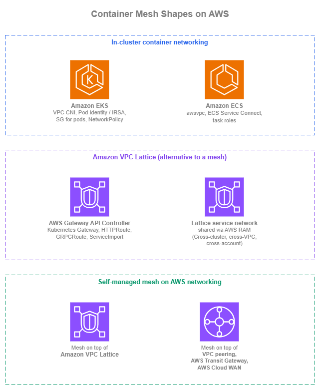
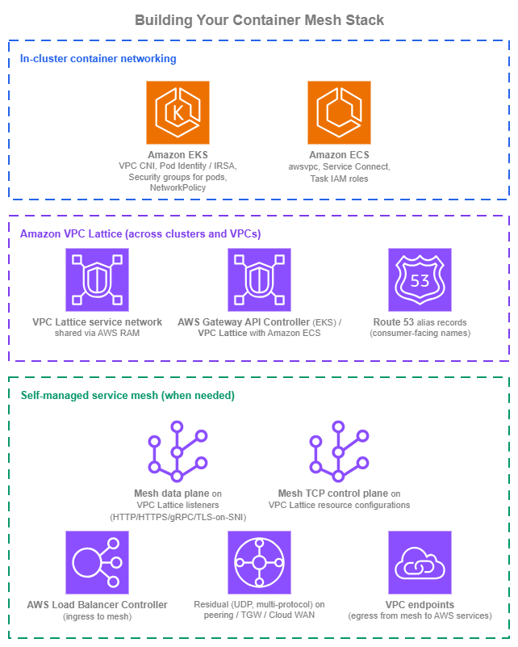

# Container Mesh

!!! info "Prerequisites"
    This section assumes familiarity with [Amazon VPC](../foundation/vpc.md), [Subnets](../foundation/subnets.md), the connectivity patterns in the [Within AWS](../connectivity/within-aws.md) page (especially Amazon VPC Lattice), the [Service to Service](service-to-service.md) page, and the [Load Balancing](load-balancing.md) page. Container mesh patterns reuse all of those primitives; this page covers the container-specific mechanics on top of them.

## What a service mesh is, and whether you need one

A service mesh is, in the [CNCF glossary's framing](https://glossary.cncf.io/service-mesh/), a dedicated infrastructure layer that manages traffic between microservices and adds reliability, observability, and security uniformly across them without requiring application code changes. The classic implementation is a per-pod sidecar proxy (the data plane) configured by a control plane; sidecar-free variants push the same logic into the kernel through eBPF. The term is broad: every mesh project draws the line in a slightly different place, so "do I need a service mesh?" is really "which specific capabilities do I need, and where should each one live?".

Most of the capabilities people adopt a service mesh for are already covered natively by AWS-managed services in a cloud-native AWS environment. The table below breaks the mesh promise into the specific features and shows where each lands.

| Capability | What it does | Native AWS coverage | Mesh-specific gap |
| --- | --- | --- | --- |
| **Service discovery** | Resolve a stable service name to current targets | Amazon Route 53, AWS Cloud Map | None for typical workloads. |
| **Service-to-service authentication** | Cryptographic identity per caller, evaluated at the service | IAM + AWS SigV4 (Amazon VPC Lattice auth policies), Amazon API Gateway IAM authorizers cover end-to-end identity-based auth without shared secrets. | None for AWS-native callers. |
| **Mutual TLS** | Both sides present a certificate during handshake | ALB mTLS and Amazon VPC Lattice TLS passthrough (with the sidecar or backend terminating mTLS) cover the listener side. | Mesh-managed mTLS lifecycle (auto-issuance, auto-rotation, auto-revocation per-pod) is sidecar-mesh territory. |
| **Traffic management** | Weighted routing, blue/green, canary deployments | Amazon VPC Lattice weighted routing, ALB weighted target groups | Mesh-native CRDs (`VirtualService`, `DestinationRule`, `ServiceProfile`) and per-request fault injection are sidecar-mesh-only. |
| **Resilience policies** | Per-request retries, timeouts, outlier detection, circuit breaking | Application-level or AWS SDK retries; Amazon VPC Lattice and load-balancer health checks. | Sidecar-enforced **per-request** policies as data-plane configuration are sidecar-mesh-only. |
| **Observability** | Per-request access logs and distributed traces | Amazon VPC Lattice access logs (identity-aware), ALB access logs, AWS X-Ray, Amazon CloudWatch Application Signals. | Sidecar-emitted golden-signal metrics with no application changes are sidecar-mesh-only. |
| **Network policy** | Which workload can reach which other workload | Security groups (per-task, per-pod), Kubernetes NetworkPolicy via Amazon VPC CNI, Amazon VPC Lattice auth policies. | Mesh-CRD-based policy is sidecar-mesh-only. |
| **Multi-cluster service connectivity** | Service in cluster A reachable as a local service in cluster B, with team and cluster ownership decoupled | Amazon VPC Lattice gives multi-cluster, multi-account reach with independent team boundaries. | Mesh-native cluster-mesh control planes (Istio multi-primary, Cilium Cluster Mesh) when the multi-cluster glue has to live inside the mesh. |

In a cloud-native AWS environment, **discovery, identity-based authentication, traffic management, observability, network policy, and multi-cluster reach are already covered by managed services**. What's left for a sidecar mesh are mesh-managed mTLS lifecycle, mesh-CRD-based traffic and resilience policies, and certain cluster-mesh control-plane patterns. None of these are bad reasons to adopt a mesh, they're real requirements for some workloads, but they should be **named contracts**, not the default starting point.

The multi-cluster row is the one most worth challenging deliberately. Teams reach for cluster-mesh patterns to let independent teams operate their own clusters and still expose services across them. Amazon VPC Lattice solves the same scaling problem at the network layer: each team owns its own cluster, exports its services to a shared service network, and consumers in other clusters reach them as a Route 53 alias backed by the Lattice service. The team boundaries stay intact without a mesh control plane bridging them.

If the workload genuinely needs one or more of the mesh-specific gap items, a self-managed mesh is the right call. The rest of this page covers the three shapes container service-to-service architecture takes on AWS: in-cluster primitives, Amazon VPC Lattice as the alternative to a mesh, and a self-managed mesh on top of AWS networking.

/// caption
Container mesh shapes — [Drawio Source](../assets/application-networking/container-mesh-shapes.drawio)
///

## In-cluster container networking

The first shape isn't really "mesh" at all: it's the in-cluster primitives Amazon ECS and Amazon EKS already give you. Used well, they cover most "I want a mesh inside one cluster" requirements without running a mesh.

### Amazon EKS in-cluster networking

Amazon EKS pods use the [Amazon VPC CNI](https://docs.aws.amazon.com/eks/latest/userguide/pod-networking.html) by default: each pod gets a routable VPC IP from the cluster's subnets, secondary ENIs are attached to nodes to provide IP capacity, and pod-to-pod traffic flows directly inside the VPC without an overlay. Prefix delegation increases per-node IP density when needed; IPv6 mode (`enableIPv6: true` on the cluster) gives every pod an IPv6 address and removes the IPv4-exhaustion question entirely for net-new clusters. Alternative CNIs (Cilium, Calico) are valid choices for richer policy semantics or eBPF-based data planes, but Amazon VPC CNI is the AWS-supported default and the only one with first-class **security groups for pods**.

In-cluster discovery works through Kubernetes Services and CoreDNS: ClusterIP for stable virtual IPs, headless services for direct pod-IP DNS, ExternalName for service-name aliasing. `kube-proxy` (in `iptables` or `IPVS` mode) or its Cilium replacement handles the ClusterIP-to-pod-IP load balancing. None of this requires a mesh.

Identity for pods is the lever that makes cross-service auth work without a mesh:

* **[Amazon EKS Pod Identity](https://docs.aws.amazon.com/eks/latest/userguide/pod-identities.html)** is the recommended pattern for new clusters. The pod identity agent runs as a DaemonSet, intercepts AWS SDK credential lookups, and returns short-lived credentials for the pod's IAM role. Setup is a single API call per association, no OIDC trust relationship per role.
* **[IAM Roles for Service Accounts (IRSA)](https://docs.aws.amazon.com/eks/latest/userguide/iam-roles-for-service-accounts.html)** is the older pattern, still fully supported. Use it in existing clusters that already rely on the OIDC-based trust model; new clusters should default to Pod Identity.

Network policy at the AWS layer comes through **[security groups for pods](https://docs.aws.amazon.com/eks/latest/userguide/security-groups-for-pods.html)** (per-pod VPC security group identifiers, the same SGs you'd use for any other ENI). Layer **[VPC CNI network policies](https://docs.aws.amazon.com/eks/latest/userguide/cni-network-policy.html)** (or Cilium / Calico if you've adopted them) on top for label-based, in-cluster network policy. The two layers complement each other: SGs control AWS-side reach, NetworkPolicy controls cluster-side reach.

#### Amazon EKS in-cluster best practices

* **Default to Amazon VPC CNI on new clusters**. Reach for Cilium or Calico only for concrete requirements VPC CNI doesn't cover (eBPF data plane, richer NetworkPolicy semantics, kube-proxy replacement).
* **Use Amazon EKS Pod Identity for new clusters; keep IRSA for existing**.
* **Layer security groups for pods with Kubernetes NetworkPolicy**. SGs answer "which AWS source can reach this pod"; NetworkPolicy answers "which workload labels can reach this pod".
* **Adopt IPv6 mode for net-new clusters**. The IPv4-exhaustion question disappears, and the cluster gets routable v6 addressing without prefix-delegation tuning.

#### Amazon EKS in-cluster documentation

*   :material-file-document: **Amazon VPC CNI**

    ---

    Default Amazon EKS pod networking with VPC-routable pod IPs, prefix delegation, and IPv6 support.

    [:octicons-arrow-right-24: Documentation](https://docs.aws.amazon.com/eks/latest/userguide/pod-networking.html)

*   :material-file-document: **Amazon EKS Pod Identity**

    ---

    Recommended pattern for assigning IAM roles to pods on new clusters; no OIDC trust relationship per role.

    [:octicons-arrow-right-24: Documentation](https://docs.aws.amazon.com/eks/latest/userguide/pod-identities.html)

*   :material-file-document: **IAM Roles for Service Accounts (IRSA)**

    ---

    OIDC-based pattern for assigning IAM roles to pods, retained for existing environments.

    [:octicons-arrow-right-24: Documentation](https://docs.aws.amazon.com/eks/latest/userguide/iam-roles-for-service-accounts.html)

*   :material-file-document: **Security groups for pods**

    ---

    Per-pod VPC security groups for identity-shaped network policy at the AWS layer.

    [:octicons-arrow-right-24: Documentation](https://docs.aws.amazon.com/eks/latest/userguide/security-groups-for-pods.html)

*   :material-file-document: **Amazon VPC CNI network policies**

    ---

    AWS-native Kubernetes NetworkPolicy implementation for in-cluster, label-based traffic control.

    [:octicons-arrow-right-24: Documentation](https://docs.aws.amazon.com/eks/latest/userguide/cni-network-policy.html)

### Amazon ECS in-cluster networking

Amazon ECS tasks in **[awsvpc network mode](https://docs.aws.amazon.com/AmazonECS/latest/developerguide/task-networking-awsvpc.html)** each get their own ENI, their own VPC IP, and their own security group. That gives you per-task identity at the AWS layer for free; the same security-group-shaped network policy that works for ENIs works for tasks. `awsvpc` is the default for Fargate and the recommended mode for EC2-launched tasks.

Inside a single Amazon ECS cluster, the closest thing AWS ships to a managed mesh is **[Amazon ECS service connect](https://docs.aws.amazon.com/AmazonECS/latest/developerguide/service-connect.html)**: an AWS-managed Envoy sidecar injected by Amazon ECS, namespace-based service addressing through AWS Cloud Map, automatic per-task service discovery, and built-in traffic metrics. You don't operate a mesh control plane, and applications resolve other services by their friendly namespace name. For new container-to-container traffic in a single ECS cluster, this is the AWS-native pattern. [Amazon ECS service discovery via AWS Cloud Map](https://docs.aws.amazon.com/AmazonECS/latest/developerguide/service-discovery.html) is the older pattern. It still has a place for attribute-filtered discovery (ECS task instances exposing custom attributes that consumers filter on) and for non-Service-Connect-enabled workloads, but Service Connect is the preferred path for new in-cluster service-to-service traffic.

Identity for tasks runs through **[Amazon ECS task roles](https://docs.aws.amazon.com/AmazonECS/latest/developerguide/task-iam-roles.html)**: each task definition references the IAM role the AWS SDK uses to sign requests.

#### Amazon ECS in-cluster best practices

* **Default to `awsvpc` network mode for Amazon ECS tasks**. Per-task ENI gives you per-task SG identity, IP, and observability for free.
* **Use Amazon ECS service connect for in-cluster container-to-container traffic**. The namespace abstraction, AWS-managed Envoy sidecar, and traffic metrics replace what most teams reach for a mesh to get.
* **Reserve AWS Cloud Map service discovery for attribute-filtered cases**. Service Connect covers the simple cases more cleanly.
* **Assign per-task IAM roles for AWS API access**. Per-task identity is what makes audit and access-log signal usable.

#### Amazon ECS in-cluster documentation

*   :material-file-document: **Amazon ECS `awsvpc` network mode**

    ---

    Per-task ENI, per-task IP, and per-task security group; the recommended Amazon ECS network mode.

    [:octicons-arrow-right-24: Documentation](https://docs.aws.amazon.com/AmazonECS/latest/developerguide/task-networking-awsvpc.html)

*   :material-file-document: **Amazon ECS service connect**

    ---

    AWS-managed Envoy sidecar for in-cluster service-to-service: namespace addressing, service discovery, traffic metrics.

    [:octicons-arrow-right-24: Documentation](https://docs.aws.amazon.com/AmazonECS/latest/developerguide/service-connect.html)

*   :material-file-document: **Amazon ECS service discovery via AWS Cloud Map**

    ---

    Attribute-filtered service discovery for Amazon ECS, complementary to Service Connect for specific workloads.

    [:octicons-arrow-right-24: Documentation](https://docs.aws.amazon.com/AmazonECS/latest/developerguide/service-discovery.html)

*   :material-file-document: **Amazon ECS task IAM roles**

    ---

    Per-task IAM roles that the AWS SDK uses to sign requests with SigV4.

    [:octicons-arrow-right-24: Documentation](https://docs.aws.amazon.com/AmazonECS/latest/developerguide/task-iam-roles.html)

## Amazon VPC Lattice as the alternative to a mesh

[Amazon VPC Lattice](https://docs.aws.amazon.com/vpc-lattice/latest/ug/what-is-vpc-lattice.html) absorbs the part of the mesh use case that hits once traffic leaves a single cluster: cross-cluster discovery without a service-mirror or cluster-mesh control plane, IAM-based auth at the service or service-network level, weighted routing, identity-aware access logs, and the L3 / L4 connectivity folded in (no peering, AWS Transit Gateway, or AWS Cloud WAN underneath). The full service treatment lives in the [Within AWS](../connectivity/within-aws.md) page (connectivity-side) and the [Service to Service](service-to-service.md) page (application-team-side); this section covers the container-specific mechanics.

The native Kubernetes integration is the **[AWS Gateway API Controller](https://www.gateway-api-controller.eks.aws.dev/)**: it watches Kubernetes Gateway API resources (`Gateway`, `HTTPRoute`, `GRPCRoute`, `TLSRoute`, `ServiceImport`, `ServiceExport`) in your cluster and creates the corresponding Amazon VPC Lattice service network associations, services, target groups, and listener rules. Application teams describe routing as Gateway API resources (the standard); the controller handles VPC Lattice provisioning.

Amazon ECS attaches to VPC Lattice through the [Amazon VPC Lattice with Amazon ECS](https://docs.aws.amazon.com/AmazonECS/latest/developerguide/vpc-lattice.html) integration: ECS service definitions register tasks as VPC Lattice target group targets directly. The per-task SG model from `awsvpc` carries through cleanly.

Multi-cluster, cross-account: Amazon VPC Lattice service network(s) shared via AWS RAM across the organization (covered in the [Within AWS](../connectivity/within-aws.md) page). Each cluster exports its services to that network; consumers in other clusters import them as Kubernetes `ServiceImport` (Amazon EKS) or call the Route 53 alias backed by the VPC Lattice service DNS name (Amazon ECS, generic clients, on-premises workloads reaching in through hybrid connectivity). The connectivity is bundled with the service: no peering or AWS Transit Gateway attachments per consumer cluster.

The honest framing: **do you still need a sidecar mesh once Amazon VPC Lattice is in place?** Amazon VPC Lattice operates at L7 (HTTP and HTTPS) and L4 (TLS passthrough on SNI). It does not provide per-pod mTLS lifecycle managed by a mesh control plane, mesh-native traffic-management CRDs (`VirtualService`, `DestinationRule`, `ServiceProfile`), or rich client-side load-balancing semantics like outlier detection and circuit-breaker policies as data-plane configuration. Most workloads don't need those; for the ones that do, the self-managed service mesh shape below is the right answer.

### Amazon VPC Lattice best practices

* **Use the AWS Gateway API Controller as the in-cluster contract for VPC Lattice in Amazon EKS**. Application teams describe routing through `Gateway` and `HTTPRoute` (the Kubernetes standard); the controller handles the Lattice service-network and service provisioning underneath.
* **Front VPC Lattice services with Route 53 aliases**, not the VPC Lattice managed DNS name. The indirection is what makes future implementation changes invisible to consumers.
* **For Amazon ECS-only environments, use VPC Lattice for cross-VPC and cross-account reach**, with Service Connect inside each cluster. The two coexist cleanly: Service Connect for local container-to-container, VPC Lattice for everything that crosses cluster, VPC, or account boundaries.
* **Match the service-network sharing model to your account structure**. One organization-wide service network is the simplest; per-OU or per-environment networks reduce blast radius if that matches workload boundaries.
* **Reach for a self-managed service mesh only when a specific sidecar-mesh feature is the genuine requirement**. "Everyone uses a mesh" isn't enough; mesh CRDs, in-pod mTLS lifecycle, and mesh-native traffic-management semantics are.

### Amazon VPC Lattice documentation

*   :material-file-document: **Amazon VPC Lattice with Amazon EKS**

    ---

    Cross-cluster connectivity for Amazon EKS workloads through Amazon VPC Lattice and the AWS Gateway API Controller.

    [:octicons-arrow-right-24: Documentation](https://docs.aws.amazon.com/eks/latest/userguide/integration-vpc-lattice.html)

*   :material-file-document: **AWS Gateway API Controller**

    ---

    Kubernetes Gateway API implementation that provisions Amazon VPC Lattice service networks, services, target groups, and rules.

    [:octicons-arrow-right-24: Documentation](https://www.gateway-api-controller.eks.aws.dev/)

*   :material-file-document: **Amazon VPC Lattice with Amazon ECS**

    ---

    Native attachment of Amazon ECS services as Amazon VPC Lattice target group targets.

    [:octicons-arrow-right-24: Documentation](https://docs.aws.amazon.com/AmazonECS/latest/developerguide/vpc-lattice.html)

*   :material-file-document: **Amazon VPC Lattice service networks and AWS RAM sharing**

    ---

    Cross-account sharing of service networks for multi-account, multi-cluster service-to-service.

    [:octicons-arrow-right-24: Documentation](https://docs.aws.amazon.com/vpc-lattice/latest/ug/service-networks.html)

*   :material-file-document: **Kubernetes Gateway API**

    ---

    The Kubernetes specification implemented by the AWS Gateway API Controller for Amazon VPC Lattice and AWS load balancers.

    [:octicons-arrow-right-24: Documentation](https://docs.aws.amazon.com/eks/latest/best-practices/gateway-api-controller.html)

## Self-managed service mesh on top of AWS networking

When the workload genuinely needs sidecar-mesh features AWS doesn't ship (mesh-managed mTLS lifecycle, mesh CRDs for traffic policy, multi-cluster mesh patterns already in production), the mesh runs on top of AWS networking. The decision that shapes operational cost is **what AWS service carries cross-cluster and cross-VPC traffic underneath the mesh**. Amazon VPC Lattice can take a lot of that load when the mesh's protocol set is compatible; VPC peering, AWS Transit Gateway, and AWS Cloud WAN are the alternatives where it isn't.

### Running the mesh on top of Amazon VPC Lattice

The mesh control plane and data-plane sidecars run inside clusters; cross-cluster and cross-VPC traffic flows through Amazon VPC Lattice. The mesh sees friendly DNS names (Route 53 aliases to VPC Lattice services or resource configurations custom domain names) and treats the other cluster as an upstream. **What this saves**: no peering, no AWS Transit Gateway, no AWS Cloud WAN, no CIDR coordination, no cross-VPC security-group authorization, no shared connectivity construct to operate.

The same VPC Lattice network carries different mesh traffic shapes through different VPC Lattice constructs:

| Mesh traffic shape | VPC Lattice construct | Notes |
| --- | --- | --- |
| HTTP / HTTPS / gRPC application traffic | Service with HTTPS listener | VPC Lattice terminates TLS; the mesh sidecar receives plaintext or re-encrypts. |
| Sidecar-to-sidecar mTLS | Service with TLS passthrough listener | Routes on SNI; the sidecar terminates mTLS. The 10-minute connection cap applies, so long-lived gRPC control-plane streams over this path need watching. |
| TCP-only mesh traffic (xDS, identity, cluster-mesh control plane) | [Resource configuration](https://docs.aws.amazon.com/vpc-lattice/latest/ug/resource-configuration.html) through a resource gateway | TCP, configurable port ranges, custom domain name supported. The 10-minute listener cap and listener-level auth-policy restrictions don't apply. |
| UDP, multi-protocol, fundamentally non-TCP traffic | Falls back to peering / AWS Transit Gateway / AWS Cloud WAN | The residual after the above three are placed. Mixed routing is a valid pattern. |

### Running the mesh on top of other AWS networking services

When Amazon VPC Lattice's model doesn't fit, cross-cluster traffic runs over **VPC peering, AWS Transit Gateway, or AWS Cloud WAN**. These are the connectivity primitives covered in the [Within AWS](../connectivity/within-aws.md) page; the mesh treats other clusters as IP-reachable subnets and handles the rest.

The cost of this shape is real: full L3 connectivity to operate, CIDR planning across all participating VPCs, security groups and route tables for the mesh's traffic patterns, and the connectivity construct itself (peering scales poorly with N clusters, AWS Transit Gateway and AWS Cloud WAN scale but adds an attachment per VPC and per region). The mesh team and the network team end up coordinating on every new cluster.

The CIDR-overlap question is the one that bites Kubernetes shops the hardest. Amazon VPC CNI in IPv4 mode allocates pod IPs from the cluster's VPC CIDRs, so multi-cluster environments often end up with overlapping pod ranges across clusters. VPC peering, AWS Transit Gateway, and AWS Cloud WAN all require non-overlapping CIDRs between connected sides; the standard remediation is **[private NAT gateways](https://docs.aws.amazon.com/vpc/latest/userguide/vpc-nat-gateway.html#private-nat-gateway-overview)** translating each cluster's pod range into a non-overlapping range used only on the cross-cluster path. That works, but it adds an hourly + per-GB cost per private NAT gateway, an IP rewrite that bites distributed tracing and audit logs, and one more piece of plumbing the network team has to operate. **Amazon VPC Lattice avoids the question entirely**: it terminates connections at the consumer side and re-originates at the provider side, so CIDR overlap is invisible. Adopting **IPv6 mode in Amazon VPC CNI** for net-new clusters also removes the problem at the source (every pod gets a globally unique IPv6 address).

What you still get from AWS underneath either variant of the self-managed service mesh shape:

* **Ingress to the mesh from outside the cluster** runs through ALBs or NLBs created by the AWS Load Balancer Controller (covered in the [Load Balancing](load-balancing.md) page). The load balancer hits the mesh ingress gateway (Istio Gateway, Linkerd ingress, etc.); the mesh handles routing past that point.
* **Egress to AWS services** runs through [VPC endpoints](https://docs.aws.amazon.com/vpc/latest/privatelink/concepts.html) (interface and gateway). The mesh egress gateway, or pods directly, reach Amazon S3, Amazon DynamoDB, Amazon SQS, Amazon Kinesis, and other AWS services through endpoints.
* **Telemetry from the mesh** flows through [AWS Distro for OpenTelemetry](https://aws-otel.github.io/) into Amazon CloudWatch Application Signals, AWS X-Ray, and Amazon Managed Service for Prometheus / Amazon Managed Grafana, alongside Amazon VPC Lattice access logs and ALB access logs at the AWS-managed boundaries.

Multi-cluster mesh patterns (Istio multi-primary, Cilium Cluster Mesh, and similar) live inside the mesh control plane; from the AWS networking perspective they are just additional cross-cluster traffic that has to be carried by one of the two variants above.

### Self-managed mesh best practices

* **If you've decided to run a self-managed mesh, default to running it on top of Amazon VPC Lattice**. Map each mesh traffic shape to the right VPC Lattice construct (see the table above): HTTPS listener for HTTP / HTTPS / gRPC application traffic, TLS passthrough for sidecar mTLS, resource configuration for TCP-only mesh traffic. Watch the 10-minute connection cap on TLS passthrough listeners for long-lived gRPC control-plane streams; resource configurations don't have it.
* **Fall back to peering, AWS Transit Gateway, or AWS Cloud WAN under the mesh** only for the residual VPC Lattice doesn't cover (UDP, multi-protocol), or when an existing connectivity construct already serves the workload.
* **Use the AWS Load Balancer Controller for ingress into the mesh**. Don't reinvent ingress in mesh CRDs when the AWS-managed load balancer is available.
* **Use VPC endpoints for mesh egress to AWS services**. Reach Amazon S3, Amazon DynamoDB, Amazon SQS, etc. through interface or gateway endpoints, not the public internet.
* **Keep IAM-for-AWS-API-access on Pod Identity, IRSA, or task roles**, not on mesh-issued certificates. The mesh handles in-cluster service identity; AWS handles AWS-service identity.

### Self-managed mesh documentation

*   :material-file-document: **AWS Load Balancer Controller**

    ---

    Kubernetes controller that provisions ALBs and NLBs; the AWS-native ingress to a mesh ingress gateway.

    [:octicons-arrow-right-24: Documentation](https://docs.aws.amazon.com/eks/latest/userguide/aws-load-balancer-controller.html)

*   :material-file-document: **AWS PrivateLink and VPC endpoints**

    ---

    Private connectivity from cluster workloads to AWS services for mesh egress without traversing the public internet.

    [:octicons-arrow-right-24: Documentation](https://docs.aws.amazon.com/vpc/latest/privatelink/concepts.html)

*   :material-file-document: **AWS Distro for OpenTelemetry**

    ---

    AWS-supported OpenTelemetry distribution for shipping mesh telemetry to Amazon CloudWatch, AWS X-Ray, and Amazon Managed Service for Prometheus.

    [:octicons-arrow-right-24: Documentation](https://aws-otel.github.io/)

## Building your container mesh stack

Container mesh architecture is the layer between connectivity (covered in the [Within AWS](../connectivity/within-aws.md) page) and the workload's application logic. The three shapes above are not mutually exclusive: most environments combine in-cluster container networking inside each cluster with Amazon VPC Lattice across clusters, and adopt a self-managed service mesh only for the workloads where a sidecar mesh is the genuine requirement.

/// caption
Container mesh stack — [Drawio Source](../assets/application-networking/container-mesh-stack.drawio)
///

### New environments

Organizations building container service-to-service communication on a clean slate can start with a coherent stack from day one:

1. **Inside each cluster, lean on the AWS-native primitives**. Amazon VPC CNI (with IPv6 mode for net-new clusters, which removes the IPv4-exhaustion and CIDR-overlap questions at the source), Amazon EKS Pod Identity, security groups for pods, and Kubernetes NetworkPolicy on the EKS side; `awsvpc` mode, Amazon ECS service connect, and per-task IAM roles on the ECS side. This in-cluster container networking shape covers most of what teams reach for a mesh to get inside one cluster.
2. **Use Amazon VPC Lattice for everything that crosses cluster, VPC, or account boundaries**. AWS Gateway API Controller in Amazon EKS, native Lattice attachment in Amazon ECS. One service network shared through AWS RAM at the OU level so new clusters and accounts inherit reach automatically. This removes the cross-cluster connectivity question from the mesh decision.
3. **Front Lattice services with Route 53 aliases distributed by Amazon Route 53 Profiles**. Same pattern as the [Service to Service](service-to-service.md) page; consumer-facing names stay stable as the implementation behind them changes.
4. **Adopt a self-managed mesh only when a specific sidecar-mesh requirement justifies the cost**. When that point arrives, default to running the mesh on top of VPC Lattice using the protocol-fit table above (HTTPS listener / TLS passthrough / resource configurations); reserve peering / AWS Transit Gateway / AWS Cloud WAN for the residual.
5. **Centralize observability from day one**: Amazon VPC Lattice access logs (identity-aware) at the AWS-managed boundary, ALB and NLB access logs where load balancers are in the path, and AWS Distro for OpenTelemetry shipping mesh and application telemetry into Amazon CloudWatch Application Signals, AWS X-Ray, and Amazon Managed Service for Prometheus.

### Existing environments

Organizations running existing container service-to-service patterns have working architectures that don't all need to change at once:

1. **Existing in-cluster patterns stay**. Amazon ECS service discovery via AWS Cloud Map, IRSA on Amazon EKS, and any in-cluster mesh you're already operating continue to work. Migrate per workload as you touch the calling code, not on a fixed timeline.
2. **Add Amazon VPC Lattice for new cross-cluster requirements first**. New service-to-service traffic that crosses cluster, VPC, or account boundaries should use Lattice through the AWS Gateway API Controller (EKS) or Amazon VPC Lattice with Amazon ECS, rather than extending an existing peering or AWS Transit Gateway-based mesh. The CIDR-overlap and private-NAT-gateway tax of the L3 path goes away.
3. **For existing self-managed meshes, layer Amazon VPC Lattice underneath opportunistically**. When the mesh is upgraded, when a new cluster joins, or when the connectivity layer is being re-architected, move inter-cluster application traffic to VPC Lattice listeners and TCP control-plane traffic to resource configurations. Only the residual (UDP, multi-protocol) stays on peering / AWS Transit Gateway / AWS Cloud WAN. Don't rip out a working mesh to migrate everything at once.
4. **Front existing internal load balancers with Route 53 aliases as you touch them**. Hard-coded ALB / NLB DNS names in application code, and direct Lattice managed DNS names, both bind consumers to a specific instance of the provider. The Route 53 alias indirection is what makes future implementation changes invisible.
