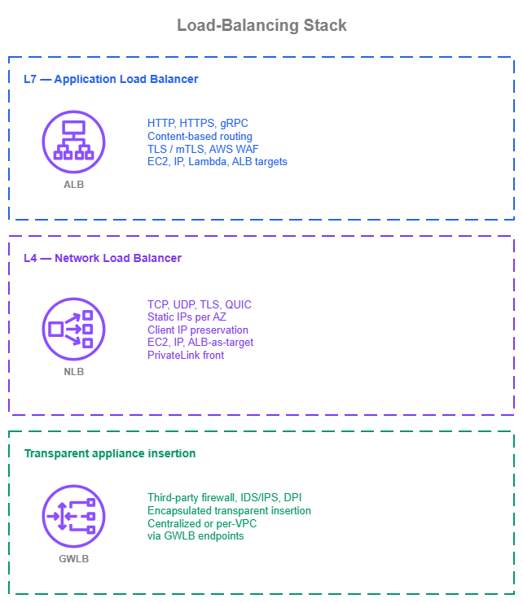

# Load Balancing

!!! info "Prerequisites"
    This section assumes familiarity with [Amazon VPC](../foundation/vpc.md), [Subnets](../foundation/subnets.md), and the connectivity patterns covered in the [Within AWS](../connectivity/within-aws.md) and [Internet connectivity](../connectivity/internet.md) pages. Review those topics first if you're new to AWS networking fundamentals.

AWS Elastic Load Balancing distributes traffic across multiple targets through three managed services: Application Load Balancer (ALB) for L7 HTTP/HTTPS/gRPC with content-based routing across up to 100 listener rules, Network Load Balancer (NLB) for L4 TCP/UDP/TLS handling millions of connections per second with sub-millisecond latency and static IPs per Availability Zone, and Gateway Load Balancer (GWLB) for transparent insertion of third-party firewall appliances using GENEVE encapsulation. These are not interchangeable — each is built for a different traffic class and a different role in the architecture.

This page covers the three Elastic Load Balancing services as building blocks of an application architecture: what each one does, how to configure it well, when to choose one over the others, and how to combine them with other AWS services.

[Amazon VPC Lattice](https://docs.aws.amazon.com/vpc-lattice/latest/ug/what-is-vpc-lattice.html) services *also* load-balance traffic across targets, with managed health checks and weighted routing. The full treatment of VPC Lattice, including the load-balancing capabilities of its services, are covered in the [Service to Service](service-to-service.md) and [Container Mesh](container-mesh.md) pages, because VPC Lattice's value extends well beyond load balancing into cross-VPC and cross-account service discovery, IAM-based authentication, and service-to-service connectivity. This page focuses on the three Elastic Load Balancing services; references to VPC Lattice on this page are pointers to where it fits, not deep coverage.

/// caption
Load-balancing services — [Drawio Source](../assets/application-networking/load-balancing-services.drawio)
///

Application Load Balancer (ALB) and Network Load Balancer (NLB) distribute application traffic to targets. Gateway Load Balancer (GWLB) does something fundamentally different: it transparently inserts a fleet of third-party network appliances (firewalls, intrusion detection, deep packet inspection) into the data path. Treating GWLB as if it were a peer of ALB or NLB is the most common source of confusion; this page calls out that distinction explicitly. Amazon VPC Lattice is shown above as a reference because its services also load-balance traffic, but its primary scope is service-to-service application networking rather than ELB-style load balancing of a single workload — that's why it sits in a separate group on the diagram and gets its full treatment elsewhere in this section.

## Application Load Balancer (ALB)

[Application Load Balancer](https://docs.aws.amazon.com/elasticloadbalancing/latest/application/introduction.html) operates at L7. It terminates TLS, decodes HTTP/HTTPS and gRPC, and routes each request based on the request itself: host header, path, HTTP method, query string, source IP, and other request attributes. Targets register in target groups and can be EC2 instances, IP addresses, or AWS Lambda functions. ALB sits in the workload VPC, scales horizontally with no operational management, and integrates natively with [AWS WAF](https://docs.aws.amazon.com/waf/latest/developerguide/waf-chapter.html), Amazon CloudFront, AWS Global Accelerator, AWS Certificate Manager, Auto Scaling, and the container services (Amazon ECS, Amazon EKS).

### Key capabilities

*   :material-router-network: **Content-based routing**

    ---

    Listener rules route requests by host header, path, method, query string, source IP, or custom headers, so a single ALB can front many services with one DNS name.

*   :material-key-variant: **TLS and mutual TLS**

    ---

    Terminate TLS at the edge of the workload VPC with ACM-issued certificates, and authenticate clients with X.509 certificates through mutual TLS in either passthrough or verify mode.

*   :material-shield-bug: **AWS WAF integration**

    ---

    Attach a regional AWS WAF web ACL directly to the ALB to apply managed rule groups, custom rules, and rate limits at the request layer, with central management through AWS Firewall Manager.

*   :material-trending-up: **Automatic Target Weights**

    ---

    Anomaly detection identifies targets returning elevated 5xx, TCP, or TLS errors and (with the weighted-random algorithm) shifts traffic away from them, mitigating gray failures that pass health checks.

*   :material-package-variant-closed: **Native target diversity**

    ---

    Route to EC2 instances, private IPs, and Lambda functions in the same Region, with target groups managed through Auto Scaling, ECS, or EKS controllers.

*   :material-internet: **Dual-stack and IPv6**

    ---

    Run dual-stack (IPv4 + IPv6) listeners or IPv6-only listeners to reach native IPv6 clients without translation, with backend connectivity over IPv4 or IPv6 as the workload requires.

### Application Load Balancer best practices

#### Choose target type by what owns the lifecycle

ALB target groups support three target types (instance, IP, and Lambda) and the right one is determined by what controls the target's lifecycle. The table below maps the most common workload shapes:

| Workload | Target type | Notes |
| --- | --- | --- |
| EC2 in an Auto Scaling group | Instance | The Auto Scaling group registers and deregisters instances automatically. |
| Workloads off the Auto Scaling path (peered VPC, hybrid through Direct Connect or VPN, manually managed IPs) | IP | The only target type that crosses VPC boundaries; instance targets are same-VPC only. |
| Lambda functions | Lambda | The ALB invokes the function directly. Useful for low-traffic endpoints, simple APIs, or bridging an HTTP front door to event-driven backends. |
| ECS on Fargate, or ECS on EC2 with `awsvpc` mode | IP | Each task gets its own ENI; ECS registers task IPs in the target group. |
| ECS on EC2 with `bridge` or `host` mode | Instance | The load balancer routes to the host, and the host's port mapping forwards to the container. |
| EKS via the [AWS Load Balancer Controller](https://docs.aws.amazon.com/eks/latest/userguide/aws-load-balancer-controller.html) | IP (default) | Routes directly to pod IPs through the Amazon VPC CNI plugin. Required for Fargate pods; recommended for new clusters because it avoids the `kube-proxy` hop. The legacy `NodePort` model uses instance targets but is no longer the default. |

Mixing target types in a single target group is not supported; pick one per target group.

#### Design health checks for the application, not the load balancer

Health checks are the only signal ALB has about whether a target is ready to serve traffic. A misconfigured health check either keeps unhealthy targets in rotation (silent errors) or kicks healthy ones out (avoidable outages). Match the check to what the application can actually attest to:

* **Use a dedicated health-check path** that exercises the application's critical dependencies (cache, database connection, downstream service availability) and returns success only when the target can serve real requests. A `200 OK` from a path that doesn't touch the dependencies is a lie.
* **Tune the interval and threshold to the application's recovery time**. The defaults (30-second interval, 5 healthy / 2 unhealthy thresholds) work for many workloads, but a slow-starting container that takes 60 seconds to warm up needs a different shape than a steady-state EC2 instance.
* **Match the health-check protocol to the listener protocol** when possible (HTTPS health checks on an HTTPS listener) so the check exercises the same TLS path as real traffic. Use HTTP only when the target can't terminate TLS itself but the listener does.

#### Use the routing algorithm the workload needs

ALB supports three target-group-level routing algorithms. Round robin is correct for most workloads; switching to one of the others without a matching workload concern usually adds noise rather than benefit.

| Algorithm | Use it when | Notes |
| --- | --- | --- |
| **Round robin** *(default)* | Targets are stateless and homogeneous, request processing time is uniform, and traffic is roughly evenly distributable. | The right starting point for most HTTP/HTTPS workloads. |
| **Least outstanding requests** | Per-request processing time varies significantly (variable-latency backends, mixed-workload targets). | Routes each new request to the target with the fewest in-flight requests, so a slow target doesn't accumulate a queue. |
| **Weighted random** | The workload is sensitive to gray failures and you want anomaly mitigation through Automatic Target Weights (ATW), or you need probabilistic distribution different from round robin. | Required to enable ATW. ATW automatically shifts traffic away from targets returning elevated 5xx, TCP, or TLS errors. |

#### Use anomaly mitigation and concurrency control where the workload needs them

Two target-group-level features handle traffic shaping beyond plain load balancing, and they address different problems:

| Feature | Use it when | How it works | Constraints |
| --- | --- | --- | --- |
| **Automatic Target Weights (ATW)** | Targets pass health checks but return elevated 5xx, TCP, or TLS errors (gray failures from CPU overload, dependency failures, latent bugs). | Anomaly detection auto-enabled on HTTP/HTTPS target groups with 3+ healthy targets. Enable the **weighted-random** routing algorithm to activate the actual traffic shifting. | No agent required. Works on existing target groups. |
| **[Target Optimizer](https://docs.aws.amazon.com/elasticloadbalancing/latest/application/target-group-register-targets.html#register-targets-target-optimizer)** | Targets have inherent concurrency limits (LLM inference endpoints, long-running synchronous tasks). Queuing on the target itself causes worse failure modes than queuing at the load balancer. | An AWS-published Rust agent (Docker image `public.ecr.aws/aws-elb/target-optimizer/target-control-agent`) runs inline on each target and signals readiness, capped at 1–1000 concurrent requests (default 1). | Must be enabled at target group creation; cannot be added later. |

ATW addresses *which* targets receive traffic; Target Optimizer addresses *how many* requests each target holds at once. They're complementary, and a workload can use both.

#### Terminate TLS at the ALB and use ACM-issued certificates

ALB terminates TLS using certificates managed by [AWS Certificate Manager](https://docs.aws.amazon.com/acm/latest/userguide/acm-overview.html) at no extra charge, with automatic renewal. Use this as the default for L7 workloads:

* **Issue per-application certificates from ACM** rather than rotating self-managed certificates on the targets themselves.
* **Re-encrypt to the origin only when the workload's compliance baseline requires end-to-end TLS**. The vast majority of L7 traffic terminates at the ALB and uses HTTP from the ALB to the targets.
* **For workloads that authenticate clients by certificate, use [mutual TLS](https://docs.aws.amazon.com/elasticloadbalancing/latest/application/mutual-authentication.html)**. Choose `passthrough` mode if backend services need the full client certificate chain to make their own authentication decisions, or `verify` mode if the ALB itself should perform X.509 authentication using a CA bundle. TLS session resumption is not supported with mTLS, so factor that into the connection-rate budget.

#### Plan for Availability Zone resilience

* **Run ALB in at least two Availability Zones and ideally three** for production. ALB itself is highly available across enabled Availability Zones; the limit is your subnet sizing and the Availability Zones your targets actually run in.
* **Cross-zone load balancing is on by default** at the ALB level (and that's the right setting). It evens out target utilization regardless of how clients distribute themselves across Availability Zones. You can override it per target group, but the default is correct for almost every workload.
* **Enable [zonal shift](https://docs.aws.amazon.com/elasticloadbalancing/latest/application/zonal-shift.html) through Amazon Application Recovery Controller** (ARC) for production ALBs. Zonal shift lets an operator drain an Availability Zone from the load balancer's DNS in seconds during a real or suspected Availability Zone event, without touching health checks or routing rules. For automatic activation on AZ-impacting events, configure `zonal autoshift` (an ARC feature that lets AWS trigger a zonal shift on your behalf when AWS-internal telemetry detects an Availability Zone impairment). The `zonal autoshift` feature requires a weekly practice-run configuration so the application is validated to run cleanly without one Availability Zone before a real shift fires.

#### Plan IPv6 as a first-class option

ALB supports dual-stack listeners (both IPv4 and IPv6) and IPv6-only listeners. Both options reach native IPv6 clients without IPv4-to-IPv6 translation, which avoids the cost and complexity of NAT and lets the application identify the original client by IPv6 address.

* **Default to dual-stack for new ALBs** unless the workload has a specific reason to be IPv4-only. Dual-stack handles existing IPv4 clients and any future IPv6 client transparently.
* **Use IPv6-only listeners when the entire client population is IPv6-capable** and the workload doesn't need to serve IPv4 clients. This is most common for internal-only ALBs in IPv6-first VPCs.
* **Confirm the target supports the IP version the listener uses**. ALB-to-target traffic uses the protocol declared by the target group; for an IPv6-only listener serving IPv4-only targets, the ALB does the protocol bridging, but for predictable behavior, prefer matching IP versions end-to-end where possible.

#### Use ALB's HTTP-layer features where they replace application code

ALB exposes several HTTP-layer features that often replace application-level work:

* **Built-in user authentication** through [Amazon Cognito](https://docs.aws.amazon.com/elasticloadbalancing/latest/application/listener-authenticate-users.html) or any OIDC-compliant identity provider. Use this on internal-facing ALBs to gate human-user access without adding auth code to every backend service. Skip it when an upstream API gateway, identity-aware proxy, or service mesh is already enforcing identity.
* **HTTP/2 is enabled by default** for client-to-ALB connections. Leave it on. For HTTP/3, terminate at CloudFront in front of the ALB; ALB itself doesn't terminate HTTP/3 directly.
* **Mitigation against request-parsing attacks** is on by default through `routing.http.desync_mitigation_mode = defensive`, which blocks malformed requests that exploit ambiguity between front-end and back-end HTTP parsers. Leave the default unless you've validated specific traffic patterns that require `monitor` (logs only) or `strictest` (more aggressive).
* **Sticky sessions** route a client repeatedly to the same target through ALB-generated or application-generated cookies. Use this only when the application maintains in-memory session state that isn't externalized to a cache or database. Stateless applications shouldn't enable stickiness; it concentrates load and slows recovery.

#### Sub-tune target lifecycle for clean deployments

Target group attributes control how an ALB drains and starts targets, which directly affects deployment quality:

* **Set deregistration delay** (default 300 seconds) to match the longest expected request the application serves. For short-lived HTTP requests, lower it to 30–60 seconds so deployments don't drag. For long-polling or streaming connections, increase it accordingly.
* **Use slow-start mode for cold-start-sensitive targets**. New targets receive a linearly ramped share of traffic over the slow-start window (up to 15 minutes) instead of being immediately added to full rotation. Use this for JIT-compiled, cache-warming, or other targets that need a short period to reach full capacity.
* **Combine weighted target groups for blue/green and canary releases**. Two target groups behind one listener rule, with weights shifted gradually (90/10 → 50/50 → 0/100), give controlled traffic shifting without DNS TTL waits.

#### Operate the ALB with the right defaults

| Setting | Default | Recommendation |
| --- | --- | --- |
| Deletion protection | Off | **On** for production. Cost is zero; protection against accidental deletion is real. |
| Access logs to S3 | Off | **On** for workloads that need request-level forensics. ALB charges nothing extra; only S3 storage cost applies. |
| Idle timeout (`idle_timeout.timeout_seconds`) | 60 seconds | Tune up for long-lived connections (server-sent events, long polling); leave at 60 for typical request/response. |
| Subnet sizing | — | At least `/27` per Availability Zone subnet, with eight free IPs reserved. Tight `/28` subnets exhaust during scale events and cause 5xx errors. |

### When to use Application Load Balancer

ALB is the default load balancer for any workload that speaks HTTP, HTTPS, or gRPC and benefits from request-level routing decisions. Choose ALB when:

* The application is HTTP/HTTPS-based: web applications, REST APIs, microservices.
* You need content-based routing (host header, path, method) to fan a single internet entry point out to multiple backend services.
* You want managed TLS termination with ACM certificates and integrated AWS WAF.
* You need mutual TLS authentication or mTLS-protected internal APIs.
* You want built-in user authentication through Amazon Cognito or any OIDC-compliant identity provider.
* Your targets are heterogeneous (EC2, containers, Lambda, on-premises through IP targets).
* You want gray-failure mitigation through Automatic Target Weights, or strict per-target concurrency through Target Optimizer.

ALB is not the right choice when the workload is non-HTTP (use NLB), needs ultra-low-latency L4 forwarding without HTTP decode (use NLB), or requires transparent insertion of a third-party firewall (use GWLB).

### Combining Application Load Balancer with other services

* **Front the ALB with [Amazon CloudFront](https://docs.aws.amazon.com/AmazonCloudFront/latest/DeveloperGuide/Introduction.html)** for global edge caching, edge TLS termination, HTTP/3 support, and AWS WAF at the edge. Use [CloudFront VPC Origins](https://docs.aws.amazon.com/AmazonCloudFront/latest/DeveloperGuide/private-content-vpc-origins.html) so the ALB stays private with no public IP exposure.
* **Use [AWS WAF](https://docs.aws.amazon.com/waf/latest/developerguide/waf-chapter.html) directly on the ALB** for L7 protection when CloudFront is not in front. Apply rule sets centrally with [AWS Firewall Manager](https://docs.aws.amazon.com/waf/latest/developerguide/fms-chapter.html).
* **Integrate with Auto Scaling, Amazon ECS, and Amazon EKS** through native target group registration, so the load balancer's target list reflects the actual capacity.
* **Use Lambda targets** for serverless backends behind an HTTP front door without an API Gateway dependency.
* **Use weighted target groups** for blue/green and canary releases without DNS-based traffic shifting.
* **Pair with [Amazon Application Recovery Controller](https://docs.aws.amazon.com/r53recovery/latest/dg/what-is-route53-recovery.html)** to enable zonal shift (operator-triggered) and `zonal autoshift` (AWS-triggered, requires a practice-run configuration) for fast AZ-level traffic draining during Availability Zone events.

### Documentation

*   :material-file-document: **Application Load Balancer documentation**

    ---

    Complete service documentation including listeners, listener rules, target groups, health checks, mutual TLS, Automatic Target Weights, Target Optimizer, IPv6, and pricing.

    [:octicons-arrow-right-24: Documentation](https://docs.aws.amazon.com/elasticloadbalancing/latest/application/introduction.html)

## Network Load Balancer (NLB)

[Network Load Balancer](https://docs.aws.amazon.com/elasticloadbalancing/latest/network/introduction.html) operates at L4. It supports TCP, UDP, TLS, QUIC, and the combined TCP_UDP and TCP_QUIC variants without HTTP-aware decoding. By default, instance-type targets always preserve the client source IP, and IP-type targets preserve it for UDP/TCP_UDP/QUIC/TCP_QUIC protocols (and not for plain TCP/TLS, which preserve client IP only when explicitly enabled). NLB supports TLS termination, is built for ultra-low latency and very high throughput, and exposes a static IP per Availability Zone (with optional Elastic IPs for stable public addresses) so that clients can allow-list specific addresses. Targets register in target groups as instances, IP addresses, or as Application Load Balancers, depending on how the workload is deployed.

### Key capabilities

*   :material-flash: **L4 forwarding at very high throughput**

    ---

    TCP and UDP forwarding without HTTP decoding, designed for sudden traffic spikes and protocols where any HTTP layer adds latency or breaks the application.

*   :material-eye-outline: **Client source IP preservation**

    ---

    By default, instance targets and UDP/TCP_UDP/QUIC/TCP_QUIC targets see the original client IP, so backend security groups and application logic can use real client addresses.

*   :material-ip-network: **Static and Elastic IPs per Availability Zone**

    ---

    Each NLB has a stable IP per enabled Availability Zone (with optional Elastic IPs for public NLBs), suitable for clients that need to allow-list specific addresses and for DNS records that point at a fixed L4 endpoint.

*   :material-shield-key-outline: **TLS termination at L4**

    ---

    Terminate TLS on the NLB using ACM certificates when the workload needs TLS but the protocol above TLS is not HTTP, or when the targets cannot terminate TLS themselves.

*   :material-shield-account: **Security groups on the NLB itself**

    ---

    Attach security groups directly to the NLB to control which clients can reach the load balancer, without consuming security group quota on every individual target. Security groups must be assigned at NLB creation time.

*   :material-internet: **Dual-stack and IPv6-only listeners**

    ---

    Run dual-stack or IPv6-only listeners with IPv6 targets, including UDP support, to reach native IPv6 clients with the same L4 semantics as the IPv4 path.

### Network Load Balancer best practices

#### Choose target type by where targets live

NLB target groups support three target types (instance, IP, and ALB-as-target) and the right one is determined by where the targets sit and what registers them. The table below maps the most common workload shapes:

| Workload | Target type | Notes |
| --- | --- | --- |
| EC2 in an Auto Scaling group, same VPC as the NLB | Instance | The Auto Scaling group registers and deregisters instances automatically. |
| Targets in a peered VPC, in another account through a shared VPC, on-premises through Direct Connect or VPN | IP | The only target type that crosses VPC boundaries; instance targets are same-VPC only. |
| ECS on Fargate, or ECS on EC2 with `awsvpc` mode | IP | Each task gets its own ENI. |
| ECS on EC2 with `bridge` or `host` mode | Instance | The load balancer routes to the host. |
| EKS via the AWS Load Balancer Controller | IP (default) | Routes directly to pod IPs through the Amazon VPC CNI plugin. Required for Fargate pods; recommended for new clusters. The legacy `NodePort` model uses instance targets but is no longer the default. The controller provisions NLBs from `Service` resources of type `LoadBalancer` and from Kubernetes Gateway API `TCPRoute`, `UDPRoute`, and `TLSRoute` resources. |
| Workload needs an L4 entry point (static IPs or PrivateLink exposure) plus L7 routing | ALB-as-target | An NLB forwards to an ALB target group. Use this when both NLB-level features (static IPs, PrivateLink front) and ALB-level routing rules are required for the same workload. |

#### Design health checks for the protocol

NLB health checks happen at the target group level and probe each target independently. Match the health-check protocol to what the application can reliably attest to:

* **For TCP/UDP/TLS target groups, use HTTP or HTTPS probes when the target speaks them**, even if the listener is L4. An HTTP probe to a dedicated `/health` path that exercises the target's dependencies gives a far richer signal than a TCP-only probe (which only confirms the port is open).
* **Use TCP probes when the target doesn't expose an HTTP health endpoint**. Recognize that a TCP success only means "the port accepts connections" — not "the application is ready". Pair TCP health checks with application-level alarms on metrics that reflect actual readiness.
* **Tune interval and threshold to the application's recovery time**. NLB health checks default to 30-second intervals and 5 healthy / 2 unhealthy thresholds; that's right for many workloads but wrong for slow-starting backends or for protocols where a single failure should not pull a target out of rotation.

#### Plan for Availability Zone resilience

NLB's Availability Zone behavior is more nuanced than ALB's because cross-zone load balancing is **off** by default and zonal traffic distribution is part of the design. Deploy NLB in at least two Availability Zones and treat cross-zone, Availability Zone DNS affinity, and zonal shift as one connected set of decisions.

* **Cross-zone load balancing is off by default**, which keeps client traffic within the Availability Zone where it arrived (no cross-zone data-transfer charges, lower latency). The trade-off is that distribution depends on how clients spread across Availability Zones.

  | Setting | Use it when |
  | --- | --- |
  | **Off** *(default)* | Client distribution is roughly uniform across Availability Zones and zonal locality matters for cost or latency. |
  | **On** | Distribution is uneven (single-AZ caller dominates), or every target should receive equal traffic regardless of arrival Availability Zone. Cross-zone NLB-to-target traffic incurs cross-AZ data-transfer charges. |

  Combine cross-zone-off with [Availability Zone DNS affinity](https://docs.aws.amazon.com/elasticloadbalancing/latest/network/edit-load-balancer-attributes.html) (Route 53 Resolver returns the NLB's IP in the client's own Availability Zone) when both halves of the path should stay zonal. Plan for targets to scale per Availability Zone rather than as a single pool.

* **Enable [zonal shift](https://docs.aws.amazon.com/elasticloadbalancing/latest/network/zonal-shift.html) through Amazon Application Recovery Controller** (ARC) for production NLBs. An operator-triggered zonal shift removes the impaired AZ's IP from DNS so new connections go to healthy Availability Zones (existing connections drain as they close). Configure `zonal autoshift` for AWS-triggered activation when AWS-internal telemetry detects an Availability Zone impairment; it requires a weekly practice-run configuration so the application is validated to run cleanly without one Availability Zone before a real shift fires.

* **Alarm on the `ZonalHealthStatus` CloudWatch metric**. NLB removes a zone's DNS record when the zone fails its zonal health check (no healthy targets, configured minimum not met, or an active zonal shift). Catching this early prevents zonal trouble from turning into customer-facing failure.

#### Be deliberate about client IP preservation

NLB preserves the client source IP by default for instance targets and for UDP/TCP_UDP/QUIC/TCP_QUIC target groups, and disables it by default for IP-target TCP and TLS target groups. Whether to keep it on is one of the most consequential design decisions on an NLB:

* **When client IP preservation is on, target security groups must permit the real client IP range**. This is an upgrade for application logic that authenticates by source IP, and a common pitfall for operators who forget that the security group must reflect actual client networks.
* **Client IP preservation does not work** when traffic flows through Transit Gateway / AWS Cloud WAN, a Gateway Load Balancer endpoint, or AWS PrivateLink. In those paths, the source IP at the target is always the NLB's private IP. If you need the original client IP in those paths, enable [Proxy Protocol v2](https://docs.aws.amazon.com/elasticloadbalancing/latest/network/edit-target-group-attributes.html#proxy-protocol) on the target group; the application must parse the Proxy Protocol header to recover the client IP.
* **Some legacy instance types do not support client IP preservation**. Register those as IP targets with client IP preservation disabled, and use Proxy Protocol v2 when the application needs the client IP.
* **Client IP preservation has no effect on AWS PrivateLink ingress**. The source IP is always the NLB's private IP regardless of the setting.

#### Use security groups on the NLB and remember the at-creation rule

NLB supports security groups attached directly to the load balancer, which lets you control who can reach the NLB without consuming per-target security group rule quota.

* **Attach a security group to the NLB at creation time**. Security groups cannot be added to an existing NLB after creation; if you didn't attach one initially, you have to recreate the NLB.
* **Use the NLB's security group as the source on target security groups** so targets only accept traffic from the NLB. This is cleaner than allow-listing every client IP on every target.
* **Allow health-check traffic in the NLB's outbound rules**. Health-check connections originate from the NLB and follow its outbound rules to reach the targets. If the outbound rules don't permit traffic to the target on the health-check port, every target appears unhealthy.
* **Decide whether PrivateLink consumers should face the same access policy as direct clients**. By default, PrivateLink-originated traffic bypasses the NLB's inbound security group rules; turn on the option to enforce inbound rules on PrivateLink traffic if you want consumers reaching the NLB through an interface VPC endpoint to be filtered by the same security group as direct clients.

#### Use TLS termination on NLB only when L4 TLS is the requirement

NLB supports TLS listeners that terminate TLS at the load balancer using ACM certificates. Use it when:

* The protocol above TLS is not HTTP (some database protocols, custom binary protocols, MQTT-over-TLS).
* Targets cannot terminate TLS themselves and you need a managed certificate workflow.

When the workload is HTTPS, terminate at ALB instead. ALB's HTTP-aware termination is operationally simpler, supports content-based routing on the decrypted request, and integrates with AWS WAF — none of which are available on NLB.

#### Use NLB's L4 features where they replace application code

Several L4-level features on NLB cover concerns that would otherwise need extra code or extra components:

* **Connection idle timeout** is 350 seconds by default for TCP flows and is configurable from 60 to 6000 seconds. Tune up for long-lived TCP connections (database synchronization, persistent message buses) so the NLB doesn't tear down sessions that the application still expects to be open. UDP flows have a fixed 120-second idle timeout (not configurable). TLS listeners have a fixed 350-second idle timeout (not configurable).
* **QUIC and TCP_QUIC listeners** support QUIC-native workloads with built-in TLS, fewer round trips for connection establishment, and connection migration across networks. Use these when the workload is QUIC-native (some HTTP/3 implementations, modern transport-layer applications).
* **Sticky sessions for TCP target groups** (source-IP affinity) route a client repeatedly to the same target. Use this only when the application maintains in-memory state per source IP that isn't externalized to a cache or database.
* **For IPv6 UDP listeners that need source IP preservation, enable the IPv6 source NAT prefix** on the NLB. Without it, UDP IPv6 source IPs cannot be preserved through to the target. This is the IPv6 equivalent of the IPv4 client IP preservation behavior.
* **Use Elastic IPs for public NLBs that clients allow-list**. Elastic IPs survive NLB recreation; ephemeral public IPs do not, and an unplanned NLB recreation breaks every client that allow-listed the old address.

#### Tune target lifecycle for clean deployments

* **Set deregistration delay** (default 300 seconds) to match the longest expected connection. For short TCP requests, lower it. For long-lived TCP connections, raise it or enable connection termination for unhealthy targets so deployments don't stall.
* **Enable connection termination for unhealthy targets** when the workload should drop in-flight connections to a target that fails its health check, instead of waiting for the connection to close on its own.
* **Use the unhealthy draining interval** to control how long the NLB waits before fully marking a target unhealthy, which gives the application a chance to recover from transient issues.

#### Operate the NLB with the right defaults

| Setting | Default | Recommendation |
| --- | --- | --- |
| Deletion protection | Off | **On** for production. Cost is zero; protection against accidental deletion is real. |
| Access logs to S3 | Off | **On** for workloads that need flow-level forensics. NLB charges nothing extra; only S3 storage cost applies. |
| Cross-zone load balancing | Off | Leave **off** as the default for the latency and cross-zone-cost reasons above. Override per target group if a specific workload needs it. |
| Zonal shift | Off | **On** for production NLBs, with `zonal autoshift` and a practice-run configuration where the application can be validated to run with one fewer Availability Zone. |
| Secondary IP addresses per subnet | 0 | Increase only when port allocation errors prevent target additions at very high scale. The setting cannot be reduced once raised. |

### When to use Network Load Balancer

NLB is the right load balancer when:

* The workload is L4 — TCP, UDP, TLS that isn't HTTPS, or QUIC.
* You need ultra-low-latency forwarding without HTTP-aware processing.
* The application authenticates clients by source IP end-to-end and needs client IP preservation.
* You need a static IP per Availability Zone (or Elastic IPs for stable public addresses) so that clients can allow-list the load balancer.
* The protocol must traverse the load balancer transparently — gaming, voice, video, real-time financial trading, custom binary protocols, or HTTP/3 / QUIC workloads.
* You need to expose a service through AWS PrivateLink, where NLB is the supported load balancer in front of an [interface VPC endpoint service](https://docs.aws.amazon.com/vpc/latest/privatelink/configure-endpoint-service.html).

NLB is not the right choice for HTTP/HTTPS workloads that need request-level routing or AWS WAF integration (use ALB), or for transparent inspection appliance insertion (use GWLB).

### Combining Network Load Balancer with other services

* **Front the NLB with [AWS Global Accelerator](https://docs.aws.amazon.com/global-accelerator/latest/dg/what-is-global-accelerator.html)** for clients distributed across continents. Global Accelerator's anycast IPs reduce internet path variability, and the NLB stays as the L4 entry point inside the Region. Enable client IP preservation on the Global Accelerator endpoint so the original client IP reaches the targets.
* **Expose the NLB through [AWS PrivateLink](https://docs.aws.amazon.com/vpc/latest/privatelink/what-is-privatelink.html)** to make a service reachable from consumer VPCs across accounts and Regions without VPC peering or Transit Gateway. NLB is the supported load balancer behind a PrivateLink endpoint service; consumers connect through interface VPC endpoints.
* **Use VPC Lattice VPC Resources** as an alternative to PrivateLink endpoint services when the goal is private TCP resource access across VPCs and accounts. VPC Resources require no NLB to maintain and support overlapping CIDRs natively.
* **Combine NLB with ALB-as-target** for the L4-then-L7 pattern when the workload genuinely needs both: an NLB for static IPs or PrivateLink exposure, and an ALB for HTTP-aware routing. This is a small set of use cases, and not a workaround for cross-VPC HTTPS ingress.
* **Integrate with Auto Scaling, Amazon ECS, and Amazon EKS** through native target group registration.
* **Pair with [Amazon Application Recovery Controller](https://docs.aws.amazon.com/r53recovery/latest/dg/what-is-route53-recovery.html)** to enable zonal shift (operator-triggered) and `zonal autoshift` (AWS-triggered, requires a practice-run configuration) for fast AZ-level traffic draining during Availability Zone events.

### Documentation

*   :material-file-document: **Network Load Balancer documentation**

    ---

    Complete service documentation including TCP/UDP/TLS/QUIC listeners, target groups, client IP preservation, Proxy Protocol, security groups, Availability Zone DNS affinity, zonal shift, and pricing.

    [:octicons-arrow-right-24: Documentation](https://docs.aws.amazon.com/elasticloadbalancing/latest/network/introduction.html)

## Gateway Load Balancer (GWLB)

[Gateway Load Balancer](https://docs.aws.amazon.com/elasticloadbalancing/latest/gateway/introduction.html) is structurally different from ALB and NLB. It is not for distributing application traffic to targets. It is for **transparent insertion of a fleet of third-party network appliances** (firewalls, intrusion detection and prevention systems, deep packet inspection) into the data path of traffic that's already flowing somewhere else. The appliances sit behind the GWLB; consumer VPCs attach through [GWLB endpoints](https://docs.aws.amazon.com/vpc/latest/privatelink/gateway-load-balancer-endpoints.html) (a PrivateLink-based construct); the load balancer encapsulates traffic so that the appliances receive the original packets transparently along with the metadata needed for return-path stickiness. The original source and destination are preserved, the appliances see the traffic without being addressed directly, and the consumer VPC's routing tables direct traffic through the GWLB endpoint to make this happen.

Choose GWLB only when you actually have third-party appliances to insert. For AWS-native L4 firewall inspection, [AWS Network Firewall](https://docs.aws.amazon.com/network-firewall/latest/developerguide/what-is-aws-network-firewall.html) is the managed alternative that doesn't require GWLB.

### Key capabilities

*   :material-eye-off-outline: **Transparent appliance insertion with encapsulation**

    ---

    Appliances sit behind the GWLB and see traffic transparently with the original source and destination intact. GWLB wraps each packet with a `GENEVE` header on port 6081 to deliver it to the appliance and recover the return path, so the consumer's route tables (not application configuration) drive traffic through inspection.

*   :material-link-variant: **Configurable flow stickiness and idle timeout**

    ---

    Hash flows on a 5-tuple (default), 3-tuple, or 2-tuple to match the appliance's session model. With 5-tuple stickiness, the TCP idle timeout is configurable from 60 to 6000 seconds; 3-tuple and 2-tuple are locked to the 350-second default.

*   :material-domain-plus: **Managed scaling and multi-AZ appliance fleet**

    ---

    Deploy appliances across multiple Availability Zones behind the GWLB; target group health drives in-service status and Auto Scaling adjusts fleet size. Cross-zone load balancing and Transit Gateway/AWS Cloud WAN Appliance Mode handle east-west and AZ-imbalance scenarios.

*   :material-hub-outline: **PrivateLink-based GWLB endpoints**

    ---

    Consumer VPCs reach the inspection layer through one GWLB endpoint per Availability Zone — a PrivateLink construct that integrates with VPC route tables so any flow can be steered through inspection.

### Gateway Load Balancer best practices

#### Tune timeouts so the appliance, the GWLB, and the client agree

When the GWLB removes a flow from its connection table before the appliance does, return-path packets can be hashed to a different appliance, which is fatal for stateful inspection. Keep all three sides in agreement:

| Flow type | GWLB idle timeout | Configurable? | Notes |
| --- | --- | --- | --- |
| TCP | 350 seconds (default) | **Yes**, 60–6000 seconds — but only with 5-tuple flow stickiness. 3-tuple and 2-tuple stickiness are locked to the default. | Match the appliance's session timeout to the GWLB timeout. Many firewall vendors default to 3600 seconds, which is fatal: the appliance holds a session the GWLB has already torn down and sends return packets to the wrong target. |
| Non-TCP (UDP, ICMP) | 120 seconds | No | Implement keep-alive at the application level — the OS does not maintain UDP timers. |

For TCP, also configure keep-alive on the application or OS to fire below the GWLB idle timeout (`net.ipv4.tcp_keepalive_time = 60` on Linux, or another value below the GWLB timeout) so idle connections are kept alive end-to-end. Tune the GWLB TCP idle timeout deliberately when the workload has long-lived flows (database synchronization, persistent message buses); raising it also increases the chance of stale entries in the connection table.

#### Plan for Availability Zone resilience

A single-AZ appliance deployment behind GWLB is a single point of failure for inspection. GWLB's cross-zone load balancing is **off** by default, which is usually correct as it isolates Availability Zone failures so a failed Availability Zone doesn't mask itself behind cross-zone routing.

* **Deploy appliances in at least two Availability Zones** behind the GWLB, with health checks that exercise the appliance's actual inspection path (not just an interface ping).
* **Use Auto Scaling for the appliance fleet** when traffic load is variable. GWLB target group health drives in-service status; Auto Scaling adds and removes appliance capacity based on the workload signals you choose.
* **Keep cross-zone load balancing off as the default** so a fully-failed Availability Zone becomes offline for inspection rather than masking itself behind a healthy Availability Zone. Turn it on only when you've decided the workload prefers continued service over strict zonal isolation, and you've sized appliances to absorb cross-zone traffic.

#### Choose one-arm or two-arm appliance deployment

Third-party appliances behind GWLB run in either one-arm or two-arm mode. The choice affects the appliance configuration and the surrounding routing.

| Mode | Use it when | Notes |
| --- | --- | --- |
| **One-arm** *(default starting point)* | General east-west and north-south inspection. | A single appliance interface for both ingress and egress traffic. Simpler to deploy and supported by most appliance vendors. |
| **Two-arm** | The appliance vendor or use case requires it (some SSL/TLS interception, explicit inside/outside policy enforcement). | Separate inbound and outbound interfaces. More moving parts to size and route; pick this only when the appliance specifically requires it. |

The architectural decision (centralized inspection in a shared VPC vs decentralized inspection per workload VPC) is independent of the deployment-mode decision.

#### Place GWLB endpoints per Availability Zone in the consumer VPC

GWLB endpoints are PrivateLink-based and deployed one per Availability Zone in the consumer VPC. The endpoint is what the consumer's route tables target to direct traffic through inspection.

* **Deploy one GWLB endpoint per Availability Zone in every consuming VPC** (or in the inspection VPC for centralized designs). Routing must direct each Availability Zone's traffic to its local endpoint to avoid unnecessary cross-AZ hops.
* **Plan routing carefully**. The route-table change that directs traffic through the GWLB endpoint is what makes inspection happen; an incomplete route-table update means some flows bypass inspection — a security gap that's easy to miss in an audit.

#### Plan for the encapsulation MTU and packet handling

GWLB encapsulates IP traffic in `GENEVE` on port 6081, which adds 68 bytes to every packet. Two consequences need planning:

* **Set the appliance MTU to at least 8568 bytes**. The GWLB interface supports packets up to 8500 bytes; with the 68-byte `GENEVE` header, the appliance must accept packets up to 8568 bytes or it drops them silently.
* **Avoid asymmetric flows**. GWLB supports only flows where it sees the initial packet; flows where the response returns through GWLB but the initial packet did not are unsupported and produce reduced network performance. Design routing so both directions of a flow traverse the same GWLB.
* **Plan for no Path MTU Discovery**. GWLB does not generate the ICMP "Destination Unreachable: fragmentation needed" messages and does not support IP fragmentation. Hosts and applications relying on Path MTU Discovery to negotiate packet sizes through GWLB don't get the signal they expect; size MTUs explicitly along the path.

#### Plan IPv6 deliberately

GWLB supports `ipv4` and `dualstack` IP-address types. Dual-stack mode lets clients reach the load balancer over both IPv4 and IPv6, but the encapsulated packet sent to the appliance is **always wrapped in an IPv4 `GENEVE` header**, regardless of whether the client traffic was IPv4 or IPv6. This shapes a few choices:

* **Use dual-stack when the consumer VPC has IPv6 workloads**. The VPC and subnets need IPv6 CIDR blocks, and the consumer subnet route tables and NACLs need to permit IPv6.
* **Match the appliance's expected encapsulation**. The appliance still receives IPv4 `GENEVE` on the data plane; this means appliance IPv6-awareness applies to the encapsulated payload, not to the encapsulation transport.
* **Subnets cannot be removed after the GWLB is created**. Pick the subnets up front; to change them, recreate the GWLB.

#### Operate the GWLB with the right defaults

| Setting | Default | Recommendation |
| --- | --- | --- |
| Deletion protection | Off | **On** for production. Cost is zero; protection against accidental deletion is real. |
| Cross-zone load balancing | Off | Leave **off** as the default, for the AZ-isolation reasons above. Override only when you've decided the workload prefers continued service over strict zonal isolation. |
| Subnet size per Availability Zone | — | At least 8 free IPs per subnet. Subnets cannot be removed after creation; to change them, recreate the GWLB. |
| Network ACLs | — | When the application servers and the GWLB endpoint are in the same subnet, NACL rules are evaluated for application-server-to-endpoint traffic. Test NACL changes in a non-production environment first. |

### Combining Gateway Load Balancer with other services

* **Pair GWLB with [AWS Transit Gateway](https://docs.aws.amazon.com/vpc/latest/tgw/what-is-transit-gateway.html) (Appliance Mode enabled) or [AWS Cloud WAN](https://docs.aws.amazon.com/vpc/latest/cloudwan/what-is-cloudwan.html)** for centralized inspection of VPC-to-VPC, VPC-to-on-premises, or Internet egress traffic. The inspection VPC sits behind the TGW or Cloud WAN attachment; spoke VPCs route through TGW or Cloud WAN to reach it.
* **Front internet ingress with GWLB and a third-party firewall** for [inbound inspection](https://docs.aws.amazon.com/whitepapers/latest/building-scalable-secure-multi-vpc-network-infrastructure/inspecting-inbound-traffic-fa.html). Traffic from the internet gateway is directed through the GWLB endpoint to the appliances, which inspect the flow before it reaches the workload's NLB or ALB.
* **Combine with NAT gateway in a centralized egress VPC** for inspection-then-NAT egress, where the appliance sees traffic with the original VPC source IP and NAT happens after inspection.

### Documentation

*   :material-file-document: **Gateway Load Balancer documentation**

    ---

    Complete service documentation including target groups, flow stickiness, idle timeout, `GENEVE` encapsulation, MTU handling, GWLB endpoints, and pricing.

    [:octicons-arrow-right-24: Documentation](https://docs.aws.amazon.com/elasticloadbalancing/latest/gateway/introduction.html)

## Building your load-balancing stack

Load balancing in AWS is a layered choice. Pick the right load balancer for each role: ALB for L7 application traffic, NLB for L4 application traffic, GWLB only when you have third-party inspection appliances to insert.

/// caption
Load-balancing stack — [Drawio Source](../assets/application-networking/load-balancing-stack.drawio)
///

### New environments

Organizations building load balancing on a clean slate can start with the patterns that scale and stay maintainable:

1. **ALB as the default for HTTP, HTTPS, and gRPC**. One ALB per workload, ACM-issued certificates, dual-stack listeners, content-based routing rules in the listener, AWS WAF attached for L7 protection (centrally managed through AWS Firewall Manager), CloudFront in front for global edge caching with VPC Origins keeping the ALB private.
2. **NLB for L4 workloads with deliberate cross-zone choices**. Cross-zone load balancing off when client distribution is uniform and zonal isolation matters; on when client distribution is uneven or every target should receive equal traffic. Security groups attached at NLB creation. Client IP preservation chosen with the security-group implications in mind. Elastic IPs for any public NLB that clients allow-list.
3. **Auto Scaling, Amazon ECS, and Amazon EKS as the source of truth for targets**. Let the workload's lifecycle drive target group membership; don't manage targets manually. EKS users get ALBs and NLBs through the AWS Load Balancer Controller (Ingress, Service of type `LoadBalancer`, or Gateway API resources, all in one controller).
4. **Application-aware health checks from day one**. Probe a path that exercises the target's real dependencies; tune interval and threshold to the workload's recovery shape. A misconfigured health check is one of the most common causes of avoidable production incidents.
5. **GWLB only when there's a third-party appliance to insert**. For AWS-native L4 inspection, AWS Network Firewall is the managed alternative. When GWLB is the right call, deploy multi-AZ from day one, enable Transit Gateway or AWS Cloud WAN Appliance Mode for east-west inspection, and tune timeouts so the GWLB, the appliance, and the client agree.
6. **IPv6 first-class on ALB and NLB** for new VPCs. Dual-stack listeners by default; IPv6-only when the client population is fully IPv6-capable.
7. **Production defaults set from creation**: deletion protection on, access logs to S3, zonal shift through ARC enabled (with `zonal autoshift` and a practice-run configuration where the application can run cleanly with one fewer Availability Zone).

### Existing environments

Organizations running existing load balancers have working patterns that don't need to be replaced:

1. **Existing ALBs** keep their role. Adopt CloudFront VPC Origins on new VPC-hosted L7 workloads; add AWS WAF (centrally managed through Firewall Manager) where it isn't already attached; turn on Automatic Target Weights for workloads that have shown gray-failure incidents; enable zonal shift through ARC.
2. **Existing NLBs without security groups** can stay running, with target-side security groups still doing the access control. New NLBs and recreated NLBs should be created with security groups attached. Enable zonal shift through ARC on production NLBs.
3. **Existing GWLB deployments** continue to work. Re-validate that Transit Gateway or AWS Cloud WAN Appliance Mode is enabled for east-west inspection paths, that timeouts are aligned across the GWLB, the appliances, and the workloads, that the appliance MTU is at least 8568 bytes, and that GWLB endpoints are deployed per Availability Zone in every consuming VPC.
4. **Classic Load Balancer** is a legacy choice. Plan migration to ALB (for HTTP/HTTPS) or NLB (for L4) opportunistically; CLB is supported but does not receive new features and should not be the target for new workloads.
5. **IPv6 adoption on existing load balancers** is a per-listener decision. ALBs and NLBs can be moved to dual-stack on a new listener without disrupting the existing IPv4 listener; plan the rollout per workload.
