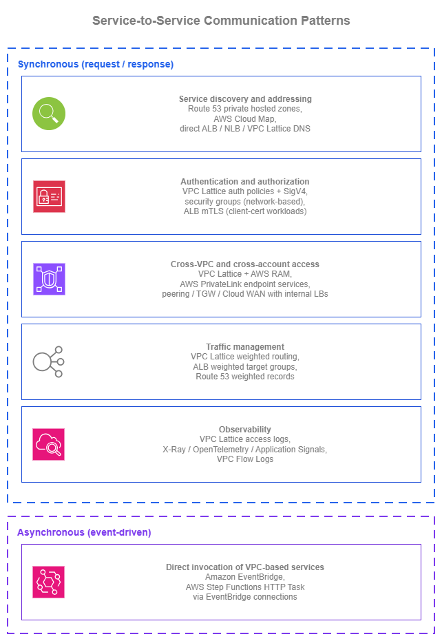
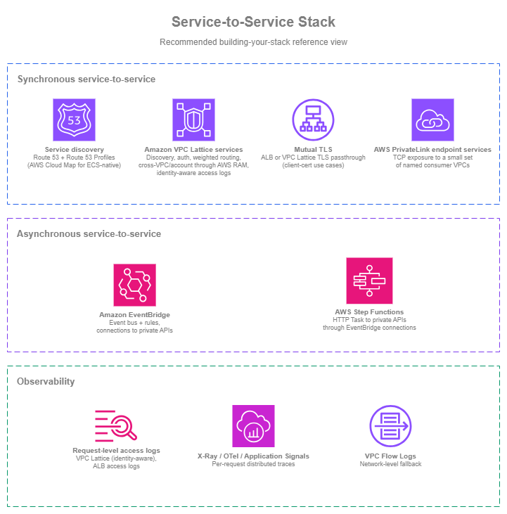

# Service to Service

!!! info "Prerequisites"
    This section assumes familiarity with [Amazon VPC](../foundation/vpc.md), [Subnets](../foundation/subnets.md), the connectivity patterns in the [Within AWS](../connectivity/within-aws.md) page (especially Amazon VPC Lattice), and the [Load Balancing](load-balancing.md) page. Service-to-service communication builds on those primitives.

Service-to-service communication in AWS spans five architectural concerns: discovery (how consumers find providers via Route 53 private hosted zones or Amazon VPC Lattice DNS), authentication (IAM-based SigV4 signing with VPC Lattice auth policies, or mutual TLS on ALB), cross-VPC reach (VPC Lattice service networks shared via RAM without CIDR coordination, or PrivateLink endpoint services for TCP), traffic management (VPC Lattice weighted routing shifts traffic between target groups in seconds, not DNS TTL minutes), and observability (VPC Lattice access logs with caller identity and auth decisions on every request). The interesting questions are rarely "ALB or NLB?" — they're "how do consumers find providers?", "how do services authenticate each other?", and "how do I deploy a new version safely?"

This page is **patterns-first**. Each pattern below has multiple AWS-supported options; the right choice depends on the rest of the architecture. The framing question to keep in mind across the page: **how much of the networking layer do you want to manage yourself?**

Each pattern's options can be assembled from individual building blocks (Amazon Route 53, AWS PrivateLink, ALB / NLB, IAM, CloudWatch, AWS WAF) where the application or platform team owns the integration, *or* covered through [Amazon VPC Lattice](https://docs.aws.amazon.com/vpc-lattice/latest/ug/what-is-vpc-lattice.html), which folds discovery, authentication, cross-VPC reach, traffic management, and observability into a single managed application networking layer with the connectivity abstracted away. Both shapes are valid.

The deeper *connectivity-side* treatment of Amazon VPC Lattice (service networks, association models, network-team-side best practices) lives in the [Within AWS](../connectivity/within-aws.md) page; this page focuses on how application teams *use* the patterns.

/// caption
Service-to-service patterns — [Drawio Source](../assets/application-networking/s2s-patterns.drawio)
///

## Synchronous service-to-service patterns

Synchronous service-to-service communication (a service makes a request, waits for the response) is the most common shape of service interaction inside a typical workload. The patterns below cover the design questions that consistently come up: how the consumer finds the provider, how the two sides authenticate, how the call crosses VPC and account boundaries, how new versions roll out safely, and how the operator sees what's happening.

### Service discovery and addressing

Hard-coded IPs don't survive contact with a real environment. Targets scale, instances replace, Availability Zones fail, and the service backing a name might migrate. Service discovery answers two questions: given a service name, what address(es) should the consumer use right now, and how do you keep that name stable as the implementation behind it changes?

The right pattern in AWS, regardless of which option below you choose, is **always abstract the consumer-facing name with an Amazon Route 53 record**. The application calls `payments.internal.example.com`, never a bare load-balancer DNS name and never an Amazon VPC Lattice managed DNS name. Route 53 alias records resolve the friendly name to whatever's actually backing the service today (an internal ALB, an NLB, an Amazon VPC Lattice service, an EC2 instance), and changing the implementation becomes a Route 53 record change rather than a consumer-side coordination exercise.

| Option | Use it when |
| --- | --- |
| **Amazon Route 53 private hosted zones with alias records** | The application code calls a friendly internal name (`payments.internal.example.com`); the Route 53 alias record resolves it to the current backing target. Alias records are first-class for internal ALBs, NLBs, and Amazon VPC Lattice services. As the implementation moves (EC2 to ECS, AWS PrivateLink endpoint service to Amazon VPC Lattice service), only the alias record changes; application code is untouched. Owned and shared across accounts as a single internal DNS control plane. |
| **AWS Cloud Map** | The discovery layer needs a service-instance registry with custom attribute filtering (deployment stage, capacity, color), or you're using Amazon ECS service discovery's automatic per-task registration. ECS registers and deregisters task IPs in AWS Cloud Map automatically; consumers can query by service name (DNS) or filter by attribute (API). For non-ECS and non-attribute-filtered cases, Route 53 private hosted zones are simpler. |
| **Direct DNS to ALB, NLB, or Amazon VPC Lattice service** | Single-team, single-VPC simple setups where the consumer can call the AWS-assigned DNS name (`internal-foo-1234.elb.us-east-1.amazonaws.com` or `my-service.7d67968.vpc-lattice-svcs.us-east-1.on.aws`) directly. Works, but binds the consumer to that specific instance of the provider. Promote to a Route 53 alias as the workload grows. |

#### Manage Private Hosted Zones at scale

[Amazon Route 53 Profiles](https://docs.aws.amazon.com/Route53/latest/DeveloperGuide/profiles.html) bundle Private Hosted Zones, Resolver forwarding rules, and DNS Firewall rule groups into a single shareable object distributed through AWS RAM. Profiles live in the network or platform account and are shared to consumer VPCs across the organization.

The main decision when working at scale in multi-account environments is **where the Private Hosted Zones referenced by the Profile live, and who can add zones to it**:

| Ownership model | Where Private Hosted Zones live | How application teams add records |
| --- | --- | --- |
| **Centralized** | Network or platform account owns every Private Hosted Zone referenced by the Profile. | Through PRs to a central IaC repo, a Service Catalog product, or a tightly-scoped delegated IAM role on the central account. |
| **Decentralized** | Each application team owns its Private Hosted Zone in its own account. The platform team shares the Profile with admin permissions (granular controls) to those application accounts so teams can add their own zones to it. | Each team manages its own zone directly and adds it to the Profile. |

Most environments end up **hybrid**: platform-owned zones for cross-cutting infrastructure (`aws.internal`, `db.internal`), team-owned zones per business domain (`payments.app.internal`, `inventory.app.internal`), all referenced by one (or a few) centrally-owned Profile and consumed by VPCs through read-only sharing.

#### Service discovery best practices

* **Use Amazon Route 53 Profiles to distribute Private Hosted Zones, Resolver forwarding rules, and DNS Firewall rule groups across multi-account environments**. Share at the OU level so new accounts inherit configuration automatically. Without Profiles, multi-account DNS turns into custom cross-account-association automation; with Profiles it's a first-class operation.
* **Decide deliberately between centralized and decentralized Private Hosted Zone ownership** (or a hybrid of the two), based on how the organization works: platform-owned with delegated change paths for application teams, or team-owned with platform aggregation through a shared admin Profile.
* **Always front load balancers and Amazon VPC Lattice services with a Route 53 alias record**. Alias records are first-class for ALB, NLB, and Amazon VPC Lattice services; they resolve at AWS-DNS-time without an extra CNAME hop and are free of charge inside Route 53 hosted zones. The alias means the implementation can change underneath without consumers noticing.
* **Use AWS Cloud Map only when its specific shape matches the workload**. Amazon ECS service discovery's per-task automatic registration, or attribute-filtered discovery (`deployment_color = blue`). For everything else, Route 53 is simpler.
* **Avoid hard-coded IPs and bare load-balancer or Amazon VPC Lattice DNS names in application code**. Both bind the consumer to a specific instantiation of the provider; the Route 53 alias indirection is what makes any change safe.

#### Service discovery documentation

*   :material-file-document: **Amazon Route 53 private hosted zones**

    ---

    Internal DNS authoritative name service inside one or more VPCs, including alias records to AWS resources.

    [:octicons-arrow-right-24: Documentation](https://docs.aws.amazon.com/Route53/latest/DeveloperGuide/hosted-zones-private.html)

*   :material-file-document: **Amazon Route 53 alias records**

    ---

    First-class records that resolve to AWS resources (ALB, NLB, Amazon VPC Lattice service, CloudFront, S3) without an extra DNS hop.

    [:octicons-arrow-right-24: Documentation](https://docs.aws.amazon.com/Route53/latest/DeveloperGuide/resource-record-sets-choosing-alias-non-alias.html)

*   :material-file-document: **Amazon Route 53 Profiles**

    ---

    Bundle private hosted zones, Resolver forwarding rules, and DNS Firewall rule groups into a single shareable object distributed through AWS RAM to multi-account environments.

    [:octicons-arrow-right-24: Documentation](https://docs.aws.amazon.com/Route53/latest/DeveloperGuide/profiles.html)

*   :material-file-document: **AWS Cloud Map**

    ---

    Service-instance registry with DNS and API discovery, custom attributes, and Amazon ECS service-discovery integration.

    [:octicons-arrow-right-24: Documentation](https://docs.aws.amazon.com/cloud-map/latest/dg/what-is-cloud-map.html)

*   :material-file-document: **Amazon ECS service discovery**

    ---

    Automatic per-task registration of Amazon ECS services in AWS Cloud Map for native container service discovery.

    [:octicons-arrow-right-24: Documentation](https://docs.aws.amazon.com/AmazonECS/latest/developerguide/service-discovery.html)

### Request authentication and authorization

A service answering a request needs to know two things: who's calling, and whether that caller is allowed to call. The traditional network approach (security groups plus shared secrets in headers) works for small environments but stops scaling once services span teams, VPCs, and accounts. The options below differ in **what** they authenticate (network source vs cryptographic identity vs application-presented certificate) and in **how much of the auth control plane you operate yourself**.

| Option | What it authenticates | What you operate |
| --- | --- | --- |
| **Amazon VPC Lattice auth policies + AWS SigV4 / SigV4A** | The IAM identity of the caller (an EC2 instance profile, an Amazon ECS task role, an Amazon EKS pod IAM role, a Lambda execution role). Each consumer signs requests with its own role; Amazon VPC Lattice evaluates the request against the service's auth policy and either allows or denies it, with the caller's identity recorded in access logs. | An IAM-based policy on each Amazon VPC Lattice service. The signing happens in the AWS SDK on the consumer side; no shared secrets to rotate. |
| **Security groups + private connectivity (network-based authentication)** | Which network source can reach the service (typically a security group identifier or a CIDR). Necessary for TCP services that can't sign requests, and the right answer when the consumer is a legacy workload that only knows IP-based access. | The security group rules at every consumer/provider pair. Security groups answer "what can call you", not "who". Different applications running with the same security group identifier are indistinguishable. |
| **Mutual TLS (mTLS)** | A client X.509 certificate presented during the TLS handshake. Available on Application Load Balancer (the ALB terminates TLS and validates the client cert in `passthrough` or `verify` mode) and on Amazon VPC Lattice TLS passthrough listeners (Amazon VPC Lattice routes the encrypted flow on SNI without terminating TLS, and the application or load balancer behind it terminates mTLS). The Amazon VPC Lattice TLS passthrough path keeps end-to-end encryption intact at the cost of restricting auth policies to anonymous principals on that listener. | The client-cert lifecycle (issuance, rotation, revocation). Real operational overhead at scale, but the right call for B2B integrations, IoT, and workloads where mTLS is a contract or compliance requirement. |
| **Shared API keys, bearer tokens, HTTP basic auth** | A static secret in a header. Concentrates trust on one rotated-by-hand secret. | Manual rotation, distribution, and revocation. Avoid for service-to-service in any environment where IAM-signed requests are an option. |

The four options layer cleanly: a security group still controls *what can reach you*, an Amazon VPC Lattice auth policy controls *what IAM identity is allowed to invoke you*, and mTLS (on ALB or through Amazon VPC Lattice TLS passthrough) controls *what client certificate is presented*. They don't replace each other: the question is which combination matches the workload.

#### Authentication and authorization best practices

* **Sign service-to-service requests with AWS SigV4 / SigV4A** wherever the consumer can. The AWS SDK on EC2, Amazon ECS, Amazon EKS, and Lambda will sign automatically when the consumer runs with an IAM role.
* **Use IAM roles end-to-end for the consumer identity**. EC2 instance profiles, Amazon ECS task roles, Amazon EKS pod IAM roles (through IAM Roles for Service Accounts or Amazon EKS Pod Identity), and Lambda execution roles. Avoid shared IAM users or shared credentials; the audit trail in CloudTrail and Amazon VPC Lattice access logs is only useful when each caller has its own role.
* **Combine network-based and identity-based authentication for defense in depth**, not as alternatives. Security groups limit which network sources can reach the service or service network; identity-based auth enforces which principals can invoke the service. A misconfigured security group still leaves identity-based auth as the gate; a misconfigured auth policy still leaves the network-source restriction in place. The two layers reduce the blast radius of any single misconfiguration.
* **Pick the identity-evaluation point that matches the service surface, not a separate authentication mechanism**. SigV4-signed requests with IAM identities are the consistent identity-based mechanism across AWS service-to-service traffic; the evaluation point differs by what's in front of the consuming service:

  | Service surface | Identity evaluation point |
  | --- | --- |
  | Amazon VPC Lattice service | Auth policy on the service or service network (evaluates SigV4-signed requests). |
  | Amazon API Gateway REST or HTTP API | IAM authorizer (evaluates SigV4-signed requests). |
  | Direct AWS-service calls (DynamoDB, S3, KMS, etc.) | The AWS SDK signs with SigV4; the AWS service evaluates against IAM. |
  | AWS AppSync, AWS-native APIs with IAM auth | Same SigV4 + IAM mechanism, evaluated at the service. |

* **Use mTLS only when the contract genuinely requires it**. B2B integrations with named clients, IoT devices presenting certificates as their identity, or compliance baselines that mandate mTLS. The client-cert lifecycle is real work in either case; don't reach for mTLS as a general service-to-service pattern.
* **Don't use shared API keys, bearer tokens, or HTTP basic auth for service-to-service**. They're fragile under rotation, hard to audit per-caller, and the IAM-signed alternative solves the same problem with the credential lifecycle already managed by IAM.
* **Until consumers are updated to sign requests, write Amazon VPC Lattice auth policies with conditions that match what the request already carries** (source VPC, HTTP method, path, headers). This gives you access logs, explicit allow/deny decisions, and a working control plane immediately, without blocking on application changes. Tighten to principal-based conditions as consumers adopt signing.

#### Authentication and authorization documentation

*   :material-file-document: **Amazon VPC Lattice auth policies**

    ---

    IAM-based access control at the service level: principals, conditions, request attributes, and SigV4 / SigV4A signing.

    [:octicons-arrow-right-24: Documentation](https://docs.aws.amazon.com/vpc-lattice/latest/ug/auth-policies.html)

*   :material-file-document: **AWS Signature Version 4 (SigV4)**

    ---

    The AWS request-signing standard used by SDK clients to authenticate API calls and Amazon VPC Lattice service requests with IAM identities.

    [:octicons-arrow-right-24: Documentation](https://docs.aws.amazon.com/IAM/latest/UserGuide/reference_sigv-create-signed-request.html)

*   :material-file-document: **Application Load Balancer mutual TLS**

    ---

    Client X.509 certificate authentication on the ALB, with `passthrough` and `verify` modes.

    [:octicons-arrow-right-24: Documentation](https://docs.aws.amazon.com/elasticloadbalancing/latest/application/mutual-authentication.html)

*   :material-file-document: **Amazon VPC Lattice TLS passthrough listeners**

    ---

    SNI-based routing of TLS and mTLS traffic without TLS termination at Amazon VPC Lattice, preserving end-to-end encryption to the application.

    [:octicons-arrow-right-24: Documentation](https://docs.aws.amazon.com/vpc-lattice/latest/ug/tls-listeners.html)

*   :material-file-document: **VPC security groups**

    ---

    Network-level access control for ENIs, ALBs, NLBs, and Amazon VPC Lattice service-network associations.

    [:octicons-arrow-right-24: Documentation](https://docs.aws.amazon.com/vpc/latest/userguide/vpc-security-groups.html)

### Traffic management for safe deployments

Releasing a new version of a service without disrupting consumers is one of the recurring tests of a service-to-service architecture. The networking layer can carry most of the weight if you let it: shift a small percentage of traffic to the new version, observe, increase, repeat. The options below differ in **where** the traffic-shifting decision is made and **how fast** it takes effect.

| Option | Where shifting happens | Speed of change |
| --- | --- | --- |
| **Amazon VPC Lattice weighted routing** | Inside the Amazon VPC Lattice service, across target groups. Weights can route to mixed compute types: EC2, Amazon ECS, Amazon EKS, and Lambda can back the same Amazon VPC Lattice service through different target groups. | Seconds. The weighted-routing change in the Amazon VPC Lattice service is what shifts traffic; no DNS TTL involved. |
| **ALB weighted target groups** | Inside the ALB listener rule, across target groups behind that ALB. Same in-listener-rule shifting; different load balancer. | Seconds. Listener-rule changes propagate quickly. |
| **Route 53 weighted records** | At the DNS layer, across DNS endpoints. Suitable when the workload genuinely lives across endpoints that can't be unified at the load-balancing layer (multi-Region active-active, ALB to VPC Lattice migration). | Slow. Depends on the consumer's DNS TTL. The wrong tool for in-Region service-to-service traffic. |

#### Traffic management best practices

* **Shift traffic at the load-balancing layer, not at the DNS layer**. Amazon VPC Lattice weighted routing and ALB weighted target groups change traffic distribution in seconds; DNS-based shifting waits for TTLs to expire on every consumer.
* **Use weighted routing for compute migrations, not just version releases**. Moving a workload from EC2 to Amazon ECS, or from Amazon ECS to Lambda, can be done with Amazon VPC Lattice weights inside one service (no consumer-side change).
* **Combine weighted routing with health checks and observability** so that a bad new version automatically reduces in weight (or gets rolled back) when its error rate climbs. Per-target-group health checks plus access logs give the signal; CloudWatch alarms on the new target group close the loop.
* **Reach for Route 53 weighted records only across DNS endpoints that can't be unified at the load-balancing layer**. Typically multi-Region active-active. Use this option also when you are migrating between solutions (ALB to VPC Lattice).

#### Traffic management documentation

*   :material-file-document: **Amazon VPC Lattice listener rules and weighted target groups**

    ---

    Weighted routing across target groups inside an Amazon VPC Lattice service, including across compute types.

    [:octicons-arrow-right-24: Documentation](https://docs.aws.amazon.com/vpc-lattice/latest/ug/listeners.html)

*   :material-file-document: **ALB weighted target groups**

    ---

    Weighted routing inside an ALB listener rule for blue/green and canary deployments.

    [:octicons-arrow-right-24: Documentation](https://docs.aws.amazon.com/elasticloadbalancing/latest/application/lb-target-group-weights.html)

*   :material-file-document: **Route 53 weighted routing**

    ---

    DNS-layer weighted routing across endpoints, suitable for cross-Region or cross-platform shifts where no single load balancer covers all targets.

    [:octicons-arrow-right-24: Documentation](https://docs.aws.amazon.com/Route53/latest/DeveloperGuide/routing-policy-weighted.html)

### Observability for service-to-service traffic

Service-to-service traffic is invisible to operators by default, there's no central place where every internal request is recorded. The observability story matters because a service-to-service incident usually starts with "service A is failing, but I don't know which downstream call is the cause".

The three layers of signal are: **network-level** (was the connection allowed and did it complete?), **request-level** (per-request log with the request, response, latency, and, when the front door evaluates IAM, the calling principal), and **application-level** (what was the call graph for this user-facing operation, and where was the latency?). Each layer answers a different question, and a healthy service-to-service environment uses all three.

| Layer | Source | What it tells you |
| --- | --- | --- |
| **Network-level** | VPC Flow Logs | Whether the IP-level connection was permitted and how much data flowed. Useful for security-group / NACL debugging; doesn't show identities or request semantics. |
| **Request-level** | Amazon VPC Lattice access logs (identity-aware), [Application Load Balancer access logs](https://docs.aws.amazon.com/elasticloadbalancing/latest/application/load-balancer-access-logs.html) | Per-request log with the source, destination, latency, response code, and timestamp. Amazon VPC Lattice access logs additionally include the source IAM principal and the auth policy decision; ALB access logs do not (the front door doesn't evaluate IAM). The signal that maps a service-to-service incident to a specific request, and (for the Amazon VPC Lattice path) to a specific caller and authorization outcome. |
| **Application-level** | AWS X-Ray, OpenTelemetry, [Application Signals](https://docs.aws.amazon.com/AmazonCloudWatch/latest/monitoring/CloudWatch-Application-Signals.html) | Distributed traces across service boundaries. Per-request call graph and latency budget; useful for "where was the time spent and why?". |

#### Observability best practices

* **Use all three layers when traffic traverses load balancers or transit-network plumbing**. Network-level for connectivity debugging, request-level for audit and per-request triage, application-level traces for latency and call-graph analysis. **For Amazon VPC Lattice traffic, network-level logs are optional**: traffic flows directly between consumer and provider VPCs through the Amazon VPC Lattice data plane, so VPC Flow Logs add less value than they do for traffic that hops through Transit Gateway, AWS Cloud WAN, or peering. Keep them on for general VPC observability, but the request-level and application-level layers carry the operational weight.
* **Enable Amazon VPC Lattice access logs from day one** for every service network, and **enable ALB access logs** for any load balancer fronting an internal service. Both are cheap relative to the visibility they give, and they're hard to recreate after the fact when you need them for an incident.
* **Use service-level instrumentation, not just network-level**. Distributed traces and Application Signals give you the call graph and latency budget that access logs alone can't. The two together are the foundation of operationally healthy service-to-service traffic.
* **Treat VPC Flow Logs as a debugging fallback, not a primary signal**. They're useful for "is the connection even reaching the destination IP?" debugging but don't substitute for application-aware observability.

#### Observability documentation

*   :material-file-document: **Amazon VPC Lattice access logs**

    ---

    Per-request access logging to Amazon S3, Amazon CloudWatch Logs, or Amazon Data Firehose, including auth policy decisions.

    [:octicons-arrow-right-24: Documentation](https://docs.aws.amazon.com/vpc-lattice/latest/ug/monitoring-access-logs.html)

*   :material-file-document: **Application Load Balancer access logs**

    ---

    Per-request access logging to Amazon S3 with client IP, request, response code, latency, and target details.

    [:octicons-arrow-right-24: Documentation](https://docs.aws.amazon.com/elasticloadbalancing/latest/application/load-balancer-access-logs.html)

*   :material-file-document: **AWS X-Ray**

    ---

    Distributed tracing across service boundaries with per-request call-graph analysis.

    [:octicons-arrow-right-24: Documentation](https://docs.aws.amazon.com/xray/latest/devguide/aws-xray.html)

*   :material-file-document: **Amazon CloudWatch Application Signals**

    ---

    Service-level monitoring with built-in service map, request rate, latency, and error metrics.

    [:octicons-arrow-right-24: Documentation](https://docs.aws.amazon.com/AmazonCloudWatch/latest/monitoring/CloudWatch-Application-Signals.html)

*   :material-file-document: **VPC Flow Logs**

    ---

    Network-level traffic capture for ENIs, subnets, and VPCs, available in Amazon S3 and Amazon CloudWatch Logs.

    [:octicons-arrow-right-24: Documentation](https://docs.aws.amazon.com/vpc/latest/userguide/flow-logs.html)

### Cross-VPC and cross-account service access

Synchronous service-to-service inside a single VPC is straightforward. Across VPC and account boundaries, the question that shapes the operational model isn't "which connectivity option do I pick?" (that's the [Within AWS](../connectivity/within-aws.md) page's question), it's **how much of the cross-account connectivity is bundled with the service**.

Amazon VPC Lattice services bring the cross-VPC and cross-account networking *with* the service: AWS RAM-sharing of a service network gives consumer VPCs reachability without VPC peering, AWS Transit Gateway, AWS Cloud WAN, or CIDR coordination. The application team publishes the service; the connectivity is part of what's published.

[AWS PrivateLink endpoint services](https://docs.aws.amazon.com/vpc/latest/privatelink/configure-endpoint-service.html) also solve cross-VPC and cross-account reach without peering or CIDR coordination, but they do it as a per-pair construct: the provider deploys an NLB and an endpoint service, each consumer creates an interface VPC endpoint in its own VPC, and the provider accepts the connection. That works cleanly for a small number of named consumer VPCs, but stops scaling once "many providers, many consumers, many environments" turns into hundreds of endpoint connections to maintain. Use AWS PrivateLink endpoint services where the workload's shape is genuinely "one TCP service exposed to a small set of consumers"; for general service-to-service traffic at scale, Amazon VPC Lattice services are the better fit.

The remaining options (VPC peering, AWS Transit Gateway, AWS Cloud WAN) are connectivity primitives, not service-exposure primitives. The application team exposes the service through an internal ALB or NLB and relies on the consumer's VPC having IP routing to the provider's VPC over the underlying connectivity, with auth and observability layered on top separately.

| Architecture | What's bundled with the service | What's operated separately |
| --- | --- | --- |
| **Amazon VPC Lattice services + AWS RAM sharing** | Cross-VPC and cross-account reachability, service discovery, IAM-based auth policies, weighted routing, access logs. CIDRs can overlap; no peering or transit gateway required. | The Amazon VPC Lattice service network design itself (which is shared platform infrastructure, not per-service work). |
| **AWS PrivateLink endpoint services** | Cross-VPC and cross-account TCP reach without peering, with per-consumer endpoint connections. | An NLB in the provider VPC, the endpoint service, the per-consumer interface VPC endpoints, and the connection-acceptance process for each new consumer. Scales linearly with the number of consumer VPCs. |
| **Internal ALB / NLB over existing connectivity** | The load balancer the application team owns. | The connectivity layer (VPC peering, AWS Transit Gateway, AWS Cloud WAN), the auth layer (security groups, IAM at the application or another front-door service), and the observability layer (access logs, traces). |

The connectivity-side treatment of these options lives in the [Within AWS](../connectivity/within-aws.md) page.

## Asynchronous service-to-service patterns

Not every service-to-service interaction is request/response. Many of the most operationally healthy patterns are asynchronous: the producer publishes an event or message and moves on; the consumer reacts when it can. Asynchronous communication absorbs traffic spikes through buffering, decouples deployment cadence between producer and consumer, and removes the synchronous failure mode where a slow downstream call blocks the upstream caller.

This page is a *networking* best-practices guide, not an event-driven-architecture guide. The core async building blocks ([Amazon EventBridge](https://docs.aws.amazon.com/eventbridge/latest/userguide/eb-what-is.html), [Amazon SNS](https://docs.aws.amazon.com/sns/latest/dg/welcome.html), [Amazon SQS](https://docs.aws.amazon.com/AWSSimpleQueueService/latest/SQSDeveloperGuide/welcome.html), [Amazon Kinesis](https://docs.aws.amazon.com/streams/latest/dev/introduction.html), [AWS Step Functions](https://docs.aws.amazon.com/step-functions/latest/dg/welcome.html)) are AWS services in their own right, with their own depth of documentation. The networking-relevant question for this page is narrower: when an asynchronous workflow needs to **call a synchronous service in a VPC** (a private API on EC2, Amazon ECS, Amazon EKS, or behind an internal load balancer), how should that call be made?

### When to choose asynchronous over synchronous

Reach for an asynchronous pattern when:

* The producer doesn't need a response in the same execution. A service that publishes "order placed" and lets the downstream "send confirmation email" service pick it up doesn't need to block.
* The work has spiky arrival rates, and the consumer cannot scale instantly. A queue absorbs the burst and the consumer processes it at its sustainable rate.
* Multiple consumers need the same event. Amazon EventBridge, Amazon SNS, and Amazon Kinesis all let one event reach many consumers without the producer knowing who they are.
* The work is long-running. An AWS Step Functions workflow can orchestrate multi-step processes with retries, branching, and human-in-the-loop steps without a synchronous timeout dictating the structure.

Asynchronous communication isn't always the right answer, request/response is the right shape when the consumer genuinely needs the result before it can continue (paying for an order, validating a login, fetching a configuration). The two patterns coexist in healthy architectures.

### Calling VPC-based services from Amazon EventBridge and AWS Step Functions

The networking question that consistently comes up: "I have an async producer (an Amazon EventBridge rule, an AWS Step Functions workflow), and the consumer is an HTTP service running on EC2, Amazon ECS, or Amazon EKS. How does the producer reach the private endpoint?"

Historically, the answer was a Lambda-as-relay: the Amazon EventBridge rule invoked a Lambda function deployed in the VPC, which then made an HTTP call to the private endpoint. That worked but added a managed component that existed only to bridge the network layers, with its own scaling, error handling, and observability surface.

However, **Amazon EventBridge and AWS Step Functions both integrate directly with private endpoints in a VPC** through [EventBridge connections to private APIs](https://docs.aws.amazon.com/eventbridge/latest/userguide/connection-private.html). The integration uses [Amazon VPC Lattice resource configurations](https://docs.aws.amazon.com/vpc-lattice/latest/ug/resource-configuration.html) as the wrapper that represents the private endpoint. A resource configuration can point at *any* private API. The integration works regardless of whether the consuming service has otherwise adopted Amazon VPC Lattice; the resource configuration is just thin glue between the async producer and the private resource.

When EventBridge creates the connection, it manages the resource association between the resource configuration and an Amazon VPC Lattice service network owned by the EventBridge service itself. You don't need to operate that service network, EventBridge brings it. Cross-account is supported: a connection in one account can target a resource configuration in another account where the private API actually lives.

The two main patterns this enables:

* **Amazon EventBridge rules with private API targets**. A producer publishes an event to an Amazon EventBridge bus; an Amazon EventBridge rule routes the matching event through a connection to a resource configuration that points at the private API. The private API receives an HTTP POST with the event payload over the AWS backbone, processes it, and the producer is none the wiser.
* **AWS Step Functions HTTP Task with private API targets**. An HTTP Task in an AWS Step Functions state machine uses an Amazon EventBridge connection to invoke a private HTTPS endpoint as part of the orchestration. Use this when a multi-step workflow needs to call a private service synchronously partway through (for example, a state machine that orchestrates an order-fulfillment process and needs to call a private inventory service before continuing).

#### Async-to-sync documentation

*   :material-file-document: **Amazon EventBridge connections to private API targets**

    ---

    Direct invocation of private API targets in a VPC from Amazon EventBridge rules through connections to Amazon VPC Lattice resource configurations.

    [:octicons-arrow-right-24: Documentation](https://docs.aws.amazon.com/eventbridge/latest/userguide/connection-private.html)

*   :material-file-document: **AWS Step Functions HTTP Task**

    ---

    Call HTTPS APIs from AWS Step Functions workflows, including private endpoints through Amazon EventBridge connections.

    [:octicons-arrow-right-24: Documentation](https://docs.aws.amazon.com/step-functions/latest/dg/call-https-apis.html)

*   :material-file-document: **Amazon VPC Lattice resource configurations**

    ---

    Resource representations of private endpoints (DNS names, IPs, ARNs) used by Amazon EventBridge and AWS Step Functions to reach VPC-based services.

    [:octicons-arrow-right-24: Documentation](https://docs.aws.amazon.com/vpc-lattice/latest/ug/resource-configuration.html)

## IPv6 for service-to-service communication

Service-to-service traffic should be dual-stack from the start. All of the synchronous patterns on this page support IPv6, and adopting it for internal traffic removes NAT gateway dependency (and its per-GB cost) for east-west communication.

**IPv6 support across the service-to-service options:**

| Component | IPv6 support | Notes |
| --- | --- | --- |
| **Amazon VPC Lattice** | Dual-stack (IPv4, IPv6, or both) | Services and target groups support dual-stack. Consumers can reach providers over IPv6 without NAT. |
| **Application Load Balancer** | Dual-stack and IPv6-only listeners | Internal ALBs support dual-stack; backend targets can be IPv6. |
| **Network Load Balancer** | Dual-stack and IPv6-only listeners | Internal NLBs support IPv6 targets for TCP/UDP/TLS. |
| **Route 53 private hosted zones** | AAAA records | Alias records to dual-stack ALBs and VPC Lattice services resolve to IPv6 addresses for IPv6-capable consumers. |
| **AWS PrivateLink** | Dual-stack interface endpoints | Interface VPC endpoints support IPv4 and IPv6 addressing. |
| **Security groups** | Separate IPv4 and IPv6 rules | Security groups require explicit IPv6 rules — IPv4 rules do not apply to IPv6 traffic. |

**Best practices for dual-stack service-to-service:**

* **Configure VPC Lattice services as dual-stack** so that consumers in IPv6-only subnets can reach them without NAT64. This is especially relevant for EKS clusters running in IPv6 mode where pods have only IPv6 addresses.
* **Add AAAA alias records alongside A records** in Route 53 private hosted zones for every internal service. IPv6-capable consumers will prefer the AAAA record automatically.
* **Update security groups for both address families** on every service endpoint. A common failure: the ALB's security group allows `10.0.0.0/8` on port 443 but has no IPv6 rule, so IPv6 consumers get connection refused.
* **Use IPv6 for east-west traffic to eliminate NAT gateway costs.** Service-to-service calls between VPCs over VPC Lattice or peering don't need NAT when both sides are IPv6-capable. This removes the per-GB NAT gateway processing charge from internal traffic paths.

***Key insight:*** *IPv6 for service-to-service is primarily a cost optimization: it removes NAT gateway from east-west traffic paths. The functionality is identical to IPv4 — the same auth policies, the same weighted routing, the same access logs. The difference is that IPv6 traffic between services doesn't incur NAT processing charges.*

## Cost considerations for cross-VPC service access

The choice between service-to-service connectivity options has significant cost implications that scale with traffic volume. The table below compares the cost model of each cross-VPC access pattern.

| Pattern | Fixed cost | Per-GB cost | Cost scales with |
| --- | --- | --- | --- |
| **Amazon VPC Lattice** | No hourly charge for the service network or service | Per-GB data processed ([Lattice pricing](https://aws.amazon.com/vpc/lattice/pricing/)) | Request volume and payload size |
| **AWS PrivateLink endpoint services** | Per-AZ per-endpoint-hour charge | Per-GB data processed ([PrivateLink pricing](https://aws.amazon.com/privatelink/pricing/)) | Number of consumer VPCs × Availability Zones, plus traffic volume |
| **Transit Gateway + internal ALB/NLB** | Per-attachment-hour charge ([TGW pricing](https://aws.amazon.com/transit-gateway/pricing/)) | Per-GB TGW data processing | Number of attached VPCs, plus all traffic through TGW (not just service traffic) |
| **VPC Peering + internal ALB/NLB** | Free (no hourly charge, no data processing) | Standard cross-AZ per-GB charges only (if cross-AZ) | Only cross-AZ traffic; same-AZ is free |
| **VPC Lattice + IPv6 (no NAT)** | No hourly charge | Per-GB Lattice processing (no NAT processing) | Request volume; eliminates the NAT gateway per-GB charge on the consumer side |

**When cost drives the decision:**

* **Low traffic volume, many consumers**: VPC Lattice wins — no per-consumer fixed cost, and the per-GB rate is competitive.
* **High traffic volume, few consumers**: VPC Peering + internal LB wins — zero data processing charges. The trade-off is managing peering connections and CIDR non-overlap.
* **Moderate traffic, moderate consumers**: PrivateLink is cost-effective when consumer count is small (the per-AZ hourly charge is the dominant cost at low traffic).
* **Already running Transit Gateway for other traffic**: The marginal cost of service-to-service over TGW is just the per-GB processing — the attachment cost is already paid. But if TGW exists only for service-to-service, VPC Lattice is cheaper.

***Key insight:*** *The cheapest cross-VPC service access path depends on two variables: how many consumer VPCs and how much traffic. VPC Lattice's zero fixed cost makes it cheapest for many-consumer, moderate-traffic patterns. VPC Peering's zero processing cost makes it cheapest for high-traffic, few-consumer patterns. Transit Gateway's per-GB charge makes it the most expensive option for service-to-service specifically, but it's often already deployed for other connectivity needs.*

## Building your service-to-service stack

Service-to-service architecture is the layer between connectivity (covered in the [Within AWS](../connectivity/within-aws.md) page) and application code. The patterns above can be assembled from individual AWS services or covered through Amazon VPC Lattice as a single managed surface; both shapes are valid, and many environments end up combining them per workload.

/// caption
Service-to-service stack — [Drawio Source](../assets/application-networking/s2s-stack.drawio)
///

### New environments

Organizations building service-to-service communication on a clean slate can start with a coherent stack from day one:

1. **Amazon Route 53 private hosted zones as the central DNS control plane**, owned by the network or platform team and distributed across accounts through Amazon Route 53 Profiles (shared via AWS RAM at the OU level). Every internal service is published as a friendly name (`payments.internal.example.com`), with an alias record resolving to the current backing target. Application code never calls a bare load-balancer DNS name or an Amazon VPC Lattice managed DNS name.
2. **IAM roles end-to-end for consumer identity, layered with security groups for defense in depth**. EC2 instance profiles, Amazon ECS task roles, Amazon EKS pod IAM roles, and Lambda execution roles let the AWS SDK sign requests with SigV4 automatically; identity-based auth (Amazon VPC Lattice auth policies, Amazon API Gateway IAM authorizers, the AWS SDK's built-in SigV4 evaluation) enforces who can call what; security groups continue to control which network sources can reach the service. The two layers reduce the blast radius of any single misconfiguration.
3. **Decide per workload how much of the networking layer you want to own**. Amazon VPC Lattice services give you discovery, auth, weighted routing, cross-VPC reach, and access logs in one managed surface. The pattern-by-pattern alternative gives you the same outcomes from individual services (Route 53, AWS PrivateLink, ALB, IAM, CloudWatch) at the cost of operating the integration. Both shapes are valid; pick deliberately rather than by default.
4. **Amazon EventBridge for event-driven communication, connected to private APIs directly**. Use Amazon EventBridge connections to private APIs from day one, with the private API wrapped as an Amazon VPC Lattice resource configuration (the resource configuration can point at an internal ALB, an EC2 instance, an Amazon EKS service, an on-premises endpoint, or an Amazon VPC Lattice service). No Lambda relays.
5. **AWS Step Functions for multi-step workflows that include calls to private services**. HTTP Task with Amazon EventBridge connections is the modern integration; pair it with the same auth policy story as direct service-to-service.
6. **Request-level access logs and distributed traces from day one**. Amazon VPC Lattice access logs (identity-aware, where Amazon VPC Lattice is in the path), ALB access logs (for any ALB-fronted internal service), plus application-level traces (X-Ray, OpenTelemetry, or Application Signals) across every service.

### Existing environments

Organizations running existing service-to-service patterns have working architectures that don't all need to change at once:

1. **AWS PrivateLink endpoint services** continue to work. Onboard the next new cross-VPC or cross-account synchronous service to Amazon VPC Lattice instead, and migrate existing endpoint services incrementally as you touch them: register the existing target as an Amazon VPC Lattice target group, expose the new Amazon VPC Lattice service DNS name (behind the same Route 53 alias), and shift consumers through weighted routing. The migration steps are documented in the [Within AWS](../connectivity/within-aws.md) page.
2. **Internal ALBs and NLBs** stay in place for workloads that don't yet need Amazon VPC Lattice's auth and weighted-routing features. As workloads adopt Amazon VPC Lattice, point the Amazon VPC Lattice service at the existing load balancer as a target group; the consumer-facing surface becomes the Route 53 alias (now backed by the Amazon VPC Lattice service) without re-platforming the backend.
3. **Hard-coded IPs, bare load-balancer DNS names, and bare Amazon VPC Lattice DNS names in application code** should be moved behind Route 53 friendly names with alias records as you touch the calling code. Don't break a working call to fix the indirection; fix it during the next change you'd be making anyway.
4. **Lambda-as-relay patterns for Amazon EventBridge or AWS Step Functions to private endpoints** can be replaced with direct Amazon EventBridge connections to private APIs when convenient. Existing relays continue to work; new integrations should use the direct path.
5. **API keys and shared secrets for service-to-service authentication** are the most fragile pattern in older environments. Plan their replacement with IAM-signed requests as the consumer code is updated, starting with the calls that have the highest blast radius if the secret leaks.
