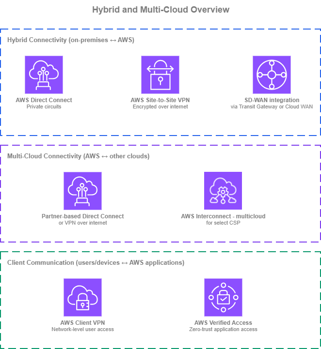

# Hybrid and Multi-Cloud Connectivity

!!! info "Prerequisites"
    This section assumes familiarity with [Amazon VPC](../foundation/vpc.md), [CIDR Planning](../foundation/cidr.md), [AWS Organizations](../foundation/organizations.md), and the [Within AWS connectivity](within-aws.md) services (AWS Transit Gateway and AWS Cloud WAN in particular). Review those topics first if you're new to AWS networking fundamentals.

Connecting AWS to networks outside AWS covers two distinct concerns, and the right answer is rarely a single service. **Hybrid connectivity** brings on-premises data centers and branch offices to AWS through private circuits, encrypted VPN, or SD-WAN overlays. **Multi-cloud connectivity** connects AWS to other public clouds for workloads that span providers.

/// caption
Hybrid and multi-cloud overview — [Drawio Source](../assets/connectivity/hybrid-overview.drawio)
///

For on-premises connectivity, [AWS Direct Connect](https://aws.amazon.com/directconnect/) delivers private, predictable bandwidth over dedicated circuits and is the foundation for most production hybrid deployments. [AWS Site-to-Site VPN](https://aws.amazon.com/vpn/site-to-site-vpn/) provides encrypted connectivity over the internet, useful when private circuits are not needed or as a complement to Direct Connect for layer-3 encryption. **SD-WAN integration** uses Transit Gateway Connect or AWS Cloud WAN Connect attachments to bring third-party SD-WAN overlays into the AWS network plane.

For multi-cloud, [AWS Interconnect](https://docs.aws.amazon.com/interconnect/latest/userguide/what-is-interconnect.html) is the recommended option: a managed service that creates a direct, private connection between your AWS VPCs and another cloud provider's networks without requiring cross-connects at a colocation, partner coordination, or manual router configuration. The established alternatives (partner-based Direct Connect cross-connects, or Site-to-Site VPN between clouds) remain valid where AWS Interconnect doesn't yet cover your Region pair or cloud pair, but they carry more operational overhead.

Most organizations use more than one of these services simultaneously. The goal is to use each where it provides the most value. For the recommended architecture combining these services, see [Building your hybrid and multi-cloud stack](#building-your-hybrid-and-multi-cloud-stack) at the end of this page.

## Private on-premises connectivity with AWS Direct Connect

[AWS Direct Connect](https://docs.aws.amazon.com/directconnect/latest/UserGuide/Welcome.html) provides private, dedicated network connectivity between your on-premises network and AWS. Traffic flows over physical circuits provisioned at a Direct Connect location, bypassing the public internet entirely, so bandwidth is predictable, latency is consistent, and data transfer out of AWS is cheaper than over the internet. Direct Connect is the foundation for most production hybrid deployments, and it integrates with every AWS network service that terminates hybrid traffic: virtual private gateways, Transit Gateway, and AWS Cloud WAN.

**Key capabilities**:

*   :material-fiber: **Dedicated and hosted connections**

    ---

    Dedicated connections at 1 Gbps, 10 Gbps, or 100 Gbps come directly from AWS at a Direct Connect location. Hosted connections at smaller speeds (50 Mbps to 25 Gbps) come from a Direct Connect Partner that has already provisioned capacity into the location.

*   :material-lan: **Virtual interfaces (VIFs)**

    ---

    A single physical connection carries multiple VLAN-tagged virtual interfaces. **Private VIFs** reach VPC resources (via a virtual private gateway or a Direct Connect gateway). **Transit VIFs** reach Transit Gateways or AWS Cloud WAN core networks (via a Direct Connect gateway). **Public VIFs** reach AWS public service endpoints over private links.

*   :material-router-network: **Direct Connect Gateway**

    ---

    A globally distributed BGP route reflector. A single Direct Connect Gateway associates with virtual private gateways, Transit Gateways, or AWS Cloud WAN core networks across any AWS Region (except China), so one physical connection can reach many Regions without provisioning multiple circuits.

*   :material-transit-transfer: **SiteLink**

    ---

    Routes traffic between two Direct Connect locations over the AWS global backbone without touching an AWS Region. Useful for connecting on-premises sites to each other through the AWS network when that path is shorter or more reliable than your WAN.

*   :material-shield-check: **MACsec encryption**

    ---

    IEEE 802.1AE MACsec encrypts traffic at layer 2 between your router and the AWS Direct Connect router on supported 10 Gbps and 100 Gbps connections. Useful when compliance requires link-layer encryption on the dedicated circuit itself.

*   :material-ip-network: **Dual-stack support**

    ---

    Private, transit, and public VIFs all support IPv4 and IPv6 BGP sessions. Dual-stack is configured per VIF, so you can run IPv4 and IPv6 on the same physical connection.

### AWS Direct Connect Best Practices

#### Design for resiliency at the location and provider level, not just at the connection level

A single dedicated connection, even at 100 Gbps, is still one circuit through one Direct Connect location. For production hybrid traffic, follow the Resiliency Toolkit's **maximum resiliency** model: at least two connections at two separate Direct Connect locations, each sourced from a different provider and terminating on different on-premises routers. This removes location, provider, cross-connect, and device as single points of failure.

If the workload can tolerate degraded performance during a single location failure, the **high resiliency** model (two connections across two locations through one or more providers) is a reasonable middle ground. The **development/test** single-connection model is rarely appropriate for anything that ends up carrying production traffic.

#### Use a Direct Connect Gateway as the attach point

A Direct Connect Gateway is a free, globally distributed resource that acts as the BGP attach point between your VIFs and AWS network services (virtual private gateways, Transit Gateways, or AWS Cloud WAN core networks). Associating a single Direct Connect Gateway with multiple regional attach points means one physical connection can reach workloads in any Region, without a Region-specific VIF per destination.

This also simplifies migrations: when you move workloads between Regions or from Transit Gateway to AWS Cloud WAN, you re-associate the Direct Connect Gateway rather than re-provisioning VIFs. It also keeps the BGP control plane off the data path, so BGP re-convergence doesn't interrupt traffic on healthy paths.

#### Choose the right VIF type for each workload

Direct Connect offers three VIF types, each suited to a different use case. Picking the right one per workload matters more than defaulting to one type everywhere:

* **Transit VIF** is the default for extending on-premises connectivity to the AWS network at large. Terminating on a Transit Gateway or AWS Cloud WAN core network (via a Direct Connect Gateway), a single Transit VIF reaches every VPC the hub routes to, with less VIF sprawl and centralized routing.
* **Private VIF** to a specific VPC makes sense for workloads that justify a dedicated path: sustained high-throughput data transfer or latency-sensitive traffic where the hub's data processing adds overhead you want to avoid, or compliance cases where the workload can't share an attach point.
* **Public VIF** is the right choice for consumption of AWS public service endpoints (for example, Amazon S3 or Amazon DynamoDB) directly over the Direct Connect path.

Most production environments run all three: one or more Transit VIFs as the backbone, Private VIFs for a small number of demanding workloads, and Public VIF where AWS public endpoint traffic is significant (S3 as the most common use case).

#### Use BGP attributes for traffic engineering across multiple Direct Connect paths

When you have multiple Direct Connect connections, BGP attributes let you shape how traffic flows: primary vs. secondary paths, load distribution across circuits, and symmetric return traffic. The supported attributes are **Local Preference communities** (on routes from AWS, higher wins), **AS_PATH prepending** (on routes you advertise, longer is less preferred), **MED** (on routes you advertise, lower wins when AS_PATH ties), and **longest prefix match** (which always overrides the attributes above).

For VIFs terminating on a Direct Connect Gateway, the on-side configuration happens on your on-premises router. The VIF and Direct Connect Gateway themselves don't have configurable BGP policy knobs, so traffic engineering is primarily an on-premises exercise. For AWS Cloud WAN deployments, Cloud WAN [routing policies](https://docs.aws.amazon.com/network-manager/latest/cloudwan/cloudwan-routing-policies.html) add an AWS-side control point: you can filter, summarize, and manipulate BGP attributes on routes between Cloud WAN segments and Direct Connect Gateway attachments from the policy rather than only from the on-premises router.

#### Enable BFD for sub-second failover

BGP hold timers alone detect a failed neighbor in around 90 seconds by default (three times the 30-second keep-alive interval). That's too long for most production hybrid workloads. [Bidirectional Forwarding Detection (BFD)](https://docs.aws.amazon.com/directconnect/latest/UserGuide/enable_bfd.html) runs a lightweight liveness check alongside the BGP session and tears the session down as soon as the forwarding path fails, typically within about a second.

AWS enables asynchronous BFD on every Direct Connect BGP session automatically, with a 300 ms detection timer and a multiplier of 3 (roughly 900 ms to declare the session down). On your side, enable BFD with compatible timers on the on-premises router to complete the negotiation. Without BFD active on both ends, failover on a connection, VIF, or peer device issue still falls back to BGP hold timers, and the outage window is tens of seconds rather than sub-second.

BFD is especially important in multi-circuit or active/passive designs where the whole point of the redundancy is quick failover. Confirm that BFD is up on every session as part of turn-up validation, and alarm on BFD state the same way you alarm on BGP session state.

#### Plan IPv6 from the start

Every VIF type supports IPv6 BGP sessions. Configure IPv6 alongside IPv4 on each VIF from the beginning, even if your on-premises hosts are IPv4-only today. The AWS side supports dual-stack; the hard part is the on-premises rollout, and having the AWS side ready means you can adopt IPv6 when the on-premises network is ready without reopening VIF configuration.

#### Monitor BGP and VIF metrics actively

Direct Connect publishes CloudWatch metrics for BGP session state, connection state, and per-VIF ingress and egress bytes and packets. Alarm on BGP session state flapping and on unexpected traffic asymmetry (one VIF carrying significantly more or less than its siblings when BGP should balance them). Fast detection of BGP state changes is the difference between a failover that is invisible to users and one that causes a five-minute outage.

### When to use AWS Direct Connect

Direct Connect is the right choice whenever any of the following applies:

* Your hybrid workloads require predictable bandwidth or latency that the public internet can't guarantee.
* You transfer large volumes of data out of AWS and want the lower Direct Connect egress pricing rather than internet egress rates.
* You have compliance requirements that forbid sensitive traffic from traversing the public internet.
* You are building any new production hybrid architecture. The path to high resiliency is multiple Direct Connect connections across multiple locations and providers, not a single Direct Connect paired with a VPN fallback.

Direct Connect is **not** the right starting point when connectivity needs to be up in days rather than weeks (provisioning involves cross-connects and provider coordination), when traffic volume is low enough that VPN cost and performance are acceptable, or when connectivity is short-lived (for example, a one-time data migration where VPN throughput is sufficient).

### Combining AWS Direct Connect with other Hybrid Networking services

| Combination | AWS Direct Connect handles | Other service handles |
| --- | --- | --- |
| **Direct Connect + Site-to-Site VPN** | Private path into AWS | IPsec overlay on top of Direct Connect when MACsec is not available (for example, sub-10 Gbps hosted connections or compliance baselines that require layer-3 encryption) |
| **Direct Connect + SD-WAN (via TGW/Cloud WAN Connect)** | Underlying transport between on-premises SD-WAN appliances and AWS | Overlay delivered by the SD-WAN solution |
| **Direct Connect + AWS Interconnect (multi-cloud)** | On-premises hybrid path | Cloud-to-cloud path between AWS and another provider; the two can share a Direct Connect Gateway |

### Documentation

*   :material-file-document: **AWS Direct Connect documentation**

    ---

    Complete service documentation covering connections, virtual interfaces, Direct Connect Gateway, SiteLink, and MACsec.

    [:octicons-arrow-right-24: Documentation](https://docs.aws.amazon.com/directconnect/latest/UserGuide/Welcome.html)

*   :material-file-document-outline: **Resiliency Toolkit**

    ---

    AWS's recommended resiliency models (development, high, maximum) and the guided workflow for implementing them.

    [:octicons-arrow-right-24: Documentation](https://docs.aws.amazon.com/directconnect/latest/UserGuide/resilency_toolkit.html)

*   :material-post: **AWS Direct Connect blog posts**

    ---

    Architecture walkthroughs, feature announcements, and implementation guides from the AWS Networking and Content Delivery blog.

    [:octicons-arrow-right-24: Blog posts](https://aws.amazon.com/blogs/networking-and-content-delivery/category/networking-content-delivery/aws-direct-connect/)

*   :material-currency-usd: **AWS Direct Connect pricing**

    ---

    Port-hour charges for dedicated and hosted connections, plus data transfer out pricing that is typically lower than internet egress.

    [:octicons-arrow-right-24: Pricing](https://aws.amazon.com/directconnect/pricing/)

## Encrypted on-premises connectivity with AWS Site-to-Site VPN

[AWS Site-to-Site VPN](https://docs.aws.amazon.com/vpn/latest/s2svpn/VPC_VPN.html) provides encrypted IPsec connectivity between your on-premises networks and AWS over the public internet. Each VPN connection consists of two IPsec tunnels terminating on separate AWS endpoints for redundancy, and supports both static routing and dynamic routing with BGP. Site-to-Site VPN can terminate on a virtual private gateway attached to a VPC, on a Transit Gateway, or on an AWS Cloud WAN core network.

Site-to-Site VPN is the fastest way to establish hybrid connectivity. It is commonly used as the primary path for sites that do not require a private circuit, for short-lived connectivity such as data migrations, and as an IPsec overlay on top of Direct Connect when MACsec is not available and layer-3 encryption is required.

**Key capabilities**:

*   :material-shield-key: **IPsec encryption with two tunnels per connection**

    ---

    Every VPN connection provides two IPsec tunnels terminating on endpoints in separate Availability Zones.

*   :material-speedometer: **Standard and Large tunnel bandwidth**

    ---

    Standard tunnels provide up to 1.25 Gbps per tunnel. Large tunnels provide up to 5 Gbps per tunnel, removing the need for complex ECMP bonding on high-throughput workloads. Large tunnels are available on Transit Gateway VPN and AWS Cloud WAN VPN attachments.

*   :material-office-building-marker: **VPN Concentrator for many remote sites**

    ---

    A Transit Gateway attachment that aggregates many low-bandwidth (under 100 Mbps) VPN connections into a single attachment, with up to 100 sites per Concentrator and 5 Gbps aggregate bandwidth. Designed for distributed enterprises with dozens of branches (retail, hospitality, healthcare) that previously required managing multiple virtual concentrator appliances in AWS.

*   :material-rocket-launch: **Accelerated VPN**

    ---

    Routes VPN traffic through AWS Global Accelerator and the AWS edge network, reducing jitter and improving throughput for customers far from the AWS Region. Available on Transit Gateway VPN connections.

*   :material-router: **Private IP VPN over Direct Connect**

    ---

    Terminates the VPN on a private IP address reachable over a Direct Connect connection instead of the public internet. Useful when you want IPsec encryption on top of a Direct Connect circuit without exposing the tunnel endpoint to the internet.

*   :material-network: **Dynamic routing with BGP**

    ---

    BGP on each tunnel lets the on-premises router learn AWS prefixes dynamically and advertise on-premises prefixes into AWS. Static routing is supported for devices that don't run BGP, but BGP is strongly recommended for any non-trivial topology.

*   :material-ip-network: **Dual-stack support**

    ---

    VPN tunnels support IPv4 or IPv6 inside addresses. Dual-stack communication requires separate VPN tunnels for each protocol.

### AWS Site-to-Site VPN Best Practices

#### Use multiple VPN connections with diverse ISP paths and dynamic routing

Every VPN connection provides two IPsec tunnels, but both terminate on AWS endpoints within the same connection. For production resiliency, provision **two or more VPN connections**, terminate them on different on-premises routers, and have each router reach AWS over a **different ISP** so a single-provider outage does not take down both paths at once. Use BGP on every tunnel so AWS learns and fails over between paths automatically, reports reachability through session state, and lets you steer traffic with BGP attributes; static routing skips all of that and is almost never appropriate for production. If an on-premises device does not support BGP, the fix is to replace the device rather than build around it.

#### Terminate VPN on Transit Gateway or AWS Cloud WAN, not virtual private gateways

A VPN to a virtual private gateway reaches exactly one VPC. A VPN to a Transit Gateway or AWS Cloud WAN core network reaches every VPC the hub routes to, with segmentation applied through route tables or network policy. For any environment with more than one VPC, terminate VPN on a Transit Gateway or AWS Cloud WAN.

This also enables Large tunnels (5 Gbps per tunnel), Accelerated VPN, and ECMP across multiple VPN attachments, none of which are available on virtual private gateway VPN.

#### Use VPN Concentrator for many low-bandwidth sites

[VPN Concentrator](https://docs.aws.amazon.com/vpc/latest/tgw/tgw-vpn-concentrator-attachments.html) addresses the many-branches use case: many sites, each with modest bandwidth needs, where provisioning a dedicated VPN connection per site creates Transit Gateway attachment sprawl and per-connection cost that doesn't match the workload. A VPN Concentrator attachment aggregates up to 100 sites (each under 100 Mbps) into a single Transit Gateway attachment, with 5 Gbps aggregate per Concentrator and up to 5 Concentrators per Transit Gateway.

Reach for VPN Concentrator when you have around 25 or more remote sites fitting the low-bandwidth profile (retail chains, hotels, healthcare branches, distributed field offices). The Concentrator runs BGP-only routing and provides AZ-redundant endpoints, so operationally it looks like one attachment with consistent routing policies and security rules applied across all connected sites, instead of a per-site connection to manage. For a handful of sites, or for sites that need more than 100 Mbps, stick with standard Site-to-Site VPN connections.

#### Use Accelerated VPN for distant sites

For branch offices or data centers far from the AWS Region, Accelerated VPN routes traffic through the AWS Global Accelerator edge network instead of the public internet. The improvement in jitter and throughput is meaningful for latency-sensitive or bandwidth-sensitive hybrid workloads, and enabling it is a per-connection toggle.

Accelerated VPN is most valuable when the AWS Region isn't in the same continent as the site or when internet routing between the site and the Region is historically unreliable.

#### Plan IPv6 from the start

VPN tunnels support IPv4 or IPv6 inside addresses, but a single tunnel carries one protocol. If you need both, provision dual-stack by creating one tunnel for IPv4 and another for IPv6 within the same connection configuration, and account for that in bandwidth and tunnel-count planning.

#### Monitor tunnel state, BGP sessions, and enable Site-to-Site VPN logs

CloudWatch publishes `TunnelState`, `TunnelIpAddress`, and BGP session state metrics per tunnel. Alarm on tunnel state transitions and on BGP session flap counts. A single tunnel going down is expected to happen periodically (AWS performs planned maintenance on tunnel endpoints); both tunnels down on the same connection for more than a few minutes is an outage.

Enable [Site-to-Site VPN logs](https://docs.aws.amazon.com/vpn/latest/s2svpn/monitoring-logs.html) on every connection. These logs capture IKE negotiations, IPsec tunnel establishment, dead peer detection, and BGP routing activity, which is the information you need to troubleshoot a failed negotiation or a flapping session. Without them, diagnosing a tunnel that won't establish typically means pulling logs from the on-premises device alone; with them, both sides of the conversation are visible in one place.

### When to use AWS Site-to-Site VPN

Site-to-Site VPN fits any of the following:

* You need hybrid connectivity running today and Direct Connect takes longer to provision.
* The site is small or remote, and the cost and physical provisioning of a Direct Connect circuit aren't justified.
* You need an encrypted overlay on top of Direct Connect because MACsec is not available (sub-10 Gbps hosted connections) or compliance requires layer-3 encryption.
* Connectivity is short-lived, for example, a one-time data migration where internet-based encrypted throughput is sufficient.
* You're connecting many small branch offices that collectively would need more Direct Connect circuits than is practical (VPN Concentrator is typically the right tool at scale).

Site-to-Site VPN is **not** the right choice when you need predictable latency beyond what the public internet can guarantee, when you transfer volumes of data where internet egress cost becomes prohibitive, or when compliance specifically requires private physical circuits rather than encrypted overlays.

### Combining AWS Site-to-Site VPN with other Hybrid Networking services

| Combination | Site-to-Site VPN handles | Other service handles |
| --- | --- | --- |
| **VPN + AWS Direct Connect** | IPsec overlay on top of Direct Connect when MACsec is not available or layer-3 encryption is required | Private path into AWS |

### Documentation

*   :material-file-document: **AWS Site-to-Site VPN documentation**

    ---

    Complete service documentation covering tunnel configuration, BGP, Transit Gateway and AWS Cloud WAN attachments, Large tunnels, and Accelerated VPN.

    [:octicons-arrow-right-24: Documentation](https://docs.aws.amazon.com/vpn/latest/s2svpn/VPC_VPN.html)

*   :material-file-document-outline: **Accelerated VPN**

    ---

    How to enable Accelerated VPN and when it improves throughput for distant sites.

    [:octicons-arrow-right-24: Documentation](https://docs.aws.amazon.com/vpn/latest/s2svpn/accelerated-vpn.html)

*   :material-file-document-multiple-outline: **Hybrid Connectivity whitepaper**

    ---

    AWS whitepaper covering Site-to-Site VPN, Direct Connect, and SD-WAN architectures for hybrid connectivity.

    [:octicons-arrow-right-24: Whitepaper](https://docs.aws.amazon.com/whitepapers/latest/hybrid-connectivity/hybrid-connectivity.html)

*   :material-post: **AWS Site-to-Site VPN blog posts**

    ---

    Architecture patterns, feature announcements, and implementation guides from the AWS Networking and Content Delivery blog.

    [:octicons-arrow-right-24: Blog posts](https://aws.amazon.com/blogs/networking-and-content-delivery/category/networking-content-delivery/aws-vpn/aws-site-to-site-vpn/)

*   :material-currency-usd: **AWS Site-to-Site VPN pricing**

    ---

    Per-connection-hour charges plus data transfer, with separate pricing for standard and Large tunnels and for Accelerated VPN.

    [:octicons-arrow-right-24: Pricing](https://aws.amazon.com/vpn/pricing/)

## SD-WAN integration with AWS Transit Gateway and AWS Cloud WAN

This section is for organizations that already run SD-WAN across their branches and data centers and want AWS to participate in that overlay as a first-class site. The SD-WAN vendor handles the overlay itself (path selection, WAN optimization, site-to-site encryption, orchestration); AWS provides the attach point that brings the overlay into the AWS network plane.

The integration mechanism is **Connect attachments** on [AWS Transit Gateway](https://docs.aws.amazon.com/vpc/latest/tgw/tgw-connect.html) or [AWS Cloud WAN](https://docs.aws.amazon.com/network-manager/latest/cloudwan/cloudwan-connect-attachment.html). A Connect attachment carries multiple Connect peers, each with BGP for dynamic routing between the SD-WAN appliance and AWS. BGP is the standard control plane every SD-WAN vendor speaks. The tunnel protocol, the underlay, and the supported landing service differ between Transit Gateway and AWS Cloud WAN, and those differences shape the integration design; the sections that follow cover them.

/// caption
SD-WAN integration — [Drawio Source](../assets/connectivity/sdwan-integration.drawio)
///

**Integration building blocks**:

*   :material-hub: **Transit Gateway vs AWS Cloud WAN differences**

    ---

    Both services support Connect attachments with BGP, but the supported **tunnel protocol** and **underlay** differ. Transit Gateway Connect uses GRE only and supports both VPC and Direct Connect underlays. AWS Cloud WAN Connect supports GRE and **Tunnel-less Connect** (a higher-performance option that eliminates encapsulation overhead), and the underlay must be a VPC attachment; Direct Connect Gateway is not supported. Pick the landing service that matches your existing AWS network backbone.

*   :material-tunnel: **GRE and Tunnel-less Connect**

    ---

    GRE encapsulates the BGP and data traffic in a tunnel between the SD-WAN appliance and the AWS side. Tunnel-less Connect (AWS Cloud WAN only) skips the encapsulation entirely, so BGP runs directly between the appliance and Cloud WAN. Tunnel-less removes GRE overhead and typically delivers higher per-peer throughput.

*   :material-router-wireless: **VPC or Direct Connect underlay (Transit Gateway only)**

    ---

    For Transit Gateway Connect, the underlay can be a VPC (where SD-WAN virtual appliances run as EC2 instances) or a Direct Connect attachment (where the SD-WAN appliance is on-premises and peers with AWS over Direct Connect via a Direct Connect Gateway). The right choice depends on where you want your SD-WAN appliances to sit. AWS Cloud WAN Connect currently supports VPC underlay only.

*   :material-chart-pie: **Segment SD-WAN traffic into AWS environments**

    ---

    With Transit Gateway route tables or AWS Cloud WAN segments, you can map SD-WAN traffic classes (production, non-production, guest, IoT) to distinct routing domains inside AWS. This requires either multiple Connect peers (one per segment) or SD-WAN-side encapsulation that the vendor then maps to the appropriate AWS segment.

*   :material-ip-network: **Dual-stack support**

    ---

    Connect attachments support IPv4 and IPv6 BGP sessions on the same GRE tunnel, so you can propagate IPv4 and IPv6 routes between the SD-WAN overlay and the AWS network without provisioning separate tunnels.

### Best Practices for integrating SD-WAN networks with AWS

#### Choose the underlay based on where the SD-WAN appliance lives

If the SD-WAN vendor recommends running virtual appliances inside AWS (a common pattern), use a VPC-based Connect attachment on either Transit Gateway or AWS Cloud WAN: deploy the appliances in a transit VPC, attach the VPC to the chosen service, then layer the Connect attachment on top. The SD-WAN overlay connects on-premises devices to the appliances over the internet or Direct Connect.

If the SD-WAN appliances stay on-premises and peer with AWS directly, use a Transit Gateway Connect attachment with a Direct Connect underlay (via a Direct Connect Gateway). The on-premises SD-WAN devices establish GRE peers to the Transit Gateway over the Direct Connect circuit. This removes the virtual-appliance tier in AWS entirely, at the cost of requiring Direct Connect everywhere the SD-WAN terminates. This pattern is currently Transit Gateway only; AWS Cloud WAN Connect does not support a Direct Connect Gateway underlay.

#### Design for Connect peer redundancy per segment

A Connect attachment supports up to four Connect peers, each with two BGP sessions. For redundancy, provision at least two Connect peers per attachment, terminated on different SD-WAN appliances or different on-premises devices. AWS strongly recommends configuring both BGP sessions on every Connect peer; running a single session removes protection against BGP control plane failures during AWS maintenance events.

If you're segmenting SD-WAN traffic into multiple AWS environments (for example, production and non-production over the same Connect attachment), each segment typically requires its own Connect peer with routes filtered appropriately.

#### Use AWS Cloud WAN segments instead of Transit Gateway route tables for multi-Region SD-WAN

For a single-Region SD-WAN landing, Transit Gateway Connect with route table segmentation works well. For global SD-WAN deployments that land in multiple AWS Regions, AWS Cloud WAN Connect attachments into policy-defined segments are operationally simpler: the segmentation is part of the network policy, applied consistently across Regions, rather than being managed per-Region through individual Transit Gateway route tables.

Existing Transit Gateway Connect deployments can migrate incrementally. AWS Cloud WAN peers with Transit Gateways, so the SD-WAN attachments can stay on Transit Gateway while other traffic moves to AWS Cloud WAN.

#### Keep BGP prefix counts manageable

Connect peers support larger prefix counts than IPsec VPN (multi-protocol BGP with many thousands of prefixes is viable), but SD-WAN overlays often advertise every branch subnet as a separate prefix and the numbers grow quickly. Summarize on the SD-WAN side where possible, and monitor received-route counts on the AWS side through CloudWatch. Approaching per-peer limits is easy to miss until an advertisement storm triggers them.

If you land SD-WAN on AWS Cloud WAN, you can also summarize on the AWS side through [routing policies](https://docs.aws.amazon.com/network-manager/latest/cloudwan/cloudwan-routing-policies.html): aggregate the prefixes announced to the Connect attachment, or filter routes arriving/leaving the AWS Cloud WAN network. This is useful when the SD-WAN orchestrator can't summarize cleanly at the source, or when different segments need different views of the branch prefix space.

#### Plan IPv6 from the start

Configure IPv6 BGP sessions alongside IPv4 on every Connect peer from the beginning. SD-WAN vendors are increasingly IPv6-capable, and the AWS side supports dual-stack natively. Retrofitting IPv6 after the fact often requires coordination with the SD-WAN orchestrator, which is smoother when the Connect peers are already dual-stack.

### Documentation

*   :material-file-document: **Transit Gateway Connect documentation**

    ---

    Complete documentation on Connect attachments, Connect peers, GRE and BGP configuration, and VPC or Direct Connect underlays.

    [:octicons-arrow-right-24: Documentation](https://docs.aws.amazon.com/vpc/latest/tgw/tgw-connect.html)

*   :material-file-document-outline: **AWS Cloud WAN Connect attachments**

    ---

    How to use Connect attachments with AWS Cloud WAN and policy-driven segments for global SD-WAN deployments.

    [:octicons-arrow-right-24: Documentation](https://docs.aws.amazon.com/network-manager/latest/cloudwan/cloudwan-connect-attachment.html)

## Multi-cloud connectivity

Workloads increasingly span multiple public clouds: a database in one cloud, an analytics platform in another, an application running in AWS consuming both. Connecting AWS VPCs to another cloud's VPCs historically required building the path yourself: provisioning Direct Connect to a colocation facility, cross-connecting to the other cloud's equivalent service, and maintaining the physical and BGP configuration on both sides. [AWS Interconnect](https://docs.aws.amazon.com/interconnect/latest/userguide/what-is-interconnect.html) changes that by offering a managed, direct cloud-to-cloud connection that AWS and the peer cloud provision and maintain end to end.

This section covers all of the multi-cloud options, with AWS Interconnect recommended as the default where it's available and the partner-based alternatives documented for cases where AWS Interconnect doesn't yet cover your Region pair or your other cloud.

### Direct cloud-to-cloud connectivity with AWS Interconnect

AWS Interconnect is a fully managed service that creates a private, high-speed connection between AWS VPCs and another cloud provider's VPCs. Today, AWS Interconnect - Multi-cloud supports connections between AWS and Google Cloud in a set of paired AWS and Google Cloud Regions. Coverage continues to expand; consult the [AWS Interconnect documentation](https://docs.aws.amazon.com/interconnect/latest/userguide/what-is-interconnect.html) for the current list of supported Regions. On the AWS side, an Interconnect attaches to a Direct Connect Gateway, which in turn associates with a Transit Gateway, AWS Cloud WAN core network, or virtual private gateway. On the other cloud's side, the service attaches to that cloud's equivalent construct.

Unlike the do-it-yourself alternative at a colocation, AWS Interconnect abstracts away physical cross-connects, BGP configuration, and VLAN provisioning. You select the AWS Region, the peer cloud's Region, the required bandwidth, and the provider, and AWS and the provider provision both sides automatically. Capacity can be scaled up or down without re-provisioning.

**Key capabilities**:

*   :material-cloud-sync: **Direct AWS ↔ other-cloud connectivity**

    ---

    A single managed object (the *interconnect*) connects an AWS Direct Connect Gateway to the peer cloud's attach point. Traffic rides the AWS global backbone to the provider and hands off directly, with no intermediate internet hops.

*   :material-shield-lock-outline: **MACsec encryption by default**

    ---

    Every physical link is encrypted with IEEE 802.1AE MACsec between the AWS router and the provider's router. Traffic only flows when encryption is active, so there is no unencrypted path.

*   :material-check-all: **Built-in maximum resiliency**

    ---

    Every Interconnect is provisioned across redundant devices in at least two physically distinct facilities with independent power and networking. Multi-cloud connections use a four-connection model with ECMP load balancing, so at least one link stays up during planned maintenance or a device failure.

*   :material-speedometer: **Elastic bandwidth**

    ---

    Capacity can be increased or decreased without re-provisioning cross-connects or coordinating with the provider.

*   :material-router-network: **Direct Connect Gateway as the AWS attach point**

    ---

    The AWS side of the Interconnect attaches to a Direct Connect Gateway, which then associates with a Transit Gateway, AWS Cloud WAN core network, or virtual private gateway. The same Direct Connect Gateway can anchor on-premises Direct Connect and multi-cloud Interconnect, so both paths share one global routing construct.

*   :material-clock-fast: **Fast provisioning**

    ---

    Interconnects are typically provisioned within minutes using the create-and-accept workflow between AWS and the provider. No cross-connect ticket, no BGP configuration, no VLAN negotiation.

#### AWS Interconnect Best Practices

##### Use AWS Interconnect as the default for supported Region pairs and providers

Where AWS Interconnect supports the AWS Region and peer cloud Region you need, it should be the default choice. The operational difference versus the partner-based Direct Connect alternative is substantial: no cross-connect, no BGP on your routers, no provider coordination during capacity changes, and MACsec encryption on every link by default.

The primary reason to consider the alternatives is coverage. AWS Interconnect - Multi-cloud currently supports AWS-to-Google Cloud, and that support is expanding. For Region pairs not yet in the supported list, or for cloud pairs where AWS Interconnect is not yet available, the partner-based approach or internet-based VPN remain the options.

##### Use AWS Cloud WAN to decouple AWS-Region from Interconnect-Region

When AWS Interconnect is reached through a Direct Connect Gateway attached to a virtual private gateway or a Transit Gateway, the reachable Interconnect is "local" to that AWS Region: a Transit Gateway in one AWS Region can only reach the Interconnect whose paired Google Cloud Region is itself paired with that same AWS Region. When the Direct Connect Gateway is attached to **AWS Cloud WAN**, any Core Network Edge in the global network can reach any Interconnect on that Direct Connect Gateway, so one Interconnect can serve workloads across every AWS Region participating in the core network.

The peer cloud's side is a different story: the Google Cloud Region an Interconnect pairs with is fixed by the Interconnect itself. Reaching a specific Google Cloud Region still requires an Interconnect for that Region, regardless of what AWS Cloud WAN does on the AWS side.

##### Plan IPv6 from the start

AWS Interconnect supports both IPv4 and IPv6 BGP sessions to the Direct Connect Gateway. Enable IPv6 alongside IPv4 on the Interconnect from the beginning so that when the peer cloud's IPv6 support catches up on your workloads' side, the transport is ready.

#### When to use AWS Interconnect

AWS Interconnect is the right choice when:

* You need private, predictable connectivity between AWS and another cloud provider, and the required AWS and peer cloud Regions are supported.
* You want encrypted cloud-to-cloud traffic without running and maintaining IPsec tunnels.
* You want to avoid the operational burden of provisioning cross-connects at a colocation and coordinating BGP and VLAN configuration between two cloud providers and a facility.
* You plan to scale bandwidth up or down as multi-cloud workloads evolve, rather than committing to a static capacity at a colocation.

### Other multi-cloud options

Where AWS Interconnect isn't available (unsupported cloud, unsupported Region pair, or existing commitments at a colocation), two established patterns remain valid.

#### Partner-based AWS Direct Connect to another cloud

The long-established pattern: provision an AWS Direct Connect connection at a Direct Connect location that also houses a peer cloud's equivalent service (Google Cloud Partner Interconnect, Microsoft Azure ExpressRoute, Oracle FastConnect), order a cross-connect or use a virtual interconnection partner's fabric to bridge the two, and configure BGP on each side to advertise prefixes between the clouds.

This gives you private, high-bandwidth connectivity in Regions and cloud pairs that AWS Interconnect doesn't yet support, and it can be the right choice where you already have Direct Connect circuits and a colocation footprint and want to extend the same facility to connect a second cloud.

The trade-offs compared to AWS Interconnect:

* **Physical and logical cross-connect to manage**. Two clouds plus a facility means three parties.
* **BGP configuration on both sides**. The path isn't managed end to end; you configure BGP, maintain the sessions, and debug the combined behavior.
* **Encryption is your responsibility**. Cross-connects at colocation facilities aren't MACsec-encrypted by default. If compliance requires encryption, you run IPsec over the cross-connect, which reintroduces the tunnel overhead AWS Interconnect avoids.
* **Capacity changes take longer**. Scaling bandwidth usually means re-provisioning cross-connects rather than adjusting through a console.

This pattern is the right choice when AWS Interconnect doesn't cover the cloud or Region pair and the traffic volume or latency requirements don't tolerate the internet-based alternative.

#### AWS Site-to-Site VPN between clouds

The simplest multi-cloud option, and sometimes the only option for low-volume or short-lived workloads: establish Site-to-Site VPN from an AWS Transit Gateway or AWS Cloud WAN core network to the peer cloud's VPN gateway. BGP runs over the tunnels and carries prefixes between the clouds.

Internet-based VPN is fast to set up (no physical provisioning), cheap for low-volume workloads, and widely supported. It is also internet-based, which means performance is subject to public internet conditions, and it ties up IPsec throughput on both sides.

Use this when AWS Interconnect isn't available and the workload can tolerate internet-based performance, or for low-volume cloud-to-cloud traffic that doesn't justify a partner-based Direct Connect setup.

#### Comparing the multi-cloud options

| Aspect | AWS Interconnect | Partner-based Direct Connect | Site-to-Site VPN between clouds |
| --- | --- | --- | --- |
| Transport | AWS global backbone, direct handoff to peer cloud | Dedicated cross-connect at a colocation facility | Public internet |
| Management model | Fully managed by AWS and the provider | You manage BGP, VLANs, cross-connects across three parties | You manage BGP and IPsec on both sides |
| Encryption | MACsec by default | Your responsibility (typically IPsec overlay) | IPsec over internet |
| Provisioning time | Minutes | Days to weeks | Minutes |
| Capacity changes | Elastic, on demand | Requires cross-connect re-provisioning | Elastic on each cloud |
| Coverage today | AWS ↔ Google Cloud, expanding | All major clouds, subject to colocation footprint | All major clouds |
| Best for | Supported cloud pairs and Regions, production multi-cloud workloads | Cloud pairs and Regions not yet covered by AWS Interconnect, existing colocation deployments | Low-volume or short-lived workloads where the cloud pair or Region is not yet covered by AWS Interconnect |

### Documentation

*   :material-file-document: **AWS Interconnect documentation**

    ---

    Complete service documentation covering both the Multi-cloud and last-mile offerings, concepts, attach points, and supported Region pairs.

    [:octicons-arrow-right-24: Documentation](https://docs.aws.amazon.com/interconnect/latest/userguide/what-is-interconnect.html)

*   :material-currency-usd: **AWS Interconnect pricing**

    ---

    Per-hour charges by bandwidth tier, plus data transfer. Shared cross-connect fees are included in the managed service, unlike the partner-based alternative.

    [:octicons-arrow-right-24: Pricing](https://aws.amazon.com/interconnect/multicloud/pricing/)

## Building your hybrid and multi-cloud stack

Real-world hybrid and multi-cloud architectures combine several of these services, with each one operating at the layer where it provides the most value.

The services covered in this page are complementary layers, not competing alternatives.

/// caption
Hybrid and multi-cloud stack — [Drawio Source](../assets/connectivity/hybrid-stack.drawio)
///

### New environments

Organizations building hybrid and multi-cloud connectivity from scratch have the opportunity to adopt the patterns that scale best from day one:

1. **On-premises path and resiliency**: AWS Direct Connect terminating on a Transit Gateway or AWS Cloud WAN core network through a Direct Connect Gateway, designed to the Resiliency Toolkit's maximum resiliency model (multiple connections across multiple locations and providers). Resiliency comes from multiple Direct Connect connections, not from pairing a single Direct Connect with a VPN fallback.
2. **VPN where it adds value**: AWS Site-to-Site VPN on the same Transit Gateway or AWS Cloud WAN for fast-start sites that don't yet have Direct Connect, short-lived connectivity, or as an IPsec overlay on top of Direct Connect when MACsec is not available.
3. **Multi-cloud**: AWS Interconnect where supported, sharing the same Direct Connect Gateway as the on-premises Direct Connect. Partner-based Direct Connect or Site-to-Site VPN between clouds only where AWS Interconnect coverage isn't there yet.
4. **SD-WAN integration**: Transit Gateway Connect or AWS Cloud WAN Connect attachments if the organization already runs SD-WAN across branches and wants that overlay to extend into AWS.
5. **Application access**: See [Remote Access](remote-access.md) for AWS Verified Access and AWS Client VPN guidance.

### Existing environments

Organizations running established hybrid patterns have working foundations that don't need to be replaced:

1. **AWS Direct Connect** remains the foundation. If circuits are terminated on virtual private gateways rather than Transit Gateway or AWS Cloud WAN, evaluate consolidating onto a hub through a Direct Connect Gateway as the environment grows.
2. **AWS Site-to-Site VPN** remains fully supported. Consider Large tunnels for high-throughput sites and Accelerated VPN for sites distant from the Region.
3. **Partner-based Direct Connect to another cloud** keeps working and should not be ripped out for its own sake. Evaluate AWS Interconnect for new multi-cloud pairs or when existing cross-connects come up for renewal.
4. **SD-WAN integrations** on Transit Gateway Connect can migrate incrementally to AWS Cloud WAN when multi-Region management complexity grows; AWS Cloud WAN peers with existing Transit Gateways, so SD-WAN traffic doesn't have to move all at once.
5. **AWS Client VPN** can coexist with AWS Verified Access during migration. See [Remote Access](remote-access.md) for the recommended migration path.
