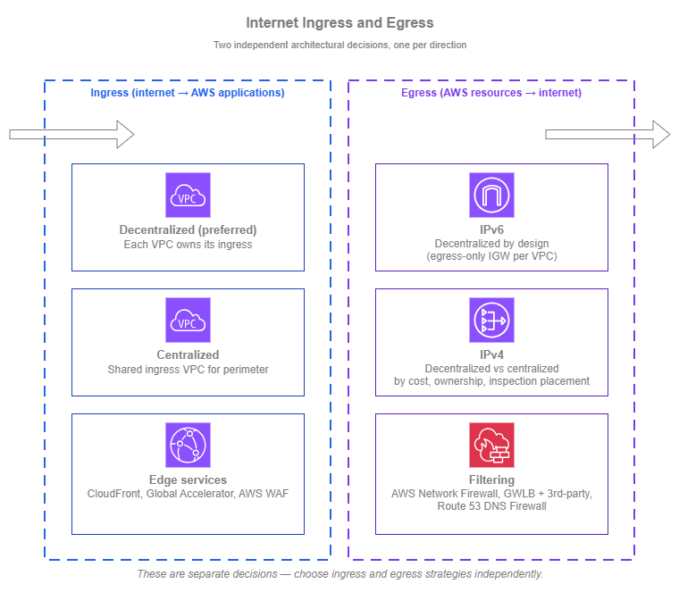
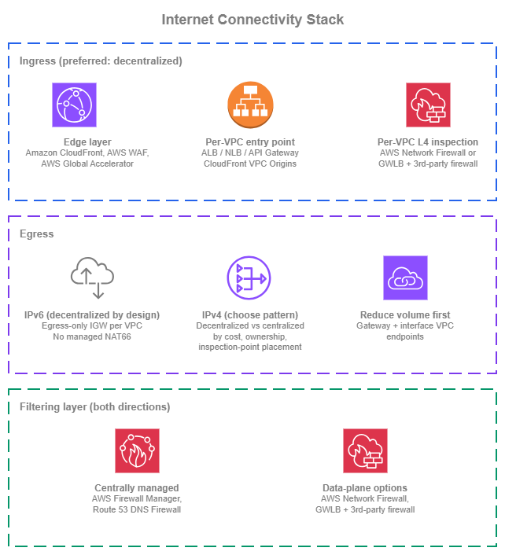

# Internet Connectivity

!!! info "Prerequisites"
    This section assumes familiarity with [Amazon VPC](../foundation/vpc.md), [Subnets](../foundation/subnets.md), and the [Within AWS connectivity](within-aws.md) services (AWS Transit Gateway and AWS Cloud WAN in particular). Review those topics first if you're new to AWS networking fundamentals.

Internet connectivity covers two distinct concerns, and the right pattern for each depends on different criteria. **Ingress connectivity** brings external clients to your AWS-hosted applications — through Amazon CloudFront's 450+ edge locations, AWS WAF evaluating requests against managed rule groups, and per-VPC load balancers that scale automatically. **Egress connectivity** lets your AWS resources reach external services — through NAT gateways processing IPv4 traffic at up to 100 Gbps per gateway with per-GB processing charges (see [NAT gateway pricing](https://aws.amazon.com/vpc/pricing/)), or through egress-only internet gateways that provide free, unlimited IPv6 outbound access. The decisions you make for one rarely apply cleanly to the other, so this page treats them separately.

The cross-cutting choice in both directions is **centralized vs. decentralized**: do you concentrate ingress or egress through a shared VPC and a network team, or distribute it per workload to the teams that own each application? The right answer differs by direction. For ingress, decentralized is the preferred default and centralized is reserved for specific cases. For egress, the choice is genuinely a trade-off across cost, operational ownership, and where the inspection point sits, and there is no single right answer. For the recommended architecture combining these patterns, see [Building your internet connectivity stack](#building-your-internet-connectivity-stack) at the end of this page.

/// caption
Internet ingress and egress — [Drawio Source](../assets/connectivity/internet-ingress-egress.drawio)
///

For ingress, the decentralized pattern keeps each application's internet entry point in the VPC and account that owns the workload. Application teams manage their own load balancers, certificates, and scaling decisions; failure of one team's ingress does not affect others. Centralized protection is still applied uniformly through CloudFront, AWS WAF, and per-VPC layer-3/4 inspection (AWS Network Firewall, or [Gateway Load Balancer](https://docs.aws.amazon.com/elasticloadbalancing/latest/gateway/introduction.html) with third-party firewall appliances) — all managed centrally through [AWS Firewall Manager](https://docs.aws.amazon.com/waf/latest/developerguide/fms-chapter.html). The AWS edge effectively becomes a centrally-managed, globally-distributed perimeter, removing the historical reason to route every flow through a shared regional ingress VPC. Centralized ingress through a shared VPC remains an option, but it adds load-balancer chaining, extra traffic processing cost, and shared-VPC blast radius without delivering protection that the cloud-native decentralized pattern doesn't already provide.

For egress, the choice is more nuanced and splits by IP version. **IPv6 egress is decentralized by design**: each VPC reaches the internet through its own egress-only internet gateway, and there is no managed NAT66 to centralize. **IPv4 egress** is the genuine 50-50 choice. Centralizing IPv4 collapses per-VPC [NAT gateways](https://docs.aws.amazon.com/vpc/latest/userguide/vpc-nat-gateway.html) and inspection endpoints into one shared egress VPC, but adds Transit Gateway or AWS Cloud WAN data-processing charges on every flow and concentrates operational ownership on a central team. Decentralizing IPv4 keeps each VPC self-contained with no transit-network charges, but each VPC pays for its own NAT gateway and (where required) per-VPC inspection. Uniform policy is achievable in either pattern.

## Ingress connectivity

Ingress is how external clients reach applications you host in AWS. The two architectural patterns are **decentralized** (each application owns its own internet entry point) and **centralized** (a shared ingress VPC fronts multiple applications). For most environments, decentralized is the right default. Centralized ingress is justified for specific cases, not as a generic best practice.

The patterns are largely independent of the protocol, but the services that implement each pattern differ for **L7 traffic** (HTTP, HTTPS, and gRPC web applications, REST APIs, and other application-layer workloads) versus **L4 traffic** (TCP and UDP services where the load balancer must forward without HTTP-aware decoding, including gaming, financial trading, custom protocols, and services that must preserve client IPs end-to-end). Each subsection that follows calls out the relevant services for both traffic classes.

!!! note "Baseline DDoS protection"
    [AWS Shield](https://docs.aws.amazon.com/waf/latest/developerguide/shield-chapter.html) Standard is automatically applied at no charge to every public-facing AWS endpoint (CloudFront distributions, Global Accelerator, ALBs, NLBs, Route 53, AWS API endpoints), regardless of whether you adopt a decentralized or centralized ingress pattern. The patterns below focus on application-layer protection and traffic shaping; baseline volumetric DDoS defense is already in place.

### Decentralized ingress (preferred)

In a decentralized model, each VPC that hosts an internet-facing application also owns its ingress. Application teams choose the load balancer or API endpoint that fits their workload, manage their own TLS certificates through AWS Certificate Manager, and scale ingress independently of every other workload. The blast radius of any ingress misconfiguration is bounded to that application.

A common concern with decentralized ingress is whether per-team ownership creates a security gap. It does not. Central, uniform protection still applies in front of every workload, but it does so at the AWS edge rather than through a shared ingress VPC:

* For L7 traffic, [Amazon CloudFront](https://docs.aws.amazon.com/AmazonCloudFront/latest/DeveloperGuide/Introduction.html) and [AWS WAF](https://docs.aws.amazon.com/waf/latest/developerguide/waf-chapter.html) apply a consistent rule baseline at every distribution.
* For L4 traffic, **per-VPC firewall endpoints** in each workload VPC inspect ingress traffic between the internet gateway and the workload's entry point. The two options are [AWS Network Firewall](https://docs.aws.amazon.com/network-firewall/latest/developerguide/what-is-aws-network-firewall.html) for an AWS-managed firewall, or Gateway Load Balancer fronting a fleet of third-party firewall appliances. In either case, the rule sets are centrally defined.

In both cases, the protection is centrally defined and centrally managed; the data plane is what's distributed. The AWS edge and the per-VPC firewall endpoints together act as a fully distributed, centrally managed perimeter (the role a DMZ plays in a traditional network) without the operational cost of routing every flow through a shared regional VPC.

**Why decentralized is recommended**:

*   :material-shield-check: **Bounded failure domain**

    ---

    A misconfigured listener, an exhausted target group, or an expired certificate affects one application, not every internet-facing workload in the organization.

*   :material-account-group: **Team autonomy and ownership**

    ---

    The application team that builds the workload also operates its ingress, with no cross-team dependency to coordinate routine changes.

*   :material-trending-up: **Independent scaling**

    ---

    Each application's ingress scales to its own traffic profile, without one team's traffic spike degrading another's.

*   :material-tune: **Per-workload tuning, central protection**

    ---

    Certificates, listener policies, and target groups are tuned per application, while CloudFront, AWS WAF, and per-VPC firewall inspection deliver consistent edge-and-VPC protection across the organization.

*   :material-routes: **Simpler routing**

    ---

    Clients reach the application through CloudFront or directly through DNS; no transit hop, no shared VPC dependency, no traffic-flow complexity to debug.

#### L7 traffic: CloudFront and AWS WAF in front of each origin

For L7 traffic, the recommended pattern is **Amazon CloudFront and AWS WAF in front of each origin**. Each application team owns its origin, which CloudFront supports through three origin types: an Amazon S3 bucket (for static content); a **VPC origin** pointing at a private (non-internet-facing) [Application Load Balancer](https://docs.aws.amazon.com/elasticloadbalancing/latest/application/introduction.html) (ALB), [Network Load Balancer](https://docs.aws.amazon.com/elasticloadbalancing/latest/network/introduction.html) (NLB), or EC2 instance inside the workload's VPC; or a **custom origin** for any HTTP/HTTPS public endpoint. CloudFront and AWS WAF are managed centrally and applied uniformly across distributions: CloudFront terminates TLS at the edge and concentrates protection (AWS WAF, HTTP/3, edge TLS) close to the user, while AWS WAF evaluates each request against managed rule groups, custom rules, and rate limits before traffic ever reaches the origin VPC.

**L7 ingress best practices**:

* **Use [CloudFront VPC Origins](https://docs.aws.amazon.com/AmazonCloudFront/latest/DeveloperGuide/private-content-vpc-origins.html) as the default for VPC-hosted workloads**. VPC Origins lets CloudFront connect to a private ALB, NLB, or EC2 instance with no public IP and no public-subnet hosting; CloudFront becomes the only path in. Cross-account VPC origins are supported through AWS Resource Access Manager (RAM). Use this for any new VPC-hosted L7 workload fronted by CloudFront, and consider migrating existing public origins.
* **Terminate TLS at CloudFront and at the origin load balancer**, not at the application. ACM-issued certificates are free, auto-renewing, and centrally auditable. Re-encrypt CloudFront-to-origin only when the workload's compliance baseline requires end-to-end TLS.
* **Manage AWS WAF centrally with AWS Firewall Manager**. A single Firewall Manager policy applies a consistent baseline across every CloudFront distribution and ALB in the organization, while application teams can layer their own per-workload rules on top.
* **Pick the right backend service for the workload**. ALB suits most HTTP/HTTPS web applications, REST APIs, and gRPC services; [Amazon API Gateway](https://docs.aws.amazon.com/apigateway/latest/developerguide/welcome.html) suits API-first workloads that benefit from request validation, throttling, and authorization built into the ingress layer.

#### L4 traffic: per-VPC entry points with edge or in-VPC protection

Some workloads cannot use HTTP-aware ingress and need a layer-4 entry point that preserves the client's source IP and protocol exactly: real-time gaming, voice, video, and trading workloads where adding an HTTP layer adds latency or breaks the protocol; workloads that authenticate the client by source IP end-to-end; services using protocols other than HTTP/HTTPS (custom binary protocols, MQTT, SMTP, database protocols exposed to authorized clients); and high-throughput TCP or UDP that must forward without protocol decoding.

The default building blocks are NLB for layer-4 TCP, UDP, and TLS termination at very high throughput with client-source-IP preservation by default, and [AWS Global Accelerator](https://docs.aws.amazon.com/global-accelerator/latest/dg/what-is-global-accelerator.html) for TCP and UDP workloads that benefit from anycast static IPs and the AWS global edge network for clients distributed across continents.

The same goal as L7 (per-workload ownership with central protection) applies, but the security mechanisms differ depending on which entry point is in front:

* **Internet-facing NLB (traffic enters the VPC through the internet gateway)**: deploy per-VPC firewall endpoints in dedicated firewall subnets and insert them between the internet gateway and the NLB through VPC ingress routing. The IGW edge route table directs incoming traffic to the firewall endpoints first, then to the NLB and workload subnets. The firewall layer is either AWS Network Firewall or Gateway Load Balancer fronting a fleet of third-party firewall appliances, with rule sets managed centrally.
* **AWS Global Accelerator in front of an internal NLB, ALB, or EC2 endpoint**: traffic from Global Accelerator is delivered to the endpoint over the AWS internal network rather than through the customer's internet gateway, so the IGW + ingress-routing pattern above does not apply. The protections that apply are AWS Shield Standard (built into Global Accelerator), client-IP preservation (which lets you write security group rules using real client IPs at the NLB or EC2 endpoint), security groups directly on the NLB, and AWS WAF when the endpoint is an ALB. If deeper stateful inspection is required, place the inspection layer inside the VPC between the load-balancer subnets and the workload subnets through subnet-level routing, rather than at the IGW.

In both cases, what's centralized is the policy and what's distributed is the data plane.

**L4 ingress best practices**:

* **Deploy NLBs across multiple Availability Zones** with cross-zone load balancing turned on (it is off by default for NLB). Cross-zone evens out the load when client distribution is uneven across zones.
* **Use TLS listeners on NLB only when the workload genuinely needs TCP-level TLS**. For HTTPS workloads, ALB's HTTP-aware termination (typically behind CloudFront) is operationally simpler.
* **Be deliberate about source IP preservation**. NLB preserves client IP by default, which means backend security groups must permit the client IP range, not just the load balancer's address. Choose the load balancer that matches what the application needs.
* **Front NLBs with Global Accelerator for global L4 audiences**. Global Accelerator's anycast IPs reduce the impact of internet path variability for distant clients, in the same way CloudFront does for L7 traffic. When you use Global Accelerator, enable client IP preservation on the endpoint so that security groups can apply IP-based rules using real client IPs.
* **Match the inspection pattern to the entry point**. Per-VPC AWS Network Firewall or GWLB-with-third-party-firewall endpoints work when traffic enters through the internet gateway (NLB-direct ingress). When Global Accelerator is the entry point, rely on edge protections (Shield Standard, client IP preservation, security groups, AWS WAF on ALB endpoints) and place any deeper inspection inside the VPC between the load-balancer and workload subnets.

### Centralized ingress

Centralized ingress sends external traffic into a shared ingress VPC first, where it passes through inspection or shared TLS termination, and is then forwarded into the correct application VPC over the internal network (Transit Gateway or AWS Cloud WAN). The two common implementations are a shared ALB or NLB in an ingress VPC with backend targets in the workload VPCs, or Gateway Load Balancer with third-party firewalls in front of that shared load balancer.

!!! danger "Rarely the right pattern in AWS"
    Centralized ingress is an on-premises mental model (a perimeter DMZ that all inbound traffic must traverse) applied to a cloud environment where the same security goals are better met by the decentralized + CloudFront + AWS WAF + VPC Origins pattern described above. Per-VPC firewall endpoints (AWS Network Firewall or Gateway Load Balancer with third-party firewall appliances) managed centrally through Firewall Manager achieve the same outcome at L4. In both cases, the protection is centrally defined and centrally managed; what's distributed is the data plane, which is exactly what makes the cloud-native pattern work.

The trade-offs of centralized ingress in AWS are real:

*   :material-link-variant: **Load-balancer chaining**

    ---

    Cross-VPC ELB target groups are **IP target only** (the instance and ALB target types are same-VPC). To deliver traffic from the shared ingress VPC to dynamic workload backends, each workload VPC typically runs its own internal NLB (and ALB for L7 traffic) to give the shared LB a stable IP target. The traffic path becomes client → edge → ingress VPC ALB/NLB → IP target across Transit Gateway or AWS Cloud WAN → workload VPC NLB → ALB (if L7) → workload compute. Each hop is another component to size, another failure mode to debug, and another place where target groups, listener rules, and certificates have to stay in sync.

*   :material-cash-multiple: **Extra traffic processing cost**

    ---

    Traffic is processed by the ingress load balancer, by the inspection layer, and by Transit Gateway or AWS Cloud WAN data processing on top of the workload-side load balancer. The decentralized pattern processes the same flow once at CloudFront and once at the origin.

*   :material-bullseye-arrow: **Shared-VPC blast radius**

    ---

    A change in the ingress VPC affects every consuming application. Maintenance windows, change management, and rollback procedures all become organization-wide rather than per-team.

*   :material-account-cog: **Operational ownership concentration**

    ---

    The network team that runs the ingress VPC becomes a coordination bottleneck for every application that wants to expose something to the internet, which works against application team velocity.

These trade-offs are not theoretical; they're the most common reasons centralized ingress deployments are eventually broken back up.

!!! info "When centralized ingress is justified"
    Before adopting it, confirm that one of these specific drivers genuinely applies and that the decentralized pattern does not satisfy it:

    * **A specific compliance baseline mandates a particular proxy layer** that is not available natively in front of CloudFront, or it does not allow the per-VPC firewall architecture.
    * **Centralized TLS termination with a private CA** is required across all internet-facing services, and re-issuing per-application certificates is not acceptable.
    * **A single, audited internet-exposed surface** is mandated as a policy choice, independent of the technical security outcome.

    When none of these apply, decentralized ingress is the right choice. It delivers the central protection that motivates the centralized pattern in the first place, without the operational cost of a shared ingress VPC.

!!! tip "If you do adopt centralized ingress"

    * **Apply the inspection at the centralized layer, not again downstream**. AWS WAF on the shared ALB, or firewall insertion (AWS Network Firewall or Gateway Load Balancer with third-party firewall appliances) between the internet gateway and the shared NLB, gives you the central protection that motivates the centralized pattern. Inspecting a second time as traffic crosses Transit Gateway or AWS Cloud WAN into the workload VPCs does not add real security (the traffic has already been inspected) and it adds another inspection layer's cost and operational surface for every flow.
    * **Watch ALB and NLB quotas at the shared layer**. The load balancers themselves scale automatically, but their per-LB quotas are now consumed by every application sharing the ingress, and a single application onboarding can push the shared LB past a limit. Track quota usage per ingress LB in CloudWatch and request limit increases proactively rather than at the moment a workload onboarding fails.
    * **Treat changes to the ingress VPC with strict change control**. The ingress VPC is now the single internet entry point for many applications, so any change that affects routing, listener rules, certificates, or inspection policy has organization-wide blast radius. Use peer review, staged releases (lower-environment ingress first, production last), canary or weighted-target deployments where the ingress LB allows it, and automated rollback paths. The goal is to keep the centralized layer dynamic enough for routine onboarding while still preventing a single change from becoming a multi-application incident.

## Egress connectivity

Egress is how AWS resources reach external services on the internet. The shape of the egress decision depends on which IP version the workload uses, because IPv4 and IPv6 have fundamentally different egress paths in AWS:

* **For IPv6, egress is naturally decentralized**. Each VPC reaches the internet through its own [egress-only internet gateway](https://docs.aws.amazon.com/vpc/latest/userguide/egress-only-internet-gateway.html), which is the IPv6 equivalent of "private subnet plus NAT": outbound-only, free of per-gigabyte charges, with no NAT in the data path. There is no AWS managed NAT for IPv6, and the egress-only internet gateway is local to its own VPC (a workload in VPC A cannot route IPv6 traffic through VPC B's egress-only internet gateway). The decentralized vs centralized debate that follows applies almost entirely to IPv4.
* **For IPv4, egress requires NAT**, and that opens a real architectural choice: run a NAT gateway in each workload VPC (decentralized) or send IPv4 egress through a shared egress VPC over Transit Gateway or AWS Cloud WAN (centralized). This is a genuine 50-50 trade-off across three dimensions, and there is no single right answer for every organization.

The IPv4 trade-offs:

* **Cost**: every flow has a cost shape. In a decentralized model, each workload VPC runs its own NAT gateway and (if used) its own AWS Network Firewall or Gateway Load Balancer endpoints, so per-VPC hourly fees and processing charges accumulate. Centralizing collapses those into a single egress VPC, but every flow now also incurs Transit Gateway or AWS Cloud WAN data-processing charges on the way to that VPC. Which pattern is cheaper depends on how many VPCs you run and how much they egress.
* **Operational ownership**: who runs the NAT gateways, who pays the bill, who handles tickets when egress is broken. Centralizing concentrates this on a network or platform team; decentralizing pushes it to each application team.
* **Where the inspection point sits**: a decentralized data plane can still enforce one uniform policy through the use of multiple AWS Network Firewall or Gateway Load Balancer endpoints (a single firewall fleet) and Route 53 DNS Firewall (for outbound domain rules). Centralizing collapses that into one physical inspection layer in one VPC. Both deliver consistent policy; they differ in whether the inspection point is logical (one set of managed rule sets distributed across VPCs) or physical (one shared appliance fleet that every flow traverses).

The right answer depends on which of these dimensions matters most for your organization. The subsections that follow walk through each pattern and the design choices that come with it.

The first decision in any egress strategy, regardless of IP version or pattern, is to **reduce egress volume before deciding where to NAT it**. AWS API traffic that goes through a NAT gateway to reach a public AWS endpoint is the most common avoidable cost: gateway [VPC endpoints (AWS PrivateLink)](https://docs.aws.amazon.com/vpc/latest/privatelink/what-is-privatelink.html) for Amazon S3 and Amazon DynamoDB are free, and interface VPC endpoints for the AWS services your workloads use most (STS, KMS, ECR, Systems Manager, CloudWatch Logs, and others) keep that traffic private. This applies whether you choose centralized or decentralized egress; it removes traffic from the egress path entirely.

### Choose between regional and zonal NAT gateway (IPv4)

For IPv4 egress, before choosing decentralized vs centralized, decide which NAT gateway availability mode to use. AWS NAT gateway has two modes: the **zonal** mode (one NAT gateway per Availability Zone, in a public subnet, with route table entries directing each Availability Zone's private subnets through its local NAT gateway), and the newer **regional** mode (a single NAT gateway ID that automatically expands and contracts across Availability Zones based on workload presence, with no public subnet required and higher per-AZ IP and port limits).

The recommendation is straightforward:

* **For greenfield deployments, default to regional NAT gateway**. A single NAT gateway ID across all Availability Zones simplifies route table design, removes the requirement to maintain a public subnet per Availability Zone (which removes a class of accidental-exposure risks), and scales IP allocation per Availability Zone without manual re-provisioning. Regional NAT gateway is the recommended option for new VPCs.
* **For existing deployments running zonal NAT gateways, there's no compelling reason to migrate**. Zonal NAT gateways continue to be fully supported, and the operational benefit of switching is small for an environment that already has the routing and public subnets in place. Pick up regional NAT gateway for new VPCs as you create them and let the existing ones run.
* **For private NAT (NAT gateway in a private subnet for hybrid use cases), keep using zonal mode**. Regional NAT gateway is recommended for general egress; private connectivity scenarios still rely on the zonal model.

This choice is independent of whether you run IPv4 egress decentralized or centralized; it's a NAT gateway availability-mode decision that applies in either pattern.

### Decentralized IPv4 egress

In a decentralized IPv4 model, each VPC that needs internet egress runs its own NAT gateway and its own egress policy. Traffic from private subnets reaches the public internet through that VPC's internet gateway directly, with no transit hop and no shared dependency. This is the same shape as the IPv6 path (per-VPC egress, no transit-network processing), which means a dual-stack workload can use a single VPC-local pattern for both IP versions.

Best practices:

* **Deploy AZ-redundant NAT capacity**. With regional NAT gateway, this is automatic. With zonal NAT gateways, deploy one per Availability Zone and route each Availability Zone's private subnets through its local NAT gateway. A single zonal NAT gateway is a single point of failure for egress in that VPC; an AZ-aware zonal design removes that risk and keeps cross-zone data transfer to a minimum.
* **Use VPC endpoints to reduce NAT gateway traffic**. Gateway endpoints for S3 and DynamoDB cost nothing and remove that traffic from the NAT path entirely. Interface endpoints for high-traffic AWS services often pay for themselves in NAT processing fees.
* **Apply egress policy at the VPC layer**. Security groups on the workload, route tables that direct only required CIDRs to the NAT path, and NACLs as a coarse second layer. For destination-based filtering (specific domains or IPs), use Route 53 DNS Firewall, AWS Network Firewall, or Gateway Load Balancer with a third-party firewall in the workload VPC, with rule sets managed centrally through AWS Firewall Manager.

### Centralized IPv4 egress

In a centralized IPv4 model, a shared egress VPC fronts internet egress for many workload VPCs. IPv4 traffic from a workload VPC routes through Transit Gateway or AWS Cloud WAN to the egress VPC, then through a NAT gateway to the internet. The egress VPC typically also hosts shared filtering (AWS Network Firewall, Gateway Load Balancer with a third-party firewall) so that a single egress policy is enforced for every workload. This pattern applies to IPv4 only — IPv6 egress remains decentralized in every consuming VPC because the egress-only internet gateway is per-VPC and AWS does not offer a managed NAT66 alternative.

Best practices:

* **Run the egress VPC as a shared service** owned by the network or platform team. Application teams don't modify the egress VPC; they consume it through Transit Gateway or AWS Cloud WAN attachments.
* **Use one egress VPC per AWS Region** at minimum. Routing egress across Regions to a single global egress VPC is rarely worth the cost and latency. With AWS Cloud WAN, the per-Region egress VPCs can still be governed by a single network policy.
* **Place the inspection layer before NAT in the egress path**. The typical layout is: workload VPC → Transit Gateway or AWS Cloud WAN → AWS Network Firewall or Gateway Load Balancer with a third-party firewall in the egress VPC → NAT gateway → internet gateway. Inspecting before NAT preserves the original VPC source IP, which matters for per-VPC policy and forensic analysis.
* **Deploy the shared inspection layer AZ-redundantly**. Both AWS Network Firewall and a GWLB-fronted third-party firewall fleet support multi-AZ deployment; use it. A single-AZ inspection layer is a single point of failure for every workload that consumes the egress VPC.
* **Alarm on the inspection layer's drop and pass counts** in addition to throughput. A surge in drops often signals that a consuming workload changed its egress profile, and noticing that quickly is the difference between fixing a misconfigured policy and chasing a confused application team.
* **Document the operational ownership boundary**. Application teams should know what egress operations they own (their workload's outbound traffic profile, the allow-list they request) versus what the central team owns (inspection rules, policy enforcement).

### Comparing decentralized vs centralized IPv4 egress

Unlike ingress, where decentralized is almost always the right default, IPv4 egress is a genuine 50-50 decision driven by organizational factors as much as technical ones. The table below summarizes how each pattern handles the dimensions that usually decide the choice. Remember that the decision is IPv4-only — IPv6 egress is decentralized in either case.

| Dimension | Decentralized IPv4 egress | Centralized IPv4 egress |
| --- | --- | --- |
| **Per-VPC cost overhead** | Each VPC pays for its own NAT gateway and (if used) its own AWS Network Firewall or Gateway Load Balancer endpoints. Direct IGW exit means no transit-network data-processing charges | One shared egress VPC absorbs NAT and inspection-endpoint costs regardless of how many workloads consume it, but every flow now also incurs Transit Gateway or AWS Cloud WAN data-processing charges on the way to the egress VPC |
| **Operational ownership** | Each application team owns its own egress path, allow-list, and bill | Network or platform team owns the egress VPC; application teams consume it as a shared service |
| **Inspection-point placement** | Centralized by management plane, distributed in the data plane: AWS Network Firewall and Gateway Load Balancer rule sets are managed centrally, and [Route 53 DNS Firewall](https://docs.aws.amazon.com/Route53/latest/DeveloperGuide/resolver-dns-firewall.html) applies a single set of domain rules across every VPC. The same uniform policy can be enforced without forcing every flow through one egress VPC | Centralized in both planes: one inspection layer in one egress VPC sees every flow. Useful when the security baseline mandates a single physical inspection point rather than a logical one |
| **Failure domain** | An egress issue affects one VPC | An egress issue or change in the shared egress VPC affects every consuming workload |
| **Inspection coverage** | Per-VPC AWS Network Firewall or Gateway Load Balancer with third-party firewall, only where the workload requires it | One shared inspection layer in the egress VPC, applied uniformly to every flow |
| **Dual-stack consistency** | IPv4 and IPv6 both exit per-VPC, so the egress shape is identical for both protocols and the workload VPC owns both paths | IPv4 traverses Transit Gateway or AWS Cloud WAN to the shared egress VPC; IPv6 still exits per-VPC through the egress-only internet gateway. Operators run two different egress patterns at once for a dual-stack workload |
| **Latency overhead** | Direct IGW exit, no transit hop | Adds a Transit Gateway or AWS Cloud WAN hop and inspection processing on every IPv4 flow |
| **Best fit** | Smaller environments, team-autonomy organizations, latency- or throughput-sensitive workloads, IPv6-first or dual-stack workloads where a single egress shape is preferred, applications that need fundamentally different egress policies from each other | Cost pressure at scale (dozens or hundreds of VPCs) for IPv4 traffic, mandatory single physical inspection point for IPv4, central security ownership, organizations where IPv4 egress is run as a shared platform service |

### Looking ahead: AWS Network Firewall Proxy (public preview)

[AWS Network Firewall Proxy](https://aws.amazon.com/about-aws/whats-new/2025/11/aws-network-firewall-proxy-preview/) is a managed **explicit forward proxy** for outbound web traffic, currently in public preview. It is not a peer alternative to AWS Network Firewall or Gateway Load Balancer with a third-party firewall (which sit transparently in the data path); it operates at a different abstraction level. The proxy explicitly proxies HTTP CONNECT requests to internet or on-premises destinations, and evaluates rules at three phases of each request — PreDNS, PreRequest, and PostResponse — giving you fine-grained, request-level control over what each workload is allowed to reach.

The pattern it replaces is the **self-hosted forward-proxy fleet** (Squid clusters on EC2 or container-based proxy fleets that organizations have historically operated for explicit egress filtering). Where AWS Network Firewall and GWLB-with-third-party-firewall give you packet-level inspection in the egress path, the proxy gives you application-aware proxying with request-level rules.

Because the service is in public preview, capabilities, supported configurations, and Region availability are limited as of this writing. Treat AWS Network Firewall Proxy as a pattern to start evaluating now if explicit forward-proxy semantics are a requirement in your organization, with a view to broader adoption when the service reaches general availability.

### Combining ingress and egress patterns

Ingress and egress are independent decisions. A workload can use decentralized ingress with centralized egress, or the other way around. The combinations that come up most often:

* **Decentralized ingress + decentralized egress** is the simplest pattern and the typical default for smaller environments and for application teams that want full ownership.
* **Decentralized ingress + centralized egress** is common in larger organizations: each application owns its public-facing entry, but IPv4 egress consolidates to absorb per-VPC NAT and inspection costs into one shared egress VPC.
* **Centralized ingress + centralized egress** appears in compliance-driven environments where both perimeter inspection and a single physical inspection point on outbound traffic are mandated. Both directions then share the same operational dependencies and ownership model.
* **Centralized ingress + decentralized egress** is rare. If perimeter inspection on inbound traffic justifies centralization, the same drivers usually apply to outbound traffic; pure asymmetry is unusual.

## Documentation

The services this page references, grouped by where they appear:

| Service | Role on this page | Documentation |
| --- | --- | --- |
| Amazon CloudFront | Ingress: L7 edge for every workload | [Documentation](https://docs.aws.amazon.com/AmazonCloudFront/latest/DeveloperGuide/Introduction.html) |
| CloudFront VPC Origins | Ingress: private ALB, NLB, or EC2 origin behind CloudFront | [Documentation](https://docs.aws.amazon.com/AmazonCloudFront/latest/DeveloperGuide/private-content-vpc-origins.html) |
| AWS WAF | Ingress: managed L7 protection on CloudFront, ALB, and API Gateway | [Documentation](https://docs.aws.amazon.com/waf/latest/developerguide/waf-chapter.html) |
| Application Load Balancer | Ingress: L7 entry point in the workload VPC | [Documentation](https://docs.aws.amazon.com/elasticloadbalancing/latest/application/introduction.html) |
| Network Load Balancer | Ingress: L4 entry point in the workload VPC | [Documentation](https://docs.aws.amazon.com/elasticloadbalancing/latest/network/introduction.html) |
| Amazon API Gateway | Ingress: managed L7 ingress for API-first workloads | [Documentation](https://docs.aws.amazon.com/apigateway/latest/developerguide/welcome.html) |
| AWS Global Accelerator | Ingress: anycast static IPs for L4 workloads with global clients | [Documentation](https://docs.aws.amazon.com/global-accelerator/latest/dg/what-is-global-accelerator.html) |
| NAT gateway | Egress (IPv4): managed NAT, regional or zonal mode | [Documentation](https://docs.aws.amazon.com/vpc/latest/userguide/vpc-nat-gateway.html) |
| Egress-only internet gateway | Egress (IPv6): per-VPC outbound IPv6 path | [Documentation](https://docs.aws.amazon.com/vpc/latest/userguide/egress-only-internet-gateway.html) |
| Route 53 DNS Firewall | Egress: domain-based outbound filtering across VPCs | [Documentation](https://docs.aws.amazon.com/Route53/latest/DeveloperGuide/resolver-dns-firewall.html) |
| AWS Network Firewall Proxy *(preview)* | Egress: managed explicit forward proxy | [Announcement](https://aws.amazon.com/about-aws/whats-new/2025/11/aws-network-firewall-proxy-preview/) |
| VPC endpoints (AWS PrivateLink) | Egress: keeps AWS service traffic off the egress path | [Documentation](https://docs.aws.amazon.com/vpc/latest/privatelink/what-is-privatelink.html) |
| AWS Network Firewall | Ingress + egress: managed stateful firewall | [Documentation](https://docs.aws.amazon.com/network-firewall/latest/developerguide/what-is-aws-network-firewall.html) |
| Gateway Load Balancer | Ingress + egress: transparent insertion point for third-party firewalls | [Documentation](https://docs.aws.amazon.com/elasticloadbalancing/latest/gateway/introduction.html) |
| AWS Firewall Manager | Ingress + egress: central rule-set management for AWS WAF, Network Firewall, GWLB | [Documentation](https://docs.aws.amazon.com/waf/latest/developerguide/fms-chapter.html) |
| AWS Shield | Baseline: Shield Standard automatic on every public AWS endpoint; Shield Advanced for higher-tier DDoS | [Documentation](https://docs.aws.amazon.com/waf/latest/developerguide/shield-chapter.html) |

## Building your internet connectivity stack

Real-world internet connectivity strategies combine choices across two largely independent dimensions: ingress (decentralized vs centralized, per workload) and egress (IPv6 stays decentralized; IPv4 is decentralized vs centralized by trade-off). Each decision is made on its own merits.

/// caption
Internet connectivity stack — [Drawio Source](../assets/connectivity/internet-stack.drawio)
///

### New environments

Organizations building internet connectivity from a clean slate can start with the patterns that scale and stay honest to the cloud-native model:

1. **Decentralized ingress as the default**. Each application team owns its public-facing entry point. Use Amazon CloudFront and AWS WAF in front of L7 workloads (with CloudFront VPC Origins for VPC-hosted backends), and NLB or AWS Global Accelerator in front of L4 workloads. Apply per-VPC AWS Network Firewall or GWLB-with-third-party-firewall endpoints where L4 inspection is required, with rule sets managed centrally through AWS Firewall Manager.
2. **IPv6-first egress where the workload supports it**. Each VPC reaches the internet through its own egress-only internet gateway. There is no managed NAT66, so plan for IPv6 egress to be decentralized everywhere — and let that simplicity drive the IPv6 adoption decision.
3. **Regional NAT gateway for IPv4 egress in every new VPC**. Single NAT gateway ID per VPC, no public subnet required, simpler routing.
4. **Reduce IPv4 egress volume from day one**. Gateway VPC endpoints for S3 and DynamoDB in every VPC at no charge. Interface VPC endpoints for the AWS services your workloads call most.
5. **Choose the IPv4 egress pattern based on organizational fit**. Decentralized for team autonomy, dual-stack symmetry, or latency sensitivity. Centralized for cost pressure at scale or a single physical inspection point. Both deliver uniform policy — through AWS Firewall Manager and Route 53 DNS Firewall in the decentralized case, and through the shared inspection layer in the centralized case.

### Existing environments

Organizations running established internet connectivity have working patterns that don't need to be replaced:

1. **Existing decentralized ingress** continues to work without change. The CloudFront + AWS WAF + AWS Firewall Manager pattern fits any account topology. Adopt CloudFront VPC Origins on new VPC-hosted L7 workloads as you create them, and consider migrating existing public origins behind CloudFront where the operational windows allow.
2. **Existing centralized ingress through a shared VPC** can keep running where it was adopted for a specific compliance reason. New workloads default to decentralized; centralized stays in place for the workloads that originally required it.
3. **Existing zonal NAT gateways** are fully supported and don't need to be migrated to regional mode. Adopt regional NAT gateway as the default for new VPCs as they're created, and let the existing zonal deployments run.
4. **Existing centralized IPv4 egress VPCs** keep their role. Add Route 53 DNS Firewall and AWS Firewall Manager-managed rule sets across the consuming VPCs to extend uniform policy enforcement to traffic that doesn't need to traverse the centralized inspection layer (DNS-based filtering, per-workload rules).
5. **Plan IPv6 adoption deliberately**. IPv6 egress is decentralized by design and cannot be retrofitted into a centralized model without self-hosted NAT66 — factor that into when and how each application starts dual-stacking.
