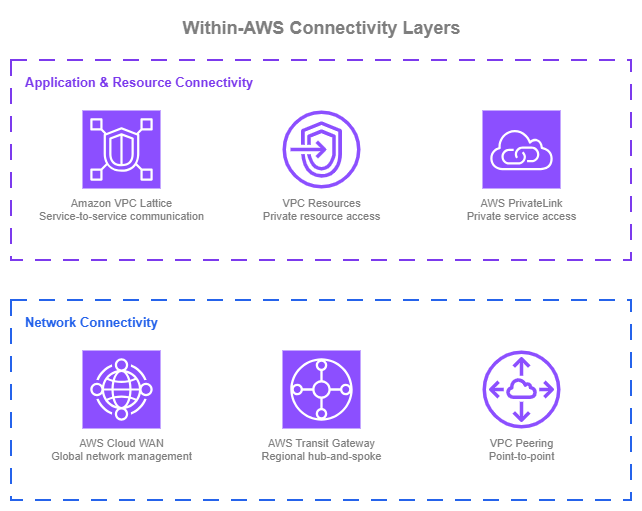
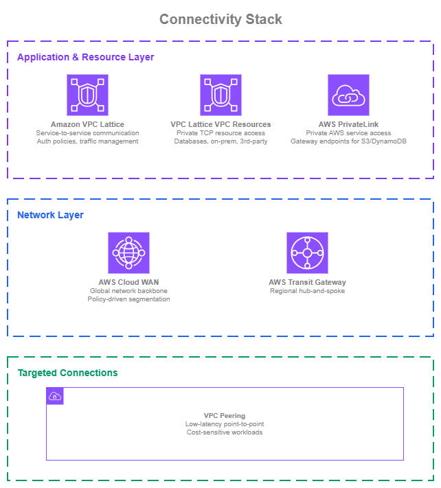

# Connectivity Within AWS

!!! info "Prerequisites"
    This section assumes familiarity with [Amazon VPC](../foundation/vpc.md), [CIDR Planning](../foundation/cidr.md), and [AWS Organizations](../foundation/organizations.md). Review those topics first if you're new to AWS networking fundamentals.

Connecting VPCs and services within AWS is rarely a single-service decision. AWS provides six connectivity services that operate at different layers — from AWS Cloud WAN managing global topology across 30+ Regions through a single declarative policy, to Amazon VPC Lattice handling service-to-service HTTP/gRPC communication with IAM-based auth and no CIDR coordination, to VPC Peering providing zero-cost same-Region data transfer between specific VPC pairs. A mature AWS network combines multiple services simultaneously, each at the layer where it provides the most value: network-level connectivity (how VPCs route traffic to each other), application-level service communication (how services discover and talk to each other), and private resource access (how workloads reach specific network resources like databases).

/// caption
Within-AWS connectivity layers — [Drawio Source](../assets/connectivity/within-aws-layers.drawio)
///

At its simplest, connecting two VPCs can be as straightforward as a [VPC Peering](https://docs.aws.amazon.com/vpc/latest/peering/what-is-vpc-peering.html) connection: direct, low-cost, and effective for point-to-point communication. As the number of VPCs and accounts grows, a hub-and-spoke model with [AWS Transit Gateway](https://aws.amazon.com/transit-gateway/) centralizes routing and simplifies management within a Region. When the network requires consistent segmentation policies, automated attachment operation, and centralized governance, [AWS Cloud WAN](https://aws.amazon.com/cloud-wan/) brings that under a single, policy-driven control plane. This applies whether you operate in one Region or many. AWS Cloud WAN's network policy defines your topology declaratively, so adding VPCs, enforcing segment isolation, and managing routing happens through policy changes rather than manual configuration across individual Transit Gateways.

On the application side, [AWS PrivateLink](https://aws.amazon.com/privatelink/) provides private access to AWS services and lets you expose your own services to other accounts through ENI-based endpoints. For communication between your own workloads, [Amazon VPC Lattice](https://aws.amazon.com/vpc/lattice/) offers a higher-level abstraction that handles service discovery, IAM-based access control, and traffic management for HTTP, HTTPS, and gRPC services without requiring network-level coordination between teams. For private access to specific network resources, such as databases, on-premises endpoints, or third-party TCP services, [VPC Lattice VPC Resources](https://docs.aws.amazon.com/vpc-lattice/latest/ug/resource-configuration.html) extend the same service-network model to TCP resources.

Most organizations will use more than one of these services simultaneously. The goal is to use each where it provides the most value. For the recommended architecture combining these services, see [Building your connectivity stack](#building-your-connectivity-stack) at the end of this page.

## Policy-driven network management with AWS Cloud WAN

[AWS Cloud WAN](https://docs.aws.amazon.com/vpc/latest/cloudwan/what-is-cloudwan.html) lets you build, manage, and monitor your network through a single declarative policy. Rather than configuring individual Transit Gateways, peering connections, and route tables across Regions and accounts, AWS Cloud WAN centralizes your entire network topology into a JSON policy document. A network policy defines the entire topology: which Regions participate, how attachments are segmented and automatically connected into the network, and how traffic routes between segments. Changes to the policy are versioned and applied through a change set process, and the service takes care of building and updating the underlying infrastructure.

**Key capabilities**:

*   :material-file-code: **Policy-driven topology**

    ---

    Define your network as code. Segments, routing, attachment rules, and inter-Region connectivity are all declared in the network policy.

*   :material-chart-pie: **Segments**

    ---

    Logical isolation boundaries that control which VPCs can communicate. Traffic between segments requires explicit routing rules.

*   :material-tag-check: **Automated attachment acceptance**

    ---

    Attachments (VPC, Direct Connect, Site-to-Site VPN, Connect, or Transit Gateway route tables) connect to the correct segment automatically based on attachment metadata (tags, attachment type, AWS account membership, AWS Region) with or without manual approval.

*   :material-shield-check: **Service insertion**

    ---

    Route traffic between segments through Inspection VPCs by defining inspection rules in the policy.

*   :material-earth: **Multi-Region and single-Region**

    ---

    AWS Cloud WAN works for both global networks spanning many Regions and single-Region deployments where policy-driven management and segmentation are the primary value.

*   :material-routes: **Routing policies**

    ---

    Fine-grained control over route propagations, including route filtering, summarization, and BGP attribute manipulation for traffic engineering in multi-path environments.

*   :material-ip-network: **Dual-stack support**

    ---

    IPv4 and IPv6 routing configured in the same network policy.

*   :material-transit-connection-variant: **Transit Gateway integration**

    ---

    Existing Transit Gateways can peer with AWS Cloud WAN, enabling incremental adoption.

### AWS Cloud WAN Best Practices

#### Think of segments as routing domains, not environments

A common first instinct is to create segments named "production" and "development." While that works, it limits the power of segmentation. Segments are better understood as routing domains or security zones that define trust boundaries.

For example, a `pci` segment might contain VPCs across both production and staging that handle cardholder data, with strict inspection rules for any traffic entering or leaving that segment. A `sharedservices` segment might host DNS, monitoring, and identity services that need controlled access from multiple other segments. A `hybrid` segment might group all Direct Connect and VPN attachments, with service insertion rules that force traffic between `hybrid` and other segments through an Inspection VPC running your preferred firewall solution.

Designing segments around trust boundaries and traffic flow patterns gives you more flexibility than mapping them 1:1 to environments. You can always have a segment per environment too, but consider what routing and security boundaries you actually need rather than defaulting to environment names.

#### Automate attachment acceptance with AWS Organizations SCPs

AWS Cloud WAN attachment acceptance policies determine which attachments can connect to which segments, based on attachment's metadata, being the main one the use of tags. The key to making this work at scale without manual approval is controlling those tags at the source.

Use [AWS Organizations Service Control Policies](https://docs.aws.amazon.com/organizations/latest/userguide/orgs_manage_policies_scps.html) (SCPs) to enforce tagging requirements on resources across your accounts. When accounts in a specific OU create VPCs with the required tags (for example, `segment:production` or `segment:sharedservices`), Cloud WAN automatically accepts the attachment into the correct segment. No tickets, no manual review by the networking team.

This combination of SCPs for tag governance and attachment policies for automated acceptance removes the networking team as a bottleneck for attachment onboarding while maintaining control over which traffic land in which segments.

#### Use service insertion for agile security enforcement

AWS Cloud WAN's service insertion capability lets you route intra or inter-segment traffic through Inspection VPCs running [AWS Network Firewall](https://aws.amazon.com/network-firewall/) or third-party appliances. The inspection rules are defined in the network policy, so changing which traffic gets inspected, or routing it through a different Inspection VPC, is a policy change rather than a manual routing update across multiple Transit Gateways.

This matters because security and inspection requirements change. A new compliance requirement might mandate inspection of traffic between two segments that previously communicated directly, or you can also apply cost-optimization strategies by removing inspection in environments that are protected using other security mechanisms. With service insertion, that's a policy update applied across all affected Regions and segments.

#### Use routing policies to control route propagation and traffic paths

AWS Cloud WAN [routing policies](https://docs.aws.amazon.com/network-manager/latest/cloudwan/cloudwan-routing-policies.html) give you fine-grained control over which routes propagate across your network and how traffic flows in multi-path environments. A routing policy is a set of rules with match conditions and actions that apply to route propagations at the attachment, segment sharing, or core network edge level.

**Route filtering and summarization**: in large networks, not every attachment needs visibility into every route. Routing policies let you filter which prefixes propagate between segments or between Cloud WAN and external networks (Direct Connect, VPN). You can also summarize routes to reduce route table size and limit the blast radius of misconfigurations. For example, instead of propagating individual VPC CIDRs to your on-premises network, you can advertise a single summary route that covers the entire segment.

**BGP attribute manipulation for multi-path environments**: when you have multiple connectivity paths to on-premises (for example, Direct Connect in two Regions, plus a VPN backup), routing policies let you manipulate BGP attributes (AS path prepending, MED, local preference) to control which path traffic takes. This is essential for optimizing performance based on bandwidth availability, latency, or cost, and for building active/standby failover patterns without relying on third-party routing appliances.

**Regional internet egress control**: Organizations that centralize outbound internet traffic through inspection VPCs in specific Regions can use routing policies to direct default routes appropriately. For example, traffic from Asia-Pacific Regions routes through an Inspection VPC in Singapore, while European traffic routes through Frankfurt.

Routing policies also provide enhanced visibility into the routing database, showing which routes are learned and advertised along with their BGP attributes. This visibility is critical for troubleshooting in complex multi-path environments.

#### Plan IPv6 from the start

AWS Cloud WAN supports dual-stack routing. Configure IPv6 alongside IPv4 in your network policy from the beginning, even if not all workloads use IPv6 today. Retrofitting IPv6 into an existing network policy is more disruptive than including it from the start, and IPv6 adoption is accelerating across AWS services.

#### Treat the network policy as code

The AWS Cloud WAN console provides policy versioning and change sets, which is a good starting point. For production networks, go further: store the network policy document in a Git repository, use pull requests for proposed changes, and run validation before applying. AWS Cloud WAN will build the global network once changes are approved and applied, so the review process is your control gate.

This approach gives you audit trails, peer review, rollback capability through version control, and the ability to test policy changes in a non-production network before applying to production. It also means your network topology is documented by definition, since the policy *is* the documentation.

### When to use AWS Cloud WAN

AWS Cloud WAN is a natural fit when building a new multi-account network in AWS. The network policy defines your entire topology declaratively, so you avoid the operational overhead of stitching together individual Transit Gateways and peering connections as you grow. This applies whether you're starting in one Region or many.

For existing environments with Transit Gateways, consider moving to AWS Cloud WAN when:

* You need centralized segmentation policies that apply consistently across your network, and managing individual Transit Gateway route tables has become error-prone.
* Your organization is scaling to dozens or hundreds of accounts and manual route management is slowing teams down.
* You want policy-driven attachment acceptance to remove the networking team as a bottleneck for attachment onboarding.
* You operate Transit Gateways in multiple Regions and managing inter-Region routing has become complex.

#### Migrating from Transit Gateway

AWS Cloud WAN integrates directly with existing Transit Gateway deployments through Transit Gateway peering attachments. This enables incremental migration:

1. Create your AWS Cloud WAN core network alongside existing Transit Gateways.
2. Peer Transit Gateways to AWS Cloud WAN as core network attachments. Over the peering attachment, you can create segmentation by extending Transit Gateway route tables to segments using TGW route table attachments.
3. If your network requires inspection, we recommend the duplication of your Inspection VPCs: current one connected to the Transit Gateway, and a new one connected to AWS Cloud WAN (pointing to the same firewall solution). Once the Service Insertion rules are applied, *local Transit Gateway traffic* will stay in the Inspection VPC connected to the Transit Gateway, while other traffic will go through the new inspection VPC.
4. Gradually move VPC attachments from Transit Gateway to AWS Cloud WAN. You can create the core network attachment, shift traffic to the new core network attachment, and remove the Transit Gateway attachment when you validate the traffic.
5. Decommission Transit Gateways as they become empty.

This approach avoids a disruptive one-step migration and lets you validate the new network behavior with non-critical workloads first. There is no urgency to migrate from a working Transit Gateway setup. AWS Cloud WAN peers with existing Transit Gateways, so you can adopt it at your own pace.

### Combining AWS Cloud WAN with other Networking services

| Combination | AWS Cloud WAN handles | Other service handles |
| --- | --- | --- |
| **AWS Cloud WAN + VPC Lattice** | Network backbone and segmentation | Service-to-service (HTTP/HTTPS/gRPC) communication with IAM-based auth policies |
| **AWS Cloud WAN + VPC Resources** | Network backbone and segmentation | Private TCP access to specific resources (databases, on-prem endpoints) without requiring network-level routing between consumer and provider VPCs |
| **AWS Cloud WAN + PrivateLink** | Inter-VPC routing | Private access to AWS services (gateway/interface endpoints) |
| **AWS Cloud WAN + Transit Gateway** | Global policy-driven network (during migration, both run side by side) | Regional hub-and-spoke routing for VPCs not yet migrated |
| **AWS Cloud WAN + VPC Peering** | Primary network backbone | Direct low-latency, high-throughput connectivity for specific VPC pairs (for example, database replication) |

### Documentation

*   :material-file-document: **AWS Cloud WAN documentation**

    ---

    Complete service documentation including network policy, segments, attachments, service insertion, routing policies, and pricing.

    [:octicons-arrow-right-24: Documentation](https://docs.aws.amazon.com/vpc/latest/cloudwan/what-is-cloudwan.html)

*   :material-github: **AWS Cloud WAN blueprints**

    ---

    Reference architectures and IaC templates for common AWS Cloud WAN deployment patterns.

    [:octicons-arrow-right-24: GitHub repository](https://github.com/aws-samples/aws-cloud-wan-blueprints)

*   :material-school: **AWS Cloud WAN workshop**

    ---

    Hands-on workshop to build and configure an AWS Cloud WAN network.

    [:octicons-arrow-right-24: Workshop](https://catalog.workshops.aws/cloudwan/en-US)

*   :material-post: **AWS Cloud WAN blog posts**

    ---

    Architecture walkthroughs, feature announcements, and implementation guides from the AWS Networking & Content Delivery blog.

    [:octicons-arrow-right-24: Blog posts](https://aws.amazon.com/blogs/networking-and-content-delivery/category/networking-content-delivery/aws-cloud-wan/)

*   :material-domain: **Customer success stories**

    ---

    How organizations use AWS Cloud WAN to simplify and scale their global networks.

    [:octicons-arrow-right-24: Case studies](https://aws.amazon.com/solutions/case-studies/browse-customer-success-stories/?ams%23interactive-card-vertical%23pattern-data-524264962.search=Cloud%20WAN)

## Application-layer service communication with Amazon VPC Lattice

[Amazon VPC Lattice](https://docs.aws.amazon.com/vpc-lattice/latest/ug/what-is-vpc-lattice.html) operates at the application layer, handling service-to-service communication without requiring you to manage the underlying network plumbing. VPC Lattice abstracts away VPC boundaries, letting services communicate across VPCs and accounts through a managed application networking layer. It operates independently of your network topology.

This section focuses on VPC Lattice **services**: the HTTP, HTTPS, and gRPC workloads your teams build and expose to each other. For private access to network resources such as databases, on-premises endpoints, or third-party TCP services, see the [VPC Resources](#private-resource-access-with-vpc-lattice-vpc-resources) section that follows. Both capabilities are part of VPC Lattice and share the same service network construct, which lets you combine them when needed.

**Key capabilities**:

*   :material-swap-horizontal: **Service networks**

    ---

    Logical groupings that enable communication between associated services and VPCs. Applications within a service network can discover and communicate with each other.

*   :material-shield-lock: **IAM auth policies**

    ---

    Identity-based access control at the service level. Define which principals (IAM roles, accounts, organizations) can invoke which services, regardless of network topology.

*   :material-scale-balance: **Traffic management**

    ---

    Weighted routing across target groups for canary deployments, blue/green releases, and gradual migrations across compute types (EC2, ECS, EKS, Lambda, ALB).

*   :material-account-multiple: **Cross-account sharing**

    ---

    Share VPC Lattice service networks or services via AWS RAM with specific accounts or your entire organization. No CIDR coordination required between accounts.

*   :material-protocol: **HTTP, HTTPS, and gRPC**

    ---

    Listeners for HTTP, HTTPS, and gRPC services. Services define their protocol, port, and routing rules; VPC Lattice handles the connectivity. For TCP-only workloads like databases, use [VPC Resources](#private-resource-access-with-vpc-lattice-vpc-resources) instead.

*   :material-ip-network: **Dual-stack support**

    ---

    IPv4, IPv6, and dual-stack configurations for services and target groups.

### How VPC Lattice complements network connectivity

VPC Lattice does not replace AWS Cloud WAN or Transit Gateway. It operates at a different layer. Your network connectivity handles IP-level routing between VPCs. VPC Lattice handles application-level service communication in parallel of whatever network connectivity exists, or even without it.

With VPC Lattice, services in different VPCs can communicate without any network-level connectivity between those VPCs. VPC Lattice manages the data plane transparently. This means you can decouple your service communication architecture from your network topology.

### VPC Lattice Best Practices

#### Associate each consumer VPC with a single service network

A VPC can associate with one service network at a time through a service network VPC association, which places the VPC Lattice data plane directly inside the consumer VPC. This is the recommended consumption model for VPCs: a single, well-known entry point for everything that VPC consumes over VPC Lattice.

The alternative, using a service network VPC endpoint to reach additional service networks from the same VPC, fragments the consumption model. Different services in the same VPC end up reaching VPC Lattice through different constructs, which makes access logs harder to correlate, security group and auth policy reasoning more complex, and troubleshooting slower. The single-association model keeps every VPC Lattice-bound request from that VPC flowing through one place, which simplifies observability (one coherent set of access logs), auth policy attribution (one service network policy applies), and day-2 operations.

Keep this as the default unless you have a specific reason to deviate. Legitimate exceptions exist, for example a shared tooling VPC that needs short-term access to a service network it doesn't usually consume. Treat those as exceptions, not the pattern.

#### Size service networks around business domains, not environments or consumers

Because the recommendation is that consumer VPCs associate with a single service network, the way you carve up service networks directly shapes what each consumer sees. Group related capabilities into service networks aligned with **business domains** (for example, `payments`, `inventory`, `identity`), not environment names like `production` or `staging` and not infrastructure boundaries like accounts or VPCs.

A key piece of flexibility: a VPC Lattice **service or resource configuration can be associated with more than one service network**. You don't have to duplicate a service to expose it to different consumer groups, and you don't have to collapse unrelated domains into one service network just because some consumers need both. Publish each service or resource once, then associate it with whichever service networks represent the consumer groups that should reach it.

Two anti-patterns to avoid:

* **A single organization-wide service network for everything**. Every service and resource ends up behind one auth policy, one set of access logs, and one failure domain. Ownership blurs and misconfigurations have a broad blast radius.
* **One service network per consumer VPC or per consuming application**. This inverts the association model. If every provider publishes a dedicated service network per consumer, consumers cannot reach multiple providers at once. The exception is when the service network lives in the **consumer's own account**, aggregating resources shared to them from multiple providers behind a single association the consumer owns.

#### Enable auth policies from day one

VPC Lattice auth policies provide IAM-based access control at the service level. Instead of managing security groups and NACLs to control which VPCs can talk to which, you define policies that specify which principals (IAM roles, accounts, organizations) can invoke which services, regardless of where they run.

The full zero-trust posture requires consumer applications to sign requests with AWS SigV4 (or SigV4A), which takes time to roll out across existing codebases. You don't need to wait. Auth policies support conditions on request attributes (source VPC, HTTP method, path, headers) alongside principal identity, so you can enable a policy on day one using what the request already carries, then tighten to principal-based conditions as consumers adopt signing. This gives you access logs, explicit allow/deny decisions, and a working control plane immediately, without blocking on application changes.

Retrofitting auth policies onto services deployed with no policy at all is harder than starting with a permissive one. Consumers may already rely on open access, and adding restrictions later requires coordinating with every consuming team.

#### Use weighted routing for safe deployments

VPC Lattice services support weighted routing to target groups, which lets you shift traffic gradually between versions of a service or between compute types. This is useful for:

* Canary deployments: send 5% of traffic to a new version, monitor, then increase.
* Compute migrations: gradually shift traffic from EC2 to ECS or Lambda without a one-step switch.
* In-place upgrades: run old and new versions side by side, shifting traffic as confidence grows.

Weighted routing works across target types, so you can route to a mix of EC2 instances, ECS tasks, EKS pods, and Lambda functions within the same service.

#### Design service networks for multi-account from the start

Share service networks via AWS RAM at the organizational unit level, not individual accounts. This scales automatically as new accounts are added to the OU. Service owners maintain control over their services and auth policies; consuming accounts associate their VPCs with the shared service network.

This model enables platform teams to create shared service networks that application teams across the organization can consume without network-level coordination.

#### Enable access logs for visibility

Configure access logging to S3, CloudWatch Logs, or Kinesis Data Firehose on your service networks. Access logs capture every request flowing through VPC Lattice, including source and destination identities, latency, response codes, and auth policy decisions. This visibility is essential for troubleshooting, security auditing, and understanding service-to-service traffic patterns.

#### Plan IPv6 from the start

VPC Lattice supports IPv4, IPv6, and dual-stack configurations. Configure based on your service requirements, but include IPv6 from the beginning to avoid retrofitting later.

### When to use Amazon VPC Lattice

VPC Lattice is well suited for any new service-to-service communication pattern over HTTP, HTTPS, or gRPC, regardless of whether you're building a new environment or adding services to an existing network. Because it operates independently of your network topology, adopting VPC Lattice doesn't require changes to your existing IP-based network setup.

Consider VPC Lattice for services when:

* Application teams need to expose or consume HTTP/HTTPS/gRPC services across VPC and account boundaries without filing network change requests.
* You want identity-based access control (IAM auth policies) for service communication instead of managing security groups and NACLs per connection.
* You're running mixed compute (EC2, ECS, EKS, Lambda) and need a unified way to route traffic across target types.
* You want built-in traffic management (weighted routing, health checks) without deploying additional load balancers.

For TCP-only workloads (databases, message brokers, legacy protocols, on-premises resources), use [VPC Resources](#private-resource-access-with-vpc-lattice-vpc-resources) instead. Both capabilities can live in the same service network.

#### Onboarding services from existing connectivity patterns

If your services currently communicate through PrivateLink endpoint services, internal load balancers, or direct IP-based connectivity, you can onboard them to VPC Lattice incrementally without disrupting existing traffic.

**From PrivateLink endpoint services**: Create the service in VPC Lattice with the same backend targets (or point to the existing NLB as IP target group). Update consumers to use the VPC Lattice service DNS name instead of the PrivateLink endpoint DNS. You can run both in parallel during the transition. Once all consumers have migrated, decommission the PrivateLink endpoint service.

**From IP-routable connectivity (internal ALBs/NLBs or direct IPs over AWS Cloud WAN / Transit Gateway / VPC Peering)**: Services reached today through a routable IP path, whether fronted by an internal ALB/NLB or accessed directly by instance IP, can move to VPC Lattice without changing the underlying network connectivity. Register the existing target as a VPC Lattice target group: an internal ALB as an ALB target, an internal NLB as an IP target group, or the compute itself (EC2, ECS, EKS, Lambda) as a native target. Consumers switch from the existing DNS name or IP address to the VPC Lattice service DNS name. The current IP-based network can stay in place for other traffic, and over time you can migrate from load-balancer-backed targets to compute-native targets to drop the load balancer entirely. In exchange, you gain VPC Lattice auth policies, access logs, and cross-account sharing on top of whatever backend you started with.

In all cases, VPC Lattice's weighted routing makes the transition safer. You can shift a small percentage of traffic to the VPC Lattice path, validate behavior, and gradually increase until the migration is complete.

### Combining VPC Lattice with other Networking services

| Combination | VPC Lattice handles | Other service handles |
| --- | --- | --- |
| **VPC Lattice + VPC Resources** | Service-to-service communication (HTTP/HTTPS/gRPC) with auth policies and traffic management | Private TCP access to resources (databases, on-prem endpoints) sharing the same service network |
| **VPC Lattice + AWS Cloud WAN** | Service discovery, auth policies, and traffic management at the application layer | Network backbone, segmentation, and global routing |
| **VPC Lattice + Transit Gateway** | Application-layer features (auth, weighted routing, access logs) for service communication | IP-level routing between VPCs |
| **VPC Lattice + Interface VPC endpoint** | Service-to-service communication between your own workloads and 3rd-parties | Private access to AWS services and 3rd-parties (if not yet onboarded to VPC Lattice) |

### Documentation

*   :material-file-document: **Amazon VPC Lattice documentation**

    ---

    Complete service documentation including service networks, auth policies, target groups, listeners, and access logs.

    [:octicons-arrow-right-24: Documentation](https://docs.aws.amazon.com/vpc-lattice/latest/ug/what-is-vpc-lattice.html)

*   :material-github: **Amazon VPC Lattice blueprints**

    ---

    Reference architectures and IaC templates for common VPC Lattice deployment patterns.

    [:octicons-arrow-right-24: GitHub repository](https://github.com/aws-samples/amazon-vpc-lattice-blueprints)

*   :material-school: **Amazon VPC Lattice workshop**

    ---

    Hands-on workshop to build and configure VPC Lattice service networks.

    [:octicons-arrow-right-24: Workshop](https://catalog.workshops.aws/vpc-lattice/en-US)

*   :material-post: **Amazon VPC Lattice blog posts**

    ---

    Architecture patterns, feature announcements, and implementation guides from the AWS Networking & Content Delivery blog.

    [:octicons-arrow-right-24: Blog posts](https://aws.amazon.com/blogs/networking-and-content-delivery/category/networking-content-delivery/amazon-vpc-lattice/)

*   :material-domain: **Customer success stories**

    ---

    How organizations use VPC Lattice to simplify service-to-service connectivity.

    [:octicons-arrow-right-24: Case studies](https://aws.amazon.com/solutions/case-studies/browse-customer-success-stories/?ams%23interactive-card-vertical%23pattern-data-524264962.search=VPC%20Lattice)

## Private resource access with VPC Lattice VPC Resources

[VPC Lattice VPC Resources](https://docs.aws.amazon.com/vpc-lattice/latest/ug/resource-configuration.html) extend VPC Lattice to network-level resources. Where VPC Lattice services handle HTTP, HTTPS, and gRPC workloads you build and expose, VPC Resources give you a scalable way to expose TCP resources (databases, on-premises endpoints, third-party services reachable by IP or DNS name) for private consumption across VPCs and accounts. Consumers reach those resources through a resource gateway in the provider VPC without requiring VPC peering, Transit Gateway or AWS Cloud WAN attachments, or non-overlapping CIDRs between consumer and provider networks.

VPC Resources address a common pain point: exposing a managed database, a legacy on-premises system, or a third-party SaaS endpoint to multiple consumer VPCs and accounts has historically required either a PrivateLink endpoint service (with an NLB in front of the resource) or full network-level routing through Transit Gateway or peering. Resource configurations collapse that into a single construct that can be shared through AWS RAM alongside your VPC Lattice services.

**Key capabilities**:

*   :material-database-lock: **Resource configurations**

    ---

    Represent a resource (or group of resources) by IP address, domain name, or an ARN (for example, an RDS DB instance). Consumers reach the resource by the custom domain name you assign, not by its actual IP.

*   :material-gate: **Resource gateway**

    ---

    An ENI-based ingress point in the provider VPC, spanning multiple Availability Zones. All consumer traffic lands on the resource gateway and is forwarded to the backend resource as if it were local traffic. Acts as the boundary where VPC Lattice hands traffic off to your VPC.

*   :material-account-multiple: **Service network or direct access**

    ---

    Associate resource configurations with a service network (the recommended pattern at scale) or expose them through a standalone resource VPC endpoint for direct, per-consumer access without a service network.

*   :material-share-variant: **Cross-account sharing via RAM**

    ---

    Resource configurations and service networks are shared through AWS Resource Access Manager, so provider teams control what they publish and consumer teams associate their VPCs on their own timeline. No CIDR coordination required.

*   :material-arrow-right-bold: **Unidirectional TCP access**

    ---

    Consumers initiate connections to the resource and receive responses on the same connection; the provider cannot initiate new connections back to consumer VPCs.

*   :material-swap-horizontal: **Overlapping CIDRs supported**

    ---

    Because traffic is NATed through the resource gateway's IPs, consumer and provider VPCs can have overlapping CIDR blocks. This is a major operational advantage compared to peering / Transit Gateway / AWS Cloud WAN.

*   :material-lan-connect: **Works with on-premises and third parties**

    ---

    A resource configuration can point to an IP address or DNS name reachable from the provider VPC, including on-premises resources accessible via Direct Connect or VPN, and third-party SaaS endpoints.

*   :material-ip-network: **Dual-stack support**

    ---

    Resource gateways support IPv4, IPv6, or dual-stack addressing, so consumers can reach resources over whichever IP family their workload uses.

### How VPC Resources complement network connectivity

Like VPC Lattice services, VPC Resources operate independently of your network topology. Your network connectivity handles IP-level routing between VPCs for general traffic. VPC Resources handle targeted, private access to specific resources on top of whatever network connectivity exists, or without any network-level connectivity at all.

This is particularly valuable in two common situations:

* **Overlapping CIDRs**: Consumer and provider VPCs can have the same CIDR block. The resource gateway NATs traffic so consumers never see provider-side IPs. Peering and Transit Gateway both require non-overlapping CIDRs; VPC Resources do not.
* **Least-privilege exposure**: You want to expose exactly one database or one endpoint, not connect two entire networks. A resource configuration is a single, explicit entry point, which is easier to reason about than a route table that connects whole CIDR ranges.

### VPC Resources Best Practices

#### Prefer service network association for scale

There are two ways to expose a resource configuration to consumers: a standalone resource VPC endpoint (direct, per-consumer access), or association with a service network (consumers access the resource through the shared service network, alongside any services in that network).

For anything beyond a handful of consumer VPCs, the service network approach is the recommended pattern. Consumers associate their VPC with the service network once and gain access to every resource (and service) the provider publishes into that service network. Provider teams add or remove resources by updating the service network, without each consumer reconfiguring their endpoints.

Use standalone resource endpoints for targeted, short-lived, or strictly limited consumer scenarios, for example, granting a single application VPC temporary access to a specific resource without making it part of a broader service network.

#### Organize resource configurations alongside related services

If a business domain (for example, `payments`) already has a service network with HTTP/HTTPS services, register the databases and other TCP resources that the domain depends on into that same service network. Consumers associate their VPC once and reach both the domain's services (via VPC Lattice listeners) and its underlying resources (via resource configurations) through a single association.

Avoid creating a separate "resources only" service network parallel to your services service network for the same domain. The service network is the unit of sharing and auth; keeping services and their resources together gives consumers one thing to associate with and one auth policy to reason about.

#### Size the resource gateway for your connection volume

The resource gateway NATs consumer traffic to the backend resource. Each IPv4 address on the gateway supports up to ~55,000 concurrent connections per destination IP, and each ENI is assigned multiple IPv4 addresses (16 by default, configurable). For high-concurrency workloads (busy databases, long-lived TCP sessions), verify the gateway's capacity matches your expected concurrent connection count and deploy the gateway across as many Availability Zones as the resource supports.

Plan this up front rather than discovering it under load. A resource gateway's IPv4 address allocation is set at creation time.

#### Use custom domain names for stable consumer contracts

When you create a resource configuration, assign a custom domain name that consumers will use (for example, `payments-db.internal.example.com`). The name is decoupled from the underlying IP or resource ARN, so the provider can change the backing resource (failover, migration, version upgrade) without consumers updating their configuration.

Consumers can let VPC Lattice manage a private hosted zone in their VPC for the custom domain, which makes the resource resolve locally without manual DNS configuration.

#### Enable access logs for visibility

Configure access logging on the service network or resource configuration. Logs capture connection attempts, source identity, and auth decisions, which is essential for security auditing and troubleshooting. Without logs, diagnosing a rejected connection through a resource gateway is significantly harder.

#### Plan for IPv6 from the start

Resource gateways support IPv4, IPv6, and dual-stack addressing. If either the consumers or the resource are IPv6-capable, configure dual-stack resource gateways from the beginning. Retrofitting IPv6 later requires recreating the gateway.

### When to use VPC Resources

VPC Resources are the right choice for any pattern where a small number of provider teams expose specific network resources to a larger number of consumer VPCs or accounts.

Consider VPC Resources when:

* You need to give multiple consumer VPCs or accounts private access to a specific database, cache, message broker, or other TCP endpoint.
* You want to expose an on-premises resource (reachable through Direct Connect or VPN in the provider VPC) to AWS consumers without extending the underlying hybrid connectivity to every consumer VPC.
* Consumer and provider VPCs have overlapping CIDRs, or you expect they might in the future, and you want to avoid the IP address management burden.
* You want unidirectional access (consumer to resource) without opening a bidirectional network-level path.
* You need access logs for TCP resources, which PrivateLink endpoint services don't provide natively.

For HTTP/HTTPS/gRPC services with routing rules, weighted deployments, and multiple compute backends, use [VPC Lattice services](#application-layer-service-communication-with-amazon-vpc-lattice) instead. Both capabilities can share a single service network.

#### Migrating from PrivateLink endpoint services to VPC resources

Many teams today expose TCP resources through a PrivateLink endpoint service backed by an NLB in front of the resource. VPC Resources address two limitations of that pattern:

* **Dynamic-IP backends**: resources whose IPs change, such as RDS failover events, Aurora cluster endpoints, or any clustered TCP application, are awkward to keep behind an NLB. A resource configuration can point directly to an RDS ARN or a DNS name and follow the backend as it moves, without an NLB-and-target-group dance.
* **Scale-out consumption**: a PrivateLink endpoint service requires each consumer VPC to create its own interface endpoint. A resource configuration associated with a service network is consumed through the service network association consumers already have (or create once), so adding new consumers does not require per-VPC endpoint configuration.

Migration path:

1. Create a resource gateway in the provider VPC and a resource configuration pointing to the backend (the RDS ARN, DNS name, or IP address).
2. Associate the resource configuration with the service network that represents the provider's domain, and share it via AWS RAM with consumer accounts.
3. Consumers reach the resource through their service network association using the custom domain name.
4. Once all consumers have migrated, decommission the PrivateLink endpoint service and its NLB.

### Combining VPC Lattice Services and VPC Resources

Services and resources live in the same service network construct, and a consumer VPC that associates with a service network can reach both through a single association. This makes them natural partners.

#### Typical pattern: a business domain exposes both

Consider a `payments` service network that contains:

* Several VPC Lattice **services** (HTTP/HTTPS APIs backed by ECS and Lambda): the `payments-api`, `refunds-api`, and `reporting-api`.
* Several VPC Lattice **resources** (TCP endpoints): the `payments-db` (RDS), a `payments-cache` (ElastiCache), and an on-premises `fraud-detection` system accessible through Direct Connect in the provider VPC.

A consumer VPC in a different account needs to:

1. Call the `payments-api` for transaction initiation.
2. Read from `payments-db` for reporting.
3. Forward flagged transactions to the on-premises `fraud-detection` system.

With a single service network association, the consumer reaches all three. The consumer doesn't need network-level connectivity to the provider VPC, doesn't need to worry about CIDR overlap with the provider's database VPC or on-premises network, and gets unified access logging across services and resources.

### Combining VPC Resources with other Networking services

| Combination | VPC Resources handle | Other service handles |
| --- | --- | --- |
| **VPC Resources + VPC Lattice services** | Private TCP access to databases, caches, on-prem endpoints in the same service network | HTTP/HTTPS/gRPC service communication with auth policies and traffic management |
| **VPC Resources + AWS Cloud WAN** | Targeted private access to specific resources, even across overlapping CIDRs | Inter-VPC routing for general traffic, segmentation, and hybrid connectivity |
| **VPC Resources + Transit Gateway** | Exposure of specific resources to consumers without requiring TGW attachments on every consumer VPC | Hub-and-spoke routing for VPCs that need full network-level connectivity |
| **VPC Resources + PrivateLink** | Private access to your TCP resources with IAM auth policies and access logs, no NLB required | Interface and gateway endpoints for AWS services |
| **VPC Resources + Direct Connect / VPN** | Exposure of on-premises resources to AWS consumers through a provider VPC, without extending hybrid connectivity to each consumer VPC | Hybrid connectivity terminating in the provider VPC |

### Documentation

*   :material-file-document: **Resource configurations documentation**

    ---

    Complete documentation on resource configurations, resource gateways, service network associations, and custom domain names.

    [:octicons-arrow-right-24: Documentation](https://docs.aws.amazon.com/vpc-lattice/latest/ug/vpc-resources.html)

*   :material-file-document-outline: **Resource gateways documentation**

    ---

    Details on resource gateway sizing, IP address allocation, Availability Zone placement, and security group configuration.

    [:octicons-arrow-right-24: Documentation](https://docs.aws.amazon.com/vpc-lattice/latest/ug/resource-gateway.html)

*   :material-school: **Amazon VPC Lattice workshop**

    ---

    Hands-on workshop covering both VPC Lattice services and VPC Resources, including resource gateway and resource configuration setup.

    [:octicons-arrow-right-24: Workshop](https://catalog.workshops.aws/vpc-lattice/en-US)

*   :material-post: **Amazon VPC Lattice blog posts**

    ---

    Architecture patterns and implementation guides covering both services and resources.

    [:octicons-arrow-right-24: Blog posts](https://aws.amazon.com/blogs/networking-and-content-delivery/category/networking-content-delivery/amazon-vpc-lattice/)

## Regional hub-and-spoke with AWS Transit Gateway

[AWS Transit Gateway](https://docs.aws.amazon.com/vpc/latest/tgw/what-is-transit-gateway.html) is the established regional hub-and-spoke service for interconnecting VPCs, VPN connections, and Direct Connect gateways through a central point. Instead of creating individual peering connections between every VPC pair (which grows quadratically), each VPC connects once to the hub and inherits routing through Transit Gateway route tables. If your organization already runs Transit Gateway, it continues to be a solid foundation, and it integrates with AWS Cloud WAN when you're ready to scale to a global, policy-driven network.

**Key capabilities**:

*   :material-hub: **Regional hub**

    ---

    A single Transit Gateway per Region interconnects up to 5,000 attachments (VPCs, VPN, Direct Connect, peering, Connect).

*   :material-routes: **Route tables and segmentation**

    ---

    Multiple route tables per Transit Gateway let you carve the network into isolated domains (for example, production, development, shared services) and control which attachments reach which others.

*   :material-earth: **Inter-Region peering**

    ---

    Transit Gateways in different Regions peer over the AWS global backbone, with static routes controlling what propagates across the peering.

*   :material-account-multiple: **Multi-account sharing via RAM**

    ---

    Share a Transit Gateway across accounts or whole organizational units with AWS Resource Access Manager. Each account attaches its own VPCs while route management stays centralized.

*   :material-lan-connect: **VPN and Direct Connect integration**

    ---

    Terminate Site-to-Site VPN and Direct Connect gateways directly on the Transit Gateway, making hybrid connectivity reachable by every attached VPC through the same hub.

*   :material-ip-network: **Dual-stack support**

    ---

    IPv4 and IPv6 routing are supported across VPC, VPN, Direct Connect, and peering attachments.

### Transit Gateway Best Practices

#### Use separate route tables for segmentation

Don't rely on the default route table. Create route tables aligned with your security or environment boundaries (for example, `production`, `non-production`, `shared-services`, `inspection`) and associate each attachment with the route table that represents its role. Route propagation and static routes between those route tables define which attachments can reach which others, giving you network-level segmentation without a second Transit Gateway.

#### Deploy in a dedicated networking account and share via AWS RAM

Own the Transit Gateway in a dedicated networking account and share it across your organization at the OU level rather than individual accounts. Sharing at the OU level scales automatically as new accounts are added to the OU, and centralizing ownership keeps route table changes in one place. Application accounts attach their own VPCs; the networking team controls the routing.

#### Use dedicated `/28` subnets for Transit Gateway attachments

Create small `/28` subnets in each Availability Zone specifically for the Transit Gateway ENIs. A dedicated subnet keeps the attachment ENIs predictable for NACL and flow log configuration, and the small size reserves minimal address space from the VPC CIDR.

#### Propagate routes selectively

Enable route propagation only where needed. Propagating every attachment's routes into every route table is convenient but defeats segmentation. Static routes and selective propagation together give you explicit control over what each attachment can reach.

#### Plan for IPv6 from the start

Enable dual-stack on Transit Gateway attachments and propagate IPv6 routes alongside IPv4. Retrofitting IPv6 after attachments are in place requires revisiting every route table.

#### Enable Amazon CloudWatch metrics and Transit Gateway Flow Logs

Track `BytesIn`, `BytesOut`, `PacketDropCountBlackhole`, and `PacketDropCountNoRoute` in Amazon CloudWatch at minimum; blackhole and no-route drops usually point directly to a missing or incorrect route table entry. Enable [Transit Gateway Flow Logs](https://docs.aws.amazon.com/vpc/latest/tgw/tgw-flow-logs.html) on the Transit Gateway itself (not just per-VPC flow logs) to get a single, central view of traffic across every attachment, which is faster to query during an incident than stitching together logs from each VPC.

### When to use AWS Transit Gateway

Transit Gateway is a good fit for organizations that need regional hub-and-spoke connectivity across a moderate number of VPCs and accounts. It's straightforward to set up and integrates with VPN and Direct Connect for hybrid connectivity.

Consider Transit Gateway when:

* You're connecting VPCs within a single Region or a small number of Regions.
* You need hub-and-spoke routing with segmentation via route tables.
* You want a proven service with a large ecosystem of reference architectures and existing tooling.
* You have VPN or Direct Connect hybrid connectivity to terminate on the same hub as your VPC attachments.

#### When to start looking at AWS Cloud WAN

Transit Gateway continues to be fully supported and receives new features. There is no urgency to migrate from a working setup. Start looking at AWS Cloud WAN when multi-Region management complexity grows, when you need policy-driven segmentation applied consistently across Regions, or when managing individual Transit Gateways becomes operationally burdensome.

Cloud WAN peers with existing Transit Gateways, so adoption is incremental rather than a one-step switch. See [Migrating from Transit Gateway](#migrating-from-transit-gateway) in the Cloud WAN section for the full walkthrough.

### Combining AWS Transit Gateway with other Networking services

| Combination | Transit Gateway handles | Other service handles |
| --- | --- | --- |
| **Transit Gateway + AWS Cloud WAN** | Regional hub-and-spoke routing during migration (both run side by side) | Global, policy-driven network backbone |
| **Transit Gateway + VPC Lattice** | IP-level routing between VPCs | Application-layer service-to-service communication (HTTP/HTTPS/gRPC) with auth policies and traffic management |
| **Transit Gateway + VPC Resources** | Hub-and-spoke routing for general traffic | Targeted private access to specific TCP resources without requiring a Transit Gateway attachment on every consumer VPC |
| **Transit Gateway + AWS PrivateLink** | Inter-VPC routing | Private access to AWS services (gateway/interface endpoints) and the most widely deployed combination in production today |
| **Transit Gateway + VPC Peering** | Primary network backbone for most VPCs | Direct connectivity for specific VPC pairs with high data transfer volumes, avoiding Transit Gateway data processing charges |

### Documentation

*   :material-file-document: **AWS Transit Gateway documentation**

    ---

    Complete service documentation covering attachments, route tables, peering, sharing, and quotas.

    [:octicons-arrow-right-24: Documentation](https://docs.aws.amazon.com/vpc/latest/tgw/what-is-transit-gateway.html)

*   :material-file-document-outline: **Design best practices**

    ---

    Official design guidance for route table segmentation, attachment topologies, and operational practices.

    [:octicons-arrow-right-24: Documentation](https://docs.aws.amazon.com/vpc/latest/tgw/tgw-best-design-practices.html)

*   :material-post: **AWS Transit Gateway blog posts**

    ---

    Architecture walkthroughs, feature announcements, and implementation guides from the AWS Networking & Content Delivery blog.

    [:octicons-arrow-right-24: Blog posts](https://aws.amazon.com/blogs/networking-and-content-delivery/category/networking-content-delivery/aws-transit-gateway/)

*   :material-currency-usd: **Transit Gateway pricing**

    ---

    Pricing covers attachment hours, data processing per GB, and inter-Region peering data transfer.

    [:octicons-arrow-right-24: Pricing](https://aws.amazon.com/transit-gateway/pricing/)

## Private service access with AWS PrivateLink

[AWS PrivateLink](https://docs.aws.amazon.com/vpc/latest/privatelink/what-is-privatelink.html) provides private connectivity to services without extending your private IP-based network between consumers and producers. It's the established pattern for accessing AWS services and third-party SaaS from within your VPC, and for exposing your own services to other accounts through an ENI-based endpoint.

**Key capabilities**:

*   :material-ethernet: **Interface endpoints**

    ---

    ENI-based endpoints in your VPC subnets that provide private access to AWS services, third-party SaaS from AWS Marketplace, or your own services hosted in other VPCs and accounts. Each endpoint gets a private IP inside your VPC.

*   :material-gate-open: **Gateway endpoints**

    ---

    Route table entries that direct traffic to Amazon S3 or Amazon DynamoDB through the AWS network without an ENI. Free to create, and they eliminate NAT gateway data processing charges for those services.

*   :material-server-network: **Endpoint services**

    ---

    Expose your own services privately to other accounts by fronting them with a Network Load Balancer or Gateway Load Balancer. Consumers create interface endpoints in their VPCs to reach the service.

*   :material-shield-lock: **Endpoint policies**

    ---

    Resource-based policies that restrict which IAM principals, resources, or actions are accessible through each endpoint, providing a layer of defense beyond security groups.

*   :material-dns: **Private DNS**

    ---

    Interface endpoints can override public DNS names for AWS services, making the private path transparent to applications without code changes.

*   :material-ip-network: **Dual-stack support**

    ---

    Interface and gateway endpoints support IPv4 and IPv6 addressing for compatible services.

### How VPC Lattice relates to AWS PrivateLink

VPC Lattice addresses many of the same use cases as PrivateLink endpoint services (cross-VPC and cross-account service communication), but splits them across two capabilities with higher-level abstractions. VPC Lattice **services** target HTTP, HTTPS, and gRPC workloads. VPC Lattice **VPC Resources** target TCP resources like databases and on-premises endpoints.

| Aspect | PrivateLink endpoint services | VPC Lattice services | VPC Lattice VPC Resources |
| -------- | ------------------------------- | ---------------------- | --------------------------- |
| Primary use case | Any TCP protocol via NLB | HTTP, HTTPS, gRPC services | TCP resources (databases, on-prem endpoints, third-party IPs/DNS) |
| Abstraction level | Network (ENI-based) | Application (service-based) | Resource (configuration + resource gateway) |
| Service discovery | DNS per endpoint | Managed service directory | Custom domain name per resource |
| Access control | Security groups + endpoint policies | IAM auth policies | IAM auth policies (service network level) |
| Traffic management | None (pass-through) | Weighted routing, health checks, routing rules | None (pass-through) |
| Multi-target support | Single NLB/GWLB backend | Multiple target groups (EC2, ECS, EKS, Lambda, ALB) | Single resource or group (IP, DNS, ARN) per configuration |
| CIDR overlap | Allowed | Allowed | Allowed (NATed through resource gateway) |
| Cross-account model | Endpoint per consumer VPC | Service network shared via RAM | Service network or resource configuration shared via RAM |

For new HTTP/HTTPS/gRPC service-to-service communication, VPC Lattice services provide a more complete solution. For new private access to TCP resources such as databases or on-premises endpoints, VPC Resources replace the PrivateLink endpoint service + NLB pattern with a simpler, policy-driven alternative. PrivateLink remains the right choice for accessing AWS services privately (gateway and interface endpoints) and for scenarios where you need ENI-level network integration or the full flexibility of an NLB/GWLB in front of your workload.

### AWS PrivateLink Best Practices

#### Always deploy gateway endpoints for Amazon S3 and DynamoDB

Gateway endpoints are free to create and use. Deploy them in every VPC that accesses S3 or DynamoDB, regardless of size or environment. The route table entry directs traffic through the AWS network, eliminating NAT gateway data processing charges for these high-traffic services. There is no downside to enabling them.

#### Use Interface Endpoints for frequently accessed AWS services

Reaching AWS APIs through a NAT gateway is a pattern to avoid: you pay NAT data processing for every call, and the path crosses the public endpoint instead of your private network. Use interface endpoints for services your workloads call routinely (STS, KMS, ECR, Systems Manager, CloudWatch Logs) and enable private DNS so applications pick up the private path without code changes.

The key design decision is **decentralized** (each VPC runs its own endpoints) vs **centralized** (a shared endpoint VPC that other VPCs reach via Transit Gateway, AWS Cloud WAN, or peering, with private DNS resolution shared for DNS resolution). Decentralized is the right default: endpoints are local to each VPC, there's no cross-VPC dependency, and the networking stays simple. Centralize only when many small VPCs make low-volume calls to the same services, so the per-VPC endpoint hourly cost dominates; for VPCs with meaningful traffic, inter-VPC data transfer usually cancels the savings.

#### Deploy endpoints in multiple Availability Zones

Create endpoint ENIs in at least two Availability Zones for high availability. An endpoint confined to a single Availability Zone becomes a single point of failure for every workload using it, which is easy to miss until the Availability Zone has a problem.

#### Use endpoint policies for defense in depth

Interface and gateway endpoints support resource-based policies that restrict which principals, resources, or actions are accessible through the endpoint. Use them to scope access even when IAM policies on the caller's side would in principle be sufficient. A common pattern is restricting an S3 gateway endpoint to buckets in your own organization, which blocks accidental or malicious data transfers to third-party buckets.

### When to use AWS PrivateLink

AWS PrivateLink is relevant from day one in any AWS environment:

* **Gateway endpoints for Amazon S3 and DynamoDB**: a baseline for every VPC. They're free and they eliminate NAT gateway data processing for those services.
* **Interface endpoints for AWS services**: as soon as you have private subnets that need to reach AWS APIs without NAT gateway.
* **Interface endpoints for third-party SaaS**: when a Marketplace provider exposes its service through PrivateLink and you want private access from your VPCs.
* **Endpoint services (exposing your own services)**: when you need private access to a specific service for a known set of consumer accounts, the service is backed by an NLB or GWLB, and you need ENI-level integration in the consumer VPC.

For new cross-account service-to-service patterns, evaluate VPC Lattice first. For HTTP/HTTPS/gRPC services, VPC Lattice services provide auth policies, traffic management, and multi-target support that PrivateLink endpoint services don't offer natively. For private access to TCP resources, evaluate VPC Resources first to avoid the need to run and maintain an NLB in front of the resource and to have access logs at the service network level.

### Combining AWS PrivateLink with other Networking services

| Combination | AWS PrivateLink handles | Other service handles |
| --- | --- | --- |
| **AWS PrivateLink + AWS Cloud WAN** | Private access to AWS services and third-party SaaS inside each VPC | Inter-VPC routing and segmentation |
| **AWS PrivateLink + Transit Gateway** | Private access to AWS services and exposing shared internal services; the most widely deployed combination in production today | Hub-and-spoke routing between VPCs |
| **AWS PrivateLink + VPC Lattice** | AWS service access (gateway and interface endpoints) | Your own service-to-service communication (HTTP/HTTPS/gRPC via VPC Lattice services, TCP via VPC Resources) |
| **AWS PrivateLink + VPC Peering** | Local AWS service access in each peered VPC, maintained independently | Direct IP connectivity between the two VPCs |

### Documentation

*   :material-file-document: **AWS PrivateLink documentation**

    ---

    Complete service documentation covering interface endpoints, gateway endpoints, endpoint services, and endpoint policies.

    [:octicons-arrow-right-24: Documentation](https://docs.aws.amazon.com/vpc/latest/privatelink/what-is-privatelink.html)

*   :material-post: **AWS PrivateLink blog posts**

    ---

    Architecture patterns, feature announcements, and implementation guides from the AWS Networking & Content Delivery blog.

    [:octicons-arrow-right-24: Blog posts](https://aws.amazon.com/blogs/networking-and-content-delivery/category/networking-content-delivery/aws-privatelink/)

*   :material-currency-usd: **AWS PrivateLink pricing**

    ---

    Gateway endpoints are free. Interface endpoints incur an hourly charge per Availability Zone plus data processing per GB. Endpoint services have no PrivateLink charge beyond the NLB/GWLB.

    [:octicons-arrow-right-24: Pricing](https://aws.amazon.com/privatelink/pricing/)

## Targeted point-to-point connectivity with VPC Peering

[VPC Peering](https://docs.aws.amazon.com/vpc/latest/peering/what-is-vpc-peering.html) creates a direct network connection between two VPCs, letting traffic flow over private IPv4 or IPv6 addresses as if both VPCs were part of the same network. It's the simplest inter-VPC connectivity option and the right choice for specific, justified pairs, but it should not be your default connectivity strategy. The number of peering connections grows quadratically with the number of VPCs, and peering is non-transitive, so it doesn't scale as a primary connectivity model.

**Key capabilities**:

*   :material-arrow-left-right: **Direct VPC-to-VPC connectivity**

    ---

    A one-to-one connection between two VPCs in the same account, different accounts, or different Regions. Uses existing VPC infrastructure, no additional gateway or appliance.

*   :material-speedometer: **No bandwidth bottleneck**

    ---

    Traffic stays on the AWS backbone with no intermediate hop and no per-connection bandwidth limit beyond what the instances themselves can drive. Good for workloads that push the instance network ceiling.

*   :material-cash-off: **No hourly or data processing charge**

    ---

    Same-Region peering has no hourly connection fee and no data processing charge beyond standard cross-AZ data transfer. Cross-Region peering only incurs inter-Region data transfer rates.

*   :material-earth: **Same-Region or cross-Region**

    ---

    Peering works within a Region, across Regions, and across accounts. Cross-Region peering traffic stays on the AWS global backbone.

*   :material-link-variant-off: **Non-transitive**

    ---

    If VPC A peers with VPC B, and VPC B peers with VPC C, VPC A cannot reach VPC C through VPC B. Each pair that needs to communicate requires its own peering connection.

*   :material-ip-network-outline: **No CIDR overlap**

    ---

    Peered VPCs cannot have overlapping CIDR blocks. This constrains peering as a general-purpose backbone in environments where CIDR overlap is hard to avoid.

*   :material-shield-account: **Security group referencing**

    ---

    Same-Region peering lets you reference security groups from the peer VPC in your rules, giving you identity-style access control without IP-based rules.

*   :material-ip-network: **Dual-stack support**

    ---

    IPv4 and IPv6 peering are both supported for same-Region and cross-Region connections.

### VPC Peering Best Practices

#### Use peering for specific, justified connections, not as a backbone

The non-transitive nature of VPC Peering means connection count grows quadratically. Connecting 10 VPCs in a full mesh requires 45 peering connections, each with its own route table entries in both VPCs. For anything beyond a handful of VPCs, Transit Gateway or Cloud WAN provides centralized management that scales linearly.

Reach for peering when a specific pair of VPCs justifies a dedicated connection, typically for cost or latency reasons. Don't reach for it as the default way of connecting VPCs.

#### Document every peering connection

Maintain a clear record of why each peering exists, which teams own each side, and what traffic it carries. Peering connections accumulate silently over time, and without documentation they become hard to retire safely. A short justification per connection, reviewed annually, keeps the mesh honest.

#### Restrict routes to the specific CIDR ranges needed

When adding routes for a peering connection, only add the CIDR ranges you actually need to reach, not the entire peer VPC CIDR. This limits the blast radius if either side's network changes and reduces the scope of what the peering actually carries.

#### Use security group referencing in same-Region peering

For same-Region peering, you can reference security groups from the peer VPC in your own rules. This lets you scope access to "instances with tag X in VPC A" rather than to the peer VPC's CIDR, which is both narrower and more stable across IP changes.

#### Monitor with VPC Flow Logs

Enable flow logs on the subnets at both ends of the peering. Cross-VPC traffic patterns are easier to investigate when the logs are already in place than when you're trying to reconstruct them during an incident.

#### Plan for IPv6

If either VPC uses IPv6, configure IPv6 routes in the peering connection alongside IPv4. Enabling IPv6 on an existing peering connection is straightforward, but it's easier to get right when you plan for it at creation time.

### When to use VPC Peering

VPC Peering works well for a small number of specific, justified connections. It's the right choice when:

* Two VPCs exchange large volumes of data and you want to avoid Transit Gateway or AWS Cloud WAN data processing charges.
* You need the lowest possible latency between two specific VPCs, with no intermediate hop.
* You have a simple topology with a handful of VPCs that won't grow into a mesh.
* You're connecting a primary and disaster recovery VPC across Regions and don't want the operational overhead of Transit Gateway peering or AWS Cloud WAN for a single pair.

Avoid building your connectivity strategy around VPC Peering if you expect to connect more than a few VPCs. The management overhead and lack of transitive routing make it impractical as a primary connectivity model, and most organizations that start with peering at scale end up migrating to Transit Gateway or AWS Cloud WAN.

### Combining VPC Peering with other Networking services

| Combination | VPC Peering handles | Other service handles |
| --- | --- | --- |
| **VPC Peering + AWS Cloud WAN** | Direct connectivity for specific VPC pairs (for example, high-throughput database replication) to avoid data processing charges on the backbone | Primary network backbone with policy-driven segmentation |
| **VPC Peering + Transit Gateway** | Direct connectivity for specific VPC pairs with high data transfer volumes, bypassing Transit Gateway data processing | Hub-and-spoke routing for the rest of the network |
| **VPC Peering + VPC Lattice** | Direct IP-level traffic between the two peered VPCs | Service and resource communication through the VPC Lattice data plane, independent of the peering |
| **VPC Peering + AWS PrivateLink** | Direct IP connectivity between the two VPCs | Local PrivateLink endpoints maintained independently in each peered VPC |

### Documentation

*   :material-file-document: **VPC Peering documentation**

    ---

    Complete documentation covering creating peering connections, route table updates, limitations, and security group referencing.

    [:octicons-arrow-right-24: Documentation](https://docs.aws.amazon.com/vpc/latest/peering/what-is-vpc-peering.html)

*   :material-file-document-outline: **Peering limitations**

    ---

    The explicit limits and constraints of VPC Peering, including non-transitivity and CIDR overlap rules.

    [:octicons-arrow-right-24: Documentation](https://docs.aws.amazon.com/vpc/latest/peering/vpc-peering-basics.html#vpc-peering-limitations)

## Building your connectivity stack

Real-world AWS networks combine multiple connectivity services. Rather than choosing a single option, build a connectivity stack where each service operates at the layer where it provides the most value.

The services covered in this page are complementary layers, not competing alternatives.

/// caption
Connectivity stack — [Drawio Source](../assets/connectivity/connectivity-stack.drawio)
///

### New environments

Organizations building a new multi-account AWS network have the opportunity to start with services designed for scale from the beginning:

1. **Network backbone**: AWS Cloud WAN provides centralized, policy-driven network management across Regions and accounts from day one, avoiding the need to stitch together individual Transit Gateways later.
2. **Service communication**: VPC Lattice services let application teams connect HTTP/HTTPS/gRPC workloads across VPCs and accounts with IAM auth policies and traffic management, without waiting for network-level changes.
3. **Private resource access**: VPC Resources expose databases, caches, and on-premises endpoints to consumer VPCs and accounts through service networks, with overlapping CIDRs supported and no NLB to maintain.
4. **AWS service access**: PrivateLink gateway endpoints for S3 and DynamoDB in every VPC (free), plus interface endpoints for frequently used AWS services in private subnets.
5. **Targeted connections**: VPC Peering for specific VPC pairs where direct low-latency or high-throughput communication justifies a dedicated connection.

### Existing environments

Organizations running Transit Gateway and PrivateLink have working foundations that don't need to be replaced:

1. **Transit Gateway** remains fully supported and capable. Focus on optimizing route table segmentation and monitoring. Evaluate AWS Cloud WAN when multi-Region management complexity grows. AWS Cloud WAN peers with existing Transit Gateways, so adoption can happen incrementally without disrupting current connectivity.
2. **PrivateLink** gateway and interface endpoints for AWS services remain the right pattern regardless of your network connectivity approach.
3. **VPC Lattice services** can be adopted for new HTTP/HTTPS/gRPC service-to-service communication alongside existing PrivateLink endpoint services. No migration required for what's already working.
4. **VPC Resources** are a natural replacement for PrivateLink endpoint services fronting TCP resources (databases, message brokers, on-premises endpoints). Migrate incrementally by creating resource configurations alongside existing endpoint services, shifting consumers, and decommissioning the NLB-backed endpoint services once migration is complete.
