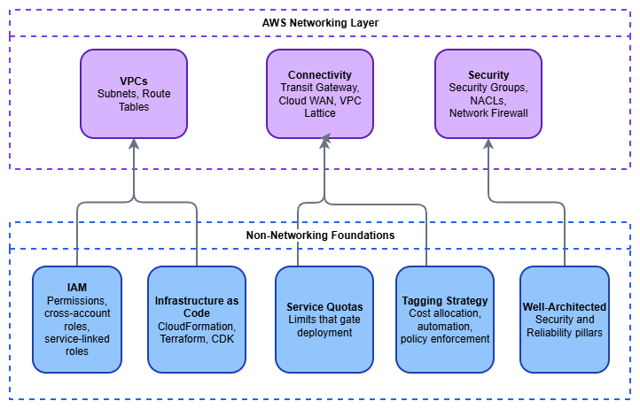

# Before You Start

AWS networking does not exist in isolation. Every VPC, route table, and Transit Gateway attachment lives inside an account, is governed by IAM policies, is subject to service quotas, and should be deployed through code. Getting these non-networking foundations right before you touch a single CIDR block prevents the class of problems that are hardest to fix later: permission errors that block cross-account sharing, quota exhaustion during production deployments, untagged resources that make cost attribution impossible, and manual configurations that drift silently.

This page covers the prerequisites that sit underneath the networking layer. None of them are networking-specific, but all of them shape how your network architecture operates in practice.

/// caption
Non-networking foundations — [Drawio Source](../assets/foundation/prerequisites-layers.drawio)
///

## Identity and Access Management (IAM)

IAM is the control plane for everything in AWS. Every API call — creating a VPC, attaching a Transit Gateway, sharing a resource through AWS RAM — is an IAM-authorized action. If your IAM foundation is weak, your networking automation will fail in ways that are difficult to diagnose: cross-account resource sharing silently denied, service-linked roles missing permissions, or deployment pipelines blocked by overly restrictive SCPs.

**What matters for networking specifically:**

* **Cross-account roles and trust policies** — Multi-account networking is the norm, not the exception. Transit Gateway sharing, Route 53 Resolver rule associations, VPC Lattice service networks, and AWS RAM shares all require cross-account IAM trust. Design your role trust policies to support the resource-sharing patterns you'll use, not just the account you're currently working in.
* **Service-linked roles** — Services like AWS Transit Gateway, Amazon VPC Lattice, and AWS Network Firewall create service-linked roles automatically. These roles have specific permissions that the service needs to operate. Understand that they exist, that they're created on first use, and that SCPs or permission boundaries that block `iam:CreateServiceLinkedRole` will break service provisioning.
* **Service Control Policies (SCPs)** — In an AWS Organizations environment, SCPs set the maximum permissions boundary for every account. A common mistake is deploying an SCP that restricts `ec2:*` actions without realizing that VPC, subnet, route table, security group, and ENI operations all live under the `ec2:` namespace. Test SCPs against networking actions explicitly.
* **Condition keys for network resources** — IAM supports condition keys like `ec2:Vpc`, `ec2:Subnet`, and `aws:RequestedRegion` that let you scope permissions to specific network boundaries. Use them to prevent accidental resource creation in the wrong VPC or Region.

***Key insight:*** *The most common IAM failure in networking is not "permission denied on a single resource" — it's a cross-account trust relationship that works in development (same account) and breaks in production (different account, different Organization). Test cross-account IAM paths early.*

## Infrastructure as Code

Networking infrastructure is almost always managed as code, and for good reason: network resources are long-lived, interdependent, and shared across teams. A VPC created manually in the console becomes a liability the moment someone needs to replicate it, audit it, or understand why a route exists. The three primary tools for AWS infrastructure as code are **AWS CloudFormation**, **Terraform**, and **AWS CDK**, and each has a different operational model.

**Choosing your tool:**

* **AWS CloudFormation** — Native AWS service, tightly integrated with AWS Organizations (StackSets for multi-account deployment), drift detection, and change sets. Best when your environment is AWS-only and you want deployment orchestration managed by AWS. Networking resources are well-supported, including custom resources for operations CloudFormation doesn't cover natively.
* **Terraform** — Provider-based, state-file-driven, supports multi-cloud. The AWS provider covers networking resources comprehensively. Best when your team already uses Terraform, when you need to manage resources across multiple clouds, or when you prefer HCL's declarative style. Requires managing state files (use remote backends like S3 + DynamoDB locking).
* **AWS CDK** — Generates CloudFormation under the hood, but lets you define infrastructure in TypeScript, Python, Java, Go, or C#. Best when your team prefers general-purpose programming languages and wants to build reusable constructs. The `aws-ec2` module provides L2 constructs for VPCs, subnets, and routing that handle common patterns with sensible defaults.

**Patterns that matter for networking IaC:**

* **Separate network infrastructure from workload infrastructure** — Network resources (VPCs, Transit Gateway attachments, route tables) change on a different cadence than application resources. Deploy them in separate stacks or state files so that a workload deployment cannot accidentally modify shared network infrastructure.
* **Use outputs and cross-stack references** — Networking stacks produce values (VPC IDs, subnet IDs, route table IDs) that workload stacks consume. Export these cleanly through CloudFormation exports, Terraform remote state data sources, or SSM Parameter Store.
* **Parameterize CIDR blocks** — Never hardcode CIDR ranges. Pass them as parameters or look them up from IPAM. This is what makes your templates reusable across environments.
* **Test with ephemeral environments** — Spin up a complete network stack in a test account, validate connectivity, and tear it down. This catches quota issues, IAM trust failures, and routing errors before they reach production.

***Key insight:*** *The tool matters less than the discipline. Pick one, use it consistently, and never allow manual console changes to network resources in production accounts. Drift between code and reality is the single largest source of networking incidents in mature AWS environments.*

## Service Quotas

AWS imposes default limits on networking resources, and many of them are lower than you'd expect. A default of 5 VPCs per Region sounds generous until you're running a multi-account landing zone where each account needs at least one VPC. A default of 50 routes per route table sounds fine until you peer with 60 VPCs. Quota exhaustion during a production deployment is an avoidable incident.

**Quotas that catch networking teams most often:**

| Resource | Default Limit | Why It Matters |
|----------|:---:|---|
| VPCs per Region | 5 | Multi-account environments hit this quickly in shared-services accounts |
| Subnets per VPC | 200 | Rarely an issue, but large multi-AZ designs with many tiers can approach it |
| Routes per route table | 50 | Transit Gateway and VPC peering each consume a route entry per destination |
| Security groups per ENI | 5 | Microservice architectures with fine-grained SG rules hit this |
| VPC peering connections per VPC | 50 | Mesh topologies exhaust this; Transit Gateway is the answer |
| Transit Gateway attachments | 5,000 | Large organizations with hundreds of accounts approach this |
| Participants per RAM share | 5,000 | Relevant for Transit Gateway and VPC Lattice sharing at scale |

**Best practices for quota management:**

* **Audit quotas before designing** — Run `aws service-quotas list-service-quotas --service-code ec2` and `--service-code vpc` in every Region you plan to use. Compare defaults against your architecture's resource count.
* **Request increases proactively** — Quota increase requests can take hours to days. Submit them as part of your environment provisioning, not when a deployment fails.
* **Monitor applied quotas in CloudWatch** — Service Quotas publishes utilization metrics. Set alarms at 80% utilization so you have time to request increases before hitting the wall.
* **Account for quotas in your IaC** — If your Terraform or CloudFormation template creates resources that approach a quota, document it. Better yet, add a pre-deployment check.

***Key insight:*** *Quotas are not bugs — they're guardrails. But the default values assume a single-workload account, not a shared-services or networking account. Treat quota planning as part of architecture design, not as an afterthought.*

## IPv6 Readiness

IPv6 is not a future consideration — it's a current requirement for modern AWS networking. Every new VPC should be dual-stack from day one, and your non-networking foundations must be ready to support that. IPv6 readiness failures are subtle: a VPC with IPv6 enabled but security groups that only have IPv4 rules, or IaC templates that create route tables without `::/0` entries, or NACLs that block IPv6 traffic silently.

**What IPv6 readiness means for your prerequisites:**

* **Security groups need explicit IPv6 rules** — IPv4 rules do not automatically apply to IPv6 traffic. A security group that allows `0.0.0.0/0` on port 443 does not allow `[::]/0` on port 443. Every security group in your IaC templates must include both protocol families.
* **NACLs must permit IPv6** — The default NACL allows all traffic (IPv4 and IPv6), but custom NACLs need explicit IPv6 entries. A custom NACL that allows `0.0.0.0/0` inbound does not allow IPv6 inbound.
* **IaC templates must include dual-stack from the start** — VPC templates should allocate both an IPv4 CIDR and an Amazon-provided IPv6 `/56`. Subnet templates should assign both an IPv4 CIDR and an IPv6 `/64`. Route tables need both `0.0.0.0/0` and `::/0` entries. Retrofitting IPv6 into existing templates is significantly more work than including it from the beginning.
* **IAM policies referencing `ec2:` actions** — IPv6-specific actions (like `ec2:AssignIpv6Addresses`) must not be inadvertently blocked by SCPs or permission boundaries that restrict `ec2:*` actions.
* **DNS resolution** — Applications must handle dual-stack DNS responses (AAAA records alongside A records). Test that your application code, health checks, and monitoring tools work correctly when DNS returns IPv6 addresses.

***Key insight:*** *The most common IPv6 failure is not "the VPC doesn't support it" — it's "the security group only has IPv4 rules." Build IPv6 into your IaC templates, security group modules, and NACL baselines from the start, and this entire class of problems disappears.*

## Tagging Strategy

Tags are metadata, but in AWS networking they're also the mechanism for cost allocation, automation targeting, and policy enforcement. An untagged VPC is a VPC that no one can attribute cost to, no automation can reliably target, and no compliance rule can evaluate. In a multi-account networking environment with hundreds of VPCs and thousands of subnets, consistent tagging is the difference between operational visibility and chaos.

**A minimum viable tagging standard for network resources:**

* **`Environment`** — `production`, `staging`, `development`. Gates automation behavior (for example, don't auto-delete production resources).
* **`Owner`** — The team responsible for the resource. Critical when a Transit Gateway attachment is consuming capacity and you need to know who to contact.
* **`CostCenter`** — For billing allocation. Network resources (NAT gateways, Transit Gateway attachments, VPC endpoints) generate significant cost that must be attributed.
* **`ManagedBy`** — `cloudformation`, `terraform`, `cdk`, or `manual`. Identifies how the resource is managed and whether it's safe to modify.
* **`Name`** — Descriptive and consistent. Use a naming convention like `{env}-{region}-{purpose}-{type}` (for example, `prod-use1-shared-tgw`).

**Enforcement mechanisms:**

* **AWS Organizations Tag Policies** — Define required tags and allowed values at the Organization level. Non-compliant resources are flagged (or blocked, depending on enforcement mode).
* **SCP-based enforcement** — Deny `ec2:CreateVpc`, `ec2:CreateSubnet`, and other networking actions unless required tags are present in the request.
* **AWS Config rules** — `required-tags` rule evaluates existing resources and flags non-compliance for remediation.

***Key insight:*** *Enforce tagging at creation time, not after the fact. Retroactively tagging hundreds of network resources is painful and error-prone. An SCP or IAM policy condition that requires tags on resource creation is far cheaper than a quarterly tagging remediation effort.*

## AWS Well-Architected Framework

The Well-Architected Framework provides the architectural principles that networking decisions should align with. Two pillars are directly relevant to network architecture: **Security** and **Reliability**. A third — **Cost Optimization** — becomes critical once you're running Transit Gateway, NAT gateways, and VPC endpoints at scale.

**Security Pillar — what applies to networking:**

* **Defense in depth** — Layer security controls: security groups at the ENI, NACLs at the subnet, Network Firewall or GWLB at the VPC perimeter, and AWS WAF at the application edge. No single layer is sufficient alone.
* **Least privilege for network access** — Default-deny security groups, explicit route table entries, and PrivateLink instead of public endpoints wherever possible.
* **Reduce attack surface** — Private subnets by default, VPC endpoints for AWS service access, no public IPs unless explicitly required.

**Reliability Pillar — what applies to networking:**

* **Multi-AZ by default** — Every networking component (NAT gateway, Network Firewall endpoints, load balancers) should be deployed across multiple Availability Zones. Single-AZ networking is a single point of failure for everything above it.
* **Limit blast radius** — Use multiple VPCs and accounts to contain failures. A routing misconfiguration in one VPC should not propagate to others.
* **Test failure modes** — Simulate Availability Zone failure, Transit Gateway attachment loss, and DNS resolution failure. Know what breaks and how it recovers.

**Cost Optimization Pillar — what applies to networking:**

* **Understand data transfer pricing** — Cross-AZ, cross-Region, Transit Gateway processing, NAT gateway processing, and VPC endpoint hourly charges all add up. Architect to minimize unnecessary data movement.
* **Use VPC endpoints to avoid NAT costs** — Traffic to S3, DynamoDB, and other AWS services through VPC endpoints avoids NAT gateway processing charges entirely.
* **Right-size your connectivity** — Don't deploy Transit Gateway when VPC peering suffices for two VPCs. Don't deploy AWS Cloud WAN when a single-Region Transit Gateway covers your topology.

***Key insight:*** *Well-Architected is not a checklist to complete after building — it's a set of principles to apply during design. Review the Security and Reliability pillars before you draw your first network diagram, not after.*

---

## Documentation

*   :material-shield-account: **IAM User Guide**

    ---

    Identity and access management fundamentals, policies, roles, and cross-account access patterns.

    [:octicons-arrow-right-24: IAM Documentation](https://docs.aws.amazon.com/IAM/latest/UserGuide/introduction.html)

*   :material-code-braces: **AWS CloudFormation**

    ---

    AWS-native infrastructure as code with StackSets, drift detection, and change sets.

    [:octicons-arrow-right-24: CloudFormation Documentation](https://docs.aws.amazon.com/AWSCloudFormation/latest/UserGuide/Welcome.html)

*   :material-terraform: **Terraform AWS Provider**

    ---

    HashiCorp's AWS provider documentation covering all networking resources.

    [:octicons-arrow-right-24: Terraform AWS Provider](https://registry.terraform.io/providers/hashicorp/aws/latest/docs)

*   :material-gauge: **Service Quotas**

    ---

    View, manage, and request increases for AWS service limits.

    [:octicons-arrow-right-24: Service Quotas Documentation](https://docs.aws.amazon.com/servicequotas/latest/userguide/intro.html)

*   :material-tag-multiple: **Tagging Best Practices**

    ---

    AWS tagging strategies, tag policies, and enforcement mechanisms.

    [:octicons-arrow-right-24: Tagging Documentation](https://docs.aws.amazon.com/tag-editor/latest/userguide/tagging.html)

*   :material-check-decagram: **Well-Architected Framework**

    ---

    Architectural best practices across Security, Reliability, Performance, Cost, and Operational Excellence.

    [:octicons-arrow-right-24: Well-Architected Framework](https://docs.aws.amazon.com/wellarchitected/latest/framework/welcome.html)

## Next Steps

With these foundations in place, work through the Foundation topics in this order:

1. **[AWS Organizations](organizations.md)** — Multi-account structure that governs how network resources are shared and isolated
2. **[Amazon VPC](vpc.md)** — The isolated virtual network that everything else builds on
3. **[Regions and Availability Zones](regions-azs.md)** — Geographic distribution and the multi-AZ patterns that drive reliability
4. **[CIDR Planning](cidr.md)** — IP address allocation strategy that prevents conflicts at scale
5. **[Subnets](subnets.md)** — Network segmentation within a VPC
6. **[IPAM](ipam.md)** — Centralized IP address management for multi-account environments
