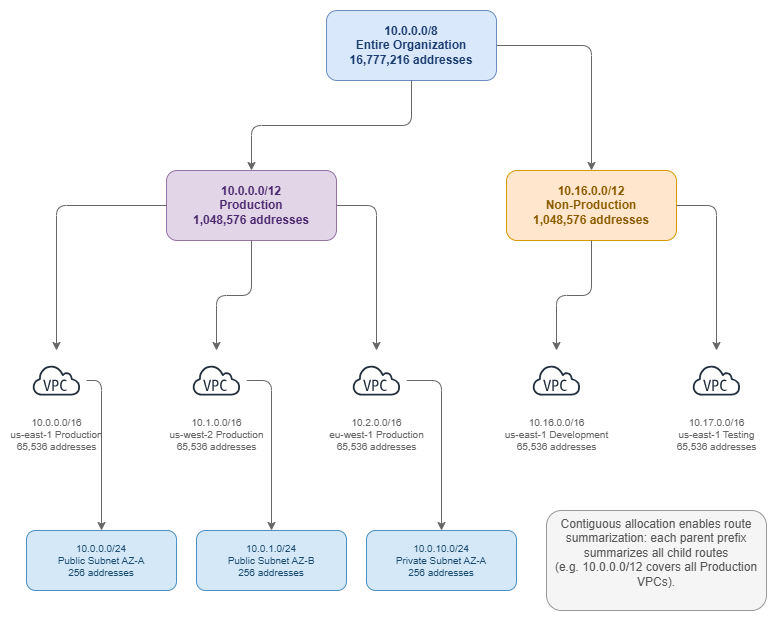

# IP Address Planning with CIDR Blocks

!!! info "Prerequisites"
    This section assumes familiarity with [Before You Start](aws-prerequisites.md), [Amazon VPC](vpc.md), and [Regions and Availability Zones](regions-azs.md). Review those pages first if you're new to AWS networking fundamentals.

IP address planning is the single most consequential decision you make early in an AWS deployment that you cannot easily change later. Every VPC, every subnet, every peering connection, every hybrid link, and every route table is constrained by the CIDR blocks you chose at creation time. Get this right and your network scales cleanly for years. Get it wrong and you'll spend those years working around overlaps, exhausted address space, and connectivity that should be possible but isn't because two VPCs share the same range.

CIDR (Classless Inter-Domain Routing) notation is the language of IP address planning. It replaces the old classful system (Class A, B, C) with variable-length prefixes that let you carve address space into precisely the sizes you need. Every AWS networking service — VPC, Transit Gateway, Cloud WAN, Direct Connect, VPN — speaks CIDR. Mastering it is not optional.

/// caption
Hierarchical CIDR allocation — [Drawio Source](../assets/foundation/cidr-hierarchy.drawio)
///

***Key insight:*** *A hierarchical CIDR allocation — organization → environment → Region → VPC → subnet — is not just tidy bookkeeping. It enables route summarization, simplifies firewall rules, and makes your network topology legible to anyone who reads a route table.*

## Understanding CIDR Notation

CIDR notation represents IP address ranges using the format: `IP_ADDRESS/PREFIX_LENGTH`

**Example**: `10.0.0.0/16`

* **IP Address**: `10.0.0.0` — the network address (starting point of the range)
* **Prefix Length**: `/16` — the number of fixed bits in the network portion (the remaining bits are available for hosts)
* **Address Range**: `10.0.0.0` to `10.0.255.255` (65,536 addresses)
* **Subnet Mask**: `255.255.0.0`

The prefix length determines how many addresses the block contains: a `/16` has 2^(32-16) = 65,536 addresses. A shorter prefix means more addresses; a longer prefix means fewer. Every time you increase the prefix by 1, you halve the address space.

### Common CIDR Block Sizes

| CIDR | Addresses | Usable in Subnet* | Typical Use |
|------|-----------|-------------------|-------------|
| /16  | 65,536    | 65,531            | Large VPC for enterprise environments, gives maximum room for subnets |
| /20  | 4,096     | 4,091             | Medium VPC, departmental or single-workload VPCs |
| /24  | 256       | 251               | Standard subnet size, balances density with manageability |
| /26  | 64        | 59                | Smaller subnets for firewall endpoints, NAT gateway, or TGW attachments |
| /28  | 16        | 11                | Minimum VPC or subnet size, used for specific services only |

*AWS reserves 5 IP addresses in each subnet (first four and last one).

### RFC 1918 Private Address Ranges

These are the private IP ranges available for your VPCs:

| Range | CIDR | Addresses | Recommendation |
|-------|------|-----------|----------------|
| 10.0.0.0 – 10.255.255.255 | 10.0.0.0/8 | 16,777,216 | **Preferred for most organizations.** Largest contiguous space, supports deep hierarchical allocation. |
| 172.16.0.0 – 172.31.255.255 | 172.16.0.0/12 | 1,048,576 | Good secondary range. Often already used by on-premises networks. |
| 192.168.0.0 – 192.168.255.255 | 192.168.0.0/16 | 65,536 | Avoid for production AWS use. Too small for multi-account environments and commonly used by home networks and VPN clients, causing overlap issues. |

### Additional Ranges for AWS Workloads

Beyond RFC 1918, AWS VPCs support these ranges:

* **100.64.0.0/10** (Carrier-Grade NAT range): Useful for EKS pod networking with the VPC CNI custom networking feature. Pods get IPs from this range, preserving your primary RFC 1918 space for nodes and other resources. Also used when RFC 1918 space is exhausted.
* **RFC 6815 space** (`198.19.0.0/16`): Available as a secondary CIDR for VPCs when other ranges are exhausted.

***Key insight:*** *The 100.64.0.0/10 range is a strategic tool for EKS-heavy environments. A single EKS cluster can consume thousands of IP addresses for pods. Assigning pod networking to 100.64.0.0/10 via custom networking keeps your primary VPC CIDR available for nodes, load balancers, and other infrastructure.*

## Best Practices

### CIDR allocation strategy

#### Allocate contiguously for route summarization

The most important property of a good CIDR plan is that allocations within the same logical group are **contiguous**. When all production VPCs in us-east-1 fall within `10.0.0.0/12`, you can advertise a single `/12` summary route to on-premises networks instead of individual `/16` routes for each VPC. This matters because:

* Route tables have size limits (Transit Gateway supports 10,000 routes, but on-premises routers may support far fewer)
* Fewer routes mean faster convergence after failures
* Summary routes simplify firewall rules — one rule covers an entire environment instead of per-VPC entries
* BGP advertisements to on-premises are cleaner and more stable

**Bad allocation** (non-contiguous, cannot summarize):

* Production VPC 1: `10.0.0.0/16`
* Development VPC: `10.1.0.0/16`
* Production VPC 2: `10.5.0.0/16`

**Good allocation** (contiguous, summarizable as `10.0.0.0/12`):

* Production VPC 1: `10.0.0.0/16`
* Production VPC 2: `10.1.0.0/16`
* Production VPC 3: `10.2.0.0/16`

#### Start with /16 for production VPCs

A `/16` gives you 65,536 addresses and room to create 256 `/24` subnets. This sounds excessive until you account for multi-AZ deployments (3+ Availability Zones × multiple subnet tiers), EKS pod density, future growth, and the fact that you cannot shrink a VPC CIDR after creation. The cost of a `/16` is zero (IP addresses in a VPC are free until you use Elastic IPs or public IPv4), but the cost of running out of space is a painful migration.

For non-production workloads where you're confident about scale, `/20` (4,096 addresses) is a reasonable choice. For isolated single-purpose VPCs (inspection VPCs, Transit Gateway attachment VPCs), `/24` or even `/28` may suffice.

***Key insight:*** *You cannot reduce a VPC's primary CIDR block. You can add secondary CIDRs later, but secondary CIDRs have limitations: they cannot overlap with existing CIDRs, some services don't support them cleanly, and they add operational complexity. Getting the primary CIDR right is always cheaper than fixing it later.*

#### Never overlap CIDR blocks across VPCs you might connect

VPCs with overlapping CIDR blocks cannot be connected via VPC Peering, Transit Gateway, or Cloud WAN. This is an absolute constraint — there is no workaround at the network layer. If VPC A uses `10.0.0.0/16` and VPC B uses `10.0.5.0/24`, those VPCs can never peer or share a Transit Gateway route table, because `10.0.5.0/24` falls within `10.0.0.0/16`.

The only escape from an overlap is PrivateLink (which uses ENIs and doesn't require routable connectivity) or VPC Lattice (which operates at the application layer). But these are service-level solutions, not network-level connectivity. If you need IP-level routing between VPCs — and most organizations do — overlaps are fatal.

This applies across your entire organization, including VPCs you haven't created yet. Reserve address space for future accounts and Regions in your allocation plan.

#### Plan for hybrid connectivity from day one

If there is any chance your AWS environment will connect to on-premises networks, corporate data centers, or other clouds, you must coordinate CIDR allocation across all environments from the start. Hybrid connectivity failures caused by CIDR overlap are among the most expensive networking mistakes to fix because they require re-IPing workloads — a process that touches DNS, application configurations, firewall rules, and monitoring systems.

This means:

1. **Document every on-premises IP range** before allocating AWS CIDRs. Include branch offices, partner networks, acquired company networks, and remote access VPN pools. The range you don't know about is the one that will overlap.
2. **Reserve non-overlapping space** for AWS that will never conflict with on-premises allocations. A clean split (for example, on-premises owns `10.128.0.0/9`, AWS owns `10.0.0.0/9`) eliminates ambiguity.
3. **Coordinate with network teams** who manage on-premises addressing. A unilateral AWS CIDR decision that overlaps with the data center range discovered six months later forces a VPC recreation.
4. **Account for VPN client pools**. Remote access VPN clients need IP ranges that don't overlap with either AWS or on-premises networks. Many organizations use `172.16.0.0/12` for client VPN pools.
5. **Plan for acquisitions**. When your company acquires another organization, their network ranges become your problem. Reserve space that's unlikely to conflict with typical enterprise allocations.

A common pattern: allocate `10.0.0.0/8` with on-premises using `10.128.0.0/9` and AWS using `10.0.0.0/9`. This gives each environment 8 million addresses with zero overlap risk. For organizations with existing on-premises allocations scattered across `10.0.0.0/8`, use `172.16.0.0/12` for AWS or work with your network team to identify unused portions of the `10.x` space.

***Key insight:*** *The most common hybrid connectivity failure is not a Direct Connect configuration error or a BGP misconfiguration — it's a CIDR overlap discovered after workloads are already running. Document all existing ranges, including those "temporary" lab networks and forgotten branch offices, before making any AWS allocation.*

#### Design a multi-Region allocation strategy

Assign each Region a dedicated block within your organizational allocation. This enables per-Region route summarization and prevents cross-Region overlap as you expand.

**Example multi-Region scheme** (within `10.0.0.0/9` for AWS):

| Region | CIDR Block | Purpose |
|--------|-----------|---------|
| us-east-1 | 10.0.0.0/12 | Primary Region |
| us-west-2 | 10.16.0.0/12 | DR / Secondary |
| eu-west-1 | 10.32.0.0/12 | European workloads |
| ap-southeast-1 | 10.48.0.0/12 | Asia-Pacific workloads |
| Reserved | 10.64.0.0/10 | Future Regions |

Each `/12` gives you 1,048,576 addresses per Region — enough for 16 `/16` VPCs or 256 `/20` VPCs. The reserved block ensures you can expand to new Regions without restructuring existing allocations.

When advertising routes to on-premises via Direct Connect or VPN, a per-Region allocation lets you advertise a single summary route per Region (for example, `10.0.0.0/12` for all of us-east-1) rather than individual VPC prefixes. This keeps your on-premises route tables small and your BGP sessions stable.

***Key insight:*** *Reserve at least 50% of your total address space for future growth. Organizations consistently underestimate how many VPCs, accounts, and Regions they'll need in 3-5 years. Address space is free; running out of it is not.*

#### Plan IPv6 alongside IPv4

IPv6 in AWS VPCs works differently from IPv4 and requires separate planning:

* **VPC-level**: Each VPC receives a `/56` IPv6 CIDR (256 `/64` subnets available). You can use Amazon-provided addresses or bring your own (BYOIP).
* **Subnet-level**: Each subnet gets a `/64` from the VPC's `/56`. This is fixed — you cannot choose a different subnet prefix length.
* **No NAT required**: IPv6 addresses are globally unique. Egress-only internet gateways provide outbound-only internet access without NAT.
* **Dual-stack**: Most organizations run dual-stack (IPv4 + IPv6) rather than IPv6-only, at least during transition.
* **No address exhaustion concern**: A single `/56` provides 4,722,366,482,869,645,213,696 addresses. Exhaustion is not a planning factor for IPv6.

**IPv6 CIDR source options:**

| Source | Use Case | Consideration |
|--------|----------|---------------|
| Amazon-provided | Default for most workloads | Addresses are assigned from Amazon's pool; change if you disassociate |
| BYOIP (Bring Your Own IP) | Enterprises with existing IPv6 allocations | Requires RIR registration and ROA; provides address portability |
| IPAM-managed Amazon pool | Multi-account with consistent allocation | Allocates from Amazon's pool but through IPAM for governance |

IPv6 planning is simpler than IPv4 in one respect: the address space is so vast that exhaustion is not a concern. The complexity lies in ensuring your security groups, NACLs, route tables, and firewall rules account for IPv6 traffic paths. Many organizations overlook that IPv6 subnets are internet-routable by default — an egress-only internet gateway provides outbound access, but without proper security group rules, resources with public IPv6 addresses are reachable from the internet.

**IPv6 planning checklist:**

* Decide on Amazon-provided vs BYOIP before creating VPCs (changing later requires disassociation)
* Update all security groups to include IPv6 rules (IPv4 rules do not automatically apply to IPv6 traffic)
* Configure route tables with IPv6 routes (`::/0` to internet gateway or egress-only internet gateway)
* Ensure NACLs permit IPv6 traffic for required flows
* Verify that applications and DNS resolution handle dual-stack correctly

#### Use secondary CIDRs strategically, not as a crutch

AWS allows up to 5 IPv4 CIDR blocks per VPC (1 primary + 4 secondary). Secondary CIDRs are useful for:

* **EKS pod networking**: Adding `100.64.0.0/16` as a secondary CIDR for pod IP space
* **Acquisitions**: Integrating a newly acquired company's workloads that need temporary address space
* **Gradual migration**: Adding non-overlapping space while planning a proper re-IP

Secondary CIDRs are **not** a substitute for proper initial planning. They add complexity: route tables need entries for each CIDR, some services handle multiple CIDRs inconsistently, and the operational overhead of managing multiple ranges per VPC compounds across hundreds of VPCs.

***Key insight:*** *If you find yourself routinely adding secondary CIDRs to VPCs, your initial allocation was too small. Treat secondary CIDRs as an escape valve, not a design pattern.*

#### Avoid common CIDR planning mistakes

| Mistake | Why It Hurts | Prevention |
|---------|-------------|------------|
| Using `192.168.0.0/16` for production | Overlaps with home networks, VPN clients, and many on-premises environments | Use `10.0.0.0/8` for AWS production |
| Allocating `/24` VPCs "to save space" | Exhausts subnet capacity quickly; no room for multi-AZ or EKS | Default to `/16` for production, `/20` minimum for non-production |
| No reserved space for future Regions | Forces non-contiguous allocation when expanding | Reserve 50%+ of your total allocation |
| Ignoring on-premises ranges | Discovered overlaps block hybrid connectivity | Document all existing ranges before any AWS allocation |
| Per-team allocation without coordination | Teams independently choose overlapping ranges | Centralize allocation through IPAM or a shared registry |
| Treating VPC CIDR as changeable | Primary CIDR cannot be removed; forces VPC recreation | Plan the primary CIDR as permanent from day one |

## Combining CIDR planning with other services

CIDR planning is not an isolated activity — it directly enables or constrains every other networking service. The decisions you make about address allocation ripple through every connectivity pattern you adopt later. A well-designed CIDR plan makes Transit Gateway route tables clean, Direct Connect BGP advertisements simple, and Cloud WAN segment routing predictable. A poorly designed plan forces workarounds at every layer.

The table below shows how CIDR decisions interact with key AWS networking services.

| Combination | CIDR Planning Enables | Other Service Provides |
|---|---|---|
| **CIDR + IPAM** | Hierarchical allocation scheme, size standards, reserved ranges | Automated allocation enforcement, overlap prevention, compliance auditing, multi-account governance |
| **CIDR + Transit Gateway** | Non-overlapping VPC ranges that can share route tables; contiguous blocks for route summarization | Regional hub-and-spoke routing, centralized egress, shared services connectivity |
| **CIDR + Direct Connect / Hybrid** | AWS ranges that never overlap with on-premises; summarizable blocks for BGP advertisements | Private dedicated connectivity, predictable bandwidth, reduced data transfer costs |
| **CIDR + VPC Peering** | Strictly non-overlapping ranges between peered VPCs (no partial overlap allowed) | Direct low-latency connectivity without bandwidth bottlenecks |
| **CIDR + Cloud WAN** | Per-Region contiguous allocations that align with segment boundaries; summarizable prefixes for routing policies | Global policy-driven network, segment isolation, service insertion, multi-Region routing |
| **CIDR + EKS (VPC CNI)** | Secondary CIDRs (100.64.0.0/10) for pod networking; primary CIDR sized for nodes | Pod-level networking with VPC-native security groups, network policies |

The most common failure mode is discovering a CIDR constraint only when you try to adopt a new service. For example: you deploy Transit Gateway and discover that two VPCs in different accounts use the same `10.0.0.0/16` range because teams allocated independently. Or you establish Direct Connect and realize your AWS ranges overlap with a branch office subnet that nobody documented. These are not Transit Gateway or Direct Connect problems — they are CIDR planning problems that surface at deployment time.

***Key insight:*** *Every networking service you adopt later will either benefit from or be constrained by your CIDR plan. The 30 minutes you spend on a proper allocation scheme saves hundreds of hours of workarounds across Transit Gateway, Direct Connect, and Cloud WAN deployments.*

## Subnet CIDR Planning

Within a VPC, subnet design determines how workloads are isolated, how many resources can run in each Availability Zone, and how route tables control traffic flow. Subnet CIDRs are carved from the VPC's CIDR block and cannot overlap with each other.

Every subnet consumes a contiguous portion of the VPC CIDR. AWS reserves 5 addresses in each subnet: the network address, the VPC router (`.1`), the DNS server (`.2`), one reserved for future use (`.3`), and the broadcast address (last IP). A `/24` subnet therefore provides 251 usable addresses, not 256.

**Recommended subnet layout for a `/16` VPC across 3 Availability Zones:**

| Subnet Tier | AZ-A | AZ-B | AZ-C | Size | Purpose |
|-------------|------|------|------|------|---------|
| Public | 10.0.0.0/24 | 10.0.1.0/24 | 10.0.2.0/24 | /24 (251 usable) | Load balancers, NAT gateways, bastion hosts |
| Private (application) | 10.0.10.0/24 | 10.0.11.0/24 | 10.0.12.0/24 | /24 (251 usable) | Application servers, containers, Lambda |
| Private (data) | 10.0.20.0/24 | 10.0.21.0/24 | 10.0.22.0/24 | /24 (251 usable) | RDS, ElastiCache, OpenSearch |
| Private (spare) | 10.0.30.0/24 | 10.0.31.0/24 | 10.0.32.0/24 | /24 (251 usable) | Future use, additional tiers |
| TGW/Firewall | 10.0.250.0/28 | 10.0.250.16/28 | 10.0.250.32/28 | /28 (11 usable) | Transit Gateway ENIs, firewall endpoints |

**Subnet sizing guidance:**

* `/24` is the standard subnet size for most workloads. It provides 251 usable addresses per Availability Zone, which handles most application tiers comfortably.
* `/20` or larger for EKS worker node subnets if pods use the primary CIDR (each node consumes IPs proportional to its pod capacity).
* `/28` for infrastructure subnets that only host a few ENIs (Transit Gateway attachments, Network Firewall endpoints, NAT gateways).
* Leave gaps in your numbering scheme (notice the jump from `.2.0` to `.10.0` above) to allow inserting new subnet tiers without renumbering.

**Subnet design principles:**

* **Consistent across Availability Zones**: Every Availability Zone should have the same subnet tiers with the same sizes. This ensures workloads can fail over between Availability Zones without capacity differences.
* **Separate route tables per tier**: Public subnets route to an internet gateway; private subnets route through NAT or stay internal. Mixing tiers in a single route table creates security risks.
* **Plan for at least 3 Availability Zones**: Even if you start with 2, design your subnet scheme for 3 Availability Zones from the beginning. Adding a third Availability Zone later with a consistent scheme is trivial if you planned for it.
* **Reserve space for infrastructure subnets**: Transit Gateway attachments, Network Firewall endpoints, and Gateway Load Balancer endpoints each need a subnet per Availability Zone. These only need `/28` but must exist in every Availability Zone.

***Key insight:*** *The numbering gaps in your subnet scheme are not wasted space — they are future-proofing. A VPC that uses 10.0.0.0/24, 10.0.1.0/24, 10.0.2.0/24 for its first three tiers has no room to insert a new tier between them. A scheme with gaps (0, 10, 20, 30) lets you add tiers at 5, 15, 25 without disrupting existing subnets.*

## Documentation

*   :material-file-document: **VPC CIDR blocks**

    ---

    Official documentation on VPC CIDR block configuration, limits, and supported ranges.

    [:octicons-arrow-right-24: Documentation](https://docs.aws.amazon.com/vpc/latest/userguide/vpc-cidr-blocks.html)

*   :material-file-document: **Subnet sizing**

    ---

    How subnet CIDR blocks work, reserved addresses, and sizing considerations.

    [:octicons-arrow-right-24: Documentation](https://docs.aws.amazon.com/vpc/latest/userguide/configure-subnets.html#subnet-sizing)

*   :material-file-document: **Subnet CIDR reservations**

    ---

    Reserve portions of subnet CIDR space for specific use cases like exclusive use by specific services.

    [:octicons-arrow-right-24: Documentation](https://docs.aws.amazon.com/vpc/latest/userguide/subnet-cidr-reservation.html)

*   :material-book-open-variant: **Building Scalable Multi-VPC Networks**

    ---

    AWS whitepaper covering IP address planning at scale, multi-account strategies, and connectivity patterns.

    [:octicons-arrow-right-24: Whitepaper](https://docs.aws.amazon.com/whitepapers/latest/building-scalable-secure-multi-vpc-network-infrastructure/welcome.html)

*   :material-post: **Designing Hyperscale VPC Networks**

    ---

    Blog post on large-scale CIDR planning, address space management, and growth strategies.

    [:octicons-arrow-right-24: Blog post](https://aws.amazon.com/blogs/networking-and-content-delivery/designing-hyperscale-amazon-vpc-networks/)

*   :material-book-open-variant: **RFC 1918 - Private Address Allocation**

    ---

    The foundational RFC defining private IPv4 address ranges used in VPC CIDR planning.

    [:octicons-arrow-right-24: RFC 1918](https://datatracker.ietf.org/doc/html/rfc1918)

---

## Related Foundation Topics

This page covers CIDR planning principles. For related foundational topics, see:

* **[Amazon VPC](vpc.md)** — VPC design patterns, multi-AZ architecture, and how VPC structure builds on your CIDR plan
* **[Subnets](subnets.md)** — Subnet tiers, route table design, and network ACLs within your CIDR allocation
* **[AWS IPAM](ipam.md)** — Automating CIDR allocation, preventing overlaps, and enforcing policies across your organization
* **[Regions and Availability Zones](regions-azs.md)** — How Region selection drives your multi-Region CIDR allocation strategy
* **[AWS Organizations](organizations.md)** — Account structure that your CIDR hierarchy should mirror
