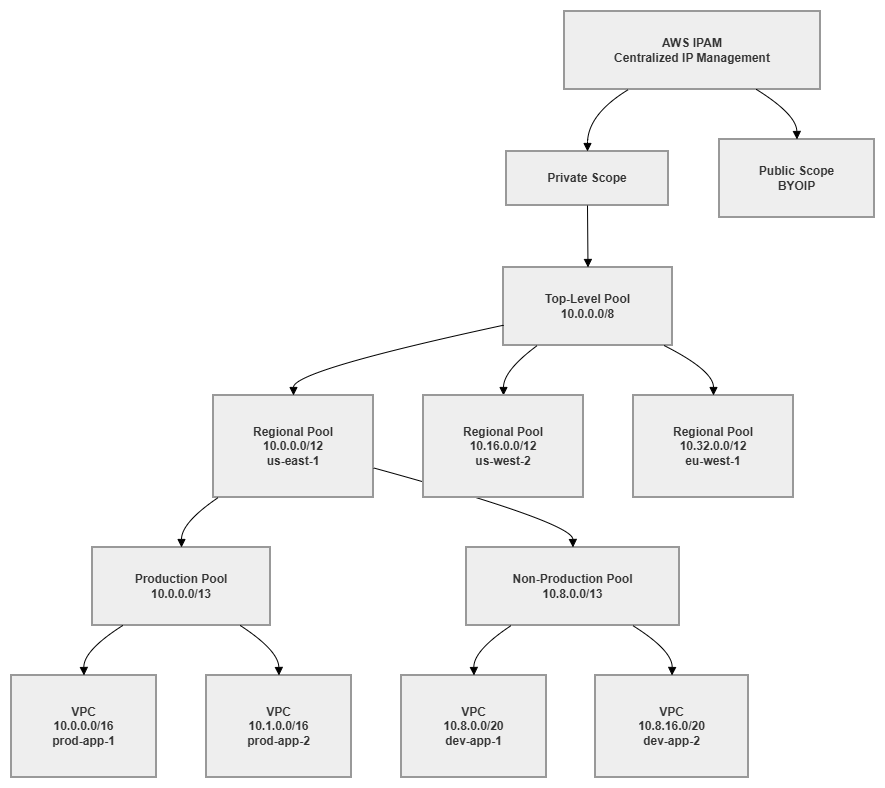

# IP Address Management (IPAM)

!!! info "Prerequisites"
    This section assumes familiarity with [Before You Start](aws-prerequisites.md), [AWS Organizations](organizations.md), [Amazon VPC](vpc.md), and [CIDR Planning](cidr.md). Review those pages first if you're new to AWS networking fundamentals.

AWS IPAM (IP Address Management) is the control plane for your organization's IP address space. It replaces spreadsheets, Confluence pages, and tribal knowledge with a centralized, policy-driven system that plans, allocates, tracks, and monitors IP addresses across every account and Region in your AWS Organization. Without IPAM, IP address management degrades into a coordination bottleneck: teams file tickets for CIDR blocks, networking engineers manually check for overlaps, and nobody has confidence that the next VPC won't conflict with an existing one. IPAM eliminates that friction by making allocation automatic, overlap-free, and auditable.

The service operates through a hierarchy of pools — collections of CIDR ranges organized by Region, environment, or business unit — with allocation rules that enforce sizing, tagging, and locality constraints. When a team creates a VPC, they request a CIDR from the appropriate pool, and IPAM guarantees a non-overlapping allocation that complies with your organizational standards. No tickets, no manual checks, no spreadsheet updates.


/// caption
IPAM pool hierarchy — [Drawio Source](../assets/foundation/ipam-pool-hierarchy.drawio)
///

## Key capabilities

<div class="grid cards" markdown>

*   :material-ip-network: **Hierarchical pool management**

    ---

    Organize IP address space into nested pools by Region, environment, and workload type. Pools inherit constraints from parents and enforce allocation rules at every level.

*   :material-shield-check: **Overlap prevention**

    ---

    Every allocation is validated against the entire pool hierarchy. IPAM guarantees that no two VPCs receive conflicting CIDR blocks, eliminating the most common networking mistake in multi-account environments.

*   :material-chart-pie: **Utilization monitoring**

    ---

    Real-time visibility into how much address space is allocated, used, and available across every pool, Region, and account. Alerts when pools approach exhaustion.

*   :material-tag-check: **Allocation rules**

    ---

    Enforce minimum and maximum CIDR sizes, required tags, and locale restrictions on every allocation. Rules prevent teams from requesting inappropriately sized blocks or deploying in unauthorized Regions.

*   :material-account-multiple: **Organizations integration**

    ---

    Delegate IPAM administration to a networking account, share pools across the Organization via RAM, and monitor compliance across all member accounts automatically.

*   :material-clipboard-check: **Compliance auditing**

    ---

    Continuous monitoring detects VPCs with manually assigned CIDRs that violate your allocation rules, overlap with managed pools, or lack required tags.

</div>

## When to use AWS IPAM

IPAM becomes essential the moment your AWS environment grows beyond what a single engineer can track mentally. The threshold is lower than most teams expect.

**Use IPAM when:**

* You operate more than 5-10 VPCs across any number of accounts. Manual tracking breaks down quickly, and the cost of a single CIDR overlap (which requires VPC recreation to fix) exceeds the cost of IPAM for years.
* Multiple teams create VPCs independently. Without centralized allocation, teams will choose CIDRs that conflict with each other or with on-premises networks.
* You need to connect VPCs to each other or to on-premises networks. Overlapping CIDRs make Transit Gateway, Cloud WAN, and VPC Peering impossible between the affected VPCs.
* Compliance frameworks require you to demonstrate IP address governance and audit trails.
* You plan to use Infrastructure as Code for VPC provisioning. IPAM pools integrate directly with CloudFormation and Terraform, enabling fully automated, conflict-free VPC creation.

**You can defer IPAM when:**

* You have a single account with 1-2 VPCs and no hybrid connectivity. Even here, setting up IPAM early avoids retrofitting later.
* You're running isolated sandbox accounts that will never connect to production networks.

***Key insight:*** *The cost of not using IPAM is invisible until it's catastrophic. CIDR overlaps are discovered when you try to peer VPCs, attach them to Transit Gateway, or establish hybrid connectivity — at which point the only fix is recreating VPCs and migrating workloads. IPAM is insurance that costs pennies compared to the operational disruption of an overlap.*

## Best Practices

### Pool hierarchy design

#### Design pools top-down: Organization → Region → Environment → Workload

The pool hierarchy should mirror your organizational structure and reflect how you want to govern address space. Start with your entire private range at the top, subdivide by Region (to enable route summarization), then by environment (to enforce isolation), and optionally by workload type (to apply different sizing rules).

A well-designed hierarchy for a typical enterprise:

* **Top-level pool**: `10.0.0.0/8` — your entire private address space
* **Regional pools**: `/12` per Region — gives each Region 1,048,576 addresses (enough for thousands of VPCs)
* **Environment pools**: `/13` or `/14` per environment within a Region — separates production from non-production
* **Workload pools** (optional): `/16` or larger per workload type — applies different allocation rules to EKS clusters vs. standard VPCs

This structure enables route summarization at every level. Your on-premises network can route to `10.0.0.0/12` for all of us-east-1, rather than maintaining individual routes for every VPC. That summarization reduces route table size on your on-premises routers and simplifies firewall rules.

#### Size regional pools generously — address space is not a scarce resource

The most common IPAM mistake is creating regional pools that are too small. A `/16` regional pool gives you only 256 `/24` VPCs or 16 `/20` VPCs. That sounds like enough until you account for production, staging, development, and sandbox environments across dozens of accounts.

Use `/12` for regional pools if your top-level pool is a `/8`. This gives each Region 16 `/16` blocks or 256 `/20` blocks — enough for years of growth. If you're constrained to a smaller top-level range (for example, `10.0.0.0/10` because the rest is used on-premises), allocate at least a `/14` per Region.

The cost of oversizing a pool is zero — unused address space in a pool costs nothing. The cost of undersizing is a pool restructuring that requires reallocating every VPC beneath it.

#### Create separate pool branches for production and non-production

Production and non-production workloads should draw from different pool branches, not different allocations within the same pool. This separation enables:

* Different allocation rules (production VPCs get `/16`, development VPCs get `/20`)
* Different sharing policies (production pools shared only with production OUs)
* Independent utilization monitoring (production pool exhaustion is a different severity than dev pool exhaustion)
* Route summarization by environment (useful for firewall rules that treat production traffic differently)

***Key insight:*** *Your pool hierarchy is your IP governance model expressed as infrastructure. A flat hierarchy with one pool per Region gives you overlap prevention but nothing else. A deep hierarchy gives you governance, summarization, environment isolation, and differentiated allocation rules — all enforced automatically.*

### Allocation rules

#### Set minimum and maximum CIDR sizes on every pool

Every pool that teams allocate from should have explicit size constraints. Without them, a team can request a `/16` from a development pool (wasting address space) or a `/28` for a production workload (creating expansion problems immediately).

Recommended sizing rules:

| Pool type | Min CIDR | Max CIDR | Rationale |
| --- | --- | --- | --- |
| Production | `/20` | `/16` | Production VPCs need room for growth, multiple subnet tiers, and IP-hungry services (EKS, ECS) |
| Non-production | `/24` | `/20` | Dev/test VPCs need less space but should still accommodate basic subnet tiers |
| Sandbox | `/26` | `/24` | Sandbox VPCs are ephemeral and small; conserve address space |
| EKS workloads | `/16` | `/16` | EKS with VPC CNI consumes IPs aggressively; undersizing causes pod scheduling failures |

#### Require tags on every allocation

Allocation rules can mandate specific tags before a CIDR is granted. At minimum, require:

* `Environment` (production, staging, development, sandbox)
* `Team` or `CostCenter` (for accountability)
* `Application` (for traceability)

Required tags serve two purposes: they enforce governance at allocation time (teams must classify their VPCs before getting address space), and they enable IPAM's compliance monitoring to identify untagged or mistagged resources later.

#### Use locale restrictions to prevent cross-Region allocation mistakes

Each pool can be restricted to a specific AWS Region. A pool designated for `us-east-1` will reject allocation requests from `us-west-2`. This prevents a common mistake where teams accidentally allocate from the wrong regional pool, consuming address space intended for a different Region and breaking your summarization strategy.

Set the locale on every pool below the top level. The top-level pool spans all Regions; regional pools and below should always have a locale set.

***Key insight:*** *Allocation rules are not bureaucracy — they're guardrails that prevent the three most expensive IPAM mistakes: oversized allocations that waste space, undersized allocations that require VPC recreation, and cross-Region allocations that break route summarization.*

### Scopes: private vs. public

#### Use the private scope for all RFC 1918 and RFC 6598 address management

The private scope is where you manage your internal IP address space: RFC 1918 ranges (`10.0.0.0/8`, `172.16.0.0/12`, `192.168.0.0/16`) and RFC 6598 shared address space (`100.64.0.0/10`, commonly used for EKS pod networking). Every organization needs the private scope; it's the core IPAM use case.

#### Use the public scope only when you bring your own IP addresses (BYOIP)

The public scope manages publicly routable IPv4 addresses that you own and have registered with AWS through the BYOIP process. Most organizations don't need this — AWS-assigned public IPs and Elastic IPs are managed outside IPAM. The public scope becomes relevant when you:

* Own portable IPv4 address blocks (from ARIN, RIPE, etc.) and want to use them in AWS
* Need to maintain consistent public IP addresses across cloud providers
* Have compliance requirements that mandate using organization-owned public address space

If you don't own public IPv4 blocks, ignore the public scope entirely. It adds no value for AWS-assigned addresses.

### IPv6 pool management

#### Include IPv6 pools in your IPAM hierarchy from day one

IPAM supports IPv6 pool management alongside IPv4, and your pool hierarchy should include both address families. IPv6 pools work differently from IPv4 pools because the address space is vast (no exhaustion concern) and the allocation model is simpler (Amazon-provided `/56` per VPC, `/48` for BYOIP), but governance still matters: you need to track which VPCs have IPv6 enabled, ensure consistent allocation sources, and maintain visibility across your Organization.

**IPv6 pool sources:**

| Source | How it works in IPAM | Use case |
| --- | --- | --- |
| **Amazon-provided IPv6** | IPAM allocates from Amazon's IPv6 pool. Each VPC gets a `/56`. The addresses are Amazon-owned and change if you disassociate. | Default for most organizations. No RIR registration needed. |
| **BYOIP IPv6** | You provision your own IPv6 block (from ARIN, RIPE, APNIC) into IPAM's public scope, then create pools from it. Each VPC gets a `/56` from your block. | Organizations with existing IPv6 allocations that want address portability or consistent prefixes across environments. |
| **Amazon-provided via IPAM pool** | Create an IPAM pool with `amazon` as the source. IPAM manages the allocation from Amazon's pool but gives you governance (allocation rules, tagging, compliance monitoring). | Best of both worlds: Amazon-provided addresses with IPAM governance. Recommended for organizations that don't own IPv6 blocks but want centralized tracking. |

#### Structure IPv6 pools parallel to your IPv4 hierarchy

Create IPv6 pools that mirror your IPv4 pool structure: top-level → regional → environment. Even though IPv6 exhaustion is not a concern, the parallel structure gives you:

* Consistent governance (same allocation rules, same required tags)
* Unified compliance monitoring (one view of both address families per VPC)
* Clear audit trail (which VPCs have IPv6, when it was enabled, from which pool)

#### Use IPAM to enforce dual-stack adoption

IPAM compliance monitoring can identify VPCs that have IPv4 allocations but no IPv6 allocation — useful for tracking your dual-stack adoption progress. As your organization moves toward IPv6-first, IPAM provides the visibility to know which VPCs still need IPv6 enablement.

***Key insight:*** *IPv6 pool management in IPAM is not about preventing exhaustion (that's an IPv4 problem). It's about governance and visibility: knowing which VPCs have IPv6, ensuring consistent allocation sources across your Organization, and tracking dual-stack adoption progress. The governance value is the same even though the scarcity concern is gone.*

### Delegated administration

#### Delegate IPAM to your centralized networking account

IPAM should be administered from a dedicated networking account (or shared-services account), not the Organization management account. Delegated administration keeps the management account clean (it should only handle Organizations, billing, and SCPs) while giving the networking team full IPAM control.

The delegated administrator account can:

* Create and manage all IPAM pools and allocation rules
* Monitor compliance across the entire Organization
* Share pools with other accounts via RAM
* View IP address usage in all member accounts

#### Share pools at the OU level, not individual accounts

When sharing IPAM pools via AWS RAM, share with Organizational Units rather than specific accounts. This ensures that new accounts added to an OU automatically gain access to the appropriate pools without manual intervention. Your account vending process creates an account in the correct OU, and IPAM pool access follows automatically.

Structure your sharing to match your pool hierarchy:

* Production OU → access to production pools
* Development OU → access to non-production pools
* Sandbox OU → access to sandbox pools

***Key insight:*** *Delegated administration + OU-level sharing creates a self-service model where teams get the right address space automatically. The networking team defines the rules once; every subsequent VPC creation follows those rules without human intervention.*

### Compliance monitoring

#### Enable IPAM compliance monitoring across your Organization

IPAM continuously monitors all VPCs in your Organization and flags those that:

* Have CIDRs that overlap with managed pool allocations
* Were created with manually assigned CIDRs outside any IPAM pool
* Lack required tags defined in allocation rules
* Violate locale restrictions

This monitoring catches VPCs created before IPAM was deployed, VPCs created by teams that bypassed IPAM (using hardcoded CIDRs in their templates), and VPCs in accounts that were recently added to the Organization.

#### Treat compliance violations as high-priority findings

A non-compliant VPC is a ticking time bomb. It might work fine in isolation, but the moment you try to connect it to your network (Transit Gateway, Cloud WAN, peering), an overlap will surface. Address compliance violations proactively:

1. Identify the non-compliant VPC and its owner
2. Determine if the CIDR actually conflicts with your managed space
3. If it conflicts, plan a migration to a compliant CIDR (this requires VPC recreation)
4. If it doesn't conflict, import the CIDR into IPAM to bring it under management

#### Import existing CIDRs into IPAM before they cause problems

If you're adopting IPAM in an environment with existing VPCs, import their CIDRs into your pool hierarchy. This registers them as known allocations, preventing future allocations from overlapping with them. Importing doesn't change the VPC — it just tells IPAM "this space is taken."

***Key insight:*** *IPAM compliance monitoring is your early warning system. Every non-compliant VPC is a potential connectivity failure waiting to happen. The monitoring is free (included with IPAM) — the cost of ignoring it is a production incident when you discover an overlap during a connectivity change.*

### Integration with Infrastructure as Code

#### Reference IPAM pools in CloudFormation using `Ipv4IpamPoolId`

CloudFormation supports IPAM-allocated CIDRs natively. Instead of hardcoding a CIDR in your VPC template, reference the IPAM pool and let IPAM assign a non-overlapping block:

```yaml
Resources:
  MyVPC:
    Type: AWS::EC2::VPC
    Properties:
      Ipv4IpamPoolId: !Ref IpamPoolId
      Ipv4NetmaskLength: 16
      Tags:
        - Key: Environment
          Value: production
        - Key: Application
          Value: my-app
```

This approach means your VPC template is reusable across accounts and Regions — the CIDR is determined at deployment time based on which pool is available in that context.

#### Use the `aws_vpc_ipam_pool_cidr_allocation` resource in Terraform

Terraform's AWS provider supports IPAM through the `aws_vpc_ipam_pool_cidr_allocation` data source and the `ipv4_ipam_pool_id` argument on `aws_vpc`:

```hcl
resource "aws_vpc" "main" {
  ipv4_ipam_pool_id   = var.ipam_pool_id
  ipv4_netmask_length = 16

  tags = {
    Environment = "production"
    Application = "my-app"
  }
}
```

Both approaches eliminate hardcoded CIDRs from your IaC templates, which is the single most impactful change you can make for IP address governance. Hardcoded CIDRs in templates are the primary source of overlaps in organizations that use IaC — teams copy templates, forget to change the CIDR, and create conflicting VPCs.

#### Store pool IDs in SSM Parameter Store or Terraform remote state

IPAM pool IDs are the bridge between your IaC templates and your address space governance. Store them in AWS Systems Manager Parameter Store (accessible cross-account via RAM) or in Terraform remote state so that templates can reference the correct pool without hardcoding pool IDs.

***Key insight:*** *The combination of IPAM pools + IaC templates that reference those pools is what transforms IP address management from a manual coordination problem into an automated, self-service capability. Teams deploy VPCs without knowing or caring what CIDR they'll get — they just know it will be correct, non-overlapping, and compliant.*

### Hybrid connectivity and on-premises integration

#### Import on-premises CIDR ranges into IPAM as non-allocatable reservations

Your on-premises networks occupy address space that AWS IPAM must know about to prevent overlaps. Import these ranges into your top-level pool as manual allocations (or into a dedicated "on-premises" pool) so that IPAM's overlap detection accounts for them.

This is critical for organizations using RFC 1918 space on-premises. If your data center uses `10.0.0.0/16` through `10.15.0.0/16`, those ranges must be reserved in IPAM before any AWS pool can allocate from the same space. Without this reservation, IPAM might allocate `10.5.0.0/16` to a new VPC — which will fail the moment you try to route between that VPC and on-premises.

#### Design your pool hierarchy to accommodate hybrid summarization

When advertising routes between AWS and on-premises (via Direct Connect or VPN), route summarization keeps your on-premises route tables manageable. Design your IPAM pool hierarchy so that each regional pool's CIDR can be advertised as a single summary route.

For example, if your us-east-1 regional pool is `10.0.0.0/12`, you advertise a single `/12` route to on-premises that covers all VPCs in that Region. This works only if all us-east-1 VPCs allocate from within that `/12` — which IPAM's locale restrictions guarantee.

### Common mistakes to avoid

#### Mistake: Creating pools that are too small

A `/16` regional pool seems large until you realize it supports only 16 `/20` VPCs or a single `/16` VPC. Organizations that start with small pools hit exhaustion within months and face a painful restructuring. Always size pools for 5-10 years of growth.

#### Mistake: No regional hierarchy (flat pool structure)

A single pool for all Regions prevents route summarization and makes locale-based governance impossible. Even if you operate in one Region today, create a regional pool beneath your top-level pool. Adding a second Region later is trivial with the hierarchy in place; retrofitting it requires reallocating existing VPCs.

#### Mistake: No allocation rules on leaf pools

Pools without allocation rules are just CIDR containers — they prevent overlaps but don't enforce governance. Teams can request any size, skip tags, and deploy in any Region. Add rules to every pool that teams allocate from directly.

#### Mistake: Not importing existing VPCs before enabling compliance monitoring

If you enable compliance monitoring without first importing existing VPC CIDRs, every pre-existing VPC will appear as non-compliant. This creates alert fatigue and makes it impossible to distinguish genuinely problematic VPCs from legacy ones. Import first, then enable monitoring.

#### Mistake: Sharing pools too broadly

Sharing your production pool with all accounts (including development and sandbox) means any account can consume production address space. Share pools only with the OUs that should use them. This is governance, not restriction — it ensures the right teams get the right address space.

***Key insight:*** *Every IPAM mistake has the same root cause: treating IP address management as a one-time setup rather than an ongoing governance system. IPAM works best when the pool hierarchy, allocation rules, and sharing policies are designed together as a coherent system — not bolted on incrementally as problems arise.*

## Combining IPAM with other services

IPAM is a governance layer that integrates with every service that consumes or manages IP address space. Understanding these integrations helps you build a coherent address management strategy.

| Combination | IPAM provides | Other service provides | Integration pattern |
| --- | --- | --- | --- |
| **IPAM + Organizations** | Centralized IP governance across all member accounts | Account structure, OUs, SCPs, delegated administration | Delegate IPAM admin to networking account; share pools at OU level; monitor compliance org-wide |
| **IPAM + RAM** | Pool definitions and allocation rules | Cross-account resource sharing | Share IPAM pools with OUs so member accounts can allocate CIDRs without networking team involvement |
| **IPAM + Transit Gateway** | Non-overlapping CIDRs across all connected VPCs | Regional hub-and-spoke routing | IPAM guarantees every VPC attached to TGW has a unique CIDR; enables route summarization in TGW route tables |
| **IPAM + Cloud WAN** | Conflict-free address space with regional summarization | Global policy-driven network backbone | Regional pools align with Cloud WAN segments; summarized routes advertised per segment |
| **IPAM + VPC** | Automated CIDR allocation at VPC creation time | The network construct that consumes the allocated CIDR | VPCs reference IPAM pool IDs instead of hardcoded CIDRs; IPAM assigns the next available block |
| **IPAM + CloudFormation / Terraform** | Pool IDs and allocation APIs | Infrastructure deployment automation | IaC templates reference pool IDs; CIDRs are determined at deploy time, not authoring time |

***Key insight:*** *IPAM is not a standalone service — it's the address governance layer that makes every other networking service work correctly at scale. Transit Gateway requires non-overlapping CIDRs. Cloud WAN benefits from summarizable address space. VPC Peering fails with overlaps. IPAM is the service that guarantees these preconditions are met before you discover a problem in production.*

## IPAM pricing and cost considerations

IPAM pricing is based on two dimensions:

* **Active IP address monitoring**: Per public IP address monitored per hour. This applies to the public scope and BYOIP addresses. Private IP monitoring within your Organization is included at no additional per-IP charge with an active IPAM.
* **IPAM instance**: There is no separate charge for the IPAM instance itself. You pay for the monitoring and auditing capabilities.

For most organizations using only private address space (RFC 1918), IPAM costs are minimal — significantly less than the operational cost of a single CIDR overlap incident. The pricing model means IPAM is effectively free for private IP governance in organizations that don't use BYOIP.

Check the [current pricing page](https://aws.amazon.com/vpc/pricing/) for exact rates, as pricing may change. The key takeaway: IPAM's cost is negligible compared to the engineering time it saves and the incidents it prevents.

## Documentation

<div class="grid cards" markdown>

*   :material-file-document: **What is IPAM?**

    ---

    Complete service documentation covering concepts, pool management, allocation rules, scopes, and compliance monitoring.

    [:octicons-arrow-right-24: Documentation](https://docs.aws.amazon.com/vpc/latest/ipam/what-it-is-ipam.html)

*   :material-cog: **How IPAM works**

    ---

    Detailed explanation of IPAM architecture, pool hierarchies, allocation mechanics, and monitoring behavior.

    [:octicons-arrow-right-24: How it works](https://docs.aws.amazon.com/vpc/latest/ipam/how-ipam-works.html)

*   :material-school: **IPAM tutorials**

    ---

    Step-by-step guides for creating pools, setting allocation rules, sharing with Organizations, and monitoring compliance.

    [:octicons-arrow-right-24: Tutorials](https://docs.aws.amazon.com/vpc/latest/ipam/ipam-tutorials.html)

*   :material-account-multiple: **IPAM with AWS Organizations**

    ---

    How to configure delegated administration, cross-account monitoring, and Organization-wide compliance.

    [:octicons-arrow-right-24: Organizations integration](https://docs.aws.amazon.com/vpc/latest/ipam/choose-single-user-or-orgs-ipam.html)

*   :material-ip-network: **BYOIP with IPAM**

    ---

    Managing your own public IPv4 address blocks through IPAM's public scope.

    [:octicons-arrow-right-24: BYOIP guide](https://docs.aws.amazon.com/vpc/latest/ipam/tutorials-byoip-ipam.html)

*   :material-post: **IPAM launch blog post**

    ---

    Architecture overview and use cases from the original service announcement.

    [:octicons-arrow-right-24: Blog post](https://aws.amazon.com/blogs/aws/network-address-management-and-auditing-at-scale-with-amazon-vpc-ip-address-manager/)

</div>

## How IPAM relates to the rest of the Foundation

IPAM is the governance layer that sits between your [CIDR planning](cidr.md) strategy and the actual [VPC](vpc.md) deployments across your Organization. It enforces the addressing decisions you've made and prevents the drift that inevitably occurs when multiple teams manage infrastructure independently.

**Relationship to other Foundation topics:**

* **[CIDR Planning](cidr.md)**: CIDR planning defines your addressing strategy — which ranges to use, how to subdivide them, and how to enable summarization. IPAM implements and enforces that strategy through pools and allocation rules. Without CIDR planning, IPAM has no coherent structure to enforce. Without IPAM, CIDR plans exist only on paper.
* **[Amazon VPC](vpc.md)**: VPCs are the primary consumers of IPAM allocations. Every VPC should get its CIDR from an IPAM pool rather than a hardcoded value. IPAM's allocation rules determine what sizes and tags are acceptable for VPC CIDRs.
* **[Subnets](subnets.md)**: While IPAM manages VPC-level CIDR allocation, subnet design within the VPC is a separate concern. IPAM ensures the VPC has enough address space; your subnet strategy determines how that space is divided.
* **[AWS Organizations](organizations.md)**: Organizations provides the account structure that IPAM governs. Delegated administration, OU-level pool sharing, and cross-account compliance monitoring all depend on a well-structured Organization.
* **[Regions and Availability Zones](regions-azs.md)**: Your Region strategy determines how many regional pools you need and how address space is distributed geographically. IPAM's locale restrictions enforce that distribution.

**Relationship to Connectivity:**

* **[Connectivity Within AWS](../connectivity/within-aws.md)**: Transit Gateway and Cloud WAN require non-overlapping CIDRs across all connected VPCs. IPAM is the service that guarantees this precondition.
* **[Hybrid & Multi-Cloud](../connectivity/hybrid-multicloud.md)**: On-premises CIDR ranges must be imported into IPAM to prevent AWS allocations from conflicting with existing networks. IPAM's hybrid awareness is essential for any organization with Direct Connect or VPN connectivity.
