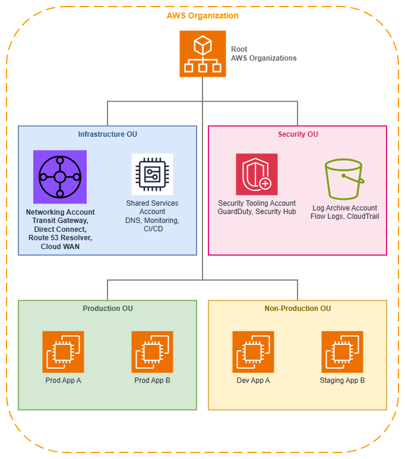

# AWS Organizations and Account Structure

!!! info "Prerequisites"
    This section assumes familiarity with [Before You Start](aws-prerequisites.md). Review that page first if you're new to AWS networking fundamentals.

AWS Organizations enables centralized management and governance of multiple AWS accounts, providing the foundation for scalable, secure network architectures. For networking specifically, Organizations is not optional infrastructure — it is the control plane that determines how network resources are shared, how security boundaries are enforced, and how teams operate independently without creating connectivity chaos.

A well-structured multi-account strategy isolates workloads, simplifies billing, and enables centralized network management. Without Organizations, every cross-account networking pattern (Transit Gateway sharing, centralized DNS, IPAM delegation, resource sharing via RAM) requires manual trust relationships that don't scale and can't be governed consistently.

/// caption
AWS Organizations structure — [Drawio Source](../assets/foundation/organizations-structure.drawio)
///

## Core Concepts

### Organizational Units (OUs)

OUs are logical groupings of accounts that reflect your business structure and governance boundaries. For networking, OUs serve a dual purpose: they organize accounts for human understanding *and* they provide the scope for automated resource sharing, policy enforcement, and attachment acceptance.

**Key capabilities:**

*   :material-file-tree: **Hierarchical structure**

    ---

    OUs can be nested to reflect organizational complexity. Network policies (SCPs, RAM shares, IPAM delegations) can target any level of the hierarchy.

*   :material-share-variant: **RAM sharing scope**

    ---

    Share networking resources (Transit Gateway, IPAM pools, VPC Lattice service networks, Route 53 Resolver rules) with an entire OU rather than individual accounts. New accounts inherit access automatically.

*   :material-tag-check: **Attachment automation**

    ---

    AWS Cloud WAN and Transit Gateway can auto-accept attachments based on the OU membership of the requesting account, removing the networking team as a bottleneck.

*   :material-shield-lock: **Policy inheritance**

    ---

    SCPs applied to an OU cascade to all child accounts and nested OUs, providing consistent governance without per-account configuration.

Common networking-focused OU patterns:

* **Infrastructure OU**: Centralized networking account(s), shared services, DNS
* **Security OU**: Security tooling, log archive, audit accounts
* **Production OU**: Production workload accounts with strict change controls
* **Non-Production OU**: Development, testing, staging accounts with relaxed policies
* **Sandbox OU**: Experimentation accounts with no connectivity to production networks

### Service Control Policies (SCPs)

SCPs define the maximum available permissions across accounts and OUs. They don't grant permissions — they set guardrails that IAM policies cannot exceed. For networking, SCPs are the enforcement mechanism that prevents well-intentioned teams from creating connectivity patterns that violate your architecture.

**Networking-specific SCP patterns:**

* **Prevent unauthorized VPC creation**: Restrict `ec2:CreateVpc` to accounts that should own VPCs, preventing shadow networks
* **Enforce region restrictions**: Limit `ec2:*` actions to approved Regions, preventing network resources in unexpected locations
* **Block public IP assignment**: Deny `ec2:AssociateAddress` and `ec2:RunInstances` with public IP parameters in accounts that should remain private
* **Enforce tagging**: Require specific tags on VPCs, subnets, and Transit Gateway attachments to enable automated Cloud WAN segment assignment
* **Protect shared resources**: Prevent workload accounts from modifying RAM resource shares or detaching from Transit Gateway
* **Don't inadvertently block IPv6**: SCPs that restrict `ec2:*` actions must not block `ec2:AssignIpv6Addresses`, `ec2:AssociateSubnetCidrBlock` (for IPv6), or `ec2:CreateEgressOnlyInternetGateway`. Test SCPs against IPv6 operations explicitly — a common failure is an SCP that works for IPv4 VPC creation but silently blocks the IPv6 CIDR association

### Centralized Networking Account

A dedicated networking account hosts shared connectivity infrastructure. This is the single most important architectural decision for multi-account networking — it establishes a clear ownership boundary between "the network" and "the workloads that use the network."

**What belongs in the networking account:**

* AWS Transit Gateway or AWS Cloud WAN core network
* AWS Direct Connect connections and gateways
* Route 53 Resolver endpoints and forwarding rules
* Centralized NAT gateways or egress VPCs (if using centralized egress)
* Network Firewall inspection VPCs
* IPAM administrator delegation (including IPv6 pool management)
* VPN connections and Customer Gateways

**Cost visibility note:** The networking account concentrates costs that scale with the number of consuming accounts: Transit Gateway per-attachment-hour charges (see [Transit Gateway pricing](https://aws.amazon.com/transit-gateway/pricing/)), Cloud WAN attachment hours, data processing charges per-GB through Transit Gateway or Cloud WAN, and NAT gateway hourly + per-GB charges for centralized egress. Use Organizations consolidated billing with cost allocation tags to attribute these shared costs back to the workload accounts that generate the traffic. Without this attribution, the networking account's bill grows opaquely as the organization scales.

**What does NOT belong in the networking account:**

* Application workloads (EC2, ECS, Lambda)
* Application load balancers
* VPC Lattice services (these belong in the service owner's account)
* Per-application security groups

## Best Practices

### Establish the networking account before any workload accounts

The networking account should be the first account you create after the management account and security accounts. Every subsequent workload account will depend on shared networking resources, and retrofitting centralized networking into an environment where teams have already built their own connectivity is significantly harder than starting centralized.

This matters because teams that create their own Transit Gateways, VPN connections, or Direct Connect gateways before a centralized model exists will resist migration. The cost of rework grows with every account that builds its own connectivity. Establish the pattern early, share resources via RAM from day one, and new accounts inherit connectivity automatically.

### Design OUs around governance boundaries, not org charts

A common mistake is mirroring your company's reporting structure in your OU hierarchy. OUs should reflect *governance and policy boundaries* — groups of accounts that share the same security posture, compliance requirements, and network access patterns.

For networking, this means accounts that need the same level of network access, the same SCP restrictions, and the same RAM resource shares should be in the same OU. A "Platform Engineering" team might have accounts in both the Infrastructure OU (for shared services) and the Production OU (for their production workloads). The OU reflects what policies apply, not who owns the account.

This design principle directly impacts networking because RAM shares, SCP enforcement, and Cloud WAN attachment policies all operate at the OU level. If your OUs don't align with your network governance boundaries, you'll end up with overly broad resource shares or overly complex per-account exceptions.

### Use SCPs to enforce network architecture, not just security

Most organizations think of SCPs as security guardrails. For networking, SCPs are equally important as *architecture enforcement*. They prevent drift from your intended network topology.

**Examples of architecture-enforcing SCPs:**

* Deny `ec2:CreateInternetGateway` in accounts that should use centralized egress — this isn't a security policy, it's an architecture policy that ensures traffic flows through your inspection infrastructure
* Deny `ec2:CreateVpc` with CIDR blocks outside your IPAM-managed ranges — this prevents IP conflicts before they happen
* Require the `network-segment` tag on `ec2:CreateVpc` — this enables automated Cloud WAN attachment acceptance
* Deny `ec2:CreateTransitGateway` in workload accounts — only the networking account should own Transit Gateways

The key insight: SCPs make your network architecture self-enforcing. Teams cannot accidentally (or intentionally) deviate from the intended topology because the API calls that would create deviations are denied at the Organizations level.

### Delegate IPAM administration to the networking account

AWS IPAM supports [delegated administration](https://docs.aws.amazon.com/vpc/latest/ipam/ipam-delegated-admin.html) through Organizations. Delegate IPAM to your networking account so the networking team manages IP address pools, allocation rules, and compliance monitoring without needing access to the management account.

This delegation enables workload accounts to request CIDR allocations from IPAM pools shared via RAM, ensuring non-overlapping address space across your entire organization. Without this, IP conflicts between accounts are inevitable as you scale past a handful of accounts.

### Share resources at the OU level, not the account level

When sharing networking resources via AWS RAM (Transit Gateway, IPAM pools, Route 53 Resolver rules, VPC Lattice service networks), share with OUs rather than individual accounts. This ensures new accounts added to the OU automatically inherit access to shared networking resources without manual intervention.

This is particularly important for Transit Gateway and Cloud WAN attachments. When a new workload account is created in the Production OU, it should immediately be able to create a VPC and attach it to the shared Transit Gateway or Cloud WAN segment. If you share at the account level, there's always a lag between account creation and network connectivity while someone updates the RAM share.

### Separate the management account from networking

The management account (the account that owns the Organization) should not host networking infrastructure. The management account has unique security properties — it cannot be restricted by SCPs and has root-level access to all organizational features. Keep it minimal: Organizations management, billing, and nothing else.

Hosting Transit Gateway or Direct Connect in the management account creates a security risk (the account with the broadest permissions also controls the network) and an operational risk (changes to organizational settings could inadvertently affect network infrastructure).

### Plan your OU structure for network segmentation from day one

Your OU hierarchy directly maps to your network segmentation strategy. If you use AWS Cloud WAN, attachment acceptance policies reference OU membership to determine which segment a VPC joins. If you use Transit Gateway with multiple route tables, RAM shares scoped to OUs determine which accounts can attach to which route table.

Design your OUs so that accounts within the same OU share the same network segment, the same level of inspection, and the same connectivity patterns. This alignment means your network segmentation is self-documenting: looking at the OU structure tells you how traffic flows.

**Anti-pattern to avoid:** Creating a flat OU structure (all workload accounts in a single "Workloads" OU) and then trying to differentiate network access through per-account RAM shares or complex SCP conditions. This approach doesn't scale and makes the relationship between organizational structure and network topology opaque.

### Use tag policies alongside SCPs for network governance

[Tag policies](https://docs.aws.amazon.com/organizations/latest/userguide/orgs_manage_policies_tag-policies.html) complement SCPs by enforcing consistent tag values across your Organization. While SCPs can require that a tag *exists* on a resource, tag policies ensure the tag *values* conform to your standards.

For networking, this is critical because automated systems (Cloud WAN attachment policies, IPAM allocation rules, cost allocation) depend on consistent tag values. If one team tags their VPC with `environment:prod` and another uses `env:production`, your automation breaks silently.

Define tag policies that enforce:

* Allowed values for network segment tags (for example, `network-segment` must be one of `production`, `development`, `shared-services`, `pci`)
* Consistent environment naming across all accounts
* Required cost allocation tags on network resources (NAT gateway, Transit Gateway attachments, VPN connections)

### Implement a network account vending pattern

As your organization scales, manually configuring network connectivity for each new account becomes a bottleneck. Implement an account vending pattern (through AWS Control Tower Account Factory, or a custom solution) that automatically:

1. Creates the account in the correct OU
2. Allocates a CIDR block from the appropriate IPAM pool
3. Creates a VPC with your standard subnet layout
4. Attaches the VPC to Transit Gateway or Cloud WAN
5. Configures Route 53 Resolver rules for DNS resolution
6. Applies baseline security groups and NACLs

This pattern ensures every new account starts with correct, consistent networking from minute one. Teams don't wait for the networking team to provision connectivity, and the networking team doesn't worry about non-standard configurations.

## When to use AWS Organizations

AWS Organizations is the right choice for any environment with more than one AWS account that needs network connectivity between accounts. In practice, this means almost every production AWS deployment.

**Use Organizations when:**

* You have (or plan to have) more than 2-3 AWS accounts
* Workloads in different accounts need to communicate with each other
* You want centralized network infrastructure (Transit Gateway, Direct Connect, DNS)
* You need consistent security policies across accounts
* You want automated resource sharing as new accounts are created
* Compliance requirements mandate centralized governance and audit trails

**A single account may be sufficient when:**

* You're running a proof of concept or personal project
* All workloads can coexist in one account without isolation concerns
* You have no compliance requirements for account-level separation
* You don't need cross-account networking (everything is in one VPC or peered VPCs within one account)

**The transition point**: Once you need a second account that communicates with the first, set up Organizations. The overhead is minimal, and retrofitting Organizations into an existing multi-account environment without it is significantly more work than starting with it.

**Common migration scenario**: If you already have multiple accounts without Organizations, the migration path is straightforward but requires planning. You can invite existing accounts into a new Organization, but existing networking resources (Transit Gateways, VPN connections, Direct Connect) won't automatically move to a centralized model. Plan the migration in phases: establish the Organization and OU structure first, create the centralized networking account second, then gradually migrate shared networking resources and update RAM shares.

## Combining AWS Organizations with other services

Organizations is the governance layer that enables every other multi-account networking service to operate at scale. Without Organizations, each of these services requires manual per-account configuration that doesn't scale.

| Combination | Organizations provides | Other service provides |
| --- | --- | --- |
| **Organizations + AWS RAM** | Sharing scope (OUs and accounts), automatic inheritance for new accounts | Actual resource sharing mechanism for Transit Gateway, IPAM pools, Resolver rules, VPC Lattice service networks |
| **Organizations + AWS Transit Gateway** | SCP enforcement for attachment governance, RAM sharing scope for the Transit Gateway | Regional hub-and-spoke routing between VPCs and hybrid connections |
| **Organizations + AWS Cloud WAN** | OU-based attachment acceptance policies, SCP-enforced tagging for segment assignment | Global policy-driven network management with segmentation |
| **Organizations + Amazon VPC IPAM** | Delegated administration, OU-scoped pool sharing, compliance monitoring across all accounts | IP address planning, allocation, and conflict prevention |
| **Organizations + Route 53 Resolver** | RAM sharing of Resolver rules across OUs, consistent DNS resolution organization-wide | Centralized DNS forwarding between VPCs and on-premises |
| **Organizations + AWS Network Firewall** | SCP enforcement preventing accounts from bypassing centralized inspection | Stateful traffic inspection and filtering |
| **Organizations + Amazon VPC Lattice** | RAM sharing of service networks at OU level, auth policy conditions on `aws:PrincipalOrgID` | Application-layer service-to-service communication |
| **Organizations + AWS Control Tower** | The organizational structure and account factory | Automated landing zone setup with networking guardrails pre-configured |

***Key insight:*** *Organizations is never the service that moves packets. It is the service that determines who can create, share, and connect the services that do. Every networking decision at scale flows through the governance structure Organizations provides.*

## Documentation

*   :material-file-document: **AWS Organizations User Guide**

    ---

    Complete service documentation including OUs, SCPs, delegated administration, and integration with other AWS services.

    [:octicons-arrow-right-24: Documentation](https://docs.aws.amazon.com/organizations/latest/userguide/orgs_introduction.html)

*   :material-book-open-variant: **Organizing Your AWS Environment**

    ---

    AWS whitepaper on multi-account strategy, OU design patterns, and governance best practices.

    [:octicons-arrow-right-24: Whitepaper](https://docs.aws.amazon.com/whitepapers/latest/organizing-your-aws-environment/organizing-your-aws-environment.html)

*   :material-office-building: **Building Landing Zones**

    ---

    Automate account creation by using the Landing Zone Accelerator on AWS.

    [:octicons-arrow-right-24: Guide](https://docs.aws.amazon.com/prescriptive-guidance/latest/patterns/automate-account-creation-lza.html)

*   :material-share-variant: **AWS Resource Access Manager**

    ---

    Documentation for sharing networking resources across accounts and OUs within your Organization.

    [:octicons-arrow-right-24: Documentation](https://docs.aws.amazon.com/ram/latest/userguide/what-is.html)

*   :material-shield-check: **Service Control Policies**

    ---

    SCP syntax, examples, inheritance behavior, and best practices for policy design.

    [:octicons-arrow-right-24: Documentation](https://docs.aws.amazon.com/organizations/latest/userguide/orgs_manage_policies_scps.html)

*   :material-network: **Multi-VPC Network Infrastructure**

    ---

    AWS whitepaper on building scalable and secure multi-VPC architectures with centralized networking patterns.

    [:octicons-arrow-right-24: Whitepaper](https://docs.aws.amazon.com/whitepapers/latest/building-scalable-secure-multi-vpc-network-infrastructure/welcome.html)

## How Organizations relates to the rest of the Foundation

AWS Organizations is the governance layer that sits above all other foundation components. Your [VPC](vpc.md) design, [CIDR planning](cidr.md), [subnet strategy](subnets.md), and [IPAM configuration](ipam.md) all operate within the structure that Organizations defines.

**Relationship to other Foundation topics:**

* **[Amazon VPC](vpc.md)**: Organizations determines which accounts can create VPCs and what CIDR ranges they can use (via SCPs and IPAM delegation)
* **[CIDR Planning](cidr.md)**: IPAM pools shared through Organizations ensure non-overlapping address space across all accounts
* **[Subnets](subnets.md)**: SCPs can enforce subnet tagging and restrict subnet creation to approved Availability Zones
* **[IPAM](ipam.md)**: Delegated IPAM administration through Organizations enables centralized IP governance
* **[Regions and Availability Zones](regions-azs.md)**: SCPs restrict which Regions accounts can deploy resources in, directly shaping your network's geographic footprint

**Relationship to Connectivity:**

* **[Connectivity Within AWS](../connectivity/within-aws.md)**: Transit Gateway and Cloud WAN rely on Organizations for RAM sharing and attachment governance
* **[Hybrid & Multi-Cloud](../connectivity/hybrid-multicloud.md)**: Direct Connect and VPN resources in the centralized networking account are shared via RAM to the Organization
* **[Internet Connectivity](../connectivity/internet.md)**: Centralized egress patterns depend on Organizations to enforce traffic flow through inspection infrastructure
