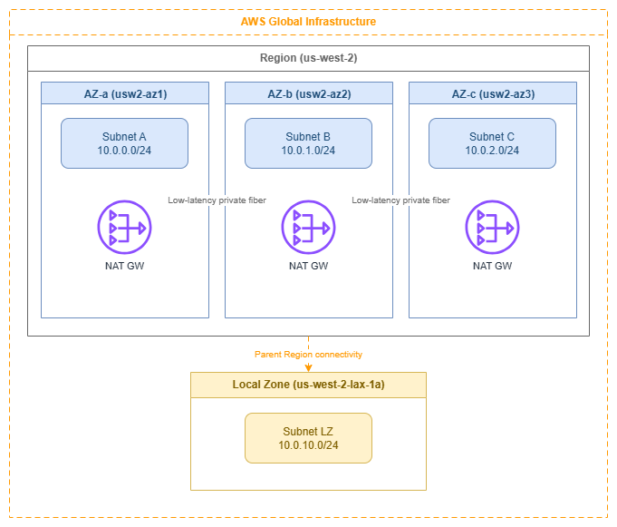

# Regions and Availability Zones

!!! info "Prerequisites"
    This page assumes familiarity with the concepts covered in [Before You Start](aws-prerequisites.md). Review that page first if you're new to AWS networking fundamentals.

AWS infrastructure is organized into Regions and Availability Zones (Availability Zones). Every networking decision you make — subnet layout, NAT gateway placement, load balancer deployment, Direct Connect termination — is shaped by how Regions and Availability Zones work. This page covers the infrastructure context that drives those decisions: what Regions and Availability Zones are, how they affect network design, and the patterns that produce resilient, cost-efficient architectures.

The most common networking mistakes aren't service misconfigurations — they're failures to account for how Region and Availability Zone choices cascade into subnet sizing, traffic cost, and blast radius. Understanding this layer deeply prevents those mistakes.

/// caption
Regions and Availability Zones — [Drawio Source](../assets/foundation/regions-azs-layout.drawio)
///

## AWS Regions

An AWS Region is a cluster of data centers in a specific geographic area, operating as a fully independent instance of the AWS platform. Each Region has its own control plane, its own API endpoints, and its own set of services. Data never leaves a Region unless you explicitly configure replication or transfer.

From a networking perspective, a Region is the blast radius boundary for most infrastructure failures and the unit of deployment for services like Transit Gateway, NAT gateway, and VPC endpoints. Multi-Region architectures exist, but they require explicit cross-Region connectivity (VPC peering, Transit Gateway peering, or CloudFront/Global Accelerator at the edge).

***Key insight:*** *Region selection is a networking decision, not just a latency or compliance decision. Your choice of Region determines which Direct Connect locations are available, which services you can use, and what your cross-Region traffic costs look like.*

### Region selection criteria for networking

| Criterion | Why it matters for networking | How to evaluate |
| --- | --- | --- |
| **Latency to users** | Determines whether you need edge services (CloudFront, Global Accelerator) or can serve directly from the Region. | Measure from your user populations; don't assume geographic proximity equals low latency. |
| **Direct Connect locations** | Not all Regions have the same Direct Connect partner ecosystem. A Region without a nearby DX location means higher latency for hybrid connectivity. | Check the [AWS Direct Connect locations page](https://aws.amazon.com/directconnect/locations/) before committing to a Region for hybrid workloads. |
| **Service availability** | Newer networking services (VPC Lattice, Cloud WAN, IPv6-only subnets) launch in major Regions first. Choosing a smaller Region may limit your architecture options. | Verify that every service in your design is available in the target Region before deployment. |
| **IPv6 service readiness** | Not all networking features support IPv6 equally across Regions. IPv6-only subnets, dual-stack VPC Lattice, and IPv6 Transit Gateway routing launched in major Regions first. | Confirm IPv6 support for each service in your target Region. A dual-stack architecture in a Region with partial IPv6 support creates operational inconsistency. |
| **Cross-Region data transfer cost** | Inter-Region traffic is significantly more expensive than intra-Region traffic. Multi-Region designs must account for replication and API call costs. | Model your expected cross-Region traffic volume and price it explicitly in the architecture review. |
| **Compliance and data residency** | Some regulations require data to stay within specific geographic boundaries, which constrains Region choice regardless of other factors. | Identify regulatory constraints first; they override all other criteria. |

## Availability Zones

An Availability Zone is one or more discrete data centers within a Region, each with redundant power, networking, and connectivity. Availability Zones within a Region are connected by low-latency, high-throughput private fiber (typically sub-2ms round-trip), but are physically separated enough that a localized failure (power grid, flood, fire) affects only one Availability Zone.

Every Region has at least three Availability Zones. This is the minimum needed for quorum-based systems and for maintaining availability during a single-AZ failure while still having capacity headroom.

***Key insight:*** *Availability Zones are the unit of fault isolation within a Region. Every networking resource you deploy — subnets, NAT gateways, load balancer nodes, interface endpoints — exists in exactly one Availability Zone. Your multi-AZ strategy is really a subnet-per-AZ strategy, and getting it wrong means either paying for unused capacity or losing availability when you need it most.*

### Availability Zone IDs vs Availability Zone names

This is the single most misunderstood aspect of Availability Zone architecture, and it causes real problems in cross-account networking:

* **AZ names** (like `us-east-1a`) are mapped randomly per AWS account. Your `us-east-1a` and another account's `us-east-1a` may be different physical locations.
* **AZ IDs** (like `use1-az1`) are consistent across all accounts and map to the same physical infrastructure.

| Scenario | Use Availability Zone name or Availability Zone ID? |
| --- | --- |
| Single-account deployments, CloudFormation templates | Availability Zone name is fine |
| Cross-account shared subnets (AWS RAM) | **AZ ID required** |
| Cross-account Transit Gateway or VPC peering traffic analysis | **AZ ID required** |
| Coordinating placement with a partner or customer account | **AZ ID required** |
| Analyzing cross-AZ data transfer charges across accounts | **AZ ID required** |

When you share subnets through AWS Resource Access Manager, the shared subnet's Availability Zone is identified by Availability Zone ID. If you're building cross-account architectures — shared VPCs, centralized egress, or Transit Gateway attachments — always think in Availability Zone IDs, not Availability Zone names.

## Best Practices

### Multi-AZ design patterns for networking

#### Deploy every stateful networking resource per-AZ

NAT gateways, interface VPC endpoints, and load balancer nodes are AZ-scoped. If you deploy a single NAT gateway in one Availability Zone and route all private subnets through it, you've created a single point of failure and you're paying cross-AZ data transfer charges on every packet from the other Availability Zones.

The correct pattern:

* **One NAT gateway per Availability Zone** in each public subnet tier. Route tables for private subnets in each Availability Zone point to the NAT gateway in the same Availability Zone.
* **Interface VPC endpoints in every Availability Zone** where you have workloads that use the endpoint. A missing endpoint in one Availability Zone means traffic from that Availability Zone crosses to another Availability Zone to reach the endpoint — adding latency and cost.
* **Load balancers enabled in all Availability Zones** where targets exist. An ALB or NLB with a missing Availability Zone creates asymmetric routing and uneven target utilization.

***Key insight:*** *The "per-AZ" pattern costs more in fixed resources (three NAT gateways instead of one), but it eliminates cross-AZ data transfer charges, removes single-AZ failure modes, and keeps blast radius contained. For any production workload, the per-AZ pattern is correct.*

#### Size for N-1 Availability Zone capacity

Design your per-AZ capacity so that losing one Availability Zone doesn't overwhelm the remaining Availability Zones. In a three-AZ deployment, each Availability Zone should handle 50% of peak load (not 33%), so that two Availability Zones can absorb the full workload during a failure.

This applies to:

* Auto Scaling group minimum and desired counts per Availability Zone
* NAT gateway throughput headroom (each NAT GW handles 100 Gbps, but your per-AZ egress patterns matter)
* Subnet IP address capacity (if one Availability Zone fails and workloads relaunch in the remaining two, those subnets need the IP headroom)

#### Use zonal shift for fast Availability Zone evacuation

Amazon Application Recovery Controller's zonal shift removes an impaired Availability Zone from load balancer DNS in seconds, without touching health checks or routing rules. Configure zonal autoshift for automatic activation when AWS detects an Availability Zone impairment. This is the fastest path to Availability Zone evacuation — faster than health check failures, faster than manual intervention.

### Cross-AZ traffic cost management

#### Understand the cost model

Cross-AZ data transfer within a Region is charged per-GB in each direction (doubled for round-trip) in most Regions — see [VPC pricing](https://aws.amazon.com/vpc/pricing/) for current rates. This applies to both IPv4 and IPv6 traffic — dual-stack does not change the cross-AZ cost model. The per-GB charge sounds small, but at scale it dominates networking costs:

* A service making 10,000 requests/second with 1 KB payloads across Availability Zones generates ~1.7 TB/month of cross-AZ traffic — costs compound significantly at scale for that single service pair.
* A chatty microservices architecture with dozens of service-to-service calls can easily generate hundreds of TB/month in cross-AZ traffic.

#### Minimize cross-AZ traffic without sacrificing availability

The goal is not to eliminate cross-AZ traffic (that would mean single-AZ deployment, which is unacceptable for production). The goal is to keep *unnecessary* cross-AZ traffic out of the data path:

* **Use AZ-aware service discovery** (Cloud Map with health checks, or VPC Lattice's built-in Availability Zone affinity) so that services prefer same-AZ targets when healthy targets exist locally.
* **Disable cross-zone load balancing on NLB** when client distribution is roughly uniform across Availability Zones. This keeps traffic zonal by default. ALB has cross-zone on by default and that's usually correct for ALB (because ALB's value is L7 routing, not zonal affinity).
* **Place caches (ElastiCache, DAX) in every Availability Zone** where application instances run. A cache miss that crosses Availability Zones defeats the purpose of caching.
* **Use VPC Flow Logs with Availability Zone metadata** to identify the largest cross-AZ traffic flows and target them for optimization.

***Key insight:*** *Cross-AZ cost optimization is a traffic engineering problem, not a deployment problem. You still deploy in multiple Availability Zones for availability — you just route traffic to prefer same-AZ paths when possible.*

### Availability Zone choices cascade into subnet design

#### One subnet per Availability Zone per tier

The foundational subnet pattern is one subnet per Availability Zone per network tier (public, private, data, etc.). This isn't optional — it's how AWS networking works:

* A subnet exists in exactly one Availability Zone
* A route table associates with subnets, not Availability Zones
* Resources launched in a subnet are placed in that subnet's AZ

For a three-AZ, three-tier VPC, you need nine subnets minimum. Plan your CIDR allocation accordingly — see [CIDR Planning](cidr.md) and [Subnets](subnets.md) for sizing guidance.

#### Subnet sizing must account for Availability Zone failure scenarios

If you size each Availability Zone's subnets for exactly the current workload, you have no headroom for Availability Zone failure recovery. When an Availability Zone fails and Auto Scaling launches replacement capacity in the remaining Availability Zones, those subnets need available IP addresses. Size subnets for 2x the steady-state requirement in each Availability Zone, or use larger CIDR blocks with secondary CIDR ranges as overflow.

### NAT gateway placement follows Availability Zone boundaries

#### One NAT gateway per Availability Zone is the production pattern

A NAT gateway is an AZ-scoped resource. Deploying one per Availability Zone and routing each Availability Zone's private subnets to its local NAT gateway achieves:

* **Fault isolation**: An Availability Zone failure takes out only that Availability Zone's NAT gateway, not egress for the entire VPC.
* **No cross-AZ charges**: Traffic from a private subnet to the internet stays within the same Availability Zone until it hits the NAT gateway, then exits through the internet gateway (which is Region-scoped and free of cross-AZ charges).
* **Predictable throughput**: Each NAT gateway handles up to 100 Gbps independently.

The single-NAT-Gateway pattern (one NAT GW, all Availability Zones route to it) is acceptable only for development and test environments where cost matters more than availability.

### Load balancer deployment and Availability Zone awareness

#### Enable all Availability Zones where targets exist

When you create an ALB or NLB, you select which Availability Zones it operates in. The load balancer places a node in each selected Availability Zone. If you have targets in three Availability Zones but only enable two Availability Zones on the load balancer, targets in the third Availability Zone are unreachable.

#### Understand cross-zone load balancing implications

| Load balancer | Cross-zone default | Cost implication |
| --- | --- | --- |
| ALB | **On** | No additional cross-AZ charge for ALB-to-target traffic |
| NLB | **Off** | Cross-zone NLB-to-target traffic incurs standard cross-AZ data transfer charges when enabled |
| GWLB | **Off** | Cross-zone GWLB-to-appliance traffic incurs standard cross-AZ data transfer charges when enabled |

ALB's cross-zone-on default is correct for most workloads because ALB's value is L7 routing and even distribution. NLB's cross-zone-off default is correct for workloads that benefit from zonal affinity and want to avoid cross-AZ charges — but it requires that targets are evenly distributed across Availability Zones.

## Local Zones and Wavelength Zones

### Local Zones

AWS Local Zones are extensions of a parent Region that place compute, storage, and select networking services closer to end users. From a networking perspective:

* A Local Zone subnet is part of the parent Region's VPC but exists in the Local Zone's physical location.
* **Internet egress from a Local Zone uses the Local Zone's own internet gateway** — traffic doesn't backhaul to the parent Region for internet access.
* **Traffic between a Local Zone and the parent Region traverses the AWS backbone**, not the public internet, but it does incur data transfer charges similar to cross-AZ traffic.
* **Not all networking services are available in Local Zones**. NAT gateway, Transit Gateway attachments, and VPC endpoints may not be available — check the [Local Zones features page](https://aws.amazon.com/about-aws/global-infrastructure/localzones/features/) for your specific Local Zone.
* **Subnet design**: Create dedicated subnets in the Local Zone within your existing VPC. Route tables for Local Zone subnets are independent of the parent Region's Availability Zone route tables.

***Key insight:*** *Local Zones are for latency-sensitive workloads that need single-digit millisecond access from a specific metro area. They are not a replacement for multi-AZ deployment in the parent Region — they complement it by placing a latency-sensitive tier closer to users while the rest of the architecture stays in the parent Region.*

### Wavelength Zones

AWS Wavelength embeds compute and storage within telecommunications providers' 5G networks. From a networking perspective:

* Wavelength Zones have their own carrier gateway for traffic to/from the carrier network — this traffic never touches the public internet.
* Traffic between a Wavelength Zone and the parent Region uses the AWS backbone.
* The networking service set is limited: no NAT gateway, no VPC endpoints, no Transit Gateway attachments within the Wavelength Zone itself.
* Use Wavelength for ultra-low-latency mobile/edge workloads where the 5G network hop to a Region Availability Zone would add unacceptable latency.

## Documentation

*   :material-earth: **AWS Global Infrastructure**

    ---

    Interactive map of all AWS Regions, Availability Zones, Local Zones, and Wavelength Zones with service availability details.

    [:octicons-arrow-right-24: Global Infrastructure](https://aws.amazon.com/about-aws/global-infrastructure/)

*   :material-map-marker-multiple: **Regions and Availability Zones**

    ---

    EC2 documentation covering Region and Availability Zone concepts, Availability Zone IDs, and how to work with them programmatically.

    [:octicons-arrow-right-24: Documentation](https://docs.aws.amazon.com/AWSEC2/latest/UserGuide/using-regions-availability-zones.html)

*   :material-identifier: **AZ IDs for cross-account coordination**

    ---

    AWS RAM documentation explaining Availability Zone ID mapping and how to use Availability Zone IDs for consistent cross-account resource placement.

    [:octicons-arrow-right-24: Availability Zone IDs](https://docs.aws.amazon.com/ram/latest/userguide/working-with-az-ids.html)

*   :material-map-marker-radius: **Local Zones features**

    ---

    Service availability matrix for each Local Zone, including networking services, instance types, and storage options.

    [:octicons-arrow-right-24: Local Zones](https://aws.amazon.com/about-aws/global-infrastructure/localzones/features/)

*   :material-access-point-network: **Direct Connect locations**

    ---

    Complete list of Direct Connect locations by Region, essential for evaluating hybrid connectivity options during Region selection.

    [:octicons-arrow-right-24: DX Locations](https://aws.amazon.com/directconnect/locations/)

*   :material-cellphone-wireless: **Wavelength Zones**

    ---

    Documentation on Wavelength Zone networking, carrier gateways, and integration with parent Region VPCs.

    [:octicons-arrow-right-24: Wavelength](https://docs.aws.amazon.com/wavelength/latest/developerguide/what-is-wavelength.html)

---

## Related Foundation Pages

This page provides the infrastructure context for Region and Availability Zone decisions. The pages below cover how those decisions manifest in specific resource configurations:

* **[VPC](vpc.md)** — VPC design patterns that build on multi-AZ architecture
* **[Subnets](subnets.md)** — Subnet-per-AZ-per-tier patterns and sizing guidance
* **[CIDR Planning](cidr.md)** — IP address allocation that accounts for multi-AZ and AZ-failure headroom
* **[IPAM](ipam.md)** — Centralized IP address management across Regions and accounts
* **[AWS Organizations](organizations.md)** — Account structure that interacts with Availability Zone ID mapping and shared subnets
