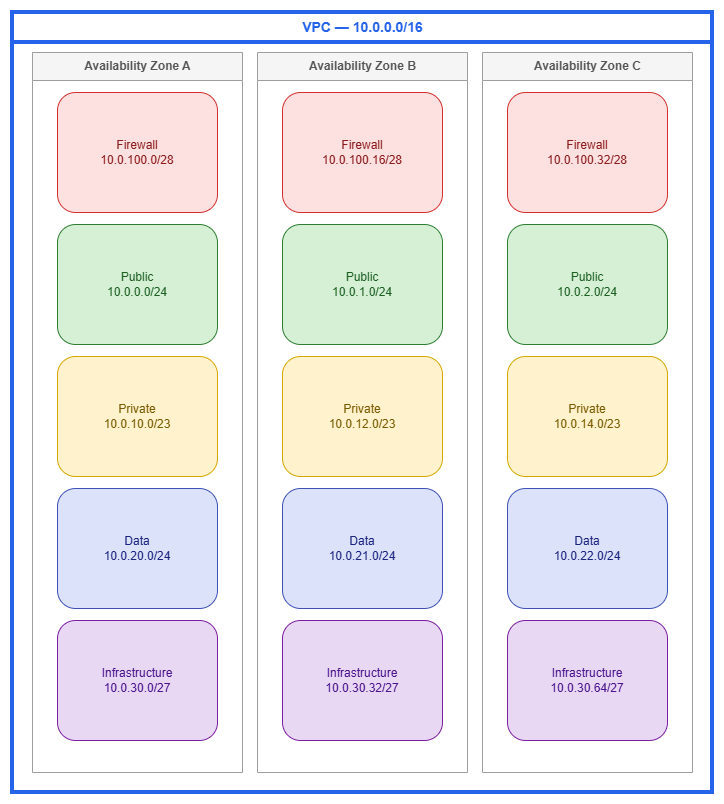

# Subnets

!!! info "Prerequisites"
    This section assumes familiarity with [Before You Start](aws-prerequisites.md), [Amazon VPC](vpc.md), [Regions and Availability Zones](regions-azs.md), and [CIDR Planning](cidr.md). Review those pages first if you're new to AWS networking fundamentals.

Subnets are where routing policy meets IP addressing. Every resource you launch in AWS — EC2 instances, ECS tasks, EKS pods, Lambda functions, RDS databases, load balancers, firewall endpoints — lands in a subnet, and that subnet's route table determines what the resource can reach. The subnet is not a security boundary in itself; it is a routing domain. Two subnets in the same VPC with identical NACLs and security groups behave identically until you attach different route tables to them. Understanding this distinction — that "public" and "private" are properties of the route table, not the subnet — is the single most important mental model for subnet design.

A well-designed subnet architecture gives you isolation between tiers, predictable IP consumption, room for growth, and clean integration with every connectivity and security service AWS offers. A poorly designed one creates IP exhaustion emergencies, forces workload migrations, and makes firewall and routing policies unnecessarily complex.

/// caption
Five-tier subnet architecture — [Drawio Source](../assets/foundation/subnet-tiers.drawio)
///

## Subnet tier design patterns

The classic "public/private/data" three-tier model is a starting point, not a ceiling. Production networks that run firewalls, Transit Gateway, VPC endpoints, or container workloads benefit from additional tiers that isolate infrastructure concerns from application workloads.

***Key insight:*** Each tier is defined by its route table and the class of resources it hosts — not by a label. A "public" subnet is simply one whose route table has a `0.0.0.0/0` route pointing at an internet gateway. A "private" subnet routes outbound traffic through a NAT gateway or has no internet route at all. The subnet resource itself is identical in both cases.

### Five-tier reference architecture

| Tier | Purpose | Typical CIDR | Route table pattern |
| --- | --- | --- | --- |
| **Firewall** | AWS Network Firewall endpoints, GWLB endpoints | `/28` per Availability Zone | Routes from IGW and other tiers for inspection |
| **Public** | ALBs, NLBs, NAT gateways, bastion hosts | `/24` per Availability Zone | `0.0.0.0/0` → internet gateway (or firewall endpoint) |
| **Private (application)** | EC2, ECS tasks, EKS pods, Lambda ENIs | `/23` or `/22` per Availability Zone | `0.0.0.0/0` → NAT gateway (or no internet route) |
| **Data** | RDS, ElastiCache, OpenSearch, Redshift | `/24` per Availability Zone | No internet route; only VPC-local and on-premises routes |
| **Infrastructure / Transit** | TGW ENIs, VPC endpoint ENIs, Direct Connect VIF attachments | `/27` or `/28` per Availability Zone | Service-specific routes only |

Not every VPC needs all five tiers. A simple workload VPC might use only public and private. A shared-services VPC might add infrastructure subnets for VPC endpoints. An inspection VPC needs the firewall tier. Design for what you deploy today and leave CIDR room for tiers you might add later.

## Best Practices

### Subnet sizing

#### Size for the workload, not for convention

The advice "just use /24 everywhere" is simple but wasteful for some tiers and dangerously small for others. Size each tier based on what actually consumes IPs in that subnet.

AWS reserves 5 addresses in every subnet (network, router, DNS, future use, broadcast). Beyond that, the real sizing drivers are:

| Resource type | IP consumption pattern |
| --- | --- |
| EC2 instances | 1 primary IP per instance + additional ENIs for multi-homed workloads |
| ECS tasks (awsvpc) | 1 ENI per task = 1 IP per running task |
| EKS pods (VPC CNI) | 1 IP per pod by default; with prefix delegation, 1 `/28` prefix per slot |
| Lambda (VPC-connected) | 1 ENI per unique security-group + subnet combination (shared across invocations via Hyperplane) |
| NAT gateway | 1 IP per gateway |
| Network Firewall endpoint | 1 IP per Availability Zone endpoint |
| VPC endpoint (interface) | 1 ENI per Availability Zone per endpoint |
| Transit Gateway attachment | 1 ENI per Availability Zone |

***Key insight:*** EKS with the VPC CNI plugin is the most aggressive IP consumer in AWS. A single `m5.xlarge` node can host 58 pods, each consuming an IP from the subnet. A 20-node cluster in one Availability Zone can consume 1,160 IPs — more than four `/24` subnets. If you run EKS, size private subnets at `/21` or `/20` per Availability Zone, or enable prefix delegation to reduce consumption to one `/28` per ENI slot.

#### Sizing recommendations by tier

| Tier | Recommended size | Rationale |
| --- | --- | --- |
| Firewall | `/28` (11 usable) | Network Firewall creates one endpoint per Availability Zone; you rarely need more than a handful of IPs |
| Public | `/24` (251 usable) | ALBs scale horizontally and consume IPs; NAT gateways need room; `/24` gives comfortable headroom |
| Private (non-container) | `/24` (251 usable) | Standard EC2 and Lambda workloads fit comfortably |
| Private (EKS/ECS) | `/22` to `/20` (1,019–4,091 usable) | Container workloads consume IPs aggressively; under-sizing here causes pod scheduling failures |
| Data | `/24` (251 usable) | Database instances are few but long-lived; `/24` is generous and simple |
| Infrastructure | `/27` or `/28` (27 or 11 usable) | TGW and VPC endpoint ENIs are predictable and few |

#### Use secondary CIDRs rather than over-allocating upfront

If a subnet tier grows beyond its initial allocation, you cannot resize the subnet — you must create a new, larger subnet and migrate resources. To avoid this, use the VPC's ability to add secondary CIDR blocks. This lets you create additional subnets in the same tier from a different CIDR range without disrupting existing workloads.

### Route table design

#### One route table per tier, not one per subnet

The most common route table pattern is one shared route table per tier, associated with all subnets in that tier across all Availability Zones. This keeps routing policy consistent within a tier and reduces the number of route tables to manage.

| Pattern | When to use |
| --- | --- |
| **One route table per tier** | Default. All public subnets share one route table; all private subnets share another. Simple, consistent, easy to audit. |
| **One route table per Availability Zone per tier** | When each Availability Zone has its own NAT gateway and you want AZ-local egress (the `0.0.0.0/0` route points to the NAT gateway in the same Availability Zone). This is the standard HA pattern for private subnets. |
| **One route table per subnet** | Rare. Use only when individual subnets need unique routing (for example, a specific subnet routes to a firewall endpoint while its peers route directly). Adds operational complexity. |

***Key insight:*** For private subnets with NAT gateways, you need one route table per Availability Zone (not per tier) because each Availability Zone's route table points `0.0.0.0/0` at the NAT gateway in that same Availability Zone. This keeps egress traffic AZ-local, avoids cross-AZ data transfer charges, and ensures that a NAT gateway failure only affects its own Availability Zone.

### Infrastructure subnet tier

#### Dedicate subnets for network service ENIs

Transit Gateway attachments, VPC interface endpoints, Network Firewall endpoints, and Direct Connect virtual interface attachments all place ENIs in your subnets. Mixing these with application workloads creates problems:

* **IP accounting becomes unpredictable.** A new VPC endpoint consumes IPs from the same pool your application uses.
* **Route table conflicts.** Infrastructure ENIs often need different routing than application workloads in the same tier.
* **Security group sprawl.** Infrastructure ENIs have different access patterns than application resources.

Dedicated infrastructure subnets (small — `/27` or `/28`) solve all three. They have their own route tables, their own NACLs if needed, and their IP consumption is isolated and predictable.

***Key insight:*** Transit Gateway attachments create one ENI per Availability Zone in the subnets you specify. If you put TGW ENIs in your application subnets, the TGW's route table entries and the subnet's route table interact in ways that are hard to reason about. A dedicated `/28` infrastructure subnet per Availability Zone costs almost nothing in address space and eliminates an entire class of routing confusion.

### Network ACLs

#### Default to open NACLs; add rules only for specific compliance requirements

NACLs are stateless, operate at the subnet level, and apply to all traffic entering or leaving the subnet regardless of security groups. They are a blunt instrument compared to security groups, which are stateful and instance-level.

**When NACLs add value:**

* Compliance frameworks (PCI-DSS, HIPAA) that require network-level deny rules independent of instance-level controls
* Blocking entire CIDR ranges at the subnet boundary (for example, denying traffic from a known-bad range before it reaches any security group)
* Defense-in-depth for data-tier subnets where you want an explicit allowlist of source CIDRs regardless of what security groups permit

**When NACLs add complexity without value:**

* Duplicating security group rules at the subnet level "just in case" — this doubles your maintenance burden and creates drift
* Environments where all access control is already handled by security groups, IAM policies, and service-level auth
* Workloads with dynamic port ranges (ephemeral ports for return traffic) where stateless rules require broad port ranges that negate the security benefit

***Key insight:*** The default VPC NACL allows all inbound and outbound traffic. Leave it that way unless you have a specific, documented reason to restrict at the subnet level. Security groups are your primary network access control; NACLs are your secondary, compliance-driven layer.

### Subnet CIDR reservations

#### Reserve address ranges for specific resource types

[Subnet CIDR reservations](https://docs.aws.amazon.com/vpc/latest/userguide/subnet-cidr-reservation.html) let you set aside a portion of a subnet's address space for a specific resource type (prefix delegation, explicit allocation) so that other resources cannot consume those IPs.

**Use CIDR reservations when:**

* Running EKS with prefix delegation — reserve a range for `/28` prefixes so that pod IPs come from a predictable block
* You need stable IP ranges for specific workloads (for example, a block of IPs that on-premises firewalls allowlist)
* Preventing IP conflicts between auto-assigned resources and manually assigned ENIs

**Skip CIDR reservations when:**

* The subnet hosts a single workload type (no contention for address space)
* You're using IPAM pools with allocation rules that already govern assignment

### IPv6 subnet addressing

#### Every IPv6 subnet is a /64 — plan accordingly

Unlike IPv4, where you choose subnet sizes from `/28` to `/16`, IPv6 subnets in AWS are always `/64`. This is not a limitation — it's the standard. A `/64` provides 2^64 addresses per subnet, which is effectively unlimited. The VPC receives a `/56` from Amazon or your own BYOIP pool, giving you 256 possible `/64` subnets.

Design implications:

* **No variable sizing.** You cannot create a "small" IPv6 subnet. Every subnet gets the same `/64` regardless of tier.
* **Subnet count is the constraint, not size.** With 256 `/64`s available from a single `/56`, plan your tier and Availability Zone layout to fit within that budget.
* **Dual-stack subnets carry both an IPv4 CIDR and an IPv6 /64.** Size the IPv4 CIDR for the workload; the IPv6 side takes care of itself.
* **IPv6-only subnets** eliminate IPv4 entirely. Use these for workloads that don't need IPv4 connectivity (internal microservices, batch processing) to simplify addressing and avoid IPv4 exhaustion.

***Key insight:*** The `/56` per VPC gives you 256 subnets. If you run 3 Availability Zones × 5 tiers = 15 subnets, you've used 15 of 256 — plenty of room. But if you're building a shared VPC with dozens of workload-specific subnets, track your `/64` allocation to avoid running out.

### Container and serverless workload considerations

#### EKS: plan for aggressive IP consumption

The Amazon VPC CNI plugin assigns a VPC IP address to every pod by default. On a `m5.xlarge` (4 ENIs × 15 IPs per ENI = 58 max pods), a fully packed node consumes 58 subnet IPs. Strategies to manage this:

* **Enable prefix delegation**: each ENI slot gets a `/28` prefix (16 IPs) instead of individual IPs, increasing pod density per node without consuming more ENI slots. This changes the consumption pattern from "1 IP per pod" to "1 /28 per slot, shared across pods."
* **Use custom networking**: assign pod IPs from a different subnet (or CIDR range) than the node's primary ENI. This lets you size node subnets conservatively while giving pods access to a much larger address pool.
* **Consider IPv6-only clusters**: pods get IPv6 addresses from the `/64` subnet (effectively unlimited) and use NAT64 for IPv4-only destinations.

The worst-case scenario is an EKS cluster that auto-scales aggressively without prefix delegation in a `/24` subnet. A burst from 5 to 30 nodes can exhaust the subnet in minutes, causing pod scheduling failures that look like cluster issues but are actually subnet IP exhaustion. Monitor the `available IPs` CloudWatch metric on your subnets and alert well before exhaustion.

#### ECS with awsvpc mode: one ENI per task

Every ECS task in `awsvpc` network mode gets its own ENI with a VPC IP. For high-density services (hundreds of tasks per Availability Zone), size subnets accordingly. Unlike EKS, there's no prefix delegation equivalent for ECS — each task is one IP, period.

For ECS services that scale to hundreds of tasks, calculate peak task count per Availability Zone and add 20% headroom. A service running 200 tasks across 3 Availability Zones needs approximately 67 IPs per Availability Zone at steady state, but during deployments (rolling update with 200% max), you temporarily need double that. A `/24` handles this comfortably; a `/26` does not.

#### Lambda in VPC: Hyperplane ENI sharing

VPC-connected Lambda functions use Hyperplane ENIs that are shared across invocations with the same security group and subnet combination. You don't need one IP per concurrent invocation. However, each unique (subnet, security group) pair creates at least one ENI. If you have many Lambda functions with different security groups in the same subnet, ENI consumption can add up.

***Key insight:*** The common fear that "Lambda in VPC will exhaust my subnet" is outdated. Since the Hyperplane ENI model (2019), Lambda shares ENIs across invocations. The real consumption driver is the number of unique (subnet, security group) combinations, not concurrency. Consolidate Lambda functions onto shared security groups where access patterns allow it.

### Naming and tagging

#### Use a consistent naming convention that encodes tier, Availability Zone, and purpose

Subnet names should be immediately parseable by both humans and automation. A pattern like `{env}-{tier}-{az}` (for example, `prod-private-use1a`, `prod-infra-use1b`) lets you filter subnets in the console, write IAM policies with conditions on tags, and build IaC modules that select subnets by convention.

Tag subnets with at minimum:

* `Environment` (prod, staging, dev)
* `Tier` (public, private, data, infrastructure, firewall)
* `Network` or `VPC` (identifies which VPC in multi-VPC accounts)
* For EKS: `kubernetes.io/role/elb` and `kubernetes.io/role/internal-elb` tags on the appropriate subnets so the AWS Load Balancer Controller can auto-discover them

### Shared subnets (VPC sharing via RAM)

#### Share subnets across accounts to centralize network management

[VPC sharing](https://docs.aws.amazon.com/vpc/latest/userguide/vpc-sharing.html) through AWS Resource Access Manager lets a central networking account own the VPC and subnets while participant accounts launch resources into shared subnets. This pattern centralizes IP management, route table control, and subnet lifecycle while giving application teams the autonomy to deploy workloads.

Design considerations for shared subnets:

* **The owner account controls routing, NACLs, and subnet lifecycle.** Participant accounts cannot modify route tables or NACLs on shared subnets.
* **Security groups are per-account.** Each participant account manages its own security groups within the shared subnet. Cross-account security group references are not supported.
* **Subnet sizing must account for all participants.** When multiple accounts share a subnet, aggregate their IP consumption. A `/24` that's comfortable for one account may be tight when three accounts deploy into it.
* **Use separate subnets per tier, not per account.** The value of VPC sharing is that accounts share infrastructure — don't recreate per-account isolation at the subnet level unless compliance requires it.

***Key insight:*** VPC sharing is the most operationally efficient pattern for organizations that want centralized network control. The networking team manages the VPC, subnets, route tables, and connectivity; application teams deploy resources without needing networking expertise. The trade-off is that the networking team must size subnets for aggregate demand across all participant accounts.

## Combining subnets with other services

Subnet design doesn't exist in isolation. Every connectivity and security service in AWS interacts with your subnet architecture. The table below maps how subnets integrate with the services you'll combine them with.

| Combination | Subnet role | Design consideration |
| --- | --- | --- |
| **Subnets + NAT gateway** | Public subnet hosts the NAT gateway; private subnets route `0.0.0.0/0` through it | Deploy one NAT gateway per Availability Zone in the public tier. Each private subnet's route table points to its AZ-local NAT gateway. Size public subnets to accommodate NAT gateway IPs alongside ALBs. |
| **Subnets + Transit Gateway** | Infrastructure subnet hosts TGW ENIs (one per Availability Zone) | Use dedicated `/28` infrastructure subnets. TGW ENIs need their own route table that doesn't conflict with application routing. Appliance mode routes return traffic through the same Availability Zone's ENI. |
| **Subnets + Network Firewall** | Firewall subnet hosts firewall endpoints; other subnets route through them | Dedicated `/28` firewall subnets per Availability Zone. The firewall subnet's route table points to the IGW; the IGW's edge route table points return traffic to the firewall endpoint. |
| **Subnets + VPC Endpoints** | Infrastructure subnet hosts interface endpoint ENIs | Interface endpoints create one ENI per Availability Zone per endpoint. Dedicated infrastructure subnets keep endpoint ENIs isolated from application IP pools. Gateway endpoints (S3, DynamoDB) don't consume subnet IPs — they're route table entries. |
| **Subnets + Load Balancers** | Public subnets for internet-facing ALBs/NLBs; private subnets for internal load balancers | ALBs require at least `/27` subnets with 8 free IPs per Availability Zone. NLBs are less demanding but still need room to scale. Never share a `/28` subnet between a load balancer and other resources. |
| **Subnets + EKS/ECS** | Private subnets host worker nodes and pod/task ENIs | Size at `/22` or larger for EKS with VPC CNI. Use custom networking to separate node and pod CIDR ranges. For ECS Fargate, every task is one IP — plan for peak task count per Availability Zone. |

## Documentation

*   :material-file-document: **Subnets for your VPC**

    ---

    Complete documentation on creating, configuring, and managing subnets including CIDR blocks, route table associations, and network ACLs.

    [:octicons-arrow-right-24: Documentation](https://docs.aws.amazon.com/vpc/latest/userguide/configure-subnets.html)

*   :material-ruler: **Subnet sizing**

    ---

    AWS guidance on subnet CIDR block sizes, reserved addresses, and sizing considerations.

    [:octicons-arrow-right-24: Subnet sizing](https://docs.aws.amazon.com/vpc/latest/userguide/configure-subnets.html#subnet-sizing)

*   :material-book-lock: **Subnet CIDR reservations**

    ---

    Reserve portions of subnet address space for specific allocation types to prevent IP conflicts.

    [:octicons-arrow-right-24: CIDR reservations](https://docs.aws.amazon.com/vpc/latest/userguide/subnet-cidr-reservation.html)

*   :material-shield-outline: **Network ACLs**

    ---

    Stateless subnet-level firewall rules for inbound and outbound traffic control.

    [:octicons-arrow-right-24: Network ACLs](https://docs.aws.amazon.com/vpc/latest/userguide/vpc-network-acls.html)

*   :material-routes: **Route tables**

    ---

    Control traffic routing for each subnet with custom route tables, propagation, and priority rules.

    [:octicons-arrow-right-24: Route tables](https://docs.aws.amazon.com/vpc/latest/userguide/VPC_Route_Tables.html)

*   :material-share-variant: **VPC sharing (RAM)**

    ---

    Share subnets across accounts using AWS Resource Access Manager for centralized network management.

    [:octicons-arrow-right-24: Shared VPCs](https://docs.aws.amazon.com/vpc/latest/userguide/vpc-sharing.html)

## Cross-references

**Foundation pages:**

* [Amazon VPC](vpc.md) — VPC design patterns, CIDR allocation, and the relationship between VPCs and subnets
* [CIDR Planning](cidr.md) — How to plan address space across VPCs and subnets without conflicts
* [Regions and Availability Zones](regions-azs.md) — Availability Zone placement strategy that drives subnet distribution
* [IPAM](ipam.md) — Automated IP address management for subnet CIDR allocation at scale

**Connectivity pages:**

* [Connectivity Within AWS](../connectivity/within-aws.md) — Transit Gateway and Cloud WAN patterns that depend on infrastructure subnet design
* [Internet Connectivity](../connectivity/internet.md) — NAT gateway, internet gateway, and firewall patterns that shape public and firewall subnet tiers
* [Hybrid and Multicloud](../connectivity/hybrid-multicloud.md) — Direct Connect and VPN attachments that land in infrastructure subnets

**Application Networking pages:**

* [Load Balancing](../application-networking/load-balancing.md) — ALB and NLB subnet requirements and Availability Zone placement
* [Container Mesh](../application-networking/container-mesh.md) — EKS and ECS networking patterns that drive private subnet sizing
