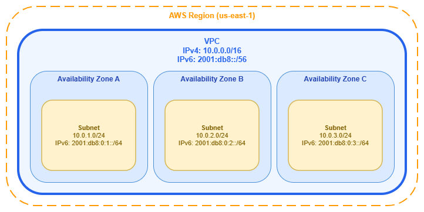
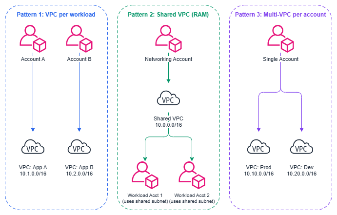

# Amazon VPC

!!! info "Prerequisites"
    This section assumes familiarity with [Before You Start](aws-prerequisites.md) and [AWS Organizations](organizations.md). Review those pages first if you're new to AWS networking fundamentals.

Amazon Virtual Private Cloud (VPC) is your logically isolated network within AWS. Every compute resource, database, container, and Lambda function that needs network connectivity runs inside a VPC. The VPC is not just a container for subnets — it is the foundational security boundary, the IP address domain, and the routing context that shapes every networking decision above it. Get VPC design wrong and you'll spend years working around CIDR conflicts, connectivity limitations, and operational friction that could have been avoided with upfront planning.

A VPC spans all Availability Zones in a Region, provides complete control over IP addressing, routing, and network gateways, and serves as the attachment point for every connectivity service (Transit Gateway, Cloud WAN, VPC Peering, PrivateLink, VPC Lattice). Your VPC design directly determines what connectivity patterns are possible, what address space is available for growth, and how cleanly workloads can be isolated from each other.

/// caption
VPC architecture — [Drawio Source](../assets/foundation/vpc-architecture.drawio)
///

## Key capabilities

*   :material-ip-network: **IPv4 and IPv6 addressing**

    ---

    Define a primary IPv4 CIDR block (`/16` to `/28`), add up to 4 secondary CIDRs, and optionally assign a `/56` IPv6 CIDR for dual-stack operation.

*   :material-shield-lock: **Network isolation**

    ---

    Each VPC is a hard isolation boundary. Traffic between VPCs requires explicit connectivity (peering, Transit Gateway, Cloud WAN, or VPC Lattice). No implicit cross-VPC routing exists.

*   :material-routes: **Route tables and gateways**

    ---

    Per-subnet route tables control traffic flow. internet gateways, NAT gateways, Transit Gateway attachments, and VPC endpoints provide connectivity to different destinations.

*   :material-chart-timeline-variant: **VPC Flow Logs**

    ---

    Capture metadata about IP traffic at the VPC, subnet, or ENI level. Essential for security analysis, troubleshooting, and compliance auditing.

*   :material-dns: **DNS resolution**

    ---

    Amazon-provided DNS (Route 53 Resolver) at the VPC+2 address. Private hosted zones, Resolver endpoints, and forwarding rules enable hybrid DNS architectures.

*   :material-share-variant: **VPC sharing (AWS RAM)**

    ---

    Share subnets across accounts within your Organization. Multiple accounts deploy resources into the same VPC without duplicating network infrastructure.

## VPC design patterns

VPC design is not a one-size-fits-all decision. The right pattern depends on your organization's account strategy, team autonomy requirements, compliance boundaries, and operational maturity. Three primary patterns dominate production AWS environments, and most organizations use a combination.

/// caption
VPC design patterns — [Drawio Source](../assets/foundation/vpc-design-patterns.drawio)
///

### VPC per workload (one VPC per application per environment)

The most common pattern in mature multi-account environments. Each application team owns a dedicated VPC in their account, sized for their workload. Connectivity to shared services happens through Transit Gateway or Cloud WAN attachments.

**When to use:** Teams need autonomy over their network configuration (security groups, NACLs, route tables). Workloads have different compliance requirements. You want blast radius isolation — a misconfiguration in one VPC cannot affect another.

**Trade-off:** More VPCs means more Transit Gateway or Cloud WAN attachments, more CIDR allocations to coordinate, and more route table entries. This is manageable with IPAM and automated provisioning, but it requires upfront investment in tooling.

### Shared VPCs via AWS RAM

The networking team creates VPCs and shares specific subnets with workload accounts via [AWS Resource Access Manager](https://docs.aws.amazon.com/ram/latest/userguide/what-is.html). Workload accounts deploy resources (EC2, RDS, Lambda) into shared subnets without managing the VPC itself.

**When to use:** You want centralized network management with minimal per-account networking overhead. Teams don't need to manage route tables or gateways. You have a small number of large VPCs rather than many small ones. Common in organizations where a central platform team owns all networking.

**Trade-off:** Less isolation between workloads sharing the same VPC. Security group management becomes more critical since resources from different accounts share the same network. Subnet-level NACLs are the coarsest isolation boundary within the VPC.

### Multi-VPC per account

A single account contains multiple VPCs for different purposes (production, staging, isolated workloads). Less common in mature environments because it conflates account-level isolation with network-level isolation.

**When to use:** Small organizations not yet using a multi-account strategy. Proof-of-concept environments. Situations where account proliferation is constrained by organizational policy.

**Trade-off:** You lose the security and billing isolation that separate accounts provide. All VPCs share the same IAM boundary, which means a compromised credential in one VPC's workload has potential access to resources in other VPCs within the same account.

***Key insight:*** *Your VPC design pattern should follow your account strategy, not the other way around. If you use one account per workload per environment (the AWS recommended approach), then one VPC per account is the natural default. If you centralize networking in a platform account, shared VPCs via RAM reduce duplication. The VPC pattern is a consequence of your organizational model.*

## Best Practices

### CIDR sizing and planning

#### Start with /16 for production VPCs and never go smaller than /20

A `/16` gives you 65,536 addresses — enough to accommodate growth, multiple subnet tiers across all Availability Zones, and services that consume IPs aggressively (EKS pods with VPC CNI, Lambda ENIs, ECS tasks in awsvpc mode). Starting smaller feels efficient but creates painful expansion scenarios later.

The cost of a `/16` is address space consumption from your private range, not dollars. If you're using [IPAM](ipam.md) with a well-planned top-level pool (for example, `10.0.0.0/8`), you have 256 `/16` blocks available. That's enough for most organizations. If you're constrained on RFC 1918 space due to on-premises overlap, use `/20` as the minimum for production and plan secondary CIDRs from the start.

#### Use secondary CIDRs strategically, not as a band-aid

Secondary CIDR blocks let you expand a VPC's address space without recreating it. This is valuable for planned growth (adding a new subnet tier, supporting a new Availability Zone) but should not become a pattern for fixing undersized initial allocations. Each secondary CIDR adds routing complexity — route tables, security groups, and NACLs must account for the additional ranges.

The best use of secondary CIDRs is for non-RFC 1918 ranges (100.64.0.0/10 for EKS pod networking) or for adding IPv6 alongside an existing IPv4-only VPC. Avoid accumulating secondary CIDRs because the primary was too small — that's a signal to create a new, properly-sized VPC and migrate.

#### Reserve CIDR space for future VPCs in the same Region

When allocating CIDRs, don't just plan for the current VPC. Reserve contiguous blocks for future VPCs in the same Region so that route summarization remains possible. If your production VPC is `10.1.0.0/16` and your staging VPC is `10.2.0.0/16`, you can advertise `10.1.0.0/15` as a summary route to on-premises. Random CIDR allocation across your `/8` makes summarization impossible and inflates route tables everywhere.

***Key insight:*** *CIDR planning is not a VPC-level decision — it's an organization-level decision. Use [Amazon VPC IPAM](ipam.md) to enforce allocation rules, prevent overlaps, and maintain a single source of truth for your entire address space. Manual spreadsheet tracking breaks down past 10 VPCs.*

### IPv6 adoption

#### Enable dual-stack from day one on new VPCs

Every new VPC should be created with both an IPv4 CIDR and an Amazon-provided `/56` IPv6 CIDR. The incremental cost is zero (IPv6 addressing is free), and retrofitting IPv6 into an existing VPC requires updating every subnet, security group, route table, and NACL — work that compounds with the age of the VPC.

Dual-stack doesn't mean you must use IPv6 immediately. It means the option is available when workloads are ready, without a migration project. Services like EKS, Lambda, and ALB already support IPv6 natively. The trend is clear: IPv6 adoption is accelerating, and VPCs created today without it will need it within their lifetime.

#### Use IPv6 for east-west traffic to reduce NAT dependency

IPv6 addresses are globally unique and publicly routable by design, but that doesn't mean they're publicly accessible. Egress-only internet gateways allow outbound IPv6 traffic while blocking inbound. For service-to-service communication within AWS, IPv6 eliminates the need for NAT gateway (and its per-GB cost) for traffic that doesn't need IPv4 translation.

### VPC Flow Logs

#### Enable Flow Logs at the VPC level, not the subnet or ENI level

VPC-level Flow Logs capture all traffic within the VPC with a single configuration. Subnet-level or ENI-level logs are useful for targeted troubleshooting but should not be your primary observability mechanism — they create gaps in visibility and require per-resource management.

Send Flow Logs to S3 for long-term retention and cost-effective querying with Athena, and optionally to CloudWatch Logs for real-time alerting. The custom log format lets you include fields like `vpc-id`, `subnet-id`, `instance-id`, `tcp-flags`, and `traffic-path` that are essential for security investigation and traffic analysis.

#### Use Flow Logs for security, not just troubleshooting

Flow Logs are often treated as a debugging tool. They're equally valuable as a security control: detecting unexpected traffic patterns, identifying resources communicating with known-bad IPs, validating that NACLs and security groups are working as intended, and providing audit evidence for compliance frameworks that require network traffic logging.

***Key insight:*** *VPC Flow Logs are the only native mechanism for understanding what traffic actually flows in your VPC. Security groups and NACLs define what's allowed — Flow Logs tell you what's happening. Enable them on every VPC, in every account, from day one.*

### DNS configuration

#### Enable DNS hostnames and DNS resolution on every VPC

Both `enableDnsHostnames` and `enableDnsSupport` should be `true` on every VPC. Without these, resources don't receive public DNS hostnames, Route 53 private hosted zones don't resolve, and VPC endpoints don't work correctly. There is no valid production reason to disable either setting.

#### Use Route 53 Resolver endpoints for hybrid DNS

If your VPC needs to resolve on-premises DNS names or your on-premises network needs to resolve AWS private hosted zone names, deploy Route 53 Resolver inbound and outbound endpoints. These replace the need for self-managed DNS forwarders (BIND, Unbound) running on EC2 and integrate natively with Route 53 Resolver rules shared via RAM across your Organization.

### VPC design and account strategy alignment

#### One VPC per workload account is the default pattern

In a multi-account strategy where each workload gets its own account (the AWS-recommended approach), each account should contain exactly one VPC for that workload's environment. This creates a clean 1:1 mapping: one account = one workload = one VPC = one CIDR allocation = one Transit Gateway or Cloud WAN attachment.

This pattern maximizes isolation (account-level IAM boundary + VPC-level network boundary), simplifies IPAM allocation (one pool per OU, one allocation per account), and makes connectivity governance straightforward (attachment acceptance based on account OU membership).

#### Use shared VPCs (RAM) when centralized control outweighs team autonomy

Shared VPCs are appropriate when a central platform team manages all networking and workload teams should not interact with VPC-level constructs at all. This is common in regulated industries where network changes require change advisory board approval, or in organizations where workload teams are application developers without networking expertise.

The trade-off is real: workload teams cannot modify security groups on shared subnets they don't own, cannot create custom route table entries, and cannot add VPC endpoints. Every network change goes through the platform team. If your organization values team autonomy and self-service, the VPC-per-workload pattern with automated provisioning is usually a better fit.

***Key insight:*** *The choice between VPC-per-workload and shared VPCs is fundamentally an organizational design decision, not a technical one. It reflects where you want the boundary between "platform responsibility" and "team responsibility" to sit. Both patterns work technically — the question is which operational model fits your organization.*

### Network isolation and security boundaries

#### Treat VPCs as trust boundaries, not just address spaces

A VPC is the strongest network isolation primitive AWS offers short of separate accounts. No traffic crosses a VPC boundary unless you explicitly create connectivity (peering, Transit Gateway attachment, VPC Lattice association, PrivateLink endpoint). Design your VPC boundaries around trust domains: resources that trust each other at the network level belong in the same VPC; resources with different trust levels belong in separate VPCs.

This principle means your PCI-scoped workloads should be in a dedicated VPC (and ideally a dedicated account), not sharing a VPC with non-PCI workloads. Your management plane (CI/CD, monitoring, bastion hosts) should be in a separate VPC from your data plane. Isolation is cheap — the cost of a VPC is zero; the cost of a breach that crosses a trust boundary is not.

#### Use multiple subnet tiers but keep the number manageable

The classic three-tier model (public, private, data) works for most workloads. Add tiers only when you have a genuine routing or access control requirement that differs from existing tiers. Common additions include a dedicated tier for Transit Gateway or Cloud WAN attachment ENIs, a tier for VPC endpoints, or a tier for firewall endpoints. Avoid creating tiers for organizational reasons (one tier per team) — that's what separate VPCs are for.

## When to use custom VPCs vs default VPCs

The default VPC exists for one purpose: letting new AWS users launch resources without understanding networking. It is pre-configured with a `172.31.0.0/16` CIDR, public subnets in every Availability Zone, an internet gateway, and a route table that sends all traffic to the internet. This configuration is the opposite of what production workloads need.

| Criterion | Default VPC | Custom VPC |
| --- | --- | --- |
| **CIDR control** | Fixed at `172.31.0.0/16` — likely conflicts with other VPCs and on-premises networks | You choose the CIDR, enabling IPAM-managed, non-overlapping address space |
| **Subnet configuration** | All subnets are public (auto-assign public IP enabled) | You define public, private, and isolated tiers with appropriate routing |
| **Internet exposure** | Internet gateway attached, default route to IGW in all subnets | No internet gateway unless you explicitly create one |
| **Connectivity** | Cannot be meaningfully integrated into a Transit Gateway or Cloud WAN topology without CIDR conflicts | Designed to participate in your connectivity architecture from the start |
| **Security posture** | Resources get public IPs by default — violates least-privilege networking | Resources are private by default — explicit action required for public exposure |
| **DNS** | Standard Amazon DNS | Full control over private hosted zones, Resolver rules, and custom DHCP options |
| **Compliance** | Cannot meet most compliance frameworks (PCI DSS, HIPAA, SOC 2) that require controlled network boundaries | Designed to meet compliance requirements with documented, auditable configuration |

**The rule is simple:** use custom VPCs for everything. Delete or ignore default VPCs. If your organization uses [AWS Organizations](organizations.md), deploy an SCP that denies resource creation in default VPCs (`ec2:CreateDefaultVpc` deny, and deny `ec2:RunInstances` where the VPC is the default). This prevents accidental use of default VPCs across your entire Organization.

The only acceptable use of a default VPC is quick experimentation in a sandbox account that has no connectivity to production networks and no compliance requirements. Even then, a custom VPC created by your account vending process is preferable because it establishes good habits and consistent tooling.

***Key insight:*** *Default VPCs are a convenience for learning, not a foundation for production. Every resource launched in a default VPC is a resource that will eventually need to be migrated to a properly designed custom VPC. Start with custom VPCs and avoid the migration entirely.*

## Combining Amazon VPC with other services

The VPC is the attachment point for every connectivity and application networking service in AWS. Understanding how VPC design decisions affect each service helps you avoid constraints that limit your architecture later.

| Combination | VPC provides | Other service provides | VPC design implication |
| --- | --- | --- | --- |
| **VPC + Transit Gateway** | Attachment ENIs in designated subnets, route table entries pointing to the TGW | Regional hub-and-spoke routing between VPCs, VPN, and Direct Connect | Dedicate a subnet tier for TGW attachment ENIs. Size these subnets for the number of Availability Zones (one ENI per Availability Zone). |
| **VPC + AWS Cloud WAN** | Core network attachment ENIs, segment membership via tags | Global policy-driven network management with segmentation | Tag VPCs with segment metadata for automated attachment acceptance. Plan CIDRs to enable route summarization per segment. |
| **VPC + VPC Peering** | The two endpoints of the peering connection, route table entries for the peer CIDR | Direct point-to-point connectivity without bandwidth bottleneck | Ensure CIDRs don't overlap between peered VPCs. Peering doesn't support transitive routing. |
| **VPC + Amazon VPC Lattice** | Service network VPC association (places Lattice data plane in the VPC) | Application-layer service-to-service communication with IAM auth | No CIDR coordination required between VPCs. Lattice operates independently of IP-level routing. |
| **VPC + AWS PrivateLink** | Interface endpoints (ENIs) in designated subnets consuming services, or NLB-backed endpoint services exposing them | Private access to AWS services and cross-account service exposure | Size endpoint subnets for the number of endpoints you'll consume. Each interface endpoint creates one ENI per Availability Zone. |
| **VPC + VPC Flow Logs** | The traffic source being monitored | Metadata capture of all IP traffic for security and troubleshooting | Enable at VPC level for comprehensive coverage. Plan S3 bucket and CloudWatch log group structure for multi-VPC environments. |
| **VPC + Route 53 Resolver** | The DNS resolution context (VPC+2 resolver) | Hybrid DNS forwarding, private hosted zone resolution, Resolver rules | Enable DNS hostnames and DNS support. Deploy Resolver endpoints in a shared-services VPC and share rules via RAM. |
| **VPC + AWS Network Firewall** | Firewall endpoints in dedicated subnets, route tables directing traffic through them | Stateful and stateless traffic inspection and filtering | Dedicate a subnet tier for firewall endpoints. Adjust route tables so traffic traverses the firewall before reaching its destination. |
| **VPC + NAT gateway** | The elastic network interface and elastic IP in a public subnet | Outbound IPv4 internet access for private subnets | Place NAT gateways in public subnets (one per Availability Zone for resilience). Size the subnet to accommodate NAT gateway ENIs and any future growth. |

***Key insight:*** *Almost every connectivity service attaches to your VPC through ENIs in specific subnets. This means your subnet design must account for Transit Gateway ENIs, PrivateLink endpoints, firewall endpoints, NAT gateways, and Resolver endpoints — not just your application workloads. Plan subnet tiers for infrastructure components from the start, or you'll run out of IP space in the subnets that matter most.*

## VPC limits and quotas to plan around

Understanding VPC limits prevents architectural dead ends:

* **VPCs per Region**: 5 (default), increasable to hundreds. Request increases proactively if using VPC-per-workload pattern.
* **CIDR blocks per VPC**: 5 (1 primary + 4 secondary). Plan your primary CIDR generously — you only get 4 expansion opportunities.
* **Subnets per VPC**: 200 (default). Rarely a constraint unless you create excessive subnet tiers.
* **Route table entries**: 50 per route table (default), increasable to 1,000. Becomes relevant with many VPC peering connections or specific routes.
* **Security groups per VPC**: 2,500 (default). Can become a constraint in shared VPCs with many workload accounts.
* **Network interfaces per Region**: 5,000 (default). Relevant for VPCs with many PrivateLink endpoints, EKS pods, or ECS tasks in awsvpc mode.
* **IPv4 CIDR block size**: `/16` (largest) to `/28` (smallest). You cannot create a VPC larger than `/16` with a single CIDR.

## Documentation

*   :material-file-document: **Amazon VPC User Guide**

    ---

    Complete service documentation including VPC creation, CIDR management, subnets, route tables, gateways, and security.

    [:octicons-arrow-right-24: Documentation](https://docs.aws.amazon.com/vpc/latest/userguide/what-is-amazon-vpc.html)

*   :material-ip-network: **VPC CIDR blocks**

    ---

    Detailed guidance on primary and secondary CIDR blocks, IPv6 assignment, and address space management.

    [:octicons-arrow-right-24: CIDR blocks](https://docs.aws.amazon.com/vpc/latest/userguide/vpc-cidr-blocks.html)

*   :material-shield-check: **VPC security best practices**

    ---

    AWS guidance on security groups, NACLs, Flow Logs, and network isolation patterns.

    [:octicons-arrow-right-24: Security](https://docs.aws.amazon.com/vpc/latest/userguide/vpc-security-best-practices.html)

*   :material-swap-vertical: **Migrate to IPv6**

    ---

    Step-by-step guidance for adding IPv6 to existing VPCs, updating subnets, route tables, and security groups.

    [:octicons-arrow-right-24: IPv6 migration](https://docs.aws.amazon.com/vpc/latest/userguide/vpc-migrate-ipv6.html)

*   :material-share-variant: **VPC sharing**

    ---

    How to share VPC subnets across accounts using AWS RAM, including permissions, limitations, and best practices.

    [:octicons-arrow-right-24: VPC sharing](https://docs.aws.amazon.com/vpc/latest/userguide/vpc-sharing.html)

*   :material-post: **Designing hyperscale VPC networks**

    ---

    AWS blog post on large-scale VPC design patterns, CIDR strategies, and multi-account architectures.

    [:octicons-arrow-right-24: Blog post](https://aws.amazon.com/blogs/networking-and-content-delivery/designing-hyperscale-amazon-vpc-networks/)

## How VPC relates to the rest of the Foundation

Amazon VPC is the central construct that every other foundation component plugs into. Your [CIDR planning](cidr.md) determines what address space the VPC uses. Your [subnet strategy](subnets.md) determines how that address space is divided within the VPC. Your [IPAM configuration](ipam.md) governs allocation and prevents conflicts. Your [Organizations structure](organizations.md) determines who can create VPCs and where.

**Relationship to other Foundation topics:**

* **[CIDR Planning](cidr.md)**: The VPC's primary and secondary CIDRs come from your CIDR plan. Poor CIDR planning at the VPC level cascades into routing conflicts, peering limitations, and summarization failures.
* **[Subnets](subnets.md)**: Subnets divide the VPC's CIDR across Availability Zones and tiers. Subnet design is constrained by the VPC's CIDR size — an undersized VPC limits your subnet options.
* **[IPAM](ipam.md)**: IPAM pools allocate CIDRs to VPCs automatically, preventing overlaps and enforcing organizational standards. Every VPC should get its CIDR from an IPAM pool, not from manual selection.
* **[Regions and Availability Zones](regions-azs.md)**: A VPC exists in exactly one Region and spans all its Availability Zones. Your Region strategy determines how many VPCs you need and where.
* **[AWS Organizations](organizations.md)**: Organizations governs who can create VPCs (SCPs), how VPCs are shared (RAM), and how VPCs attach to connectivity services (Cloud WAN attachment policies).

**Relationship to Connectivity:**

* **[Connectivity Within AWS](../connectivity/within-aws.md)**: Every Transit Gateway attachment, Cloud WAN attachment, and VPC peering connection terminates in a VPC. Your VPC design enables or constrains your connectivity architecture.
* **[Hybrid & Multi-Cloud](../connectivity/hybrid-multicloud.md)**: Direct Connect and VPN traffic enters AWS through a VPC. The VPC hosting these connections is typically in a centralized networking account.
* **[Internet Connectivity](../connectivity/internet.md)**: internet gateways, NAT gateways, and egress-only internet gateways are VPC-level constructs. Your VPC's subnet tiers determine which resources can reach the internet and how.

**Relationship to Application Networking:**

* **[Load Balancing](../application-networking/load-balancing.md)**: ALBs and NLBs deploy into VPC subnets. Subnet sizing and tier design must account for load balancer ENIs and scaling behavior.
* **[Service to Service](../application-networking/service-to-service.md)**: VPC Lattice associates with VPCs through service network associations. PrivateLink endpoints consume IP addresses in VPC subnets.
