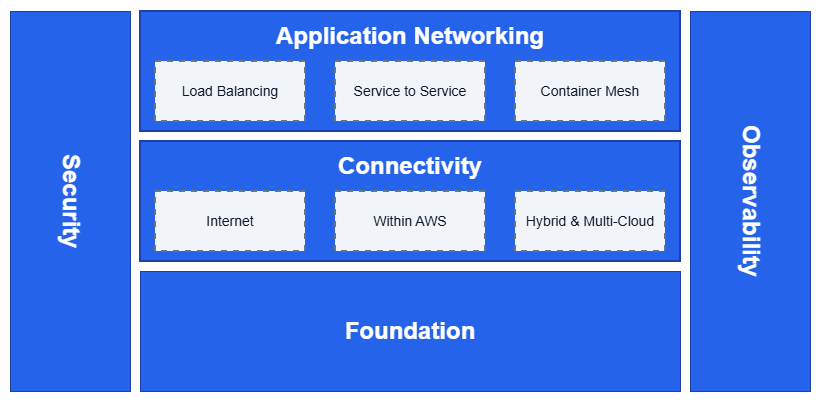

# Introduction

A reference architecture for AWS networking best practices.

Enterprise AWS networks are built on five interconnected pillars:

* **Foundation** - Core infrastructure (AWS Organizations, VPCs, subnets, IPAM) that everything else depends on
* **Connectivity** - Communication through internet gateways, Transit Gateway, Direct Connect, and VPN services
* **Application Networking** - Traffic distribution via Elastic Load Balancing, service-to-service communication through VPC Lattice, and container networking
* **Security** - Protection through Network Firewall, PrivateLink, and Verified Access
* **Observability** - Monitoring and troubleshooting capabilities

/// caption
AWS Network Reference Architecture
///

## Architecture Overview

Start with Foundation to understand the basics, then explore each pillar based on your specific networking requirements.

*   :material-network: **Foundation**

    ---

    Essential AWS networking concepts including VPCs, subnets, routing, and
    core infrastructure components.

    ---

    [:octicons-arrow-right-24: Foundation](foundation/)

*   :material-lan-connect: **Connectivity**

    ---

    Internet access, connectivity within AWS, and hybrid & multi-cloud
    networking solutions.

    ---

    [:octicons-arrow-right-24: Connectivity](connectivity/)

*   :material-application: **Application Networking**

    ---

    Load balancing, service-to-service communication, and container mesh
    networking for modern applications.

    ---

    [:octicons-arrow-right-24: Application Networking](application-networking/)

*   :material-lock-outline: **Security**

    ---

    Secure your AWS network with defense-in-depth strategies, access controls,
    and threat protection.

    ---

    [:octicons-arrow-right-24: Security](security/)

*   :material-monitor-eye: **Observability**

    ---

    Monitor network performance, troubleshoot connectivity issues, and gain
    visibility into your AWS network.

    ---

    [:octicons-arrow-right-24: Observability](observability/)

## Contribute

Help improve this guide by [reporting issues](community/report-a-correction.md),
[suggesting new best practices](community/new-best-practice.md), or
[contributing content](community/making-a-pull-request.md). Join our
community-driven effort to create comprehensive AWS networking resources for
everyone.
