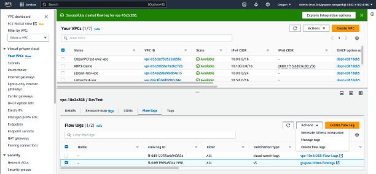
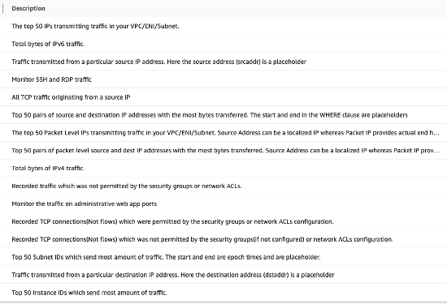

# Internal Traffic Monitoring

See VPC Flow Logs, Athena analysis, CloudWatch, and other tools to understand what network activity inside AWS is going on.

There are several ways to monitor traffic inside AWS.

## Flow Logs

Flow Logs are comma-separated files that provide a record of traffic that goes through whatever is producing the flow logs. Today, there are two sources: [VPC Flow Logs](https://docs.aws.amazon.com/vpc/latest/userguide/flow-logs.html) and [AWS Transit Gateway Flow Logs](https://docs.aws.amazon.com/vpc/latest/tgw/tgw-flow-logs.html). Both produce the same format file, although with different fields. You can also create flow logs [for network interfaces AWS services create for you](https://docs.aws.amazon.com/vpc/latest/userguide/flow-logs-basics.html), such as NAT gateways and Transit Gateways.

Flow Logs can be expensive to leave running full-time for everything, so it is recommended to either select only certain resources to monitor, or create automation that only collects them at certain times or events.

With VPC flow logs, by default, only [version 2](https://docs.aws.amazon.com/vpc/latest/userguide/flow-log-records.html#flow-logs-fields) fields are recorded. While needed for consistency, AWS is currently up to version 8, with many additional fields now available. The most helpful will depend on your specific use case, but frequently are:

* `vpc-id`, `subnet-id`, especially when storing the flow logs in a unified location
* `instance-id` to more easily identify the network interface
* `pkt-srcaddr` and `pkt-dstaddr` especially for EKS pods
* `az-id` is helpful in cases when you want to determine what traffic is going cross-AZ
* `pkt-src-aws-service` and `pkt-dst-aws-service` to get AWS to provide an indication this is to or from AWS. However, keep in mind, many AWS services overlap each other, so only one will show. This field is generally most useful to identify if traffic is going to *any* AWS service.
* `traffic-path` to give an easy filter to filter on for traffic leaving the VPC and by what method
*`reject-reason` is very useful with the [VPC Block Public Access](https://docs.aws.amazon.com/vpc/latest/userguide/security-vpc-bpa.html) feature to see what traffic is getting blocked by it.

Overall, if you are starting fresh, it is recommended to use Custom Fields and get the specific data you want, instead of just accepting the default fields.

### Tools for analyzing flow logs

Flow Logs can produce a lot of data. AWS provides several tools to help analyze these.

#### CloudWatch Contributor Insights

Contributor Insights can provide quick reports for the most commonly asked for questions from VPC flow logs - top talks, traffic by source, and so on. It is located in the console under CloudWatch.

#### Athena Queries

One frequently-missed tool is under the Actions dropdown in Flow Logs.

There is an option Generate Athena Integration. This will provide you with a CloudFormation template that you can then deploy that sets up Athena to query your VPC Flow Logs using SQL syntax or with the pre-built reports:

## Network Synthetic Monitors

Available in CloudWatch, under Network Monitoring, Synthetic Monitors deploy AWS-managed ICMP or TCP probes in your VPC, with a list of target IP addresses you provide. These then report on observed packet loss and round trip time. These can be outside of your VPC, or outside of AWS - you can use these to measure the time between your VPC and something on-premises for example.

## Network Flow Monitors

[Network Flow Monitor](https://docs.aws.amazon.com/AmazonCloudWatch/latest/monitoring/CloudWatch-NetworkFlowMonitor.html) involve installing agents onto your workloads. These agents monitor statistics from TCP connections (not the payloads), and sends it to a backend service for reporting. These reports can be combined to see information about cross-AZ, cross-VPC, or for specific flows. There is a good [AWS Blog Post](https://aws.amazon.com/blogs/networking-and-content-delivery/visualizing-network-performance-of-your-aws-cloud-workloads-with-network-flow-monitor/) that goes through setting it up and use cases for it.
