<!--- Never modify this file directly. Update the scripts/generate-service-monitoring.py instead. -->
# AWS Services Monitoring

Guidance about the important metrics to monitor and alarm on, listed by service.

For the metrics, the following symbols are used:

| Symbol | Meaning |
| :-: | --- |
| :material-alarm-light:{ title=Alarm any time the condition exists. } | Alarm any time the condition exists. |
| :material-exclamation-thick:{ title=These statistics should trigger alarms if the condition persists for several minutes. A couple increments occasionally should be expected as a normal part of networking. } | These statistics should trigger alarms if the condition persists for several minutes. A couple increments occasionally should be expected as a normal part of networking. |
| :material-eye-check:{ title=These statistics should always be monitored, and may be alarmed depending on specific use case. } | These statistics should always be monitored, and may be alarmed depending on specific use case. |

For quotas:

| Symbol | Meaning |
| :-: | --- |
| :octicons-stop-16:{ title=Hard quota – Cannot be adjusted. } | Hard quota – Cannot be adjusted. |
| :fontawesome-solid-road-barrier:{ title=Medium quota - Contact AWS to discuss these and possible alternative architectures. } | Medium quota - Contact AWS to discuss these and possible alternative architectures. |
| :material-image-auto-adjust:{ title=Soft quota - Adjustable by customer. } | Soft quota - Adjustable by customer. |

!!! info "Remember"
    Always validate the quotas below against the official AWS documentation - in case of differences, the official quotas should be used. Not all quotas are repeated here - only the most critical ones to keep an eye on.

## Application Load Balancer

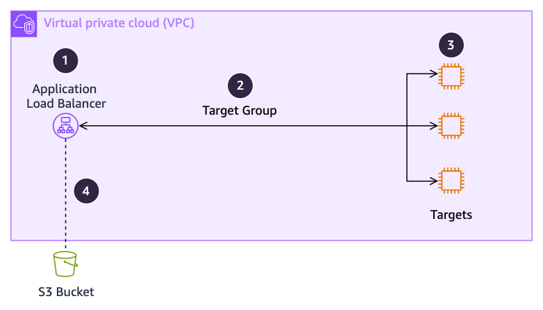

/// caption
[Drawio Source](../assets/monitoring-observability/Services.drawio)
///

=== "Metrics"
    | Number | Notes |  |  |
    | :--: | --- | -- | -- |
    | 1 | AWS CloudWatch "AWS/ApplicationELB" namespace: | ~~ | ~~ |
    |    | | **Metric** | **Alarm if** |
    |  | :material-alarm-light:{ Alarm any time the condition exists. } | RejectedConnectionCount | Going up more than 2/min |
    |  | :material-exclamation-thick:{ These statistics should trigger alarms if the condition persists for several minutes. A couple increments occasionally should be expected as a normal part of networking. } | UnhealthyHostCount | Higher than 0 for longer than expected for scaling. |
    |  | :material-exclamation-thick:{ These statistics should trigger alarms if the condition persists for several minutes. A couple increments occasionally should be expected as a normal part of networking. } | ELBAuthError, ELBAuthLatency | Going usually high, if user authentication is in use. |
    |  | :material-eye-check:{ These statistics should always be monitored, and may be alarmed depending on specific use case. } | ConsumedLCUs | None - monitor for cost |
    |__| :material-eye-check:{ These statistics should always be monitored, and may be alarmed depending on specific use case. } | ActiveConnectionCount, NewConnectionCount, ProcessedBytes, ProcessedPackets | Outside of band. |
    | 2 | AWS CloudWatch "AWS/ApplicationELB" namespace, per target group: | ~~ | ~~ |
    |    | | **Metric** | **Alarm if** |
    |__| :material-exclamation-thick:{ These statistics should trigger alarms if the condition persists for several minutes. A couple increments occasionally should be expected as a normal part of networking. } | UnhealthyRequestCount, UnhealthyStateDNS, UnhealthyStateRouting | Higher than 0 for longer than expected for scaling. |
    | 3 | AWS CloudWatch "AWS/ApplicationELB" namespace, per target group: | ~~ | ~~ |
    |    | | **Metric** | **Alarm if** |
    |  | :material-exclamation-thick:{ These statistics should trigger alarms if the condition persists for several minutes. A couple increments occasionally should be expected as a normal part of networking. } | TargetConnectionErrorCount | Increasing |
    |__| :material-eye-check:{ These statistics should always be monitored, and may be alarmed depending on specific use case. } | TargetResponseTime | Going unusually high |
    | 4 | Consider enabling access and/or connection logs. | ~~ | ~~ |

=== "Quotas"
    Always check these against the [official Application Load Balancer quotas.](https://docs.aws.amazon.com/elasticloadbalancing/latest/application/load-balancer-limits.html)

    No key operational quotas.

## AWS Direct Connect

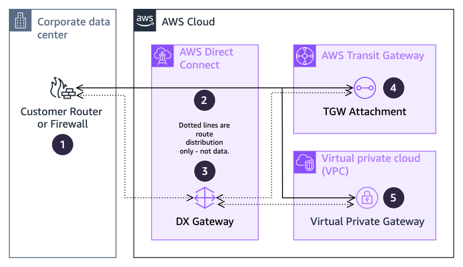

/// caption
[Drawio Source](../assets/monitoring-observability/Services.drawio)
///

=== "Metrics"
    | Number | Notes |  |  |
    | :--: | --- | -- | -- |
    | 1 | Monitor your router’s incoming and outgoing BPS and PPS, along with number of routes advertised and received against quotas. | ~~ | ~~ |
    | 2 | AWS CloudWatch "AWS/DX" namespace, per connection: | ~~ | ~~ |
    |    | | **Metric** | **Alarm if** |
    |  | :material-alarm-light:{ Alarm any time the condition exists. } | ConnectionState | Equals 0 |
    |  | :material-alarm-light:{ Alarm any time the condition exists. } | ConnectionEncryptionState | Equals 0 if MACsec is enabled |
    |  | :material-exclamation-thick:{ These statistics should trigger alarms if the condition persists for several minutes. A couple increments occasionally should be expected as a normal part of networking. } | ConnectionErrorCount | Going up more than 1/min |
    |  | :material-exclamation-thick:{ These statistics should trigger alarms if the condition persists for several minutes. A couple increments occasionally should be expected as a normal part of networking. } | ConnectionLightLevel(Rx&#129;Tx) | Outside the range of: <table><tbody><tr><td>1/10G:</td><td>Rx and Tx</td><td>-14.4 to 2.5</td></tr><tr><td rowspan="2">100G</td><td>Tx</td><td>-4.3 to 4.5</td></tr><tr><td>Rx</td><td>-10.6 to 4.5</td></tr><tr><td rowspan="2">400G</td><td>Tx</td><td>-1 to 6.09</td></tr><tr><td>Rx</td><td>-12 to 7.09</td></tr></tbody></table> |
    |__| :material-eye-check:{ These statistics should always be monitored, and may be alarmed depending on specific use case. } | ConnectionBps(Ingress&#129;Egress) | 80% of your link speed |
    | 3 | DX Gateway is not in the traffic path, and does not have metrics to monitor. | ~~ | ~~ |
    | 4 | See [AWS Transit Gateway](#aws-transit-gateway). | ~~ | ~~ |
    | 5 | Virtual Private Gateways do not have metrics to monitor | ~~ | ~~ |

=== "Quotas"
    Always check these against the [official AWS Direct Connect quotas.](https://docs.aws.amazon.com/directconnect/latest/UserGuide/limits.html)

    | Component | Quota | Type |
    | --- | --- | --- |
    | Routes from customer to AWS, per BGP session, per AFI (private/transit) | 100 | :fontawesome-solid-road-barrier:{ title="Medium quota - Contact AWS to discuss these and possible alternative architectures."} |
    | Routes from customer to AWS, per BGP session, per AFI (public) | 1000 | :fontawesome-solid-road-barrier:{ title="Medium quota - Contact AWS to discuss these and possible alternative architectures."} |
    | Routes from Transit Gateway to customer, combined AFIs | 200 | :fontawesome-solid-road-barrier:{ title="Medium quota - Contact AWS to discuss these and possible alternative architectures."} |

## AWS Site-to-Site VPN

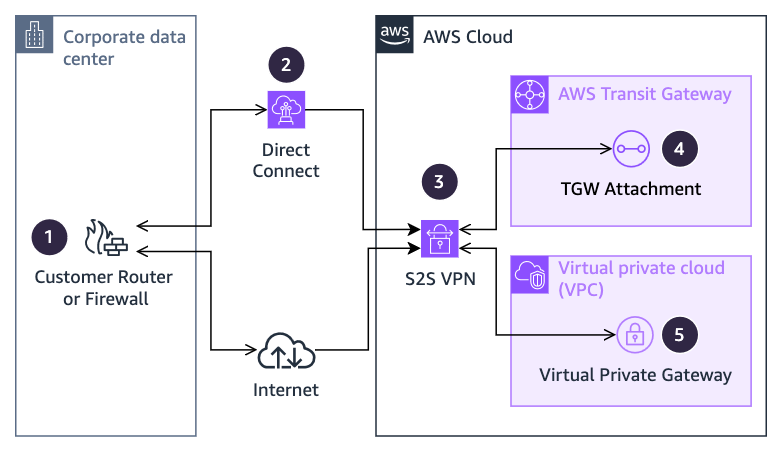

/// caption
[Drawio Source](../assets/monitoring-observability/Services.drawio)
///

=== "Metrics"
    | Number | Notes |  |  |
    | :--: | --- | -- | -- |
    | 1 | Monitor your router’s incoming and outgoing BPS and PPS, and alarm on tunnel down or errors. | ~~ | ~~ |
    | 2 | See [Direct Connect](#aws-direct-connect) | ~~ | ~~ |
    | 3 | AWS CloudWatch "AWS/VPN" namespace, per tunnel: | ~~ | ~~ |
    |    | | **Metric** | **Alarm if** |
    |  | :material-alarm-light:{ Alarm any time the condition exists. } | TunnelState | Equals 0 (down) |
    |__| :material-eye-check:{ These statistics should always be monitored, and may be alarmed depending on specific use case. } | TunnelDataIn, TunnelDataOut | Exceeding 1.0 Gbps |
    | 4 | See [AWS Transit Gateway](#aws-transit-gateway) | ~~ | ~~ |
    | 5 | Virtual Private Gateways do not have metrics to monitor. | ~~ | ~~ |

=== "Quotas"
    Always check these against the [official AWS Site-to-Site VPN quotas.](https://docs.aws.amazon.com/vpn/latest/s2svpn/vpn-limits.html)

    | Component | Quota | Type |
    | --- | --- | --- |
    | Bandwidth per tunnel | 1.25 Gbps | :octicons-stop-16:{ title="Hard quota – Cannot be adjusted."} |
    | Packets per second | 140,000 | :octicons-stop-16:{ title="Hard quota – Cannot be adjusted."} |

## AWS Transit Gateway

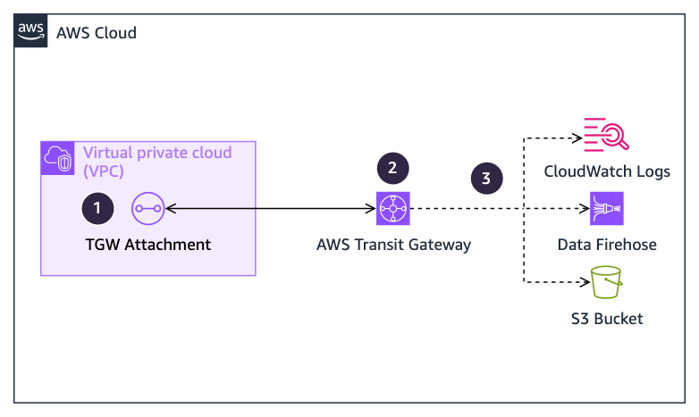

/// caption
[Drawio Source](../assets/monitoring-observability/Services.drawio)
///

=== "Metrics"
    | Number | Notes |  |  |
    | :--: | --- | -- | -- |
    | 1 | AWS CloudWatch "AWS/TransitGateway" namespace, per attachment: | ~~ | ~~ |
    |    | | **Metric** | **Alarm if** |
    |  | :material-eye-check:{ These statistics should always be monitored, and may be alarmed depending on specific use case. } | (Packet&#129;Bytes)DropCount(Blackhole&#129;NoRoute) | Greater than 1% of traffic |
    |  | :material-eye-check:{ These statistics should always be monitored, and may be alarmed depending on specific use case. } | BytesIn + BytesOut | Approaching 100 Gbps |
    |__| :material-eye-check:{ These statistics should always be monitored, and may be alarmed depending on specific use case. } | PacketsIn + PacketsOut | Approaching 7.5 Mpps |
    | 2 | AWS CloudWatch "AWS/TransitGateway" namespace, per Transit Gateway: | ~~ | ~~ |
    |    | | **Metric** | **Alarm if** |
    |  | :material-eye-check:{ These statistics should always be monitored, and may be alarmed depending on specific use case. } | (Packet&#129;Bytes)DropCount(Blackhole&#129;NoRoute) | Greater than 1% of traffic |
    |  | :material-eye-check:{ These statistics should always be monitored, and may be alarmed depending on specific use case. } | BytesIn + BytesOut | None (alarm on the attachment) |
    |__| :material-eye-check:{ These statistics should always be monitored, and may be alarmed depending on specific use case. } | PacketsIn + PacketsOut | None (alarm on the attachment) |
    | 3 | Consider enabling [Transit Gateway Flow Logs](https://docs.aws.amazon.com/vpc/latest/tgw/tgw-flow-logs.html) | ~~ | ~~ |

=== "Quotas"
    Always check these against the [official AWS Transit Gateway quotas.](https://docs.aws.amazon.com/vpc/latest/tgw/transit-gateway-quotas.html)

    | Component | Quota | Type |
    | --- | --- | --- |
    | VPC, Direct Connect, and Peering Attachments, per AZ | 100 Gbps, 7.5 Mpps | :fontawesome-solid-road-barrier:{ title="Medium quota - Contact AWS to discuss these and possible alternative architectures."} |

## Network Load Balancer

/// caption
[Drawio Source](../assets/monitoring-observability/Services.drawio)
///

=== "Metrics"
    | Number | Notes |  |  |
    | :--: | --- | -- | -- |
    | 1 | AWS CloudWatch "AWS/NetworkELB" namespace, per NLB: | ~~ | ~~ |
    |    | | **Metric** | **Alarm if** |
    |  | :material-alarm-light:{ Alarm any time the condition exists. } | RejectedFlowCount | Greater than 0 |
    |  | :material-alarm-light:{ Alarm any time the condition exists. } | PortAllocationErrorCount | Greater than 0 |
    |  | :material-exclamation-thick:{ These statistics should trigger alarms if the condition persists for several minutes. A couple increments occasionally should be expected as a normal part of networking. } | UnHealthyHostCount | Higher than 0 for longer than expected for scaling. |
    |  | :material-exclamation-thick:{ These statistics should trigger alarms if the condition persists for several minutes. A couple increments occasionally should be expected as a normal part of networking. } | UnhealthyRoutingFlowCount | Greater than 0 |
    |  | :material-exclamation-thick:{ These statistics should trigger alarms if the condition persists for several minutes. A couple increments occasionally should be expected as a normal part of networking. } | TCP_(Client&#129;ELB&#129;Target)_Reset_Count | Outside of band, or a large percentage of NewFlowCount |
    |__| :material-eye-check:{ These statistics should always be monitored, and may be alarmed depending on specific use case. } | ActiveFlowCount, NewFlowCount, PeakPacketsPerSecond, ProcessedByte, ProcessedPacket | Outside of band |
    | 2 | AWS CloudWatch "AWS/NetworkELB" namespace, per target group: | ~~ | ~~ |
    |    | | **Metric** | **Alarm if** |
    |  | :material-alarm-light:{ Alarm any time the condition exists. } | PortAllocationErrorCount | Greater than 0 |
    |__| :material-exclamation-thick:{ These statistics should trigger alarms if the condition persists for several minutes. A couple increments occasionally should be expected as a normal part of networking. } | UnhealthyRoutingRequestCount, UnhealthyStateDNS, UnhealthyStateRouting | Greater than 0 |
    | 3 | Appropriate per-target monitoring. | ~~ | ~~ |
    | 4 | Consider enabling [access logs](https://docs.aws.amazon.com/elasticloadbalancing/latest/network/load-balancer-access-logs.html) if you are using TLS listeners. | ~~ | ~~ |

=== "Quotas"
    Always check these against the [official Network Load Balancer quotas.](https://docs.aws.amazon.com/elasticloadbalancing/latest/network/load-balancer-limits.html)

    No key operational quotas.

## Gateway Load Balancer

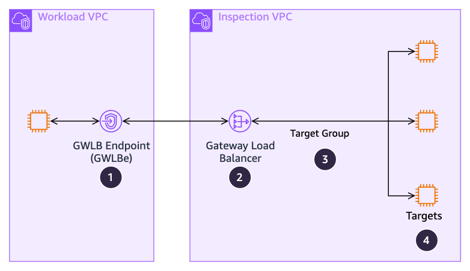

/// caption
[Drawio Source](../assets/monitoring-observability/Services.drawio)
///

=== "Metrics"
    | Number | Notes |  |  |
    | :--: | --- | -- | -- |
    | 1 | AWS CloudWatch "AWS/PrivateLinkEndpoints" namespace: | ~~ | ~~ |
    |    | | **Metric** | **Alarm if** |
    |  | :material-exclamation-thick:{ These statistics should trigger alarms if the condition persists for several minutes. A couple increments occasionally should be expected as a normal part of networking. } | PacketsDropped | Greater than 0.5% |
    |  | :material-exclamation-thick:{ These statistics should trigger alarms if the condition persists for several minutes. A couple increments occasionally should be expected as a normal part of networking. } | RstPacketsReceived | Greater than 10 pps |
    |  | :material-eye-check:{ These statistics should always be monitored, and may be alarmed depending on specific use case. } | ActiveConnections | Going anomalously high |
    |  | :material-eye-check:{ These statistics should always be monitored, and may be alarmed depending on specific use case. } | BytesProcessed | Approaching 100 Gbps |
    |__| :material-eye-check:{ These statistics should always be monitored, and may be alarmed depending on specific use case. } | NewConnections | Going anomalously high |
    | 2 | AWS CloudWatch "AWS/GatewayELB" namespace: | ~~ | ~~ |
    |    | | **Metric** | **Alarm if** |
    |  | :material-alarm-light:{ Alarm any time the condition exists. } | RejectedFlowCount | Greater than 0 |
    |  | :material-exclamation-thick:{ These statistics should trigger alarms if the condition persists for several minutes. A couple increments occasionally should be expected as a normal part of networking. } | UnhealthyHostCount | Staying over 0 |
    |  | :material-eye-check:{ These statistics should always be monitored, and may be alarmed depending on specific use case. } | ConsumedLCUs | Unexpected increases |
    |  | :material-eye-check:{ These statistics should always be monitored, and may be alarmed depending on specific use case. } | ActiveFlowCount | Going anomalously high |
    |  | :material-eye-check:{ These statistics should always be monitored, and may be alarmed depending on specific use case. } | NewFlowCount | Going anomalously high |
    |__| :material-eye-check:{ These statistics should always be monitored, and may be alarmed depending on specific use case. } | ProcessedBytes | Approaching 100 Gbps |
    | 3 | AWS CloudWatch "AWS/GatewayELB" namespace, per target group: | ~~ | ~~ |
    |    | | **Metric** | **Alarm if** |
    |__| :material-exclamation-thick:{ These statistics should trigger alarms if the condition persists for several minutes. A couple increments occasionally should be expected as a normal part of networking. } | UnhealthyHostCount | Staying over 0 |
    | 4 | Per target monitoring. | ~~ | ~~ |

=== "Quotas"
    Always check these against the [official Gateway Load Balancer quotas.](https://docs.aws.amazon.com/elasticloadbalancing/latest/gateway/quotas-limits.html)

    | Component | Quota | Type |
    | --- | --- | --- |
    | Network traffic (per GWLB) | 100 Gbps | :octicons-stop-16:{ title="Hard quota – Cannot be adjusted."} |
    | Network traffic (per GWLBe) | 100 Gbps | :octicons-stop-16:{ title="Hard quota – Cannot be adjusted."} |

## Route53 Endpoints, Resolver, and Resolver DNS Firewall

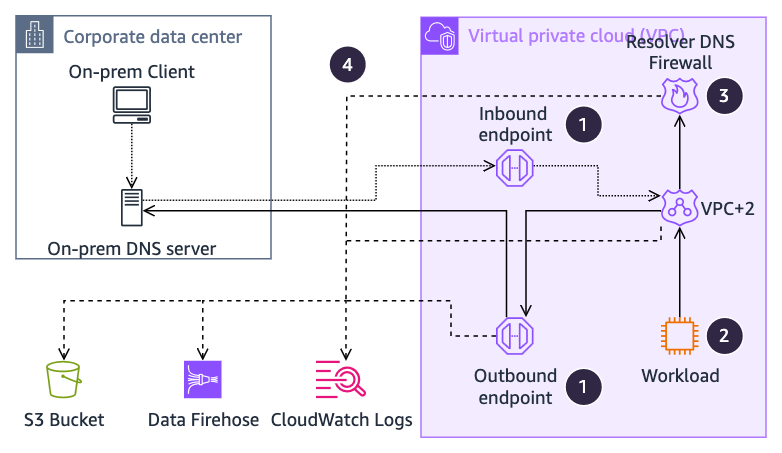

/// caption
[Drawio Source](../assets/monitoring-observability/Services.drawio)
///

=== "Metrics"
    | Number | Notes |  |  |
    | :--: | --- | -- | -- |
    | 1 | AWS CloudWatch "AWS/Route53Resolver" namespace: | ~~ | ~~ |
    |    | | **Metric** | **Alarm if** |
    |  | :material-exclamation-thick:{ These statistics should trigger alarms if the condition persists for several minutes. A couple increments occasionally should be expected as a normal part of networking. } | InboundQueryVolume or OutboundQueryAggregateVolume | Greater than 8,000 per second |
    |__| :material-eye-check:{ These statistics should always be monitored, and may be alarmed depending on specific use case. } | EndpointUnHealthyENICount | Greater than 0 for more than 10 minute |
    | 2 | AWS CloudWatch "Instances" namespace, per instance: | ~~ | ~~ |
    |    | | **Metric** | **Alarm if** |
    |__| :material-exclamation-thick:{ These statistics should trigger alarms if the condition persists for several minutes. A couple increments occasionally should be expected as a normal part of networking. } | linklocal_allowance_exceeded | Greater than 20 per minute |
    | 3 | Consider utilizing the [Resolver DNS firewall](https://docs.aws.amazon.com/Route53/latest/DeveloperGuide/resolver-dns-firewall-overview.html) | ~~ | ~~ |
    | 4 | Consider enabling [query logging](https://docs.aws.amazon.com/Route53/latest/DeveloperGuide/resolver-query-logs.html) from the VPC+2 resolver, endpoints, and the DNS Firewall | ~~ | ~~ |

=== "Quotas"
    Always check these against the [official Route53 Endpoints, Resolver, and Resolver DNS Firewall quotas.](https://docs.aws.amazon.com/Route53/latest/DeveloperGuide/DNSLimitations.html)

    | Component | Quota | Type |
    | --- | --- | --- |
    | Packets per second from an instance to link-local/VPC+2, per interface | 1,024 pps | :octicons-stop-16:{ title="Hard quota – Cannot be adjusted."} |
    | Queries per second per IP address in an endpoint | 10,000 qps | :octicons-stop-16:{ title="Hard quota – Cannot be adjusted."} |

## NAT Gateway

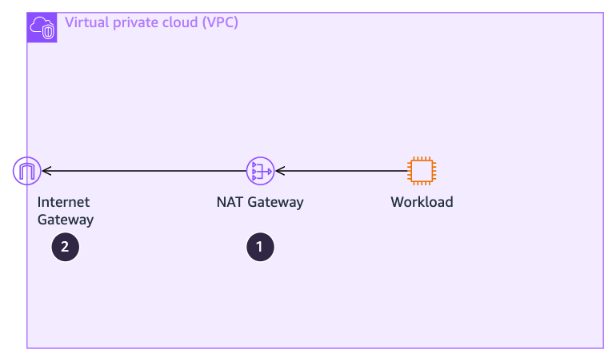

/// caption
[Drawio Source](../assets/monitoring-observability/Services.drawio)
///

=== "Metrics"
    | Number | Notes |  |  |
    | :--: | --- | -- | -- |
    | 1 | AWS CloudWatch "AWS/NATGateway" namespace: | ~~ | ~~ |
    |    | | **Metric** | **Alarm if** |
    |  | :material-alarm-light:{ Alarm any time the condition exists. } | PacketsDropCount | More than 0.1% per second |
    |  | :material-exclamation-thick:{ These statistics should trigger alarms if the condition persists for several minutes. A couple increments occasionally should be expected as a normal part of networking. } | ErrorPortAllocation | More than 2 per second |
    |  | :material-exclamation-thick:{ These statistics should trigger alarms if the condition persists for several minutes. A couple increments occasionally should be expected as a normal part of networking. } | BytesInFromSource + BytesInFromDestination | Approaching 100 Gbps |
    |__| :material-exclamation-thick:{ These statistics should trigger alarms if the condition persists for several minutes. A couple increments occasionally should be expected as a normal part of networking. } | PacketsInFromSource + PacketsInFromDestination | Approaching 10 Mpps |
    | 2 | See [Internet Gateway](#internet-gateway) section. | ~~ | ~~ |

=== "Quotas"
    Always check these against the [official NAT Gateway quotas.](https://docs.aws.amazon.com/vpc/latest/userguide/nat-gateway-basics.html)

    | Component | Quota | Type |
    | --- | --- | --- |
    | Bits per seconds | 5 Gbps cold, able to scale up to 100 Gbps | :octicons-stop-16:{ title="Hard quota – Cannot be adjusted."} |
    | Packets per second | 1 Mpps cold, able to scale up to 10 Mpps | :octicons-stop-16:{ title="Hard quota – Cannot be adjusted."} |
    | Simultaneous connections from a source IP to each unique destination (can be mitigated by adding additional public IPs to the NAT gateway) | 55,000 | :octicons-stop-16:{ title="Hard quota – Cannot be adjusted."} |
    | Number of public IPs per NAT gateway | 8 (2 by default) | :material-image-auto-adjust:{ title="Soft quota - Adjustable by customer."} |

## Internet Gateway

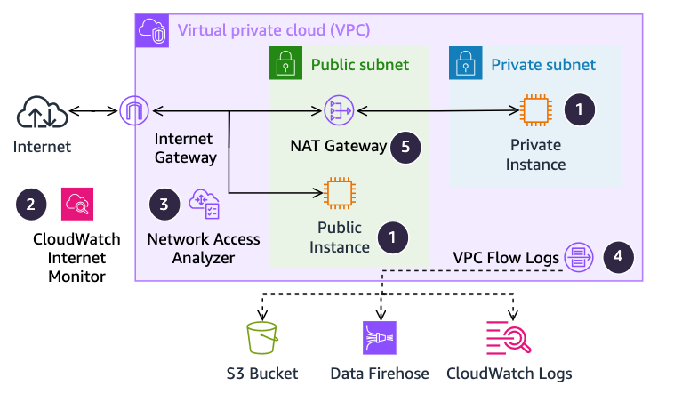

/// caption
[Drawio Source](../assets/monitoring-observability/Services.drawio)
///

=== "Metrics"
    | Number | Notes |  |  |
    | :--: | --- | -- | -- |
    | 1 | Monitor [instances](#instances) for network traffic exceeded. | ~~ | ~~ |
    | 2 | Consider enabling [CloudWatch Internet Monitor](https://docs.aws.amazon.com/AmazonCloudWatch/latest/monitoring/CloudWatch-InternetMonitor.html) | ~~ | ~~ |
    | 3 | Consider using [Network Access Analyzer](https://docs.aws.amazon.com/vpc/latest/network-access-analyzer/what-is-network-access-analyzer.html) | ~~ | ~~ |
    | 4 | Consider enabling [VPC Flow Logs](https://docs.aws.amazon.com/vpc/latest/userguide/flow-logs.html) | ~~ | ~~ |
    | 5 | See [NAT Gateway](#nat-gateway) section. | ~~ | ~~ |

=== "Quotas"
    Always check these against the [official Internet Gateway quotas.](https://docs.aws.amazon.com/vpc/latest/userguide/amazon-vpc-limits.html)

    | Component | Quota | Type |
    | --- | --- | --- |
    | Traffic to the internet, per instance | 5 Gbps or 50% of network bandwidth for instances with more than 32 vCPUs | :octicons-stop-16:{ title="Hard quota – Cannot be adjusted."} |

## AWS PrivateLink

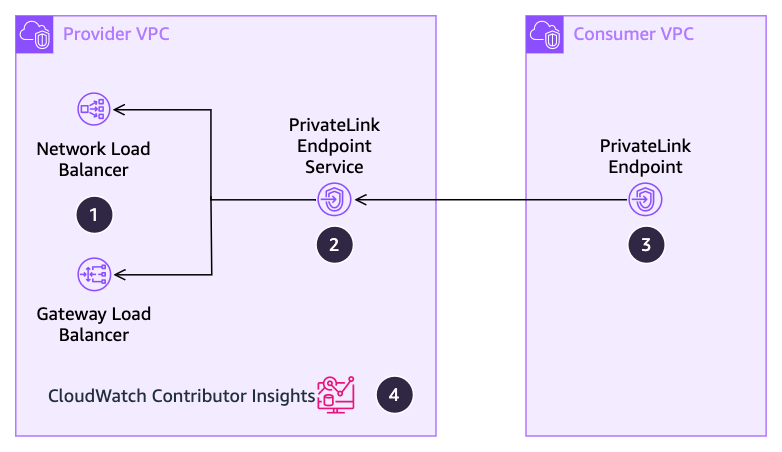

/// caption
[Drawio Source](../assets/monitoring-observability/Services.drawio)
///

=== "Metrics"
    | Number | Notes |  |  |
    | :--: | --- | -- | -- |
    | 1 | Monitor the attached load balancer (see their entries) | ~~ | ~~ |
    | 2 | AWS CloudWatch "AWS/PrivateLinkServices" namespace, per service: | ~~ | ~~ |
    |    | | **Metric** | **Alarm if** |
    |  | :material-exclamation-thick:{ These statistics should trigger alarms if the condition persists for several minutes. A couple increments occasionally should be expected as a normal part of networking. } | RstPacketsSent | Increasing quickly |
    |  | :material-exclamation-thick:{ These statistics should trigger alarms if the condition persists for several minutes. A couple increments occasionally should be expected as a normal part of networking. } | BytesProcessed | Approaching 100 Gbps |
    |  | :material-eye-check:{ These statistics should always be monitored, and may be alarmed depending on specific use case. } | ActiveConnections | Unexpectedly increasing |
    |__| :material-eye-check:{ These statistics should always be monitored, and may be alarmed depending on specific use case. } | NewConnections | Unexpectedly increasing |
    | 3 | AWS CloudWatch "AWS/PrivateLinkEndpoints" namespace, per endpoint: | ~~ | ~~ |
    |    | | **Metric** | **Alarm if** |
    |  | :material-exclamation-thick:{ These statistics should trigger alarms if the condition persists for several minutes. A couple increments occasionally should be expected as a normal part of networking. } | PacketsDropped | Increasing quickly |
    |  | :material-exclamation-thick:{ These statistics should trigger alarms if the condition persists for several minutes. A couple increments occasionally should be expected as a normal part of networking. } | RstPacketsReceived | Increasing quickly |
    |  | :material-exclamation-thick:{ These statistics should trigger alarms if the condition persists for several minutes. A couple increments occasionally should be expected as a normal part of networking. } | BytesProcessed | Approaching 100 Gbps |
    |  | :material-eye-check:{ These statistics should always be monitored, and may be alarmed depending on specific use case. } | ActiveConnections | Unexpectedly increasing |
    |__| :material-eye-check:{ These statistics should always be monitored, and may be alarmed depending on specific use case. } | NewConnections | Unexpectedly increasing |
    | 4 | Consider enabling [Contributor Insights](https://docs.aws.amazon.com/vpc/latest/privatelink/privatelink-cloudwatch-metrics.html#privatelink-contributor-insights) to see which endpoints are the largest contributors to traffic. | ~~ | ~~ |

=== "Quotas"
    Always check these against the [official AWS PrivateLink quotas.](https://docs.aws.amazon.com/vpc/latest/privatelink/vpc-limits-endpoints.html)

    | Component | Quota | Type |
    | --- | --- | --- |
    | Bits per second | 10 Gbps cold, able to scale to 100 Gbps | :octicons-stop-16:{ title="Hard quota – Cannot be adjusted."} |

## Instances

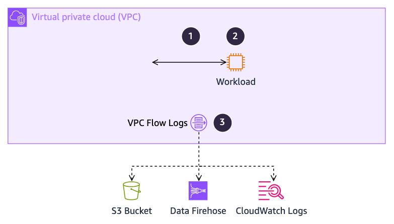

/// caption
[Drawio Source](../assets/monitoring-observability/Services.drawio)
///

=== "Metrics"
    | Number | Notes |  |  |
    | :--: | --- | -- | -- |
    | 1 | AWS CloudWatch "agent" namespace, per network interface: | ~~ | ~~ |
    |    | | **Metric** | **Alarm if** |
    |  | :material-alarm-light:{ Alarm any time the condition exists. } | conntrack_allowance_exceeded | Increasing quickly |
    |  | :material-exclamation-thick:{ These statistics should trigger alarms if the condition persists for several minutes. A couple increments occasionally should be expected as a normal part of networking. } | conntrack_allowance_available | Approaching zero |
    |  | :material-exclamation-thick:{ These statistics should trigger alarms if the condition persists for several minutes. A couple increments occasionally should be expected as a normal part of networking. } | bw_(in&#129;out)_allowance_exceeded | Increasing quickly |
    |  | :material-exclamation-thick:{ These statistics should trigger alarms if the condition persists for several minutes. A couple increments occasionally should be expected as a normal part of networking. } | Per interface RX dropped count | Increasing quickly |
    |  | :material-exclamation-thick:{ These statistics should trigger alarms if the condition persists for several minutes. A couple increments occasionally should be expected as a normal part of networking. } | queue_<X>_tx_queue_stop | Increasing quickly |
    |  | :material-exclamation-thick:{ These statistics should trigger alarms if the condition persists for several minutes. A couple increments occasionally should be expected as a normal part of networking. } | pps_allowance_exceeded | Increasing quickly |
    |  | :material-exclamation-thick:{ These statistics should trigger alarms if the condition persists for several minutes. A couple increments occasionally should be expected as a normal part of networking. } | linklocal_allowance_exceeded | Increasing quickly |
    |__| :material-eye-check:{ These statistics should always be monitored, and may be alarmed depending on specific use case. } | Output from “tc –s qdisc show <interface>” | Shows drops increasing quickly |
    | 2 | AWS CloudWatch “AWS/EC2” namespace contains many metrics to monitor, the exact ones depend on the details of the workload – CPUUtilization is a common one. See [the EC2 metrics page](https://docs.aws.amazon.com/AWSEC2/latest/UserGuide/viewing_metrics_with_cloudwatch.html) for more. | ~~ | ~~ |
    | 3 | Consider enabling [VPC Flow Logs](https://docs.aws.amazon.com/vpc/latest/userguide/flow-logs.html). | ~~ | ~~ |

=== "Quotas"
    Always check these against the [official Instances quotas.](https://docs.aws.amazon.com/AWSEC2/latest/UserGuide/viewing_metrics_with_cloudwatch.html)

    | Component | Quota | Type |
    | --- | --- | --- |
    | Bits per second | Varies by [instance type](https://docs.aws.amazon.com/AWSEC2/latest/UserGuide/ec2-instance-network-bandwidth.html) | :octicons-stop-16:{ title="Hard quota – Cannot be adjusted."} |
    | Packets per second from an instance to link-local/VPC+2, per interface | 1,024 pps | :octicons-stop-16:{ title="Hard quota – Cannot be adjusted."} |

## AWS Network Firewall

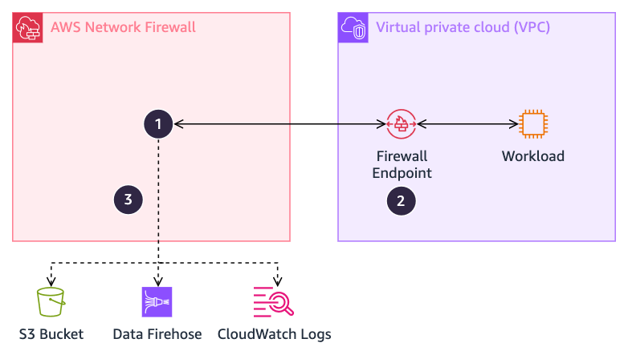

/// caption
[Drawio Source](../assets/monitoring-observability/Services.drawio)
///

=== "Metrics"
    | Number | Notes |  |  |
    | :--: | --- | -- | -- |
    | 1 | AWS CloudWatch "AWS/NetworkFirewall" namespace: | ~~ | ~~ |
    |    | | **Metric** | **Alarm if** |
    |  | :material-alarm-light:{ Alarm any time the condition exists. } | InvalidDroppedPackets, OtherDroppedPackets | Greater than 20/min |
    |__| :material-eye-check:{ These statistics should always be monitored, and may be alarmed depending on specific use case. } | DroppedPackets, RejectedPackets, ReceivedPackets | Unexpected changes |
    | 2 | A Firewall Endpoint is a GWLB endpoint – see [GWLB](#gateway-load-balancer) for monitoring details. | ~~ | ~~ |
    | 3 | Consider [exporting flow, alert, and/or TLS logs](https://docs.aws.amazon.com/network-firewall/latest/developerguide/firewall-logging.html) from AWS Network Firewall’s stateful rules engine. | ~~ | ~~ |

=== "Quotas"
    Always check these against the [official AWS Network Firewall quotas.](https://docs.aws.amazon.com/network-firewall/latest/developerguide/quotas.html)

    | Component | Quota | Type |
    | --- | --- | --- |
    | Bits per second, per endpoint | 100 Gbps | :octicons-stop-16:{ title="Hard quota – Cannot be adjusted."} |
