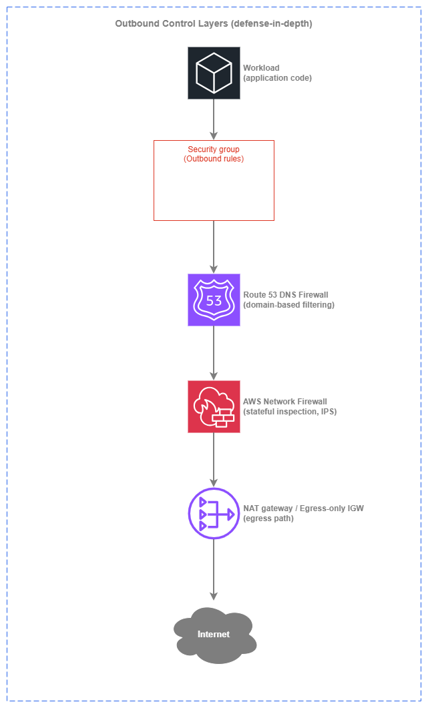

# Outbound Controls

!!! info "Prerequisites"
    This section assumes familiarity with [Amazon VPC](../foundation/vpc.md), [Subnets](../foundation/subnets.md), [Internet Connectivity](../connectivity/internet.md), and [Perimeter Controls](perimeter-inbound.md). Review those topics first if you're new to AWS networking fundamentals.

Outbound controls determine what your workloads are allowed to reach on the internet and how that traffic is filtered before it leaves your environment. The [Internet Connectivity](../connectivity/internet.md) page covers the architectural choice of *where* egress happens (centralized vs. decentralized, IPv4 vs. IPv6). This page focuses on the security question: *what* is allowed out, *how* you enforce that, and *why* defense-in-depth for egress matters as much as it does for ingress.

The core principle is simple: **default-deny outbound, allow by exception**. Most production workloads need to reach a small, well-defined set of external destinations — specific AWS service endpoints, a handful of third-party APIs, OS package repositories. Everything else is unnecessary attack surface. An unrestricted egress path is the most common enabler of data exfiltration, command-and-control callbacks, and supply-chain compromise. Outbound controls exist to close that path.

AWS provides multiple layers for egress filtering, each operating at a different level of the stack. The right approach is not to pick one — it's to layer them so that a gap in one control is caught by the next.


/// caption
Outbound control layers — [Drawio Source](../assets/security/outbound-layers.drawio)
///

Each layer adds a distinct capability: security groups enforce port and protocol restrictions at the instance level, DNS Firewall blocks resolution of unauthorized domains before a connection is ever attempted, Network Firewall inspects the actual traffic for protocol violations and known-bad signatures, and the egress path (NAT gateway or egress-only IGW) shapes where traffic exits. Together, they form a pipeline where each layer catches what the previous one cannot.

## Key capabilities

<div class="grid cards" markdown>

*   :material-shield-lock: **Security groups (outbound rules)**

    ---

    First line of egress control. Stateful rules restrict which ports, protocols, and destination CIDRs or prefix lists a workload can reach. Zero cost, applied at the ENI level, evaluated before traffic hits the network.

*   :material-dns: **Route 53 DNS Firewall**

    ---

    Domain-based outbound filtering at the DNS resolution layer. Block or allow by domain name — the cheapest and fastest way to prevent workloads from resolving known-bad or unauthorized destinations. Applies across all VPCs in an account or organization.

*   :material-fire: **AWS Network Firewall (egress rules)**

    ---

    Stateful deep packet inspection for outbound traffic. Domain filtering via SNI/Host header, Suricata-compatible IPS signatures, and protocol-aware rule groups. The heavyweight option for environments that need full traffic inspection.

*   :material-lan-connect: **VPC Endpoints (AWS PrivateLink)**

    ---

    Eliminate egress entirely for AWS service traffic. Gateway endpoints for S3 and DynamoDB are free; interface endpoints keep API calls off the NAT path and inside the AWS network. Not a filter — a path removal.

*   :material-server-network: **AWS Network Firewall Proxy (preview)**

    ---

    Managed explicit forward proxy for outbound web traffic. Evaluates rules at PreDNS, PreRequest, and PostResponse phases. Replaces self-hosted Squid or proxy fleets for organizations that need application-aware egress control.

*   :material-shield-account: **AWS Firewall Manager**

    ---

    Centralized policy management for DNS Firewall rules, Network Firewall policies, and security group rules across all accounts in an AWS Organization. The control plane that makes multi-account egress governance practical.

</div>

## Defense-in-depth for egress

The layers above are not alternatives — they're complementary. Each catches a different class of threat, and the cost-to-coverage ratio improves dramatically when you stack them correctly.

### Layer 1: Security groups (free, always-on)

Security group outbound rules are the baseline. Every ENI has them, they cost nothing, and they're evaluated before traffic leaves the instance. The limitation is that they operate on IP addresses and ports, not domain names — and in a world of CDN-fronted services and dynamic IPs, IP-based filtering alone is insufficient for outbound control.

**What security groups catch**: workloads attempting to reach ports or protocols they should never use (SSH out, SMTP out from a web server, arbitrary high ports). They also restrict lateral movement when combined with inbound rules on other security groups.

**What security groups miss**: a compromised workload reaching a C2 server on port 443 — the same port your legitimate HTTPS traffic uses. Security groups cannot distinguish between `api.legitimate-vendor.com` and `evil-c2.attacker.com` when both resolve to different IPs on port 443.

### Layer 2: Route 53 DNS Firewall (low cost, high coverage)

DNS Firewall operates at the resolution layer: it intercepts DNS queries from your VPC's Route 53 Resolver and evaluates them against domain lists before returning an answer. If a domain is blocked, the workload never gets an IP address to connect to — the connection is prevented before it starts.

This is the single highest-value egress control for the cost. DNS Firewall pricing is based on queries processed (fractions of a cent per million queries), making it orders of magnitude cheaper than inspecting the actual traffic. It catches the vast majority of data exfiltration and C2 patterns because attackers need DNS resolution to reach their infrastructure.

**What DNS Firewall catches**: resolution of known-malicious domains, DNS tunneling (via managed threat intelligence domain lists), resolution of any domain not on your allow list (when running in allow-list mode).

**What DNS Firewall misses**: traffic to hardcoded IPs (no DNS resolution involved), DNS-over-HTTPS that bypasses the VPC resolver, and legitimate domains used as exfiltration channels (for example, uploading data to an attacker-controlled S3 bucket via the legitimate `s3.amazonaws.com` endpoint).

***Key insight:*** *DNS Firewall is the first egress control you should deploy in every VPC — it covers the widest threat surface at the lowest cost, and it works regardless of whether your egress is centralized or decentralized.*

### Layer 3: AWS Network Firewall (full inspection)

Network Firewall sits in the data path and inspects actual traffic. It can filter by domain name (matching the SNI field in TLS ClientHello or the Host header in HTTP), apply Suricata-compatible IPS signatures to detect known-bad patterns, and enforce protocol compliance. This is the layer that catches what DNS Firewall cannot: hardcoded-IP connections, protocol-level anomalies, and traffic patterns that only become visible in the packet stream.

**What Network Firewall catches**: outbound connections to IPs with no DNS resolution, TLS connections to unauthorized domains (via SNI inspection), protocol violations, known exploit signatures, and traffic that matches behavioral IPS rules.

**What Network Firewall costs**: endpoint hourly charges plus per-GB traffic processing. For a centralized egress VPC processing terabytes of outbound traffic, Network Firewall costs are significant. This is why DNS Firewall as a first layer matters — it reduces the volume of traffic that needs full inspection by blocking unauthorized destinations before they generate any traffic.

### Layer 4: VPC Endpoints (path elimination)

VPC endpoints don't filter traffic — they remove it from the egress path entirely. Traffic to S3, DynamoDB, and other AWS services via VPC endpoints never traverses a NAT gateway, never hits Network Firewall egress rules, and never leaves the AWS network. This reduces cost (no NAT processing charges), reduces attack surface (no internet path to intercept), and reduces the volume of traffic your inspection layers need to handle.

***Key insight:*** *The most secure outbound traffic is traffic that never reaches the internet. Deploy VPC endpoints for every AWS service your workloads use before tuning your egress filters.*

## Best Practices

### Domain-based filtering

#### Prefer domain-based filtering over IP-based filtering for outbound controls

IP addresses are unstable identifiers for internet destinations. CDNs rotate IPs, SaaS providers share IPs across tenants, and cloud services use dynamic IP pools. An allow list of IPs requires constant maintenance and breaks silently when a provider changes their infrastructure. Domain names are the stable identifier that humans and applications actually use.

DNS Firewall and Network Firewall both support domain-based filtering. DNS Firewall blocks at resolution time (cheapest, fastest). Network Firewall matches on the SNI field in TLS or the Host header in HTTP (catches hardcoded-IP bypass attempts). Use both: DNS Firewall as the primary domain filter, Network Firewall as the enforcement backstop.

| Filtering approach | Strengths | Weaknesses |
| --- | --- | --- |
| **IP-based (security groups, NACLs)** | Zero cost, always available, no additional service needed | IPs change, CDNs share IPs, impossible to maintain for SaaS destinations |
| **Domain-based at DNS (DNS Firewall)** | Low cost, prevents connection before it starts, covers all protocols | Bypassed by hardcoded IPs, DNS-over-HTTPS, or IP-literal URLs |
| **Domain-based at TLS (Network Firewall SNI)** | Catches connections regardless of how the IP was resolved | Only works for TLS traffic, adds inspection cost, encrypted payload not visible |
| **Explicit proxy (Network Firewall Proxy)** | Full request-level visibility, URL path filtering, response inspection | Requires application configuration, preview service, higher operational complexity |

#### Use DNS Firewall in allow-list mode for sensitive workloads

For workloads that handle sensitive data or operate in regulated environments, configure DNS Firewall with an explicit allow list of permitted domains and block everything else. This inverts the default: instead of blocking known-bad domains (which requires keeping up with threat intelligence), you permit only known-good domains and deny the rest.

Allow-list mode is operationally heavier — every new external dependency requires a rule update — but it eliminates entire categories of exfiltration risk. Pair it with a self-service process for application teams to request domain additions through your change management system.

#### Deploy managed domain lists for threat intelligence

AWS provides [managed domain lists](https://docs.aws.amazon.com/Route53/latest/DeveloperGuide/resolver-dns-firewall-managed-domain-lists.html) for DNS Firewall that cover known malware domains, botnet C2 infrastructure, and newly observed domains. Enable these as a baseline block list in every VPC, even when you also run allow-list mode on specific workloads. The managed lists are updated by AWS threat intelligence and require no maintenance from your team.

### Data exfiltration prevention

#### Block DNS tunneling with DNS Firewall

DNS tunneling encodes data in DNS queries to exfiltrate information through what appears to be normal DNS traffic. DNS Firewall's managed threat lists include known tunneling domains, and the service can detect anomalous query patterns. Enable the `AWSManagedDomainsMalwareDomainList` and `AWSManagedDomainsAggregateThreatList` in every VPC as a baseline.

#### Restrict S3 access to authorized buckets only

A common exfiltration vector is uploading data to an attacker-controlled S3 bucket using legitimate AWS credentials. VPC endpoint policies on the S3 gateway endpoint can restrict which buckets are accessible from your VPC — limiting access to your organization's buckets only. This is a control that DNS Firewall and Network Firewall cannot provide because the traffic uses a legitimate AWS endpoint.

```json
{
  "Statement": [
    {
      "Sid": "RestrictToOrgBuckets",
      "Effect": "Deny",
      "Principal": "*",
      "Action": "s3:*",
      "Resource": "*",
      "Condition": {
        "StringNotEquals": {
          "aws:ResourceOrgID": "o-your-org-id"
        }
      }
    }
  ]
}
```

#### Combine VPC endpoint policies with DNS Firewall for AWS service traffic

VPC endpoint policies control *what* you can do through the endpoint (which buckets, which KMS keys). DNS Firewall controls *whether* the workload can resolve non-endpoint paths to AWS services. Together, they ensure that AWS service traffic stays on the private path and is scoped to authorized resources only.

***Key insight:*** *Data exfiltration prevention requires controls at multiple layers — DNS resolution, network path, and API authorization. No single service covers all vectors.*

### Multi-account governance

#### Use AWS Firewall Manager for cross-account DNS Firewall rules

In a multi-account environment, DNS Firewall rules must be consistent across every VPC in every account. Deploying rules manually per account does not scale and creates drift. [AWS Firewall Manager](https://docs.aws.amazon.com/waf/latest/developerguide/fms-chapter.html) applies DNS Firewall rule group associations automatically to every VPC in scope — including VPCs in accounts created after the policy was defined.

Firewall Manager DNS Firewall policies support priority ordering, so you can layer a central baseline (managed threat lists, organization-wide blocks) with account-level or VPC-level additions without conflict.

#### Centralize Network Firewall policy through Firewall Manager

For environments using AWS Network Firewall (whether in a centralized egress VPC or distributed per-VPC), Firewall Manager manages the firewall policy centrally. Rule groups are defined once and applied across all firewall endpoints in scope. This ensures that a new VPC or account automatically inherits the organization's egress inspection baseline.

#### Separate rule ownership between central and application teams

A practical model for multi-account egress governance:

| Rule layer | Owner | Scope | Example |
| --- | --- | --- | --- |
| **Baseline block list** | Central security team | All VPCs, all accounts | Managed threat domain lists, known-bad CIDRs |
| **Organization allow list** | Central security team | All VPCs, all accounts | Shared SaaS vendors, OS update repos, common APIs |
| **Workload-specific rules** | Application team | Single VPC or account | Application-specific third-party APIs, partner endpoints |

Firewall Manager's priority ordering makes this layering work: central rules evaluate first, application-team rules layer on top without overriding the baseline.

### IPv6 egress security

#### Apply security group outbound rules for IPv6 traffic

The [egress-only internet gateway](https://docs.aws.amazon.com/vpc/latest/userguide/egress-only-internet-gateway.html) allows outbound IPv6 traffic and blocks unsolicited inbound — it is the IPv6 equivalent of a NAT gateway's one-way behavior. But it does not filter outbound traffic. Security groups remain the first control: restrict outbound IPv6 rules to the ports and protocols the workload actually needs, just as you do for IPv4.

A common mistake is leaving the default `0.0.0.0/0` and `::/0` outbound rules in place. Remove the default allow-all outbound rule and replace it with explicit rules for the workload's actual egress requirements.

#### Use DNS Firewall identically for IPv4 and IPv6

DNS Firewall operates at the resolution layer and is protocol-agnostic — it blocks domain resolution regardless of whether the resulting connection would use IPv4 or IPv6. Your DNS Firewall rules apply equally to both address families with no additional configuration.

#### Understand that there is no managed NAT66

AWS does not offer a managed NAT for IPv6. IPv6 egress is always decentralized (per-VPC egress-only internet gateway) and cannot be centralized through a shared egress VPC the way IPv4 can. This means:

* IPv6 egress inspection must happen per-VPC (Network Firewall endpoints in each VPC) or at the DNS layer (DNS Firewall, which is centrally managed regardless of egress topology).
* There is no IPv6 equivalent of routing all egress through a centralized NAT gateway for inspection.
* For organizations that require a single physical inspection point, this is a factor in IPv6 adoption planning.

***Key insight:*** *IPv6 egress security relies on security groups and DNS Firewall as the primary controls. The egress-only IGW provides directionality (outbound-only) but not filtering — your security posture must not depend on it alone.*

### Cost optimization

#### Deploy DNS Firewall before Network Firewall

DNS Firewall costs fractions of a cent per million queries. Network Firewall charges hourly per endpoint plus per-GB processing. By blocking unauthorized domains at the DNS layer first, you prevent those connections from generating traffic that Network Firewall would then need to inspect. In high-egress environments, this ordering can reduce Network Firewall processing costs significantly.

| Service | Pricing model | Typical cost driver |
| --- | --- | --- |
| **Security groups** | Free | None |
| **Route 53 DNS Firewall** | Per million queries processed | Query volume (typically negligible) |
| **AWS Network Firewall** | Per endpoint-hour + per GB processed | Traffic volume through firewall endpoints |
| **NAT gateway** | Per hour + per GB processed | All IPv4 egress traffic volume |
| **VPC Endpoints (interface)** | Per hour + per GB processed | AWS API call volume |
| **VPC Endpoints (gateway)** | Free | None |

#### Use VPC endpoints to reduce NAT gateway processing charges

Every API call to S3, DynamoDB, or other AWS services that traverses a NAT gateway incurs processing charges. Gateway endpoints for S3 and DynamoDB are free and remove that traffic from the NAT path entirely. Interface endpoints for high-traffic services (ECR, CloudWatch Logs, STS, KMS) often pay for themselves in avoided NAT charges within days.

#### Right-size Network Firewall deployment

Network Firewall charges per endpoint-hour. In a decentralized model, every VPC with a firewall endpoint pays that hourly cost. Not every VPC needs full traffic inspection — workloads with no internet egress, or workloads whose egress is fully covered by DNS Firewall and security groups, don't need a Network Firewall endpoint. Reserve Network Firewall for VPCs that handle sensitive data or have complex egress requirements that DNS Firewall alone cannot cover.

## When to use each outbound control

Each control addresses a different part of the egress problem. The question is not which one to use — it's which combination fits your workload's risk profile and budget.

**Security groups (outbound rules)** are the right choice when:

* You need port and protocol restrictions on egress (always — this is baseline)
* The workload's destinations are identifiable by IP range or prefix list
* You want zero-cost, zero-latency egress control

Security groups are **not sufficient alone** when:

* Destinations are identified by domain name rather than IP (use DNS Firewall)
* You need visibility into what traffic is actually flowing outbound (use Network Firewall or VPC Flow Logs)

**Route 53 DNS Firewall** is the right choice when:

* You want the cheapest effective egress control beyond security groups
* Workloads reach external services by domain name (the vast majority of cases)
* You need organization-wide domain blocking or allow-listing
* You want to prevent DNS tunneling

DNS Firewall is **not sufficient alone** when:

* Workloads connect to hardcoded IPs (use Network Firewall)
* You need payload inspection or IPS signatures (use Network Firewall)
* You need to filter by URL path, not just domain (use Network Firewall Proxy)

**AWS Network Firewall** is the right choice when:

* You need stateful inspection of outbound traffic (IPS, protocol enforcement)
* Compliance requires logging of all outbound connections with deep metadata
* You must catch connections to hardcoded IPs that bypass DNS
* Domain filtering via SNI is needed as a backstop to DNS Firewall

Network Firewall is **not the right choice** when:

* DNS Firewall alone covers your domain-filtering needs (avoid the cost)
* The workload has no internet egress (no traffic to inspect)
* Budget constraints make per-endpoint-hour charges prohibitive (use DNS Firewall as primary)

**VPC Endpoints** are the right choice when:

* Workloads call AWS services (always — deploy endpoints for services in use)
* You want to reduce NAT gateway processing costs
* Security policy requires AWS API traffic to stay off the internet path

**AWS Network Firewall Proxy (preview)** is the right choice when:

* You need explicit forward-proxy semantics (URL-level filtering, request/response inspection)
* You're currently running self-hosted Squid or proxy fleets
* Application-aware egress control is required (not just domain-level)

## Combining outbound controls with other services

| Combination | Outbound control provides | Other service provides |
| --- | --- | --- |
| **DNS Firewall + VPC Endpoints** | Domain-based blocking for internet-bound traffic | Path elimination for AWS service traffic (never hits DNS Firewall for endpoint-resolved names) |
| **DNS Firewall + Network Firewall** | First-pass domain filtering at DNS resolution (cheap, fast) | Second-pass inspection of actual traffic (catches hardcoded IPs, IPS signatures, protocol violations) |
| **Network Firewall + NAT gateway** | Stateful inspection before traffic exits | Address translation and egress path for IPv4 |
| **Security Groups + DNS Firewall** | Port/protocol restriction at the ENI | Domain-based restriction at DNS resolution |
| **Firewall Manager + DNS Firewall** | Centralized policy definition and automatic deployment | Per-VPC DNS query filtering |
| **Firewall Manager + Network Firewall** | Centralized rule group management across accounts | Per-VPC or centralized-VPC traffic inspection |
| **VPC Endpoints + Endpoint Policies** | Private path for AWS service traffic | Authorization scoping (restrict to org buckets, specific KMS keys) |
| **DNS Firewall + CloudWatch** | Domain filtering and blocking | Alerting on blocked queries, dashboards for egress patterns |

## Centralized vs. decentralized egress inspection

The [Internet Connectivity](../connectivity/internet.md) page covers the architectural trade-offs of centralized vs. decentralized egress from a connectivity perspective. From a security lens, the key question is: **where does inspection happen?**

| Dimension | Decentralized inspection | Centralized inspection |
| --- | --- | --- |
| **Inspection placement** | Network Firewall endpoints per-VPC, DNS Firewall per-VPC (managed centrally) | Single Network Firewall in shared egress VPC |
| **Policy consistency** | Achieved through Firewall Manager — same rule groups everywhere | Achieved by single inspection point — all traffic passes through one firewall |
| **IPv6 support** | Works naturally (IPv6 egress is per-VPC by design) | IPv6 cannot be centralized (no managed NAT66), so IPv6 inspection is per-VPC regardless |
| **Failure domain** | Firewall issue affects one VPC | Firewall issue affects all consuming VPCs |
| **Cost at scale** | Per-VPC endpoint hours accumulate | One set of endpoints, but Transit Gateway/Cloud WAN processing on every flow |
| **Visibility** | Per-VPC flow logs and firewall logs | Single pane of glass for all egress traffic |
| **Best fit** | Smaller environments, team autonomy, dual-stack workloads | Large environments with dedicated security operations, IPv4-heavy traffic, compliance mandating single inspection point |

***Key insight:*** *Centralized and decentralized inspection both deliver uniform policy when managed through Firewall Manager. The difference is whether the data plane is distributed (per-VPC endpoints) or concentrated (shared egress VPC). Choose based on operational model and cost, not on policy consistency — both achieve it.*

## Documentation

<div class="grid cards" markdown>

*   :material-file-document: **Route 53 DNS Firewall**

    ---

    Domain-based filtering for DNS queries from your VPCs, including managed domain lists and custom rules.

    [:octicons-arrow-right-24: DNS Firewall documentation](https://docs.aws.amazon.com/Route53/latest/DeveloperGuide/resolver-dns-firewall.html)

*   :material-file-document: **AWS Network Firewall**

    ---

    Managed stateful firewall with Suricata-compatible IPS, domain filtering, and protocol inspection.

    [:octicons-arrow-right-24: Network Firewall documentation](https://docs.aws.amazon.com/network-firewall/latest/developerguide/what-is-aws-network-firewall.html)

*   :material-file-document: **AWS Firewall Manager**

    ---

    Centralized security policy management across AWS Organizations for AWS WAF, Network Firewall, DNS Firewall, and security groups.

    [:octicons-arrow-right-24: Firewall Manager documentation](https://docs.aws.amazon.com/waf/latest/developerguide/fms-chapter.html)

*   :material-file-document: **VPC Endpoints (AWS PrivateLink)**

    ---

    Private connectivity to AWS services without internet gateway, NAT, or public IP requirements.

    [:octicons-arrow-right-24: PrivateLink documentation](https://docs.aws.amazon.com/vpc/latest/privatelink/what-is-privatelink.html)

*   :material-currency-usd: **NAT gateway pricing**

    ---

    Per-hour and per-GB processing charges that drive the cost case for VPC endpoints and DNS Firewall as first-line controls.

    [:octicons-arrow-right-24: NAT gateway pricing](https://aws.amazon.com/vpc/pricing/)

*   :material-post: **AWS Network Firewall Proxy (preview)**

    ---

    Managed explicit forward proxy for outbound web traffic with request-level rule evaluation.

    [:octicons-arrow-right-24: Announcement](https://aws.amazon.com/about-aws/whats-new/2025/11/aws-network-firewall-proxy-preview/)

</div>

## Related pages

**Relationship to other Security topics:**

* **[Perimeter Controls](perimeter-inbound.md)**: Covers inbound traffic filtering — the other half of network security. Outbound controls complement perimeter controls to form a complete security posture.
* **[Network Segmentation](segmentation.md)**: Controls east-west traffic between workloads. Outbound controls handle north-south traffic leaving your environment.

**Relationship to Connectivity:**

* **[Internet Connectivity](../connectivity/internet.md)**: Covers the architectural decision of centralized vs. decentralized egress, NAT gateway modes, and IPv6 egress paths. This page layers security controls on top of those connectivity patterns.
* **[Within AWS Connectivity](../connectivity/within-aws.md)**: Transit Gateway and Cloud WAN are the transit layer that enables centralized egress inspection when that pattern is chosen.

**Relationship to Foundation:**

* **[Amazon VPC](../foundation/vpc.md)**: VPCs are the boundary within which outbound controls operate. Security groups, route tables, and VPC endpoints are all VPC-level constructs.
* **[Subnets](../foundation/subnets.md)**: Subnet design determines where NAT gateways, Network Firewall endpoints, and egress-only IGWs are placed.
