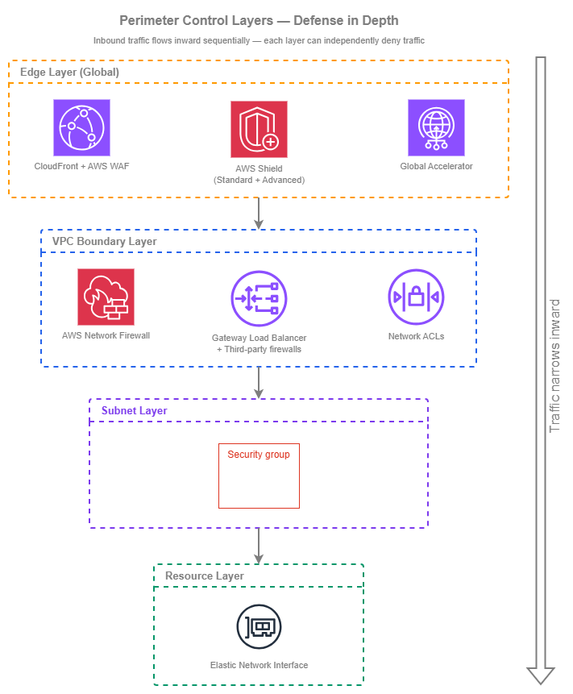

# Perimeter Controls

!!! info "Prerequisites"
    This section assumes familiarity with [Amazon VPC](../foundation/vpc.md), [Subnets](../foundation/subnets.md), and [Internet Connectivity](../connectivity/internet.md). Review those topics first if you're new to AWS networking fundamentals.

Perimeter controls protect your network boundaries from unauthorized inbound access. In AWS, the perimeter is not a single firewall at the edge — it is a series of layered controls that operate at different levels of the stack, from the global edge network down to individual elastic network interfaces. Each layer serves a distinct purpose, and the combination of all layers is what delivers defense in depth. Relying on any single layer is a design failure; the goal is overlapping controls where a misconfiguration at one layer is caught by another.

The key architectural decision is not which perimeter control to use — you will use several simultaneously — but how to organize them across accounts and VPCs. In a multi-account environment, centralized policy management (through AWS Firewall Manager) ensures consistent baselines, while the enforcement points themselves are distributed across workload VPCs. This separation of policy definition from policy enforcement is what makes perimeter security scalable without creating operational bottlenecks.

This page covers the controls that protect inbound traffic. For outbound filtering and egress controls, see [Outbound Controls](outbound.md). For internal segmentation between workloads, see [Network Segmentation](segmentation.md).

/// caption
Perimeter control layers — [Drawio Source](../assets/security/perimeter-layers.drawio)
///

Traffic flows inward through these layers sequentially. A request from the internet first hits the edge (CloudFront, Shield, Global Accelerator), then enters the VPC where Network Firewall or GWLB-based inspection can evaluate it, passes through Network ACLs at the subnet boundary, and finally reaches the security group attached to the target resource's ENI. Each layer can deny traffic independently — a packet blocked at any layer never reaches the layers below it.

## Key capabilities

*   :material-shield-lock: **Security Groups — stateful, instance-level**

    ---

    The primary access control mechanism for every ENI in your VPC. Stateful evaluation means return traffic is automatically allowed. Rules reference CIDR blocks, prefix lists, or other security groups — enabling identity-based access patterns without IP management.

*   :material-wall: **Network ACLs — stateless, subnet-level**

    ---

    A coarse defense-in-depth layer at the subnet boundary. Stateless evaluation means you must explicitly allow both inbound and outbound traffic. Use NACLs as a safety net for broad deny rules, not as your primary access control.

*   :material-web: **AWS WAF — L7 application protection**

    ---

    Inspects HTTP/HTTPS requests at CloudFront, ALB, API Gateway, and AppSync. Managed rule groups cover OWASP Top 10, bot control, and IP reputation. Custom rules handle application-specific logic and rate limiting.

*   :material-shield-alert: **AWS Shield — DDoS protection**

    ---

    Shield Standard is automatic and free on all public-facing AWS endpoints. Shield Advanced adds real-time visibility, DDoS Response Team access, cost protection, and proactive engagement for higher-tier workloads.

*   :material-fire: **AWS Network Firewall — managed VPC inspection**

    ---

    Stateful and stateless packet inspection at the VPC level. Supports Suricata-compatible IPS rules, domain filtering, and protocol detection. Deployed as firewall endpoints in dedicated subnets with VPC route table integration.

*   :material-server-network: **Gateway Load Balancer — third-party appliance insertion**

    ---

    Transparently inserts third-party firewall appliances (Palo Alto, Fortinet, Check Point) into the traffic path using GENEVE encapsulation. Use when your organization requires specific vendor capabilities or has existing appliance investments.

## Best Practices

### Security Groups

#### Design security groups around workload identity, not IP addresses

Security groups support referencing other security groups as sources — this is their most powerful feature and the one most often underused. Instead of allowing `10.0.1.0/24` (a subnet CIDR that might contain anything), allow the `sg-frontend` security group. This creates an identity-based access model: "the frontend tier can reach the backend tier" rather than "this IP range can reach that IP range." When instances scale, move, or get replaced, the access model holds without rule updates.

In practice, this means creating purpose-specific security groups (`sg-web-alb`, `sg-app-tier`, `sg-database`, `sg-cache`) and writing rules that reference each other. The ALB security group allows inbound HTTPS from the internet; the app-tier security group allows inbound traffic only from `sg-web-alb`; the database security group allows inbound only from `sg-app-tier`. No CIDR management, no rule updates when instances change.

#### Apply least privilege — deny by default, allow explicitly

Security groups deny all inbound traffic by default (no rules = no access). Every rule you add is an explicit allow. This is the correct mental model: start with zero access and open only what the workload requires. Common violations include allowing `0.0.0.0/0` on ports other than 80/443 on public-facing load balancers, allowing entire VPC CIDRs when only specific security groups need access, and leaving SSH/RDP open to broad ranges instead of using Systems Manager Session Manager.

***Key insight:*** *Security groups are your primary access control — not NACLs, not Network Firewall. Get security group design right and the other layers become safety nets rather than compensating controls.*

#### Create separate security groups per workload, not shared groups across applications

A single "allow everything internal" security group applied to all resources defeats the purpose of microsegmentation. Each workload (or workload tier) should have its own security group with rules scoped to exactly what that tier needs. Shared security groups create implicit trust relationships between unrelated workloads — when one workload is compromised, the attacker inherits access to everything that shares the group.

The exception is common infrastructure: a shared security group for VPC endpoints (allowing HTTPS from the VPC CIDR) or for a monitoring agent (allowing the monitoring system to scrape metrics) is reasonable because the access pattern is genuinely shared.

#### Add explicit IPv6 rules — security groups do not inherit IPv4 rules for IPv6 traffic

Security groups treat IPv4 and IPv6 as completely separate rule sets. A rule allowing `0.0.0.0/0` on port 443 does **not** allow `::0/0` on port 443. If your VPC is dual-stack and your workload accepts IPv6 traffic, you must add explicit IPv6 rules. This is the most common IPv6 security gap: teams enable dual-stack on a subnet, the resource gets an IPv6 address, but the security group has no IPv6 inbound rules — so IPv6 traffic is silently dropped, and the team spends hours debugging connectivity.

Conversely, if your workload should **not** accept IPv6 traffic, the absence of IPv6 rules in the security group is your protection. Verify this intentionally rather than relying on the accidental absence of rules.

#### Use managed prefix lists for shared CIDR sets

When multiple security groups need to reference the same set of CIDRs (corporate office ranges, partner networks, monitoring infrastructure), use [managed prefix lists](https://docs.aws.amazon.com/vpc/latest/userguide/managed-prefix-lists.html) instead of duplicating CIDR entries across groups. Prefix lists are shareable via RAM across accounts, update atomically (all security groups referencing the list get the change simultaneously), and count as a single rule entry regardless of how many CIDRs the list contains.

### Network ACLs

#### Use NACLs as a coarse safety net, not as primary access control

NACLs are stateless — you must write both inbound and outbound rules, including ephemeral port ranges for return traffic. This makes them operationally expensive to maintain for fine-grained access control. Their value is as a broad deny layer: blocking entire CIDR ranges you know should never communicate with a subnet (known-bad IP ranges, embargoed countries, internal ranges that should never reach public subnets).

The default NACL allows all traffic in both directions. This is intentional — security groups are the primary control. Modify NACLs only when you need subnet-level deny rules that security groups cannot express (security groups have no deny capability).

#### Add IPv6 NACL entries explicitly

Like security groups, NACLs treat IPv4 and IPv6 as separate rule sets. The default NACL includes allow-all rules for both `0.0.0.0/0` and `::/0`, but custom NACLs start empty for both address families. If you create a custom NACL for a dual-stack subnet, you must add rules for both IPv4 and IPv6 traffic — including the ephemeral port ranges for return traffic in both address families. Missing IPv6 NACL rules is the second most common IPv6 connectivity issue after missing security group rules.

#### Keep NACL rule sets small and auditable

NACLs are evaluated in rule-number order, and the first match wins. Complex NACL configurations with dozens of rules become difficult to reason about and audit. If your NACL has more than 10-15 custom rules, you're likely using it for access control that belongs in security groups or Network Firewall. Keep NACLs focused on broad deny patterns: deny known-bad ranges, deny protocols that should never appear on a subnet, and let security groups handle the fine-grained allow logic.

***Key insight:*** *NACLs exist for one reason: to deny traffic that security groups cannot deny. Security groups are allow-only — they cannot block a specific IP that would otherwise be permitted by a broader rule. NACLs fill that gap. If you're writing allow rules in NACLs, you're using the wrong tool.*

### AWS WAF

#### Deploy AWS WAF on every internet-facing L7 endpoint

AWS WAF should be attached to every CloudFront distribution, public-facing ALB, and API Gateway stage. The cost of a AWS WAF WebACL (per-WebACL-month plus per-million-requests — see [AWS WAF pricing](https://aws.amazon.com/waf/pricing/)) is negligible compared to the cost of an application-layer attack reaching your origin. Use AWS Firewall Manager to deploy a baseline WebACL across all accounts automatically — this ensures new resources get protection without relying on application teams to remember.

#### Start with AWS Managed Rule Groups, then layer custom rules

AWS Managed Rules provide immediate coverage for common threats: the Core Rule Set (CRS) covers OWASP Top 10, the Known Bad Inputs rule group blocks common exploit patterns, and the IP Reputation list blocks traffic from known-malicious sources. These are maintained by AWS and updated automatically. Start with these as your baseline, monitor for false positives in count mode for 1-2 weeks, then switch to block mode.

Custom rules layer on top for application-specific logic: rate limiting per IP or per session, geo-blocking for regions you don't serve, header validation for expected patterns, and request-size constraints that match your application's actual needs.

#### Use rate-based rules as your first line against volumetric application-layer attacks

Rate-based rules throttle requests from a single IP (or other key) that exceed a threshold within a 5-minute window. Set a rate limit that reflects your application's legitimate traffic pattern — if no single client should send more than 2,000 requests per 5 minutes, set the threshold there. This catches credential stuffing, scraping, and application-layer DDoS before they consume backend resources.

Rate-based rules support custom keys beyond IP: you can rate-limit by header value, query string, cookie, or label namespace. This handles distributed attacks where a single IP stays below the threshold but the aggregate from a botnet is overwhelming.

#### AWS WAF handles both IPv4 and IPv6 transparently

AWS WAF rules that match on IP addresses accept both IPv4 CIDRs and IPv6 CIDRs in IP sets. Rate-based rules track IPv4 and IPv6 sources independently. There is no separate configuration needed for IPv6 — AWS WAF evaluates all HTTP/HTTPS traffic regardless of the underlying IP version. This is one area where IPv6 does not require additional configuration, unlike security groups and NACLs.

### AWS Shield

#### Understand what Shield Standard gives you automatically

Shield Standard is enabled on every AWS account at no cost. It protects all public-facing endpoints (CloudFront, Route 53, Global Accelerator, ALB, NLB, Elastic IPs) against common L3/L4 DDoS attacks — SYN floods, UDP reflection, and DNS amplification. You do not need to configure anything. This baseline protection is why most AWS workloads never experience a successful volumetric DDoS attack.

#### Upgrade to Shield Advanced for business-critical internet-facing workloads

Shield Advanced (per-organization monthly subscription plus data transfer fees during attacks — see [Shield pricing](https://aws.amazon.com/shield/pricing/)) adds capabilities that matter for high-value targets: real-time attack visibility in the Shield console, access to the AWS DDoS Response Team (DRT) for manual mitigation during complex attacks, cost protection (credits for scaling charges incurred during an attack), and proactive engagement where AWS contacts you when an attack is detected. The DRT can also write and deploy AWS WAF rules on your behalf during an active incident.

Shield Advanced is justified when the cost of downtime exceeds the subscription cost — typically for revenue-generating web applications, financial services APIs, and SaaS platforms where minutes of unavailability have measurable business impact.

#### Associate Shield Advanced with all related resources

Shield Advanced protection is per-resource. If your application uses CloudFront → ALB → EC2, associate Shield Advanced with both the CloudFront distribution and the ALB. Protecting only CloudFront leaves the ALB exposed to direct attacks if its DNS name is discoverable. Use Firewall Manager to automatically associate Shield Advanced with new resources matching your criteria across all accounts.

***Key insight:*** *Shield Standard handles the vast majority of DDoS attacks silently. Shield Advanced is not about getting DDoS protection — you already have it. It's about getting visibility, expert response, and cost protection during sophisticated or sustained attacks that exceed what automated mitigation handles alone.*

### AWS Network Firewall

#### Deploy Network Firewall for stateful L3/L4 inspection at the VPC boundary

AWS Network Firewall provides managed stateful and stateless inspection between your internet gateway and your workload subnets. It supports Suricata-compatible IPS/IDS rules, domain-based filtering (allow/deny traffic to specific FQDNs), TLS Server Name Indication (SNI) inspection, and protocol detection. Deploy firewall endpoints in dedicated subnets and use VPC ingress routing to direct traffic through them.

The typical deployment for inbound inspection places firewall endpoints between the internet gateway and the public subnets hosting your load balancers. The IGW edge route table directs incoming traffic to the firewall endpoint in the same Availability Zone, and the firewall endpoint's subnet route table forwards inspected traffic to the workload subnets. For the full architectural context on where Network Firewall fits in your ingress and egress paths (centralized vs. per-VPC placement, cost trade-offs, and integration with Transit Gateway or AWS Cloud WAN), see [Internet Connectivity](../connectivity/internet.md).

#### Choose between centralized and per-VPC inspection deliberately

Two deployment models exist, and the right choice depends on your traffic patterns and operational model:

| Factor | Centralized inspection (shared VPC) | Per-VPC inspection |
| --- | --- | --- |
| **Traffic path** | All traffic routes through a central inspection VPC via Transit Gateway | Each VPC has its own firewall endpoints |
| **Cost model** | One set of firewall endpoints + Transit Gateway data processing on every flow | Firewall endpoint hours per VPC (no transit data processing) |
| **Policy management** | Single rule group applied at one location | Same rule groups deployed to each VPC via Firewall Manager |
| **Blast radius** | Central firewall misconfiguration affects all VPCs | Per-VPC misconfiguration affects only that workload |
| **Best for** | Few VPCs with high cross-VPC traffic, or when Transit Gateway is already in the path | Many VPCs with independent traffic patterns, or when minimizing transit data processing cost |

For most multi-account environments with many workload VPCs, **per-VPC inspection managed centrally through Firewall Manager** is the recommended pattern. It avoids Transit Gateway data processing charges on every inbound flow, keeps the blast radius per-workload, and still delivers uniform policy through centrally-managed rule groups.

#### Use stateless rules for high-volume, simple filtering and stateful rules for protocol-aware inspection

Network Firewall evaluates stateless rules first (fast, per-packet, no connection tracking) and then passes traffic to the stateful engine (connection-aware, protocol-aware, Suricata rules). Use stateless rules for broad deny patterns (block entire CIDR ranges, drop malformed packets, rate-limit by protocol) and stateful rules for protocol-aware inspection (HTTP host header matching, TLS SNI filtering, IPS signatures).

This separation matters for cost: stateless rules are cheaper to evaluate at high throughput. Pushing simple deny logic into the stateless layer reduces the volume of traffic the stateful engine must process.

### Gateway Load Balancer and third-party firewalls

#### Use GWLB when your organization requires specific vendor capabilities

Gateway Load Balancer transparently inserts third-party firewall appliances (Palo Alto Networks, Fortinet, Check Point, Cisco) into the VPC traffic path using GENEVE encapsulation. The appliances see the original packet headers (source IP, destination IP, protocol) without NAT, inspect or modify the traffic, and return it to the GWLB for forwarding. This is the right choice when your organization has existing vendor relationships, compliance requirements that mandate a specific product, or needs capabilities that Network Firewall does not provide (advanced threat intelligence feeds, application-ID-based policies, unified management with on-premises firewalls).

#### Deploy GWLB endpoints in the same pattern as Network Firewall endpoints

The VPC routing integration is identical: GWLB endpoints sit in dedicated subnets, and VPC route tables direct traffic through them. The difference is that GWLB forwards traffic to a target group of appliance instances (which you manage) rather than to an AWS-managed inspection engine. This means you own the appliance fleet's availability, patching, scaling, and licensing — operational overhead that Network Firewall eliminates.

#### Consider the cost model carefully

GWLB charges per hour per endpoint plus per-GB data processing. On top of that, you pay for the EC2 instances (or marketplace AMIs) running the firewall appliances, their licensing, and the operational cost of managing a fleet. For organizations already committed to a vendor and running those appliances on-premises, GWLB extends that investment into AWS. For organizations without an existing vendor commitment, Network Firewall is almost always more cost-effective and operationally simpler.

***Key insight:*** *GWLB is not a competitor to Network Firewall — it's a deployment mechanism for third-party appliances. Choose based on whether you need AWS-managed inspection (Network Firewall) or vendor-specific inspection (GWLB + appliances). Many organizations use both: Network Firewall for standard VPC inspection and GWLB for specialized workloads that require vendor-specific capabilities.*

### AWS Firewall Manager

#### Use Firewall Manager as the single pane for cross-account perimeter policy

Firewall Manager is not a firewall — it is a policy management service that deploys and enforces security group rules, AWS WAF WebACLs, Shield Advanced associations, Network Firewall policies, and DNS Firewall rules across every account in your Organization. Without Firewall Manager, each account team must independently configure these controls, leading to drift, gaps, and inconsistent baselines.

Firewall Manager requires AWS Organizations with all features enabled and a delegated administrator account (typically your security or networking account). Once configured, policies automatically apply to new accounts and new resources as they're created — no manual onboarding step.

#### Define baseline policies that application teams cannot weaken

Firewall Manager supports two enforcement modes for security groups: **audit** (report non-compliant groups but don't change them) and **auto-remediate** (bring non-compliant groups into compliance automatically). For baseline rules (for example, "no security group may allow SSH from 0.0.0.0/0"), use auto-remediation. For AWS WAF, deploy a baseline WebACL that application teams cannot remove, while allowing them to add their own rules on top.

This creates a layered ownership model: the security team owns the baseline (managed through Firewall Manager), and application teams own workload-specific rules within the guardrails the baseline establishes.

#### Account for Firewall Manager costs in your security budget

Firewall Manager charges per-policy per-Region (see [Firewall Manager pricing](https://aws.amazon.com/firewall-manager/pricing/)). If you have 5 policies across 4 Regions, that compounds significantly for Firewall Manager alone, before the cost of the underlying services (AWS WAF WebACLs, Network Firewall endpoints, Shield Advanced subscriptions). This cost is justified for organizations with 10+ accounts where manual policy management is impractical, but may not be cost-effective for small organizations with 2-3 accounts where manual configuration is manageable.

### IPv6 perimeter considerations

#### Treat IPv6 security as a separate, explicit configuration — not an extension of IPv4

The most dangerous IPv6 security posture is accidental: a VPC is dual-stack, resources receive IPv6 addresses, but security groups, NACLs, and firewall rules only cover IPv4. In this state, IPv6 traffic bypasses every control you've configured. The fix is straightforward but requires discipline:

* **Security groups**: Add explicit IPv6 rules (`::/0` for public, specific IPv6 prefixes for internal). No IPv4 rule applies to IPv6 traffic.
* **NACLs**: Add IPv6 entries for both inbound and outbound, including ephemeral port ranges. Custom NACLs start with no IPv6 rules.
* **Network Firewall**: Stateful rules that reference IP addresses need both IPv4 and IPv6 variants. Domain-based rules (SNI, HTTP host) work regardless of IP version.
* **AWS WAF**: Handles both address families transparently — no separate configuration needed.

#### Audit for unintended IPv6 exposure in dual-stack VPCs

When you enable IPv6 on a subnet, every ENI in that subnet can receive an IPv6 address (depending on the subnet setting). If a security group has no IPv6 inbound rules, traffic is blocked — but if someone adds a `::/0` rule without understanding the implications, the resource is now reachable from the entire IPv6 internet. Use Firewall Manager's security group audit policies to detect overly permissive IPv6 rules across your Organization.

## When to use each perimeter control

Each control operates at a different layer and serves a different purpose. They are complementary, not alternatives to each other — but understanding when each is the primary defense helps you invest configuration effort where it matters most.

**Security Groups** are the right primary control when:

* You need per-resource access control (which is always)
* Traffic patterns can be expressed as "source identity X can reach destination on port Y"
* You want stateful evaluation without managing return-traffic rules

Security Groups are **always required** — they are not optional in any architecture.

**Network ACLs** are the right addition when:

* You need to explicitly deny specific CIDR ranges at the subnet level
* Compliance requires a second independent control layer beyond security groups
* You need to block traffic from compromised internal resources that security groups would otherwise allow

NACLs are **not the right tool** for fine-grained access control (use security groups) or for application-layer filtering (use AWS WAF).

**AWS WAF** is the right choice when:

* You need to inspect HTTP/HTTPS request content (headers, body, URI, query strings)
* You need rate limiting, bot detection, or geo-blocking
* Your workload is fronted by CloudFront, ALB, API Gateway, or AppSync

AWS WAF is **not the right tool** for L3/L4 traffic inspection (use Network Firewall) or for non-HTTP protocols.

**AWS Network Firewall** is the right choice when:

* You need stateful L3/L4 inspection with IPS/IDS capabilities
* You need domain-based filtering for non-HTTP traffic (TLS SNI inspection)
* You need protocol detection and deep packet inspection at the VPC boundary

Network Firewall is **not the right tool** for HTTP-specific logic (use AWS WAF) or when you need vendor-specific appliance features (use GWLB).

**Gateway Load Balancer + third-party firewalls** is the right choice when:

* Your organization mandates a specific firewall vendor for compliance or operational consistency
* You need capabilities not available in Network Firewall (application-ID policies, advanced threat feeds, unified management with on-premises)
* You have existing vendor licensing and operational expertise

GWLB is **not the right tool** when you have no existing vendor requirement — Network Firewall is simpler and cheaper to operate.

**AWS Shield Advanced** is the right choice when:

* Your internet-facing workload generates revenue and minutes of downtime have measurable cost
* You need DDoS Response Team access for complex attack mitigation
* You want cost protection against scaling charges during attacks
* You need proactive engagement (AWS contacts you during detected attacks)

Shield Advanced is **not needed** for workloads where Shield Standard's automatic L3/L4 protection is sufficient and the cost of occasional degradation is acceptable.

## Combining perimeter controls with other services

| Combination | Perimeter control provides | Other service provides | When to use together |
| --- | --- | --- | --- |
| **Security Groups + VPC Lattice** | Per-ENI access control on the target | Service-level authentication and authorization via IAM auth policies | Always — security groups remain active even when Lattice handles service-to-service auth |
| **AWS WAF + CloudFront** | L7 request inspection, rate limiting, geo-blocking | Global edge distribution, TLS termination, caching, origin isolation via VPC Origins | Every internet-facing L7 workload — AWS WAF at CloudFront inspects before traffic reaches your Region |
| **AWS WAF + API Gateway** | Request filtering, IP blocking, rate limiting | API management, throttling, request validation, authorization | API-first workloads where API Gateway is the entry point rather than CloudFront |
| **Network Firewall + Transit Gateway** | Stateful/stateless VPC traffic inspection | Cross-VPC and hybrid routing | Centralized inspection model where all traffic routes through an inspection VPC |
| **Network Firewall + VPC ingress routing** | Inbound traffic inspection before it reaches workload subnets | IGW edge route table directs traffic to firewall endpoints | Per-VPC inspection of internet-bound inbound traffic |
| **Shield Advanced + AWS WAF** | DDoS protection, DRT access, cost protection | Application-layer attack mitigation, automatic rate limiting | Shield Advanced can instruct AWS WAF to deploy emergency rules during an attack via DRT |
| **GWLB + Network Firewall** | Third-party appliance inspection for specialized workloads | AWS-managed inspection for standard workloads | Organizations that need vendor-specific features for some traffic and AWS-native for the rest |
| **Firewall Manager + all perimeter controls** | Centralized policy deployment and compliance monitoring | Individual control enforcement at each resource | Any multi-account environment (10+ accounts) where manual policy management creates drift |
| **Security Groups + managed prefix lists** | Per-ENI access control | Shared, centrally-managed CIDR sets via RAM | When multiple security groups across accounts need the same source/destination CIDRs |
| **NACLs + Security Groups** | Subnet-level broad deny rules | Per-resource fine-grained allow rules | Defense in depth — NACLs deny what should never reach the subnet; security groups allow what should reach each resource |

## Cost implications

Perimeter controls vary significantly in cost, and understanding the cost model helps you layer them appropriately without over-spending on redundant inspection.

| Service | Cost model | Typical monthly cost (per Region) | Cost optimization lever |
| --- | --- | --- | --- |
| **Security Groups** | Free | Free | None needed — always use |
| **Network ACLs** | Free | Free | None needed — always use where appropriate |
| **AWS WAF** | Per-WebACL + per-rule + per-million-requests ([pricing](https://aws.amazon.com/waf/pricing/)) | Low-moderate for typical workloads | Consolidate rules; use managed rule groups (flat fee) over many custom rules |
| **AWS Shield Standard** | Free (automatic) | Free | None needed — always active |
| **AWS Shield Advanced** | Per-organization monthly subscription + data transfer during attacks ([pricing](https://aws.amazon.com/shield/pricing/)) | Significant fixed cost | Single subscription covers all accounts in the Organization |
| **AWS Network Firewall** | Per-endpoint-hour + per-GB processed ([pricing](https://aws.amazon.com/network-firewall/pricing/)) | Moderate-high per VPC | Use stateless rules for high-volume simple filtering; minimize endpoints by using multi-AZ efficiently |
| **Gateway Load Balancer** | Per-endpoint-hour + per-GB processed + appliance costs ([pricing](https://aws.amazon.com/elasticloadbalancing/pricing/)) | High per deployment | Right-size appliance fleet; use auto-scaling groups for the target appliances |
| **AWS Firewall Manager** | Per-policy per-Region ([pricing](https://aws.amazon.com/firewall-manager/pricing/)) | Scales with policy count and Regions | Consolidate policies where possible; evaluate whether manual management is cheaper for small orgs |

***Key insight:*** *Security groups and NACLs are free. AWS WAF is cheap relative to the protection it provides. Network Firewall and GWLB are the expensive layers — deploy them where the inspection value justifies the per-GB processing cost, not as a blanket "inspect everything" approach. Use AWS WAF for L7 and security groups for L3/L4 as your cost-effective baseline, and add Network Firewall or GWLB only where deeper inspection is required.*

## Documentation

*   :material-file-document: **Security Groups documentation**

    ---

    Complete reference for security group rules, limits, and behavior including stateful tracking and connection tracking timeout.

    [:octicons-arrow-right-24: Security Groups](https://docs.aws.amazon.com/vpc/latest/userguide/vpc-security-groups.html)

*   :material-file-document: **AWS WAF Developer Guide**

    ---

    Full AWS WAF documentation covering WebACLs, rule groups, managed rules, and integration with CloudFront, ALB, and API Gateway.

    [:octicons-arrow-right-24: AWS WAF](https://docs.aws.amazon.com/waf/latest/developerguide/waf-chapter.html)

*   :material-file-document: **AWS Network Firewall Developer Guide**

    ---

    Architecture, deployment patterns, rule group configuration, and VPC routing integration for managed firewall inspection.

    [:octicons-arrow-right-24: Network Firewall](https://docs.aws.amazon.com/network-firewall/latest/developerguide/what-is-aws-network-firewall.html)

*   :material-shield-check: **AWS Shield documentation**

    ---

    Shield Standard automatic protections and Shield Advanced features including DRT engagement and cost protection.

    [:octicons-arrow-right-24: AWS Shield](https://docs.aws.amazon.com/waf/latest/developerguide/shield-chapter.html)

*   :material-file-document: **AWS Firewall Manager documentation**

    ---

    Cross-account policy management for AWS WAF, Shield, security groups, Network Firewall, and DNS Firewall.

    [:octicons-arrow-right-24: Firewall Manager](https://docs.aws.amazon.com/waf/latest/developerguide/fms-chapter.html)

*   :material-currency-usd: **AWS Network Firewall pricing**

    ---

    Endpoint hourly charges and per-GB data processing fees for planning Network Firewall deployment costs.

    [:octicons-arrow-right-24: Pricing](https://aws.amazon.com/network-firewall/pricing/)

## Related pages

**Relationship to other Security topics:**

* **[Outbound Controls](outbound.md)**: Perimeter controls protect inbound boundaries; outbound controls manage what traffic leaves your network. Many services (Network Firewall, security groups) enforce both directions — this page covers the inbound perspective.
* **[Network Segmentation](segmentation.md)**: Perimeter controls protect the external boundary; segmentation controls traffic between internal workloads. Security groups serve both purposes — as perimeter controls (allowing internet traffic to load balancers) and as segmentation controls (restricting backend-to-database communication).

**Relationship to Foundation topics:**

* **[Amazon VPC](../foundation/vpc.md)**: The VPC is the network boundary where most perimeter controls are enforced. VPC design (subnet tiers, route tables) directly determines where Network Firewall endpoints and GWLB endpoints can be placed.
* **[Subnets](../foundation/subnets.md)**: Subnet tier design must account for dedicated firewall subnets. NACLs are applied at the subnet level, making subnet boundaries the enforcement point for stateless deny rules.

**Relationship to Connectivity topics:**

* **[Internet Connectivity](../connectivity/internet.md)**: Internet connectivity covers the ingress and egress patterns; this page covers the security controls that protect those patterns. The two pages are complementary — read Internet Connectivity for the architecture, this page for the security controls layered on top.

**Relationship to Application Networking topics:**

* **[Load Balancing](../application-networking/load-balancing.md)**: Load balancers are the primary targets of perimeter controls — security groups on ALBs/NLBs, AWS WAF on ALBs, and Network Firewall inspection in front of load balancer subnets.
